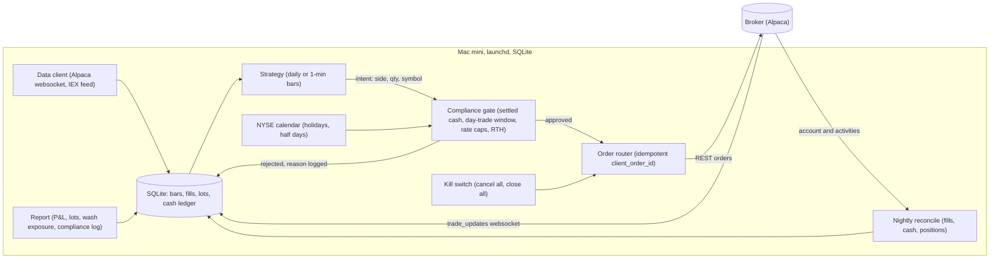
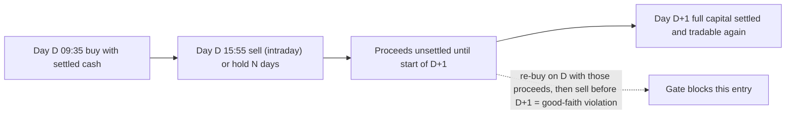
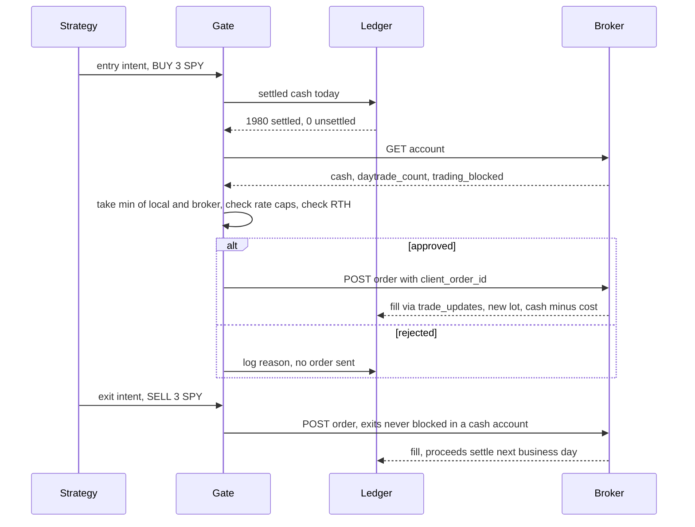

# Mini quant system — DE 06, regulatory and account constraints

Assumptions: US retail account at Alpaca (API-first, commission-free, self-clearing, free paper environment). Two instruments, SPY and QQQ, long only, no options, no shorting. The operator has no other brokerage or IRA account that trades the same tickers. Rules are labelled by kind: **law** (statute or federal regulation), **SRO** (FINRA/exchange rule, SEC-approved, binding on every US broker), **policy** (this broker's choice; another broker may differ), **unsure** (I would verify before go-live).

## Requirements

Functional

| # | Requirement | Number |
|---|---|---|
| F1 | Pull bars for 2 symbols, compute signal, place orders, reconcile, report | daily bars for swing; 1-min bars if intraday |
| F2 | Pre-trade compliance gate that blocks any order that would create a good-faith violation, a pattern-day-trader flag, or exceed order-rate caps | 0 broker-side rejects for rule reasons per year |
| F3 | Exits are never blocked by the gate | 100% of exit intents reach the broker |
| F4 | Append-only fill ledger keyed by broker fill id, FIFO lots, realized P&L per lot | reconciles to 1099-B within $1 of proceeds and cost |
| F5 | Nightly reconcile of local cash, positions, fills against broker | drift alert if any field differs by > $0.01 or 1 share |
| F6 | Kill switch: cancel all open orders, close all positions | one command, < 5 s |
| F7 | Daily report: P&L, open lots, wash-sale exposure, compliance events, settled cash | one email by 17:00 ET |

Non-functional

| # | Requirement | Number |
|---|---|---|
| N1 | Runs unattended for one trading day; gate fails closed (no order on any uncertainty) | 0 unintended orders |
| N2 | Compliance counters are derived from the local ledger and cross-checked with broker fields; the stricter value wins | always |
| N3 | Drawdown circuit breaker | halt at -$200 day, -$500 cumulative |
| N4 | Order-rate ceilings, independent of strategy | 10 orders/min, 50 cancels/day, 1 open order per symbol |
| N5 | Every ledger row carries an idempotent `client_order_id` and UTC timestamp | 100% |

## Estimates

| Item | Swing (hold 1 to 10 days) | Intraday (flat by close) |
|---|---|---|
| Round trips / year | ~100 | ~250 |
| Fills / year | ~200 | ~500 |
| Position size | 100% of settled cash, 1 position | 100% of settled cash, 1 round trip per day |
| Bars stored / year | 2 x 252 daily = 504 rows | 2 x 390 x 252 = 197k rows, ~20 MB SQLite |
| REST calls / day | < 30 | < 100 (limit is 200/min, irrelevant) |
| Broker commission | $0 | $0 |
| SEC Section 31 fee (sells only, ~$27.80 per $1M in 2025) | ~$6 / yr | ~$14 / yr |
| FINRA TAF ($0.000166 / share sold) | < $1 / yr | < $1 / yr |
| Spread, SPY ~1 cent on ~$600 | ~$3 / yr | ~$8 / yr |
| Slippage, market orders near open/close, 2 to 5 bp | ~$8 / yr with limit orders | $100 to $250 / yr |
| Data | free IEX feed, $0 | free IEX feed, $0 (the $99/mo SIP feed is 5% of capital per month, so no) |
| Electricity, Mac mini | ~$2 / mo | ~$2 / mo |
| Total monthly cost | < $3 | < $3 |

Honest edge: a solo, simple signal on SPY/QQQ has an expected gross edge somewhere between -2% and +8% per year, that is -$40 to +$160. Intraday costs of 5 to 12% of capital per year make intraday negative expectation at this size. Swing costs about 1%. Taxes: every gain is short-term, taxed as ordinary income (assume 24% federal plus state), so a good year nets roughly $100. The point of the system is the experiment, not the income.

## High-level design

Flows

1. Data in: websocket bars into SQLite; daily bars backfilled by REST at 16:30 ET.
2. Signal: strategy emits an intent, never an order. Intents are `(symbol, side, qty, kind=entry|exit)`.
3. Order out: gate evaluates entries against the ledgers below; exits pass through. Router posts with `client_order_id = hash(date, symbol, side, intent_seq)` so a retry cannot double-fill.
4. Reconcile: `trade_updates` writes fills in real time; nightly job pulls `/v2/account/activities?activity_types=FILL` and `/v2/account`, diffs against the ledger, alerts on drift. Settled cash is recomputed from fills plus the NYSE calendar.
5. Report: FIFO lots, realized/unrealized P&L, estimated wash-sale disallowed loss, count of day trades in the trailing 5 business days, GFV count trailing 12 months, one email.

## Deep dive: regulatory and account constraints

### The hard part

Account rules are stateful, time-windowed, and enforced after the fact by the broker, with penalties out of proportion to a $2,000 account: a PDT flag or a third good-faith violation locks the account for 90 days, which is most of the experiment. They also invert which leg is dangerous. In a margin account the *exit* can be the illegal action (the 4th day trade). In a cash account the *entry* is the only thing that can go wrong (buying with unsettled money). A system meant to run unattended must be built so that the leg that protects capital, the exit, is never the one a rule blocks.

### The obvious approach and why it breaks

Open the default account (Alpaca defaults to margin), trade intraday, and rely on the broker's PDT protection (`pdt_check`) to reject anything illegal.

| Failure | Mechanism |
|---|---|
| Dead on day 4 | FINRA 4210(f)(8)(B): 4 day trades in 5 rolling business days in a margin account, if > 6% of trades, makes you a pattern day trader; with equity under $25,000 the account goes closing-only for 90 days. An intraday strategy firing once a day hits it on day 4. |
| Stop-loss silently disabled | With `pdt_check=both` the broker rejects the *exit* that would be the 4th day trade. You are now holding overnight with no stop, which is the exact scenario the brief says must not happen. |
| Split brain | A broker-side reject leaves the strategy believing it is flat (or in position) while the account says otherwise. Recovery needs a human. |
| Margin is fictional anyway | FINRA 4210(b) sets $2,000 minimum equity for a margin account. At exactly $2,000 there is no usable margin, and a $50 loss drops you below the floor. You take the PDT rule and get nothing for it. |

Note (unsure): FINRA published a proposal in 2025 to replace the $25,000 PDT threshold with a different day-trading margin framework. As of my knowledge the $25,000 rule is still in force; verify before relying on either state.

### What I would do instead

**1. Cash account.** The PDT rule applies only to margin accounts (SRO, high confidence). A cash account trades under Regulation T section 220.8 (law, Federal Reserve): every purchase must be paid for with settled funds. Since 2024-05-28 US equities settle T+1 (SEC Rule 15c6-1, law). The cash cycle is therefore:

So with T+1 the whole $2,000 can do one round trip per trading day, every day, with zero violations. What it cannot do is two round trips in one day with the same dollars. Swing trading never comes near the rule. This is the practical answer: cash account, one entry per day, hold as long as the strategy likes.

**2. A local settled-cash ledger, not the broker's field.** `settled_cash(today) = cash - sum(proceeds of sells whose settle_date > today)` where `settle_date = next NYSE business day after trade date`. The gate approves an entry only if `cost <= settled_cash`. The broker's `cash` and `buying_power` fields are used as a cross-check; the lower number wins. Reason: broker fields lag fills by seconds to minutes, the ledger does not.

**3. Exits pass the gate unconditionally.** In a cash account, selling shares that were bought with settled funds is always legal. The invariant "every entry is paid with settled cash" implies "every exit is legal". The gate enforces the premise; the conclusion is free. This is the property the margin design cannot give you.

**4. Day-trade counter kept anyway.** Even in a cash account the ledger counts same-day round trips per symbol over the trailing 5 business days and puts it in the report. It costs 10 lines and means switching to margin later does not require new code. Counting is conservative: any sell of a symbol bought that day is 1 day trade, regardless of how the broker nets partial fills (unsure how Alpaca counts multi-fill round trips).

**5. Wash sales: record, do not block.** IRC section 1091 (law): a loss on a sale is disallowed if substantially identical stock is bought within 30 days before or after, a 61-day window; the disallowed loss is added to the basis of the replacement lot and the holding period tacks. For a system that re-enters the same two tickers, nearly every losing exit will be washed. This *defers* the loss, it does not destroy it, and the worst case is deferring at most the account's losses into the next tax year. A 31-day re-entry cooldown after every loss would kill any strategy, so the gate does not enforce it. The report shows estimated disallowed loss year-to-date so the operator sees the deferral coming. Two things the broker will not catch (Treas. Reg. 1.6045-1 requires it to flag wash sales only for identical CUSIP in the same account): the same ticker in another account, including an IRA, where the loss is permanently lost (Rev. Rul. 2008-5); and SPY vs VOO style "substantially identical" pairs, on which the IRS has never ruled (unsure). Assumption above: the operator trades these tickers nowhere else.

**6. Lots that reconcile to the 1099-B.** The broker reports each covered lot: date acquired, date sold, proceeds, cost, wash-sale adjustment, short/long term (IRC 6045, law). Default lot relief is FIFO unless specific identification is given by settlement (Treas. Reg. 1.1012-1(c)); I assume Alpaca is FIFO-only (unsure). So the local lot builder is FIFO, per symbol, matching on `broker_fill_id`. The ledger row is: `broker_fill_id, order_id, client_order_id, symbol, side, qty (6 dp for fractional), price, fees, filled_at_utc, settle_date`. Year-end job exports a Form 8949 CSV; expected difference to the 1099-B is only the wash-sale column, which the broker computes and we estimate.

**7. Broker terms on automation (policy).** Alpaca's agreement permits API trading, holds the customer responsible for every order sent with their key, rate-limits at 200 requests/min, and offers a paper environment with the same API. Nothing forbids a bot. What *law* forbids is manipulative patterns: Exchange Act 9(a)(2) and 10(b)/Rule 10b-5, and FINRA 5210 on wash and self-trades. A bug that places and cancels in a loop looks like layering to broker surveillance, so N4's caps (10 orders/min, 50 cancels/day, 1 open order per symbol, never a resting buy and sell on the same symbol) live in the gate, not the strategy. Extended hours are limit-only at Alpaca (policy), so the gate refuses market orders outside 09:30 to 16:00 ET. Fractional orders at Alpaca must be market, DAY (unsure); quantity is rounded to whole shares by default.

**8. What changes for crypto.** Spot BTC/ETH are treated as commodities/property, not securities (SEC and CFTC positions, high confidence for BTC and ETH, lower for smaller tokens). Consequences: no PDT, no Reg T settlement (trades settle immediately), no section 1091 wash sale as of my knowledge (extension has been proposed repeatedly, never enacted, unsure of current status), 24/7 market, and every disposal is a taxable event under property rules. Broker basis reporting is immature: Form 1099-DA covers gross proceeds from tax year 2025 and basis from 2026 (unsure on exact phase-in), so the local lot ledger is the *only* reliable basis record. Fees flip the economics: Alpaca crypto is roughly 0.15% maker, 0.25% taker per side, so 0.3 to 0.5% per round trip, 100x the equity spread, and no SIPC cover. Regulatory-easy, fee-hard.

### Rules and their concrete effect on the design

| Rule | Source | Kind | Effect on design | Confidence |
|---|---|---|---|---|
| Pattern day trader, $25,000 equity, 4 day trades in 5 days | FINRA 4210(f)(8)(B) | SRO | Cash account. Day-trade counter kept for reporting. Never rely on broker `pdt_check` to protect exits. | High, but 2025 amendment proposal pending |
| Margin minimum equity $2,000 | FINRA 4210(b) | SRO | Margin gives nothing at this size; cash account. | High |
| Cash account pays with settled funds; free-riding freezes 90 days | Reg T, 12 CFR 220.8 | Law | Settled-cash ledger; entry approved only if cost <= settled cash. | High |
| Three good-faith violations in 12 months = 90 days settled-cash-only | Broker policy (common industry practice) | Policy | Same ledger; also a GFV counter in the report. Whether Alpaca rejects unsettled-fund buys outright or allows and counts is unsure. | Medium |
| T+1 settlement | SEC Rule 15c6-1 | Law | `settle_date = next NYSE business day`; holiday calendar is a dependency. | High |
| No short sales in cash account | Reg T 220.8 | Law | Long-only strategies; gate rejects sells with no lots. | High |
| Wash sale, 61-day window, basis carryover | IRC 1091, Treas. Reg. 1.1091-1 | Law | No blocking. Estimated disallowed loss in report. Operator must not trade the tickers elsewhere. | High on rule, low on "substantially identical" across ETFs |
| Broker 1099-B per-lot reporting, same-account same-CUSIP wash flagging only | IRC 6045, Treas. Reg. 1.6045-1 | Law | Ledger keyed on broker fill id; year-end 8949 export; reconcile proceeds and cost to $1. | High |
| Lot method FIFO unless specific ID by settlement | Treas. Reg. 1.1012-1(c) | Law | Local lot builder is FIFO to match broker. Alpaca specific-ID support unsure. | High rule, medium broker |
| Short-term gains taxed as ordinary income | IRC 1222, 1(h) | Law | Report shows pre- and post-tax P&L at an assumed rate. | High |
| Manipulation: spoofing, layering, wash trades | Exchange Act 9(a)(2), 10(b), Rule 10b-5, FINRA 5210 | Law and SRO | Rate caps and one-open-order-per-symbol in the gate. | High |
| API terms, 200 req/min, customer liable for all key activity | Alpaca agreement | Policy | Rate limiter, live and paper keys never in the repo, key scoped to trading only. | High |
| Extended hours limit-only | Alpaca | Policy | Gate refuses market orders outside 09:30 to 16:00 ET. | High |
| Fractional orders market/DAY only | Alpaca | Policy | Whole shares by default. | Unsure |
| SEC Section 31 fee and FINRA TAF on sells | Exchange Act 31, FINRA Schedule A | Law and SRO | Fee model in backtest and P&L; ~$15/yr. | High |
| Crypto not a security: no PDT, no Reg T, no wash sale; 1099-DA reporting | SEC/CFTC positions, IRC 6045 amendments | Law, partly unsettled | Separate crypto lot ledger, full local basis tracking, 0.25% taker fee in the model. | Medium |
| SIPC $500,000 securities cover, none for crypto | SIPA | Law | Informational; crypto balance is unprotected. | High |

## Trade-offs

| Choice | Chosen | Alternative | Why |
|---|---|---|---|
| Account type | Cash | Margin | PDT and $2,000 floor make margin all cost, no benefit; cash makes exits always legal. |
| Timeframe | Swing default, intraday allowed at 1 round trip/day | Free intraday | T+1 gives exactly one round trip per dollar per day without GFVs. |
| Settled cash source | Local ledger, broker as cross-check | Broker field only | Broker lags fills; ledger is deterministic from fills plus calendar. |
| Wash sale | Record and report | 31-day cooldown in the gate | Cooldown kills re-entry strategies; the rule only defers. |
| Lot method | FIFO | Specific ID | Matches the broker's 1099-B; specific ID likely unsupported. |
| Broker | Alpaca | IBKR | IBKR needs a desktop gateway with daily restarts and 2FA, worse for unattended. |
| Crypto | Out of scope initially | Include | Regulatory-simple but 0.3 to 0.5% round-trip fees at $2,000 dominate any edge. |

## Pitfalls

- Trusting `daytrade_count` or `cash` from the broker as the only source; both lag and the penalty for one miss is 90 days.
- Letting the gate block exits in any mode. If a future margin mode is added, it must block entries only.
- Holiday and half-day mistakes in `settle_date` (Good Friday is a market holiday but not a bank holiday); use the NYSE calendar, not `weekday()`.
- Same ticker in an IRA or a spouse's account: the wash-sale loss becomes permanent and no broker will tell you.
- Year-end: an open replacement lot on December 31 with a disallowed loss attached pushes the loss into next year's taxes.
- Order retry without an idempotent `client_order_id` double-fills, which both doubles the position and can create a GFV on exit.
- A place-and-cancel bug at 10 per second looks like layering; the broker will restrict the account before you notice.
- Corporate actions (splits) change lot quantities; reconcile lots to the broker's positions the morning after any split.

## Open questions for the panel

1. Should the gate hold a small settled-cash reserve (say $50) so an unexpected fee or partial-fill rounding never turns a legal entry into a GFV?
2. Is a 31-day re-entry cooldown from December 1 worth a config flag, so year-end losses are realized instead of deferred, or is that over-engineering for a $2,000 account?
3. If FINRA's PDT amendment passes, does the panel want a margin mode at all, given the $2,000 floor still applies?
4. Crypto as a second sleeve: is a 0.4% round-trip fee acceptable for a strategy that trades weekly rather than daily?
5. Who owns the annual 1099-B reconciliation task, the system (automated diff) or the operator with a spreadsheet?

## Non-negotiables

1. **Cash account, long only.** No margin, no shorting, no options at this size. If someone insists on margin, the gate must hard-cap at 3 day trades per 5 business days and block entries only.
2. **Entries gated on a local settled-cash ledger; exits never gated.** The gate fails closed on any uncertainty (missing calendar, broker unreachable, ledger drift).
3. **Append-only fill ledger keyed on broker fill id, reconciled nightly, FIFO lots.** Without it the 1099-B cannot be reconciled and the operator cannot know whether the strategy made or lost money after tax.
