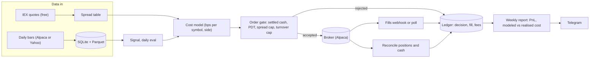
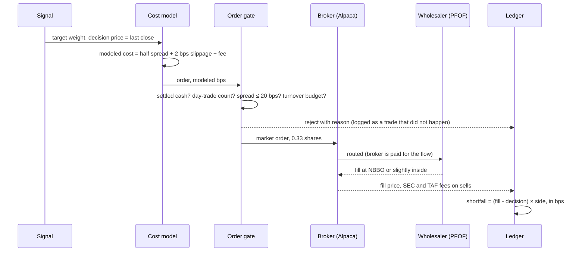
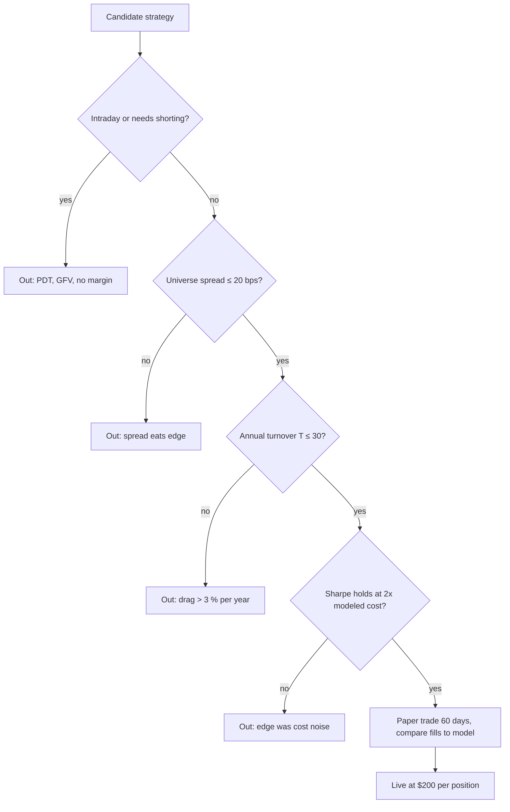

# Mini quant system — DE 07, costs, fees and edge realism

Lens: the arithmetic nobody wants to do. "Commission-free" is the most expensive phrase in retail trading. Everything below is for a $2,000 US cash account at a zero-commission broker (assume Alpaca: fractional shares, paper API, free IEX data), $200 max per position, long-only. Numbers are 2026 approximations; the model is parameterised so the operator replaces them with measured ones.

## Requirements

Functional

| # | Requirement | Number |
|---|---|---|
| F1 | Trade a fixed universe of liquid US ETFs and mega-cap stocks, long-only, cash account | 5 to 10 symbols, $200 max per position |
| F2 | Evaluate signals daily; place orders only on signal change, at most one rebalance per symbol per day | ≤ 20 orders per day hard cap |
| F3 | One cost model shared by backtest and live: `cost(symbol, side, notional, time_of_day)` | returns bps; per-symbol spread table refreshed from live quotes |
| F4 | Ledger records decision price, submitted price, fill price, fees, timestamps for every order | 100 % of orders, append-only |
| F5 | Order gate rejects orders that would breach settled-cash (good-faith violation) or day-trade (PDT) rules | 0 violations, ever |
| F6 | Weekly report: gross PnL, modeled cost, realised cost (implementation shortfall), turnover | one page, sent to phone |

Non-functional

| # | Requirement | Number |
|---|---|---|
| N1 | Fixed infrastructure cost | ≤ $8 per month, ≤ 5 % of account per year |
| N2 | Modeled round-trip cost on admitted symbols | ≤ 10 bps; symbol blocked if measured spread > 20 bps |
| N3 | Annual one-way turnover cap | 30x account (≈ 3 % per year drag at 10 bps) |
| N4 | Data | free tier only; daily bars plus IEX quotes; no paid SIP feed |
| N5 | Realised cost vs modeled cost | alert if realised > 1.5x modeled over any 20-trade window |
| N6 | Unattended for one trading day | no order without a passing gate; kill switch on 3 % daily drawdown |

Assumptions: US retail, cash account (no margin, no shorting, T+1 settlement), Alpaca or equivalent zero-commission broker with fractional shares, home broadband already paid for, operator's time is not in the P&L (it should be; see deep dive).

## Estimates

Cost stack for one $200 round trip, liquid ETF (SPY-class, $0.01 spread on ~$600)

| Item | Per round trip | bps of $200 | Note |
|---|---|---|---|
| Commission | $0.00 | 0 | Alpaca, Schwab, Fidelity, Robinhood, IBKR Lite. IBKR Pro $1 minimum = 50 bps, ruled out |
| SEC Section 31 fee (sells only) | $0.00 to $0.006 | ≤ 0.3 | rate is set per fiscal year, $0 to ~$28 per $1M sold |
| FINRA TAF (sells only) | ~$0.0001 | ~0 | ~$0.00017 per share on 0.3 shares |
| Bid-ask spread, cross twice | $0.03 | 1.7 | full spread paid once per round trip with market orders |
| Timing slippage, PFOF execution | $0.04 | 2 | wholesaler fills at or inside NBBO; the cost is NBBO itself and your latency to it |
| Fractional-share rounding | $0.00 to $0.02 | 0 to 1 | fractional orders are market-only at Alpaca; whole-share brokers round $200 to 1 share of a $180 stock, 10 % sizing error |
| Total, SPY-class | ~$0.08 | ~4 | |
| Total, single mega-cap ($0.02 spread on $250) | ~$0.20 | ~10 | AAPL, MSFT, NVDA class |
| Total, mid-cap ($0.05 spread on $60) | ~$0.60 | ~30 | blocked by N2 |
| Total, crypto on Alpaca (0.25 % taker each way) | $1.00 | 50 | 12x the ETF case |

Planning number: 10 bps per round trip base, 20 bps stress. Market impact is zero at $200; that is the one thing size buys you.

Fixed costs per month

| Item | $/month | Note |
|---|---|---|
| Mac mini electricity, ~8 W average | 1 to 3 | 6 kWh at $0.20 to $0.45 per kWh |
| Broadband | 0 | already paid |
| Market data | 0 | Alpaca IEX real-time (free), daily bars from Alpaca or Yahoo. Alpaca SIP $99, Polygon $29 to $79: ruled out, 17 % to 59 % of account per year |
| Off-site backup (few GB) | 0 to 1 | Backblaze B2 or iCloud |
| Alerting | 0 | Telegram bot, healthchecks.io free tier |
| UPS, $80 amortised over 3 years | 2 | prevents the one outage that matters |
| Total | 3 to 7 | ≈ $60 per year ≈ 3 % of account |

Volumes and rates

| Item | Estimate |
|---|---|
| Daily bars, 10 symbols, 10 years | 25,000 rows, < 5 MB |
| Minute bars (IEX), 10 symbols | ~1M rows per year, ~50 MB per year in Parquet |
| API calls | < 200 per day, well inside free rate limits |
| Orders per year | 120 (monthly) to 1,500 (daily), see deep dive |
| Fee dollars per year | $2 to $20 in regulatory fees; $10 to $150 in spread and slippage |
| Honest expected edge | documented retail-replicable premia (trend, dual momentum) 2 to 5 % per year over buy-and-hold, i.e. $40 to $100 per year gross, before the $60 fixed cost |

## High-level design

Main flows

1. Data in: 16:05 ET pull daily bars; on trade days pull IEX quotes for the universe 5 minutes before the order window to refresh the spread table.
2. Signal: computed daily from closes. Emits target weights, not orders.
3. Cost model turns target minus current into candidate orders, attaches modeled cost, applies a hysteresis band (do not trade if drift < 2 % of position).
4. Order gate checks settled cash, day-trade count, spread cap, turnover budget. Only then does an order reach the broker. Rejections are logged as if they were trades, with reason.
5. Reconcile: after fills, positions and cash are re-read from the broker and diffed against the ledger. Mismatch stops trading until the operator clears it.
6. Report: weekly implementation-shortfall report; this, not PnL, is the first thing the operator can actually learn from.

## Deep dive: costs, fees and edge realism

The hard part: at $200 a trade the costs are cents, so they feel like zero. They are not zero, they scale linearly with turnover, and the account is far too small to see them in the PnL. Cost drag is the one loss that is certain.

### Break-even by trading frequency

Model: annual drag = T × r, where T is annual one-way turnover as a multiple of account equity (T = 1 means the whole book sold and rebought once) and r is the round-trip cost. Fixed cost $60 per year = 3 %. Risk-free alternative assumed 4 % (T-bills or a money-market sweep). Turnover assumptions are typical for the strategy type, stated so the panel can argue with them.

| Frequency | Turnover assumption | T per year | Orders per year (10 names) | Drag, r = 10 bps | Drag, r = 20 bps | Gross edge to break even (drag + 3 % fixed) | Gross edge to beat T-bills (+ 4 %) | Required per month |
|---|---|---|---|---|---|---|---|---|
| Daily rebalance | 30 % of book per day | 75 | ~1,500 | 7.5 % | 15 % | 10.5 % to 18 % | 14.5 % to 22 % | 0.9 % to 1.5 % |
| Weekly rebalance | 50 % of book per week | 26 | ~520 | 2.6 % | 5.2 % | 5.6 % to 8.2 % | 9.6 % to 12.2 % | 0.5 % to 0.7 % |
| Monthly rebalance | 50 % of book per month | 6 | ~120 | 0.6 % | 1.2 % | 3.6 % to 4.2 % | 7.6 % to 8.2 % | 0.3 % to 0.35 % |

Read it in dollars. Daily rebalancing must generate $210 to $360 per year gross just to hand $150 to $300 of it to the market and $60 to the electricity company. Monthly rebalancing must generate $72 to $84. The same 10-name universe, the same signals, a 12x difference in hurdle.

Two frequencies that are not in the table because they are ruled out before costs are counted:

| Frequency | Why it is out |
|---|---|
| Intraday round trips | Cash account: buying with unsettled proceeds and selling before settlement is a good-faith violation, three of them freezes the account for 90 days. Margin account: PDT rule caps day trades at 3 per 5 business days under $25k. Either way, structurally impossible at $2,000, and at r = 10 bps a 1 % intraday move nets 0.9 %. |
| Crypto daily | r = 50 bps at Alpaca taker rates; T = 75 gives 37 % per year drag. Monthly crypto (T = 6, 3 % drag) is the only crypto cadence that survives, and 24/7 markets add a weekend gap the daily bar model does not see. |

### Where each cost lands in an order

### The obvious approach and why it breaks

The obvious approach: backtest on daily closes with commission = 0, assume fills at the close, note "broker is commission-free", go live.

1. The close is not your fill. A market order at 15:55 fills at the ask, not the close print; a `cls` time-in-force order fills in the auction, which for SPY is fine and for a mid-cap can be 10 to 30 bps off the last trade. Backtest and live diverge by exactly the cost the backtest omitted.
2. Zero commission hides a sign error. Retail backtests routinely show strategies with Sharpe 1.5 at daily frequency that go to Sharpe 0 at 10 bps. The turnover that made the backtest look good is the same turnover that pays the market.
3. Free IEX quotes are 2 to 3 % of US volume. Limit orders priced off IEX quotes miss the real NBBO and do not fill, then the strategy "held cash" in the backtest and "held the wrong stock" live. Use market orders on liquid names, or limit orders only at or through the far side.
4. Fractional shares are market-only at Alpaca. Whole-share brokers turn $200 targets into 1 share or 0 shares; a $2,000 book of 10 names cannot be rebalanced by 5 % in $180 stocks at all.
5. Settlement and PDT rules are not costs in the model but they change what the model can do. T+1 makes daily sell-then-buy-next-day fine; sell, buy, sell inside one day is not.
6. Nobody can measure the edge. At 12 % annual volatility, confirming a 3 % alpha at t = 2 needs (2 × 12 / 3)² = 64 years of live data. Confirming 10 % alpha needs 6 years. The live PnL of a $2,000 account will never tell the operator whether the strategy works.

### What I would do instead

1. Cost model in the backtest from day one: `cost_bps = half_spread_bps(symbol) + 2 + fee_bps(side)`, spread from a table measured live over the last 20 sessions at the order window, not from a constant. Run every backtest at 1x and 2x modeled cost; admit only strategies whose Sharpe survives 2x.
2. Turnover is the design variable, not a result. Evaluate daily, trade on signal change with hysteresis (2 % drift band, minimum holding period 5 days). A 200-day trend filter on SPY flips 3 to 6 times a year: T ≈ 5, drag 0.05 %. Same daily evaluation, 15x less turnover than a daily rebalance.
3. Measure the thing you can measure. Implementation shortfall (fill minus decision price, per trade, in bps) has a standard error small enough to be meaningful after 50 trades. PnL does not. The weekly report leads with realised cost vs modeled cost; if realised exceeds 1.5x modeled the model is wrong and trading pauses.
4. Admission gate for strategies, applied before any code is written for them:

### What is plausible at this scale and what costs alone rule out

| Strategy class | Verdict | Arithmetic |
|---|---|---|
| Monthly tactical asset allocation on 5 to 10 ETFs (dual momentum, risk parity) | Plausible | T = 2 to 6, drag < 0.6 %, spreads 1 to 3 bps |
| Daily-evaluated trend filter, trade on flip only | Plausible | T ≈ 5, drag ≈ 0.05 %; the best cost profile on the list |
| Weekly cross-sectional momentum on mega-caps | Marginal | T ≈ 26, drag 2.6 to 5 %, needs 8 to 12 % gross; documented momentum premia are about that size before costs |
| Daily rebalance of any kind | Ruled out | drag 7.5 to 15 %, hurdle 10 to 22 % gross, above the long-run return of the index itself |
| Daily mean reversion on single stocks | Ruled out | T = 100+, spreads 10 bps, drag 10 to 20 %; this is the classic retail backtest mirage |
| Intraday anything | Ruled out | GFV or PDT before costs are even counted |
| Options | Ruled out | $0 to $0.65 per contract but 5 to 10 % of premium in spread; one contract is 5 to 50 % of the account |
| Crypto, daily or faster | Ruled out | 50 bps round trip, drag 37 % at T = 75 |
| Small caps, illiquid ETFs, anything under $10 | Ruled out | 30 to 100 bps spread |
| Pairs or stat-arb | Ruled out | needs shorting; cash account cannot; margin at $2k cannot borrow |

The honest summary: the only strategies that clear the hurdle are slow ones on liquid ETFs, and their expected excess return is $40 to $100 per year on $2,000. That is the correct size for a learning system. The real cost is the operator's time: 2 hours a week at any plausible hourly rate exceeds the account's entire expected profit by 10x. The return on this project is education and infrastructure, and the design should say so in the README.

## Trade-offs

| Decision | Chosen | Alternative | Why |
|---|---|---|---|
| Order type | Market orders on liquid names | Limit at mid | Limit orders off IEX quotes do not fill; at $200 the half-spread saved is $0.02 and the non-fill risk is the whole trade |
| Rebalance cadence | Daily evaluation, trade on flip, monthly full rebalance | Daily rebalance | 12x hurdle difference, see table |
| Account type | Cash | Margin | PDT rule and margin interest; cash account only costs the T+1 wait, which a daily-or-slower system never notices |
| Data | Free daily bars plus free IEX quotes | $99 SIP feed | 59 % of account per year; the strategy does not need sub-second NBBO |
| Broker | Zero-commission, fractional (Alpaca) | IBKR Pro | $1 minimum = 50 bps on $200; IBKR's better execution is worth ~1 bp |
| Cost model | Measured spread table, 2 bps slippage constant | Full market-impact model | impact is zero at $200; the constant is honest, the model would be theatre |

## Pitfalls

1. Reading $0.08 per trade as free. It is 4 bps, and 4 bps × T = 75 is 3 % per year on the best-case universe.
2. Backtesting momentum with 0 cost, then wondering why live Sharpe is 0.
3. Using IEX quotes as if they were the NBBO for limit pricing.
4. Whole-share rounding turning a 10-name book into a 6-name book.
5. Good-faith violations from a "harmless" same-day fix-up trade after a bad fill. Three and the account is frozen.
6. Comparing to zero instead of to a T-bill sweep. Alpaca pays nothing on idle cash; $2,000 in a money-market fund earns ~$80 per year with no code.
7. Judging the strategy by PnL after 3 months. That is 0.5 % of the data needed.
8. Forgetting that the fee rate table changes every year (SEC fee reset each fiscal year, TAF adjusted); hard-code nothing, read from a config with a date.

## Open questions for the panel

1. Is the turnover cap N3 (30x) too generous? At 20 bps stress it is 6 %, more than the plausible edge. I would accept 15x.
2. Should idle cash sit in a money-market ETF (BIL, SGOV) inside the account? It adds two trades a month at 1 bp spread and earns 4 %; it also complicates the settled-cash gate.
3. Do we treat the operator's time as a cost in the report? I think yes, printed on the first line, so the project stays honest about what it is.
4. Paper trading at Alpaca fills at the NBBO with no spread cost; does anyone on the panel know a paper venue that models spread, or do we subtract modeled cost from paper fills ourselves? I propose the latter.
5. If the strategy that survives admission is monthly dual momentum on 4 ETFs, is the system worth building at all versus a calendar reminder and a spreadsheet? The infrastructure lenses should answer that, not this one.

## Non-negotiables

1. The backtest uses the same cost function as live, with per-symbol measured spreads, and no strategy goes live unless its Sharpe survives 2x modeled cost. Without this every other number on the panel is fiction.
2. The order gate enforces settled cash, day-trade count, spread cap and turnover cap before the broker sees an order, and logs rejections. A cost model that can be bypassed by one enthusiastic trade is not a cost model.
3. The weekly report leads with realised versus modeled cost, not PnL, and pauses trading when realised exceeds 1.5x modeled. This is the only feedback loop the account is large enough to close.
