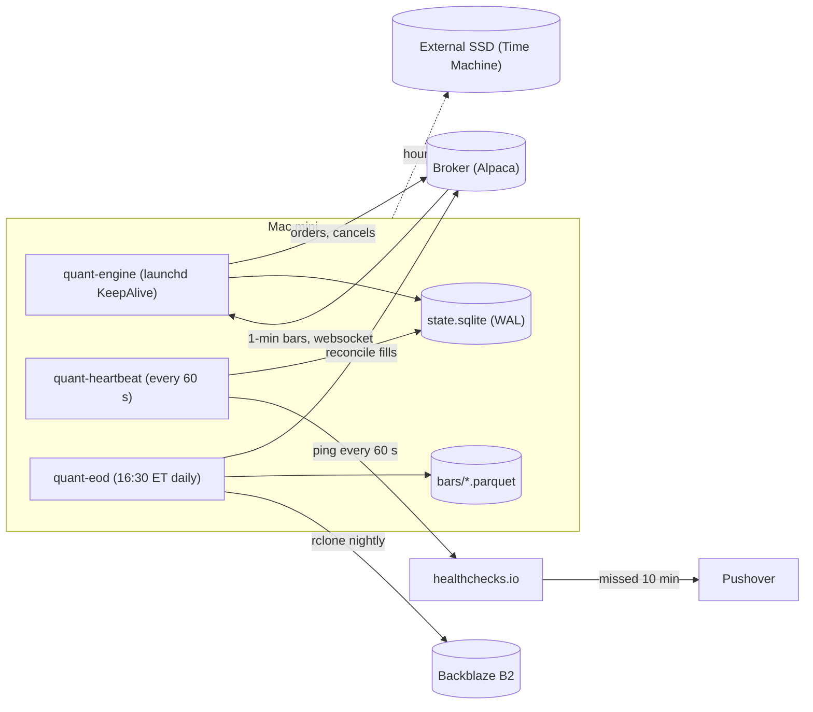
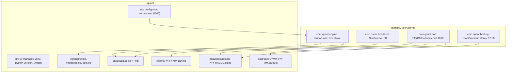
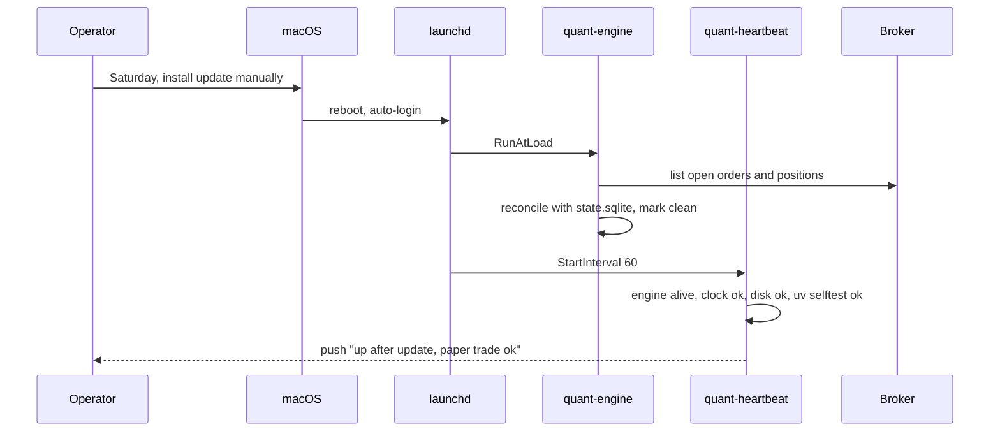

# Mini quant system — DE 08, running it on a Mac mini

Lens: the machine itself. A Mac mini in a closet is a fine server if you treat it as one: launchd, no sleep, a UPS, boring storage, and a recovery path that needs nobody at the keyboard.

Assumptions: Alpaca (commission-free, paper + live, free IEX data), 3 to 5 liquid ETFs, one signal per minute at most, orders during the regular session only, cash account (no margin, no PDT rule, T+1 settlement). Home broadband with a router that reboots on its own after power loss.

## Requirements

Functional

| # | Requirement | Number |
|---|---|---|
| F1 | Pull bars, compute signal, place and reconcile orders, report daily | 3 to 5 symbols, 1-minute bars, at most 10 orders/day |
| F2 | Come back on its own after crash, power loss, reboot, OS update | Human touches keyboard 0 times per week in steady state |
| F3 | Flat-position kill switch when unhealthy | Cancel all open orders within 60 s of a detected fault |
| F4 | Full history of bars, signals, orders, fills kept locally | 5 years on the internal SSD |

Non-functional

| # | Requirement | Number |
|---|---|---|
| N1 | Availability during market hours | 99.5 % per month, about 40 min lost per month is acceptable |
| N2 | Recovery time after crash | Process back in 10 s; after reboot, trading within 3 min of power |
| N3 | Data loss on power cut | Zero committed orders or fills lost (SQLite WAL, UPS clean shutdown) |
| N4 | Clock error | Under 500 ms versus NTP; alert above that |
| N5 | Backup | Nightly, off-machine and off-site; restore tested quarterly |
| N6 | Infra cost | Under $5 per month recurring, under $200 one-time |
| N7 | Operator alerting | Dead-man's switch fires within 10 min of the machine going dark |

## Estimates

| Item | Working | Result |
|---|---|---|
| Bar rows per year | 390 bars × 5 symbols × 252 days | 490 k rows/yr |
| Bar storage | 490 k × ~50 B raw; Parquet zstd about 5× | 25 MB raw, 5 MB Parquet per year |
| Optional 1 s quotes | 23,400 × 5 × 252 × ~30 B | 880 MB raw, ~180 MB Parquet per year |
| Trades | 2 to 10 orders/day × 252 | 500 to 2,500 orders/yr, under 5 MB in SQLite for 5 years |
| Logs | Engine at INFO, ~5 MB/day, gzip rotated | ~300 MB/yr compressed |
| 5-year disk, everything | Parquet 1 GB + logs 1.5 GB + SQLite 0.1 GB + backups 3 GB | Under 10 GB of 512 GB |
| RAM steady | macOS 4 GB + engine 0.4 GB + heartbeat 0.05 GB | ~4.5 GB of 16 GB |
| RAM peak | plus DuckDB backtest over 5 years of quotes | ~8 GB |
| CPU | Engine idle under 2 %; backtests burst 100 % of 4 cores for minutes | Never contended during market hours if backtests run after close |
| Electricity | Mac mini ~8 W avg + router 15 W, 24 × 30 h, $0.17/kWh | ~$3/month |
| Off-site backup | 2 GB on Backblaze B2 at $6/TB-month | $0.01/month |
| Total recurring | | ~$3 to $4/month, mostly electricity |
| One-time | UPS $80, 1 TB external SSD $70 | $150 |

Honest edge versus fees. Commission is zero; the real cost is the spread, about 1 to 2 bps each way on SPY-class ETFs plus a few cents of SEC/FINRA fees on sells. At 20 round trips a month of $500 notional that is about $4 per month, $50 per year, or 2.5 % of the account. A daily-timeframe retail signal on liquid ETFs has a plausible gross edge of 0 to 3 % per year, so expected net is roughly zero. The machine's job is to make that measurement cheaply and safely, not to make money in year one.

## High-level design

Main flows

1. Data in: engine holds one websocket to the broker, writes each closed 1-minute bar to `bars_today` in SQLite. On disconnect it backfills the gap over REST before resuming signals.
2. Signal: on each bar close, the strategy reads the last N bars from SQLite, emits a target position per symbol, writes the signal row.
3. Order out: engine diffs target versus known position, submits limit orders, writes `orders` with the broker id before returning. A crash between write and submit is resolved at startup by asking the broker for open orders.
4. Reconcile: heartbeat compares local positions to broker positions every 60 s; mismatch beyond one share flips the kill switch (cancel all, flatten, alert). The eod job does the full fill reconcile and marks the day closed.
5. Report: eod appends the day's bars and fills to monthly Parquet, runs a DuckDB query over Parquet for P&L, spread paid, and signal hit rate, writes `reports/YYYY-MM-DD.md`, pushes a one-line summary.

## Deep dive: running it on a Mac mini

The hard part: nobody is watching. Every failure mode has to end in one of two states with no human: trading again, or flat and alerting.

### Processes and files on the machine

Everything lives under `~/quant`, not Documents, Desktop, or Downloads. Those three are gated by TCC and a launchd job that touches them silently gets a permission dialog nobody will click.

### Supervision: launchd, not a supervisor on top of launchd

The obvious approach is `supervisord` or `pm2` inside a Docker container. It breaks because launchd already is the supervisor, and every layer on top adds a thing that itself must be kept alive at boot. One plist per job, four jobs total.

Plist keys that matter: `ProgramArguments` pointing at the venv's absolute `python -m quant.engine`, `WorkingDirectory ~/quant`, `RunAtLoad true`, `KeepAlive true`, `ThrottleInterval 10`, `StandardOutPath` and `StandardErrorPath` to `log/engine.log`, `EnvironmentVariables TZ=America/New_York`.

Decisions and why

| Question | Choice | Reason |
|---|---|---|
| LaunchAgent or LaunchDaemon | LaunchAgent in `~/Library/LaunchAgents`, auto-login enabled | Runs in the user session, no root, keychain available, `launchctl` works without sudo. Daemons run before login but then the user session and its files are an afterthought |
| FileVault | Off on this machine | With FileVault on, nothing runs until a human types the password after power loss. The box is in a home; disk-at-rest risk is lower than the unattended-boot risk. Secrets are in a 0600 file, never in git |
| Crash loops | `ThrottleInterval 10` plus engine exits non-zero on a config or auth error | launchd restarts in 10 s; the heartbeat notices more than 5 restarts in 10 min via `launchctl print` and sends an alert instead of letting it spin all day |
| Watchdog placement | Separate `heartbeat` job, 40 lines of Python | A process cannot watch itself. It checks: engine pid alive, last bar written within 3 min during session, broker positions equal local, disk over 10 GB free, clock offset. Any failure: cancel all orders, flatten, Pushover |
| Dead-man's switch | Heartbeat pings healthchecks.io every 60 s, grace 10 min | Covers the cases local code cannot: power gone, ISP gone, kernel panic. External, free |

### Native Python, not Docker

| | Native (uv) | Docker Desktop on Apple silicon |
|---|---|---|
| Starts before login without a person | Yes, launchd | Docker Desktop is a GUI app; autostart is best-effort and the VM takes 20 to 40 s |
| Memory overhead | 0 | Linux VM, 1 to 2 GB reserved |
| Broken by macOS update | Rarely; uv Python builds do not link to Homebrew or Xcode CLT | Regularly; Docker Desktop updates lag macOS releases |
| Reproducible env | `uv.lock` plus `.python-version` pin (3.12) | Dockerfile, also reproducible |
| Keeping the container alive | n/a | Needs restart policy plus a supervisor for the daemon itself |

`uv` wins. Install: `uv python install 3.12`, `uv sync --frozen` from the lockfile, launchd calls the venv's interpreter by absolute path. No Homebrew Python anywhere near the trading path; Homebrew is fine for `rclone` and `sqlite3` CLI.

### Storage layout

| Data | Store | Why |
|---|---|---|
| Live state: orders, fills, positions, signals, today's bars, kill-switch flag | SQLite, WAL mode, `synchronous=NORMAL` | Multiple processes, small transactional writes, survives power cut with WAL, `.backup` API for consistent snapshots. DuckDB is a single-writer analytics engine; using it as an OLTP state store is the mistake to avoid |
| History: bars, quotes, fills by month | Parquet, zstd, one file per symbol per month, written only by eod | Append-only, cheap, readable by anything. Eod rewrites only the current month's file |
| Analytics and backtests | DuckDB in-process, querying Parquet directly, no `.duckdb` file | `SELECT ... FROM 'data/bars/*/*.parquet'` is the whole ingestion layer |
| Logs | `log/*.log` from launchd stdout, rotated by `newsyslog` (`/etc/newsyslog.d/quant.conf`, daily, gzip, keep 30) | Native rotation, no logrotate install, no Python rotating handler fighting launchd's open file handle |
| Config | `etc/config.toml`, read with stdlib `tomllib` | One file, in git |
| Secrets | `etc/secrets.env`, mode 0600, excluded from every backup that leaves the machine | Keychain via `security` CLI is the upgrade when a second person exists |

Backups, three layers, all native or one binary:

1. Time Machine to the external SSD, hourly, whole machine. Restores the OS and `~/quant` together.
2. Eod job runs `sqlite3 data/state.sqlite ".backup data/backup/state-$(date +%F).sqlite"` then `rclone sync data/ b2:quant-data --exclude secrets.env`. Off-site, about 2 GB, a cent a month.
3. Quarterly drill, 30 minutes on a calendar: fresh user account, `git clone`, `uv sync`, `rclone copy` back, `quant selftest` passes against paper.

### Keep it awake and powered

- `sudo pmset -a sleep 0 disksleep 0 womp 1 autorestart 1 powernap 0`. Display sleep is fine. `autorestart 1` is the "start up after power failure" setting.
- UPS: 600 VA line-interactive with USB, about $80. Mac mini plus modem plus router draw under 40 W, so 60 to 90 minutes of runtime. macOS recognizes a USB UPS natively under Energy Saver: shut down after 5 minutes on battery. A clean shutdown checkpoints the WAL; power return triggers autorestart; launchd brings the jobs back; the engine's startup reconcile asks the broker what happened while it was gone.
- The router and modem go on the same UPS. A machine that is up with no internet is the same as a machine that is down, but noisier.

### Time

macOS runs `timed` against `time.apple.com` by default; confirm with `systemsetup -getusingnetworktime`. The heartbeat runs `sntp -d time.apple.com`, parses the offset, alerts over 500 ms. Bars are timestamped by the broker, not the local clock, so local skew only affects "is the market open" checks and log ordering. Machine time zone stays whatever the operator likes; every job gets `TZ=America/New_York` from its plist so `StartCalendarInterval` and the code agree.

### What happens during a macOS update

Rules

- System Settings: automatic download on, automatic install of macOS updates off. Keep "security responses and system files" on; those do not reboot.
- Install on a Saturday. Never on a weekday with open positions.
- Post-update, the heartbeat's `selftest` subcommand imports every module, opens SQLite, hits the broker's clock endpoint, and writes one paper order and cancels it. Failure means the engine refuses to go live and the operator gets a push.
- Known breakers: a new Xcode CLT prompt (avoided by uv's standalone Python), Gatekeeper quarantining a rebuilt binary (`xattr -d com.apple.quarantine`), and Login Items being reset (check `launchctl list | grep quant` in the selftest).

### Resource budget, 5 years

| Resource | Year 1 | Year 5 cumulative | Headroom |
|---|---|---|---|
| Disk, Parquet bars + quotes | 0.2 GB | 1 GB | 512 GB SSD, keep 100 GB free for macOS updates |
| Disk, logs compressed | 0.3 GB | 1.5 GB | rotated, capped by newsyslog |
| Disk, backups local | 0.5 GB | 3 GB | prune snapshots older than 90 days |
| RAM steady | 4.5 GB | same | 16 GB, backtests after close only |
| CPU | under 2 % | same | fine |

The Mac mini is oversized for this workload by 20× on every axis except one: it is a single point of failure. That is accepted; the mitigation is that the safe state is flat, and the heartbeat plus dead-man's switch get to flat without the machine.

## Trade-offs

| Decision | Gain | Cost |
|---|---|---|
| LaunchAgent + auto-login + FileVault off | Unattended boot after power loss | Physical access to the box means access to the account keys; mitigated by the account size and Alpaca API key scopes |
| Native uv over Docker | Simpler boot, 1 to 2 GB RAM back, fewer update breakages | Less portable to a Linux VPS later; the lockfile carries most of it |
| SQLite for state, DuckDB only as a query engine | Crash-safe writes and simple analytics with no ETL | Two engines to know; DuckDB's SQLite extension bridges when needed |
| One machine, no failover | $0 and nothing to keep in sync | Downtime is downtime; the design guarantees flat, not uptime |
| Free IEX data feed | $0 versus $99/month, which would be 5 % of the account per year | IEX-only prints, fine for minute bars on ETFs, wrong for anything tick-sensitive |

## Pitfalls

- Sleeping Mac: the single most common failure. `pmset -g` in the selftest, alert if `sleep` is not 0.
- Time Machine and SQLite: Time Machine copies a WAL mid-write. Restores from it may need `PRAGMA wal_checkpoint`; the `.backup` snapshots are the ones to trust.
- launchd cannot see the venv's `PATH`; use absolute paths for everything, including `rclone` and `sqlite3`.
- `StartCalendarInterval` jobs skip if the machine was asleep or off at that minute; the eod job is idempotent and the heartbeat re-runs it if the day is not marked closed by 18:00.
- Broker websocket silently stops delivering bars but stays connected. The "last bar within 3 minutes during session" check catches this; the reconnect must backfill over REST.
- Log files opened by launchd grow forever without newsyslog; 5 MB a day is 9 GB in 5 years and a full disk corrupts SQLite writes.

## Open questions for the panel

1. Should the kill switch flatten positions or only cancel open orders when the fault is infrastructure rather than strategy? Flattening on a flaky ISP pays spread for no reason; not flattening leaves an unsupervised position overnight.
2. Cash account to dodge the PDT rule means T+1 settled funds; does the strategy lens accept that the account effectively trades at half size on consecutive days?
3. Is the 500 ms clock tolerance too loose or too tight for the intraday variant?
4. Does anyone want a $5/month VPS as an external watchdog that can call the broker's cancel-all endpoint when the Mac is dark, or is healthchecks.io plus a phone alert enough for a $2,000 account?
5. Who tests the restore drill if the operator is on vacation, or do we accept that the answer is "nobody, the system is flat"?

## Non-negotiables

1. `pmset sleep 0`, `autorestart 1`, and a UPS with the router on it. Without these the machine is a laptop and every other promise is void.
2. An external dead-man's switch that alerts a phone within 10 minutes of the machine going dark, and a startup reconcile that asks the broker for truth before placing anything.
3. SQLite in WAL mode for all order and fill state, with a nightly `.backup` copied off-site and a restore drill on the calendar. No state that only exists in process memory or in a log line.
