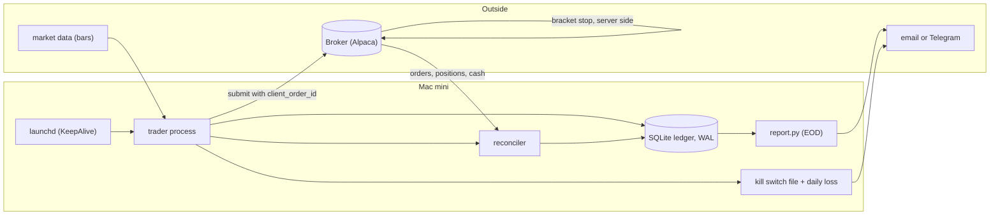
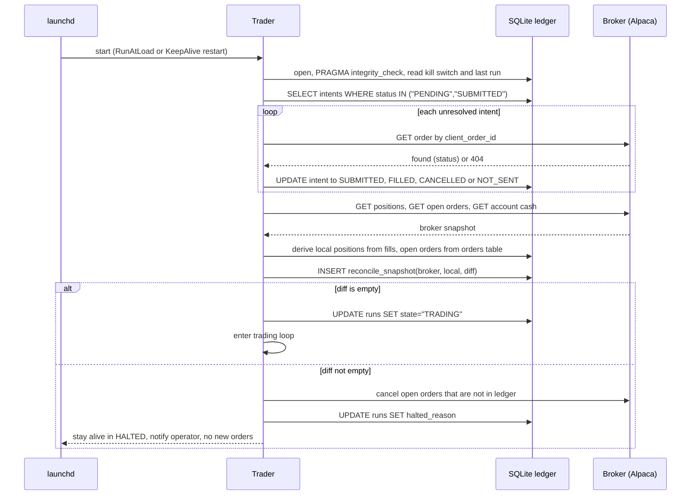
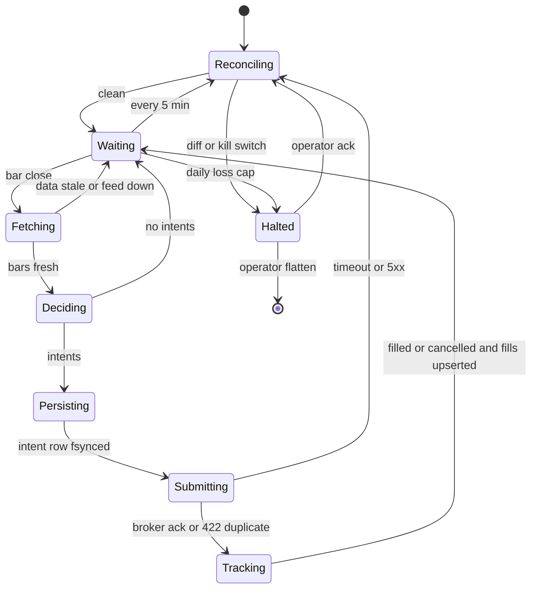

# Mini quant system — DE 09, reliability, crash recovery and reconciliation

Assumptions: US retail margin-free cash account at Alpaca (free API, commission-free, supports `client_order_id` and bracket orders). 3 to 5 liquid ETFs (SPY, QQQ, IWM, TLT, GLD). One strategy, decisions on 15-minute bars during regular hours, at most one position per symbol. Python 3.12, SQLite, launchd. No Kubernetes, no message queue, no second machine.

## Requirements

Functional:

- Pull bars, compute a signal per symbol per bar, submit at most one order per symbol per bar, track fills, reconcile with the broker, produce an end-of-day report.
- Every order carries a broker-side stop (bracket). The Mac mini is not the only thing protecting the account.
- Operator can halt and flatten with one command, and the system can halt itself.

Non-functional, with numbers:

| Property | Target | Why |
|---|---|---|
| Safe to `kill -9` at any instruction | Zero duplicated or orphaned orders across 500 random kills in paper trading | This is the whole lens |
| Restart to trading-ready | Under 60 s after process start, including reconciliation | One bar is 15 min; a missed bar is fine, a wrong bar is not |
| Max unattended time | 1 trading day, 6.5 h | Brief says "trusted for a day" |
| Loss cap | Per position 1.5 percent of equity ($30) via broker stop; daily 3 percent ($60) via local kill switch | $2,000 cannot survive a runaway loop |
| State divergence from broker | Detected within 60 s of any restart and every 5 min while running; any unexplained diff halts new orders | Halt, never guess |
| Durability | Intent fsynced before the broker call; no in-memory-only trading state | Derived state is rebuildable, persisted state is the truth |
| Data staleness | No order if last bar is older than 2 bar intervals, 30 min | Fail closed when the internet or feed drops |

## Estimates

| Item | Number |
|---|---|
| Bars | 5 symbols x 26 bars/day x 252 days = 33k rows/yr, about 3 MB. Even 1-min bars are 500k rows/yr, under 100 MB |
| Broker calls | About 26 bar cycles x (1 positions + 1 orders + up to 5 submits) = 200/day, versus Alpaca's 200/min limit. Not a concern |
| Orders | 0 to 5 per day, roughly 40 to 80 per month, about 1,000 per year |
| Ledger size | Orders + fills + intents + reconcile snapshots: under 2 MB/yr. SQLite on the SSD holds decades |
| Fees | Commission $0. SEC and FINRA fees on sells about $0.01 per trade. Spread on these ETFs 1 to 2 bps, so about $0.20 per $2,000 round trip. Roughly $15/yr in explicit costs, $50 to $150/yr in slippage |
| Edge | An honest good outcome for a retail 15-min ETF strategy is 5 to 10 percent per year, $100 to $200. Costs eat 30 to 60 percent of that. A single duplicate order that hits the stop costs $30, one sixth of a good year. Reliability bugs are the cheapest edge to buy |
| Monthly cost | $0 to $9 for data (Alpaca IEX free, SIP $9). Power for the Mac mini about $2. Backups to iCloud or B2 under $1 |
| Bugs to expect | Home broadband drops: 1 to 3 per month, seconds to hours. Broker API degraded: a few incidents per year, some during market hours. macOS forced reboot after update: monthly unless disabled |

## High-level design

Single Python process supervised by launchd (`KeepAlive`, `RunAtLoad`), SQLite ledger in WAL mode as the only source of truth, broker holds the protective stops.



Main flows:

1. Data in: every bar close, fetch the last N bars per symbol, upsert into `bars` keyed by `(symbol, ts)`. Idempotent.
2. Signal: pure function of bars and current positions. Produces intents, never side effects.
3. Order out: for each intent, insert an `intents` row with a deterministic key, fsync, then call the broker with that key as `client_order_id`, then record the response. Three steps, three durable points.
4. Reconcile: on every start and every 5 min, compare ledger against broker positions, open orders and cash. Diff means halt.
5. Report: end of day, ledger plus broker activities feed a report; a mismatch here is a bug ticket, not an alert.

## Deep dive: reliability, crash recovery and reconciliation

### The hard part

There is a window between "I decided to buy" and "the broker confirmed my order" where the process can die, the network can die, or the broker can accept the order and fail to tell us. A naive loop that keeps positions in memory and calls `submit_order` directly will, after a restart, either resubmit (double position, twice the risk) or forget (an open order it does not know about, with a stop it will never manage). Both have happened to real retail bots. On $2,000 one double-fill through the stop is $60, a whole month's edge.

### The obvious approach and why it breaks

Obvious: keep positions in a Python dict, call the broker, on startup ask the broker for positions and trust them. Breaks because:

- Broker positions tell you what you hold, not why, and not whether an order is in flight. A restart 200 ms after submit sees no position and no fill yet, resubmits, then gets two fills.
- Retrying a timed-out submit without a key is a coin flip: the broker may have accepted the first one.
- Trusting the broker blindly means a manual trade from the phone app becomes "the bot's position" and the bot manages it with the wrong stop.
- In-memory daily loss counters reset on restart, so the kill switch quietly re-arms.

### What I would do instead

**1. Split state into persisted and derived, and be strict about it.**

| Persisted, in SQLite, truth | Derived, rebuilt on start, never trusted across restart |
|---|---|
| `intents` (key, symbol, side, qty, bar_ts, status, created_at) | Current positions, computed from fills |
| `orders` (broker_id, client_order_id, status, last_seen_at) | Signals and indicators |
| `fills` (broker_fill_id, order_id, qty, price, ts), unique on `broker_fill_id` | Daily PnL (sum of fills today plus mark) |
| `bars` (symbol, ts, ohlcv), unique on `(symbol, ts)` | Anything cached in a dict |
| `runs` (run_id, started, last_heartbeat, halted_reason) | |
| `reconcile_snapshots` (ts, broker_json, local_json, diff, outcome) | |

If a value must be correct after `kill -9`, it is a row. If it can be recomputed from rows plus a broker query, it is a variable. Nothing else exists.

**2. Write intent before every broker call, with a deterministic idempotency key.**

`client_order_id = sha1(strategy_id, symbol, side, bar_ts)[:32]`. Not a UUID. The key is a function of the decision, so a restart that recomputes the same decision for the same bar produces the same key, and Alpaca rejects the duplicate with a 422. Two decisions on the same bar for the same symbol are impossible by construction. The sequence is:

```
BEGIN; INSERT intents(..., status='PENDING'); COMMIT   -- fsync, WAL synchronous=FULL
resp = broker.submit(client_order_id=key, bracket stop)   -- the only non-idempotent line in the system
UPDATE intents SET status='SUBMITTED', broker_id=resp.id  -- may never run, that is fine
```

Every crash point is covered: before the insert, nothing happened; between insert and submit, startup finds a PENDING intent and asks the broker by `client_order_id`; between submit and update, same lookup finds the order. At-least-once retries plus broker-side dedup on the key gives exactly-once submission. Fills are made idempotent the same way: upsert on `broker_fill_id`, so replaying the fill stream is harmless.

**3. Startup reconciliation. Disagreement halts, it does not guess.**



What counts as a diff and what we do:

| Broker says | Ledger says | Action |
|---|---|---|
| Position 10 SPY | Position 10 SPY | Proceed |
| Position 10 SPY | Position 0, intent SUBMITTED | Fetch fills for that order, upsert, recompute, proceed |
| Position 10 SPY | Nothing at all | Halt. Someone traded by hand or we lost rows. Do not adopt, do not sell |
| Position 0 | Position 10 SPY | Halt. Stop fired while we were down and fills not ingested, or worse. Pull activities, if fills explain it, proceed; else halt |
| Open order X | Not in ledger | Cancel it, then halt. Cancelling reduces exposure, it never adds it |
| Cash differs by more than $1 | | Halt. Fees and dividends explain cents, not dollars |
| No stop order on a position | Position exists | Place the stop, log loudly, proceed. This is the one "guess", because a naked position is worse than a wrong stop |

Halted means: process alive, heartbeat running, reconciler running every 5 min, zero new intents, operator notified. It leaves halted only when the operator runs `trader ack <snapshot_id>` after looking. On a single-person system, an unexplained diff at 10:03 that resolves itself by guessing is the one you cannot debug at 22:00.

**4. The trading loop as an explicit state machine.**



Every transition writes `runs.state` before doing the work of the next state. A crash in any state restarts in `Reconciling`, which is the only entry point. There is no code path from process start to `Submitting` that skips reconciliation.

**5. The three failure scenarios, concretely.**

Broker outage mid-trade. Submit times out after 10 s. We do not know if it landed. Do not retry blindly and do not mark failed. Transition to `Reconciling`, which polls `GET /orders?client_order_id=key` with backoff 5, 10, 20, 40 s for up to 5 min. Found: adopt it. 404 after 5 min: mark intent `NOT_SENT`, skip this bar (the bar is gone, the key is bar-scoped, so no resubmit). Broker fully down for more than 15 min: `Halted` with reason, the bracket stops on the broker still protect every open position, which is the entire reason they are server side.

Home internet drops. Data fetch fails or bars are older than 30 min: no new intents, that is just `Fetching --> Waiting`. Open positions are protected by the broker stop, not by us. The heartbeat row stops updating; a $0 external check (healthchecks.io free tier, pinged from the loop) notifies the phone after 20 min of silence. Nothing to reconcile when the network returns, because nothing local changed; the next `Reconciling` catches any stop that fired meanwhile via fills.

Machine reboots during market hours. macOS: enable "start up automatically after power failure", disable automatic OS updates during 09:00 to 16:30 ET, FileVault off or auto-login on, else the box waits at a password prompt until the operator gets home. launchd starts the trader at boot; it opens SQLite (WAL recovers any half-written transaction), resolves unresolved intents, reconciles, and is trading within 60 s. If the reboot took 40 minutes, two bars were missed, no harm. Nightly `sqlite3 .backup` to a second folder synced to B2, so an SSD death loses one day of ledger and the broker's records rebuild the rest.

**6. Proving it.** A chaos harness in paper trading: a wrapper that sends `SIGKILL` at a random point every 2 to 10 min for a week, plus a fault-injecting broker client that randomly times out after the request went through. Pass criterion: at week end, ledger positions equal broker positions, `intents` has zero duplicates per `(symbol, bar_ts)`, and every fill in broker activities exists in `fills`. This runs before the first real dollar and after every code change.

## Trade-offs

| Choice | Gain | Cost |
|---|---|---|
| Halt on diff, never auto-adopt | No silent wrong positions | Can sit halted for hours if the operator is away. Bracket stops make that acceptable |
| Bar-scoped idempotency key | No double orders across restarts, no retry ambiguity | A restart late in a bar that already NOT_SENT skips that bar's trade. Accepted, one missed trade is not a loss |
| Server-side bracket stops | Protection survives Mac, network and process death | Stop orders are visible, can be gapped through, and cost some slippage. Alternative, local stops, means no protection when offline. Not acceptable at $2,000 |
| SQLite, one process | Transactions, fsync, zero ops, crash-safe with WAL | No concurrent writers. Fine, there is exactly one |
| Reconcile every 5 min | Catches manual trades and stop fires quickly | About 80 extra calls per day. Rate limit is 200 per min, irrelevant |
| Cancel unknown open orders before halting | Reduces exposure without guessing | Might cancel an order the operator placed by hand on purpose. Rule: the operator does not trade this account by hand |

## Pitfalls

- Using a UUID as `client_order_id`. Every restart mints a new one and the broker happily accepts the duplicate.
- Persisting positions instead of fills. Positions are derived; if you store both they will drift and you will trust the wrong one.
- `synchronous=NORMAL` in WAL mode loses the last transaction on power loss. Use `FULL` for the ledger; it is one fsync per intent, milliseconds.
- Reconciling positions but not open orders. The dangerous state is an order in flight, not a settled position.
- Daily loss counter in memory. Persist it as a derived-on-start sum of today's fills plus mark, and store the halt as a row.
- Assuming a 5xx means "not sent". At Alpaca a 5xx can arrive after the order was booked. Only a `GET` by key resolves it.
- Marking fills by polling order status only. Partial fills change qty over time; ingest the fill events or activities endpoint and upsert on fill id.
- Sleeping macOS. Set `pmset -a sleep 0 disablesleep 1`; a sleeping Mac mini with an open position and a bracket stop is fine, a sleeping one with a naked position is not, and you will not know which you have.

## Open questions for the panel

1. Alpaca bracket orders: after a partial fill, is the stop leg sized to the filled qty automatically, and does the reconciler need to resize it? DE for broker integration should confirm against the API, not the docs.
2. Should "position on broker, nothing in ledger" ever auto-adopt, for example if the operator explicitly tags a manual trade? My answer is no, but strategy and risk lenses may want a manual-position allowlist.
3. Halted for over 2 hours with open positions: flatten automatically at 15:45 ET, or leave the stops to do their job? Flattening is a guess about direction, holding is a guess about the operator's return time.
4. Is a 5-minute reconcile interval too slow for intraday? A stop that fires at 10:01 is not in the ledger until 10:05 and the signal at 10:00's bar may try to re-enter at 10:15. Tightening to 1 min costs nothing.
5. Does anyone on the panel want a second process, for example a separate watchdog that can flatten? I think it doubles the reconciliation surface for no gain when the broker already holds the stops.

## Non-negotiables

1. Intent row fsynced with a deterministic `client_order_id` before every broker submit. No exceptions, no "fast path".
2. Startup and periodic reconciliation against broker positions, open orders and cash, where any unexplained diff halts new orders and notifies the operator. The system never guesses its way out of a diff.
3. Every position carries a broker-side stop. The Mac mini, the home network and the process are all allowed to die; the account's downside is not allowed to depend on them.
