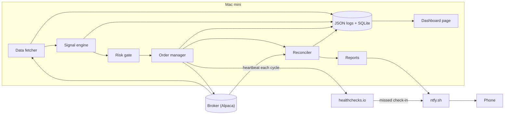
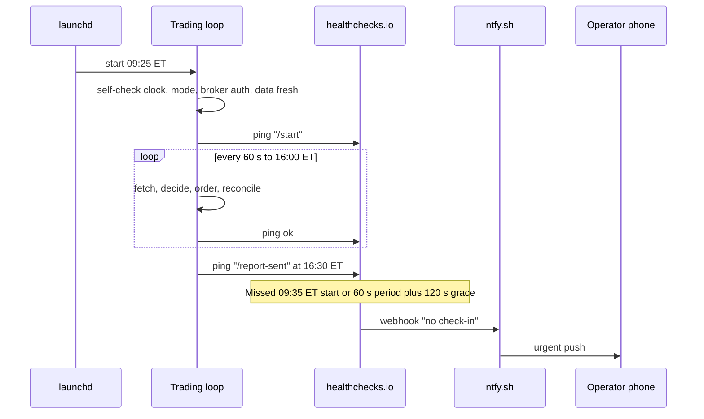

# Mini quant system — DE 10, observability and alerting

Lens: observability and alerting for one operator. Assumptions: Alpaca retail account (paper first, then live), 3 to 5 liquid US ETFs, one Python process on the Mac mini scheduled by launchd, SQLite for state. The operator has a day job; the system runs unattended from 09:30 to 16:00 ET and the operator looks at a phone maybe three times.

## Requirements

Functional

| # | Requirement | Number |
|---|---|---|
| F1 | Every log line is structured JSON and carries run id, strategy, symbol, order id when they exist | 100 percent of lines, enforced by one logger wrapper |
| F2 | Local dashboard shows positions, P&L today, open orders, last data timestamp, last heartbeat, risk budget used | refresh every 10 s, reachable on LAN and via Tailscale from the phone |
| F3 | Alerts reach the phone | delivered within 60 s of the condition, no app cost |
| F4 | Dead-man's switch fires from outside the Mac mini | page by 09:35 ET if no check-in after 09:30 ET |
| F5 | Daily report after close and weekly report Sunday evening | daily by 16:45 ET, weekly by Sunday 18:00 ET |
| F6 | Alerts are rare and actionable | target under 1 page per week on a healthy system; every alert names the action |

Non-functional

| # | Requirement | Number |
|---|---|---|
| N1 | Staleness is always visible; the dashboard never implies "fine" from old data | any timestamp older than 2 min turns red |
| N2 | Observability cannot take down trading | logging and alerting failures are caught and counted, never raised into the loop |
| N3 | Logs retained and greppable | 1 year on local disk, plain files, `grep` and `jq` are the query tools |
| N4 | Monthly cost | under $5 including electricity |

## Estimates

| Item | Estimate | Working |
|---|---|---|
| Bars ingested | 1,950 per day | 5 symbols x 390 one-minute bars |
| Log lines | 4,000 to 6,000 per day | 1 per bar per symbol, plus loop, order, reconcile events |
| Log volume | 1.5 MB per day, about 400 MB per year | 300 bytes per JSON line |
| Trades | 0 to 4 per day, 20 to 60 per month | daily or intraday signals on 5 symbols |
| Fees | commission $0, regulatory fees about $0.01 per sell, spread 1 to 3 bps on liquid ETFs | Alpaca retail |
| Honest edge | 0 to 10 percent per year, so $0 to $200 on $2,000 | daily P&L noise about $10 to $20 at 1 percent daily vol, edge is not visible for months |
| Monthly cost | about $3 | electricity $2, ntfy free, healthchecks.io free, Tailscale free, Alpaca data free (IEX feed) |

The estimate that matters for this lens: daily P&L noise of $10 to $20 is 10 to 20 times bigger than the daily expected edge. Any alert or dashboard that reacts to P&L alone will react to noise. Alerts must key on process health, data freshness, and risk budget, not on whether today was green.

## High-level design

Main flows

1. Data in: fetch last bars for 5 symbols each minute, write `last_data_ts` to SQLite, log one `bar` event per symbol.
2. Signal: compute, log a `decision` event with a `decision_id` even when the decision is "no trade". A silent "no trade" is indistinguishable from a broken strategy.
3. Order out: risk gate logs `risk_check` with budget used; order manager submits with a `client_order_id` that encodes lineage; every state change logs `order_state`.
4. Reconcile: after every cycle and at 16:05 ET compare local positions and orders with the broker; log `reconcile` with the diff. A non-empty diff is an alert.
5. Report: at 16:30 ET build the daily report from SQLite and send via ntfy; Sunday build the weekly report.

Every cycle ends with a ping to healthchecks.io and a rewrite of `status.json` that the dashboard reads.

## Deep dive: observability and alerting for one operator

### The hard part

The failure that costs money is silent. Nothing raises. The data feed returns yesterday's bars with today's timestamp. An order sits in `accepted` for an hour. The launchd job never started because macOS updated overnight. The process is alive but the loop is stuck in a retry. The clock is 4 minutes off after a sleep. Each of these produces zero exceptions and, with naive logging, a log file that looks healthy.

### The obvious approach and why it breaks

Obvious: log everything at INFO, alert on every ERROR, run a Grafana stack locally, look at the dashboard often.

| Why it breaks | Consequence |
|---|---|
| Alerting on exceptions misses the silent failures above | the expensive failures never page |
| Alerting from inside the process cannot report the process being dead | the one alert you need most is the one it cannot send |
| Grafana, Prometheus, Loki on a 16 GB Mac mini for one process | more moving parts than the trading system, and they need their own monitoring |
| Alert on every retry and every warning | 30 alerts a week, muted by week two, real page missed in week three |

### What I would do instead

Principle: monitor freshness and invariants, not errors. Put the liveness check outside the machine. Make every alert say what to do. Make quiet mean healthy by sending a daily proof of life.

#### 1. Structured logs

One logger wrapper, stdlib `logging` with a JSON formatter, one file per day under `~/quant/logs/`, rotated by date, kept 365 days. Context fields are bound once and travel with every line. `event` is a fixed vocabulary of about a dozen names (`start`, `bar`, `data_stale`, `decision`, `risk_check`, `order_submit`, `order_state`, `fill`, `reconcile`, `heartbeat`, `report`, `stop`); adding one is a code review item.

| Field | Always | Source | Why |
|---|---|---|---|
| `ts` | yes | UTC ISO 8601 with ms | grep and sort across days, no DST ambiguity |
| `level` | yes | logger | filter |
| `event` | yes | fixed vocabulary above | grep by event, not by free text |
| `run_id` | yes | `YYYYMMDD-` plus 6 hex chars at process start | tie every line of one process lifetime together; a restart gets a new id and that is itself visible |
| `strategy` | when known | bound at strategy entry | compare strategies in the same log |
| `symbol` | when known | bound per symbol loop | `jq 'select(.symbol=="SPY")'` |
| `decision_id` | signal onward | uuid per signal evaluation | links a decision to its orders and fills |
| `order_id` | order onward | broker id | reconcile against broker |
| `client_order_id` | order onward | `{run_id}-{strategy}-{symbol}-{seq}` | lineage survives on the broker side even if local state is lost |
| `mode` | yes | `paper` or `live` | the one field that must never be wrong; printed on every line so a mixed-up log is obvious |
| `msg` | yes | short human text | for humans at 3 am |

#### 2. Dashboard

No framework. The loop writes `status.json` each cycle; a static `index.html` fetches it every 10 s and is served by `python -m http.server` bound to the Tailscale address so the phone can open it anywhere. Building it is under 100 lines.

| Panel | Shows | Red when |
|---|---|---|
| Mode | `PAPER` or `LIVE` in large text, background colour differs | always visible, never red, just unmistakable |
| Last heartbeat | timestamp and age in seconds | age over 120 s during market hours |
| Last data timestamp | per symbol, age | age over 120 s during market hours, or bar date not today |
| Positions | symbol, qty, avg price, market value, unrealised | local and broker disagree |
| P&L today | realised plus unrealised, dollars and percent of equity | below the daily loss limit, default minus 2 percent of equity, $40 |
| Open orders | client id, symbol, side, state, age | any order older than 5 min not in a terminal state |
| Risk budget used | positions notional versus max, daily loss used versus limit, trades today versus max | over 80 percent |

The rule for the page: every number has a timestamp next to it. A number without an age is a lie waiting to happen.

#### 3. Alerts that reach a phone

Channel: ntfy.sh, free, push to iOS and Android, a topic name is the only secret so use a random 24-character topic. Email via the operator's SMTP as the second channel for reports. SMS skipped: costs money, adds a vendor, and push is faster.

Severity and delivery

| Severity | Meaning | Delivery | Budget |
|---|---|---|---|
| P1 | money at risk or unknown state, act now | ntfy priority `urgent`, bypasses phone silent mode | under 1 per month on a healthy system |
| P2 | degraded, act within the hour | ntfy priority `high` | under 1 per week |
| P3 | informational, read tonight | folded into the daily report, no push | unlimited but summarised |

The rule for alerts: an alert is a sentence with a verb the operator will do. If there is no action, it is a report line, not an alert. If an alert fires twice in a week and the action was "nothing", delete it or fix the cause the same evening. Alerts are deduplicated per condition per day so a flapping feed sends one push, not forty.

Alert conditions

| Condition | Detected by | Severity | Action the operator takes |
|---|---|---|---|
| No check-in by 09:35 ET | healthchecks.io grace window | P1 | Open Tailscale, check launchd and the log; if not fixable in 10 min, flatten via the broker app |
| Heartbeat missed for 3 min during market hours | healthchecks.io period 60 s, grace 120 s | P1 | Same as above; the process is hung or dead |
| Reconcile diff non-empty | reconciler | P1 | Trust the broker: set local state from broker, stop new orders until investigated |
| Daily loss limit hit, minus 2 percent of equity | risk gate | P1 | Confirm the kill switch fired and positions are flat; no new trades today |
| Order not terminal after 5 min | order manager | P1 | Cancel at broker, check fill status, verify no duplicate |
| Data stale over 2 min or bar date not today | data fetcher | P2 | Check feed status; the loop already refuses to trade on stale data, so the action is to confirm it did |
| Clock drift over 30 s versus broker server time | start and hourly | P2 | Restart the loop; fix NTP |
| Mode mismatch, `LIVE` but config says paper or vice versa | start | P1 | Stop immediately; this is a config error |
| Daily report sent | reporter | P3 | Read it; absence of this report by 16:45 ET is itself the alert, see below |

Two negative alerts are the most valuable: no check-in by 09:35 ET and no daily report by 16:45 ET. Both are absence checks that live on healthchecks.io, so they fire when the Mac mini is off, the power is out, or the ISP is down. Nothing inside the box can send those.

#### 4. Health checks and the dead-man's switch

Three checks on healthchecks.io, all free tier:

| Check | Schedule | Grace | Fires when |
|---|---|---|---|
| `quant-open` | cron `30 9 * * 1-5` America/New_York | 5 min | the loop did not start and self-check by 09:35 ET |
| `quant-heartbeat` | period 60 s, paused outside market hours by the loop itself | 120 s | the loop hung or died mid-day |
| `quant-report` | cron `30 16 * * 1-5` | 15 min | no daily report, so the close-of-day reconcile did not run |

The self-check at start is the gate for the first ping: clock within 30 s of broker time, `mode` matches config, broker auth works, account equity matches the last known value within 5 percent, first bars are dated today. If any fails, the loop does not ping `/start`, logs `start` with `ok=false`, and the dead-man's switch pages by 09:35 ET. Deliberately, a failed self-check is reported by silence, so the external watchdog is the single path for "not trading when I should be".

Market holidays: the loop knows the exchange calendar and pings `quant-open` with a `/pause` on holidays at 09:30 ET so there is no false page.

#### 5. Daily and weekly reports

Daily, 16:30 ET, one ntfy message and one email, under 20 lines: mode, run id, restarts; equity, P&L today and month to date; each trade with fill versus decision price in bps and fee; peak risk budget used and kill switch state; stale data minutes per symbol; final reconcile diff, which must be empty; alerts fired; and one line per strategy such as "3 signals, 2 traded, 1 blocked by risk gate".

Weekly, Sunday 18:00 ET, email only, and this is where the honest-edge question lives:

| Section | Content |
|---|---|
| Performance | weekly and cumulative P&L, max drawdown, hit rate, average win versus average loss, trades count |
| Versus expectation | same metrics from the backtest over the same window; flag any metric outside the backtest's 20th to 80th percentile |
| Paper versus live | if both run, divergence in fills and P&L; a divergence over 20 bps per trade means slippage assumptions are wrong |
| Reliability | restarts, stale data minutes, alerts fired, alerts that led to no action |
| Alert hygiene | any alert that fired more than twice with action "none" is listed for deletion |

The weekly report is the only place the operator is asked to judge the edge, and it does so against the backtest distribution, not against zero. Twelve weeks of live data will still not prove an edge at this trade count; the report says so in its footer so the operator does not fool themselves.

## Trade-offs

| Choice | Chosen | Alternative | Why |
|---|---|---|---|
| Log storage | JSON lines files plus SQLite status | Loki or Elasticsearch | 1.5 MB per day; `jq` is enough; no second system to keep alive |
| Dashboard | static HTML reading `status.json` | Grafana, Streamlit | fewer processes than the trading system itself; nothing to upgrade |
| Push channel | ntfy.sh | Pushover, Twilio SMS, Telegram bot | free, no account, urgent priority bypasses silent mode; Pushover is the paid fallback if ntfy is flaky |
| Dead-man's switch | healthchecks.io external | local cron checking the loop | a local check dies with the machine; external is the whole point |
| Reports | daily push and email | real-time P&L pushes | intraday P&L is noise; a push per trade trains the operator to ignore pushes |

## Pitfalls

- Alerting on P&L movement. Daily noise is 10 to 20 times the edge; you will page yourself on randomness.
- Dashboard numbers without timestamps. A stale "P&L +$12" looks fine while the process is dead.
- Heartbeat from a thread that stays alive while the main loop is stuck. Ping from the end of the main loop iteration, never from a separate timer.
- Wrapping the loop in `try/except: log and continue`. It converts a crash, which the dead-man would catch, into a silently non-trading process that pings healthy. Retry a bounded number of times, then exit non-zero.

## Open questions for the panel

1. Should a failed reconcile flatten positions automatically or only stop new orders and page? Auto-flatten limits loss but can sell into a broker-side display glitch.
2. Is 09:35 ET the right dead-man deadline, or should the loop start at 09:00 ET with a pre-market self-check so a page arrives before the open?
3. Does the risk lens want the daily loss limit alert to be P1 with a kill switch, or is the kill switch itself the control and the alert merely P2 confirmation?
4. Paper and live in parallel doubles logs and alerts. Do we run both, and if so does the paper run get its own ntfy topic at P3 only?
5. Is Tailscale acceptable for phone access to the dashboard, or does the security lens want the dashboard read-only via a pushed daily snapshot instead?

## Non-negotiables

1. An external dead-man's switch that pages by 09:35 ET and on a 3 minute heartbeat gap during market hours. Nothing inside the Mac mini can report that the Mac mini is off.
2. Every log line carries `run_id`, `mode`, and, once they exist, `strategy`, `symbol`, `decision_id`, `client_order_id`, `order_id`. Without lineage a bad fill cannot be traced to the decision that caused it.
3. Alerts key on freshness and invariants, carry the action in the message, and are deleted when they fire twice with no action. A muted phone is the same as no alerting.
