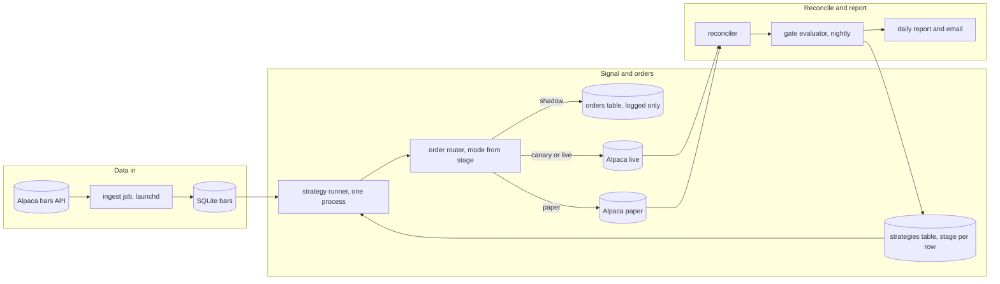
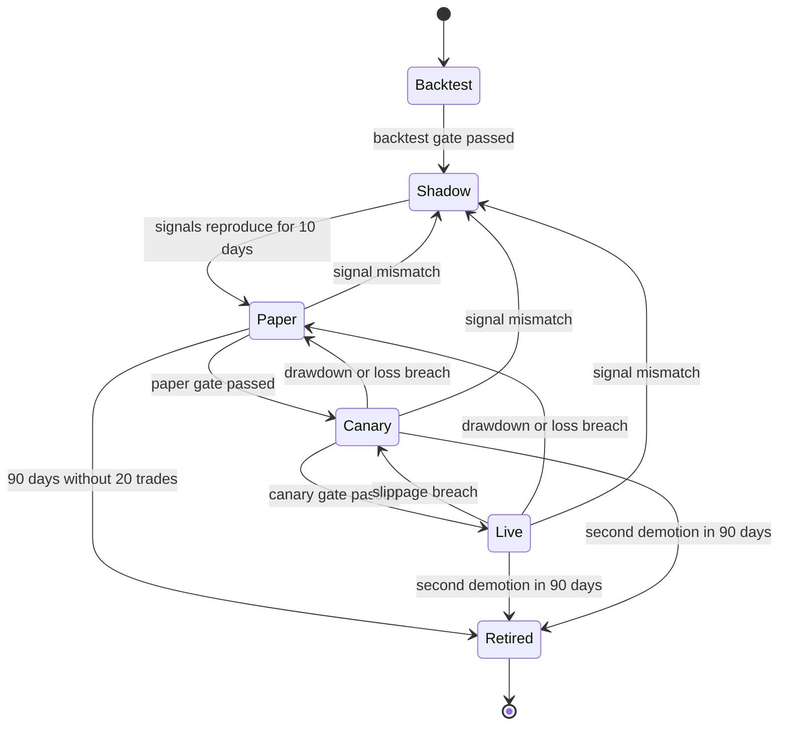
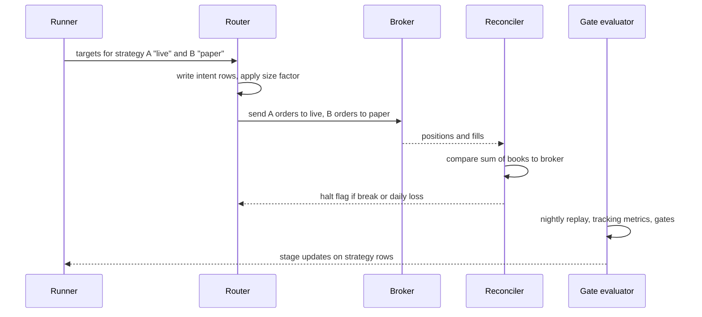

# Mini quant system — DE 11, from backtest to paper to live

Assumptions I am making: broker is Alpaca (free API, paper and live endpoints with identical schemas, fractional shares, $0 commission). Cash account, not margin, so the PDT rule does not apply and settled-cash rules do (T+1). Universe is 5 liquid ETFs (SPY, QQQ, IWM, TLT, GLD). Timeframe is daily bars with one intraday decision window at 15:45 ET. Stack is Python, SQLite, launchd on the Mac mini. One operator, no on-call, so anything that needs a human at 3am is a bug.

## Requirements

Functional

| # | Requirement | Number |
|---|---|---|
| F1 | Ingest bars for the universe and keep them locally | 5 symbols, 1-min and daily, 2 years history |
| F2 | Run a strategy over stored bars and produce a backtest report | full run over 2 years in under 60 s |
| F3 | Run the same strategy code on live data in one of five stages: backtest, shadow, paper, canary, live | stage is a column in a table, not a deployment |
| F4 | Route orders per stage: log only, paper endpoint, live endpoint at 10% size, live at 100% | size multiplier applied in exactly one function |
| F5 | Reconcile local ledger against broker positions and cash | every 5 min during market hours, once after close |
| F6 | Evaluate promotion gates nightly and promote or demote automatically | gate run finishes by 18:00 ET, result written to the strategy row |
| F7 | Run two strategies at different stages at the same time | at least 2, cap of 4 |
| F8 | Daily report: per-strategy stage, PnL, tracking error, gate progress | one text file plus one email |

Non-functional

| # | Requirement | Number |
|---|---|---|
| N1 | Unattended for a trading day | zero human actions between 09:00 and 17:00 ET |
| N2 | Never send a live order the ledger did not first record | intent row written before the HTTP call, 100% of orders |
| N3 | Daily loss stop on the whole account | 2% of equity, $40, then no new orders until next day |
| N4 | Live exposure bounded | max 80% of equity deployed, max 1 live strategy per symbol |
| N5 | Deterministic strategy code | same bars in, same signals out, checked nightly |
| N6 | Recoverable | SQLite backed up nightly to a cloud bucket, under $1 per month |

## Estimates

| Item | Estimate | Working |
|---|---|---|
| 1-min bars | 5 symbols x 390 per day = 1,950 per day, 490k per year, about 50 MB per year | 100 bytes per row |
| Daily bars | 1,250 per year | negligible |
| API calls | 1 bar fetch per symbol per minute plus 12 reconciles per hour, about 2,500 per day | far under Alpaca's 200 per minute |
| Orders | 2 to 6 per week per strategy, 150 to 300 per year with two strategies | daily strategy, average hold 3 days |
| Position size | $400 intended, $40 at canary | 4 positions of 20% each |
| Explicit costs | $0 commission, SEC and FINRA fees about $0.01 per sell | round trip under $0.02 |
| Spread plus slippage | SPY spread 1 cent on $500, about 0.2 bps; budget 5 bps per side | $0.20 per round trip at $400 |
| Data cost | $0 with the free IEX feed, $9 per month if SIP is needed | free feed is fine for 15:45 daily decisions |
| Infra | $0 to $3 per month for backups and an email API | Mac mini already owned |
| Honest expected edge | 2% to 6% gross per year on a good day, $40 to $120 on $2,000 | costs about $6 per year, so fees are not the problem, variance is |

Time to know whether an edge is real, using t-stat = Sharpe x sqrt(years):

| True Sharpe | Years for t-stat 2 | Trades at 2 per week |
|---|---|---|
| 0.5 | 16 | 1,700 |
| 1.0 | 4 | 400 |
| 2.0 | 1 | 100 |

This table drives the whole lens. A 30-day paper run cannot tell you the strategy works. It can tell you the system is honest: signals reproduce, fills match assumptions, ledger matches broker. The promotion path proves the pipeline, and the live stage at small size is where the edge question gets answered over years.

## High-level design

Main flows:

1. Data in: launchd fires ingest every minute during market hours, upserts bars, records the latest bar timestamp per symbol. Staleness over 15 minutes blocks order sending for that symbol.
2. Signal: at 15:45 ET the runner loads every strategy row with stage not in {backtest, retired}, feeds it the same bar frame, collects target positions. Strategy code has no idea what stage it is in.
3. Order out: router computes deltas against the per-strategy ledger book, multiplies by the stage size factor (0, 1.0 paper, 0.1 canary, 1.0 live), writes an intent row, then sends or does not send.
4. Reconcile: every 5 minutes, broker positions and cash versus the sum of per-strategy books. Any unexplained break flips a halt flag that stops new orders for the account.
5. Report: nightly gate evaluator computes tracking metrics, applies promotion and demotion rules, writes the new stage, emails a one-page summary.

## Deep dive: the path from backtest to paper to live

The hard part: a backtest is the operator's own hypothesis graded by the operator's own code on data the operator already looked at. Everything between that and real money exists to catch the three ways it lies: the code lies (plumbing bugs that only show up with live data), the fills lie (backtest assumes the close, the market gives you the ask), and the selection lies (you tried 20 parameter sets and kept the best one, so the backtest number is the max of 20 noisy draws).

The obvious approach: backtest looks good, set `live=true`, watch the dashboard. Why it breaks:

- Timezone, holiday, half-day and late-bar bugs never appear in a backtest because the bars are already clean and complete.
- Alpaca paper fills at the quote with no partials; the backtest fills at the close. Neither is the live fill. Nobody measures the gap, so cost assumptions are never corrected.
- There is no exit criterion. When the drawdown comes, the operator calls it variance and keeps it running, because turning it off is a decision and nobody wrote down when to make it.
- Two strategies get two copies of the loop, diverge, and the one in paper is no longer testing the code that trades live.

What I would do instead: one code path, stage as data, pre-registered numeric gates, automatic demotion, and per-strategy virtual books over one broker account.

### Lifecycle

Every stage after backtest runs the same runner on the same live bars. The only thing that changes is what the router does with the resulting orders. Any code change to a strategy resets it to shadow; a parameter-only change resets it to paper. The version hash is stored on the strategy row so the gate evaluator can tell.

### Gate criteria

Gates are written into the strategy row before the stage starts and cannot be edited while in that stage. That is the anti-goalpost rule.

| Gate | Minimum duration | Minimum trades | Numeric criteria, all must hold | What it actually tests |
|---|---|---|---|---|
| Backtest to Shadow | 2 years of data | 100 closed trades | Walk-forward with 40% of trades out of sample; OOS Sharpe at least 0.8; max drawdown at most 15%; positive after 5 bps per side; at most 5 parameters; re-run reproduces signals byte for byte | The hypothesis is not obviously overfit |
| Shadow to Paper | 10 trading days | none | Nightly replay of the same days through the backtest engine matches live-loop signals on 100% of symbol-days; runner completed before 15:55 ET on at least 95% of days; zero crashes | The plumbing, not the edge |
| Paper to Canary | 30 trading days, cap 90 | 20 closed trades | Signal match 100%; per-trade fill versus backtest assumed price: median at most 3 bps, p95 at most 15 bps; paper drawdown at most 1.5x backtest max drawdown; zero unexplained reconciliation breaks; no gate on PnL sign | Fill assumptions and the ledger |
| Canary to Live | 20 trading days | 15 live fills | Live fill versus paper fill on the same signal: median at most 5 bps, p95 at most 20 bps; order reject rate at most 2%; realized cost at most 2x modeled cost; zero unexplained breaks; daily loss stop never hit | Real fills, real cash, real rejects |

Why no PnL gate at paper: with 20 trades and a true Sharpe of 1, the chance the paper PnL is negative is about 30%. Gating on PnL sign would reject good strategies a third of the time and pass bad ones half the time. The hard loss cap is the only PnL rule, and it is a safety rule, not an evidence rule.

Why 20 trades and 30 days: 20 fills is enough to estimate median slippage to within about 2 bps on these ETFs, and 30 days covers at least one options expiry, one month-end and usually one macro print. That is what the gate is for. The cap of 90 days retires strategies that trade too rarely to ever be evaluated at this account size.

### Shadow mode

Router mode `shadow` writes the intent row with status `SHADOW` and returns a synthetic fill at the next bar's open. No HTTP call. The ledger book for that strategy is updated from the synthetic fill so reconciliation logic, position sizing and the daily report all exercise the exact code they will use live. The nightly replay test is: take today's bars from SQLite, run the backtest engine over just today, compare its target positions to what the live loop wrote. Any diff on any symbol is a mismatch and the strategy drops to shadow from wherever it was. This one check catches most of the bugs that lose money in month one: off-by-one bar, timezone, lookahead through a partially formed bar, a holiday the backtest skipped.

### Canary sizing

Canary multiplies target notional by 0.1: $40 per position instead of $400. At this account size both numbers are noise against ETF volume, so the fill quality measured at $40 transfers to $400. What the canary really tests is everything that only exists on the live endpoint: fractional order handling, settled-cash rejects in a cash account, order status transitions, and the operator's nerve. The ramp is 10% to 100% in one step because a 50% rung on a $2,000 account measures nothing the 10% rung did not. If the account grows past $25,000 that decision should be revisited.

### Comparing live fills to assumptions

Every fill row stores three prices: `assumed_px` (what the backtest engine would have used, the 15:45 bar close), `paper_px` (Alpaca paper fill for the same signal, if the strategy also runs a paper twin) and `fill_px` (what actually printed). Tracking error is reported at three levels, each with its own owner.

| Level | Metric | Warning | Breach | Response |
|---|---|---|---|---|
| Signal | fraction of symbol-days where live loop target differs from replay | any | any | demote to Shadow, this is a bug not variance |
| Fill | rolling 20-fill median of fill_px minus assumed_px, signed against the trade, in bps | over 5 | over 10 | demote Live to Canary, then update the cost model |
| PnL | rolling 20-day mean absolute difference between live daily PnL and replay daily PnL, in bps of equity | over 10 | over 25 | report and investigate, no automatic action, because this is the sum of the two above |

Fill-level data is also fed back: after every 50 live fills the modeled cost in the backtest engine is reset to the observed p75, and the backtest is re-run. If the strategy no longer clears the backtest gate at observed costs, it demotes to paper. That closes the loop the obvious approach leaves open.

### Automatic demotion

Runs inside the nightly gate evaluator and, for the two loss rules, inside the intraday reconciler.

| Trigger | Checked | Action |
|---|---|---|
| Daily account loss over 2% of equity | every reconcile | halt all new orders until next session; strategy that caused it drops one stage |
| Strategy drawdown from its peak over min of 10% or its backtest max drawdown | nightly | demote to Paper |
| Signal mismatch versus replay | nightly | demote to Shadow |
| Fill slippage breach | nightly | demote Live to Canary |
| Unexplained reconciliation break older than one session | every reconcile | halt account, demote strategy to Paper |
| Bar staleness over 15 minutes | at signal time | skip orders for that symbol today, no demotion |
| Second demotion within 90 days | nightly | Retire, requires a code change and a fresh backtest gate to re-enter |

Demotion is a row update plus a flatten order for that strategy's book at the next session open. Re-promotion is never automatic from a demotion: the stage clock resets and the full gate must be re-earned. The operator can retire a strategy at any time but cannot promote one; only the evaluator promotes.

### Two strategies at different stages

Stage is a column, so two strategies is two rows and one process. The parts that need care are capital and symbols.

- Paper strategies use the Alpaca paper account. Live and canary strategies share the one live account. The local ledger keeps a book per strategy; the broker only knows the sum. Reconciliation compares the sum to the broker and attributes any break to the strategy whose last order touched that symbol.
- One symbol is owned by at most one live-or-canary strategy at a time. This avoids netting two books through one broker position and keeps tax lots attributable. Paper strategies can overlap freely.
- Capital is split by a target weight per strategy on its row, summing to at most 80% of equity across live strategies. A canary strategy reserves its full weight even though it deploys 10% of it, so promotion never has to find new cash.
- A strategy in shadow or paper that is a candidate replacement for a live one runs alongside it on the same symbols. The nightly report shows both, which is how the operator decides to retire the incumbent.

## Trade-offs

| Decision | Chosen | Alternative | Why |
|---|---|---|---|
| Stage as data vs separate deployments | one process, stage column | one process per stage | the paper copy must be the same code as the live copy or paper proves nothing |
| Gate on process metrics vs PnL | process metrics plus a hard loss cap | PnL sign at paper | 20 trades cannot distinguish edge from noise; the table in Estimates shows it takes years |
| Canary ramp | 10% then 100% | 10, 25, 50, 100 | at $2,000 the middle rungs measure nothing extra and each adds 20 days |
| Demotion | automatic, evaluator only | operator judgment | the operator is the person most motivated to call a loss variance |
| Broker paper account | use Alpaca paper as is | own simulator with modeled slippage | free and real order lifecycle; its optimistic fills are corrected by the canary stage |
| Symbol ownership | one live strategy per symbol | net books at the broker | simpler reconciliation and tax lots, costs some diversification |

## Pitfalls

- Alpaca paper fills are better than live. If canary is skipped, the cost model is wrong by the whole paper-to-live gap.
- Cash account settlement: buying with unsettled funds and selling triggers a good faith violation, three of which lock the account for 90 days. The router must check settled cash, not buying power.
- Nightly replay must use the bars as they were at 15:45, not corrected bars fetched later. Store the bar snapshot the runner saw.
- A strategy that passes shadow in a quiet fortnight has not seen a half day or a data outage. The 10-day shadow window should span at least one of the exchange calendar oddities or be extended.
- Gate criteria edited mid-stage are the most likely way this system gets quietly defeated. The row is immutable while in stage; changing it means restarting the stage.
- Fractional shares below $1 notional are rejected by Alpaca; at 10% canary on a $2,000 account a 5% weight would be $10, fine, but a 1% weight would not be.

## Open questions for the panel

1. Should paper fills be artificially worsened by a fixed 3 bps so the paper stage is pessimistic, or is that the canary stage's job and paper stays a pure plumbing test?
2. Is a 10% canary at $40 per position meaningful, or should canary on this account size be defined as 1 share per symbol regardless of weight?
3. Any code change resets to shadow. Is that too strict for a bug fix that does not touch the signal, and if so who decides what counts as signal code?
4. Should the daily loss stop demote the strategy that caused it, or only halt the account and leave the stage decision to the nightly evaluator with fuller data?
5. With one live strategy per symbol, a good replacement strategy on SPY can only run in paper until the incumbent retires. Is that acceptable or do we need netted books?

## Non-negotiables

1. One code path for backtest, shadow, paper, canary and live, with stage as a column and the size factor applied in exactly one function. Without this, paper results are evidence about different code.
2. Shadow mode with nightly replay comparison, and every strategy passes through it. This is the cheapest bug catcher in the whole system and it costs nothing but 10 days.
3. Numeric gate and demotion criteria stored on the strategy row before the stage starts, immutable during the stage, enforced by the evaluator and not by the operator.
