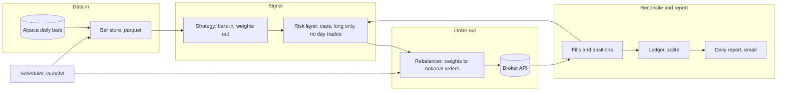
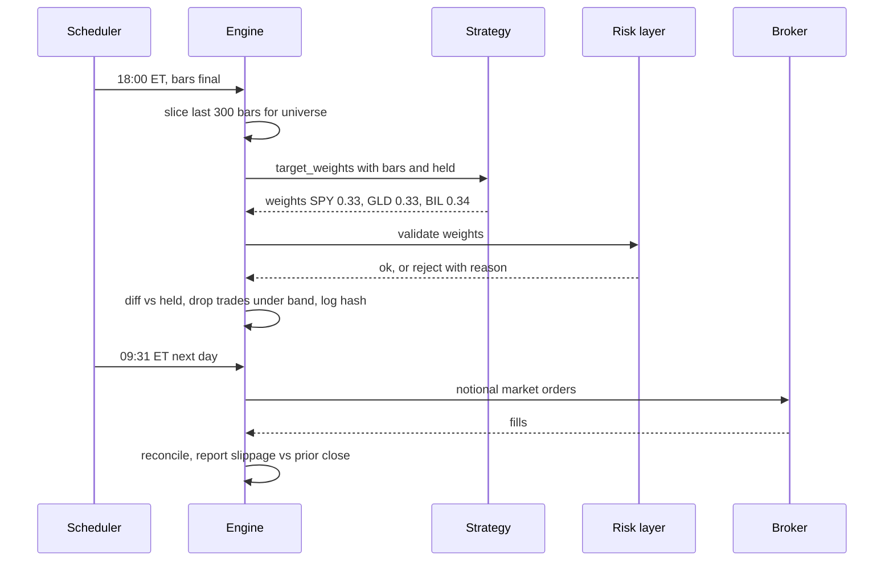
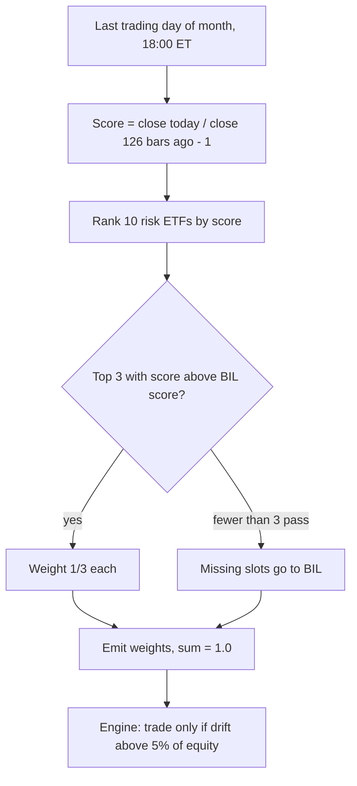

# Mini quant system — DE 12, strategy families for small capital

Assumptions: US retail margin account at Alpaca (the $2,000 is exactly the FINRA margin minimum, which buys us T+1 settlement freedom, not leverage), fractional notional orders available, daily adjusted bars free. No leverage, no shorts, no day trades in v1. Everything below is sized to those four constraints.

## Requirements

Functional

| # | Requirement | Number |
|---|---|---|
| F1 | Ingest daily adjusted OHLCV for the universe | 11 symbols, 10 years history, 1 update per day by 18:00 ET |
| F2 | Strategy produces target weights from bars | called once per trading day, returns in under 1 s |
| F3 | Engine turns weights into orders | at most 5 positions, long only, weights sum to 1.0 |
| F4 | Same strategy code in backtest and live | byte-identical function, weight hash logged both places |
| F5 | Reconcile positions and cash with broker | daily after close, alert on any mismatch over $1 |
| F6 | Daily report | equity, positions, orders, fill price vs. prior close |
| F7 | Paper trade before live | at least 3 months or 30 orders, whichever is later |

Non-functional

| # | Requirement | Number |
|---|---|---|
| N1 | Unattended for a day | worst case on box death: positions sit in unlevered ETFs, no forced action |
| N2 | Latency | minutes are fine, orders at 09:31 ET from a signal computed at 18:00 ET the day before |
| N3 | Cost | under $5 per month all in |
| N4 | Determinism | replaying the same bars yields the same weights, checked in CI |
| N5 | Regulatory | 0 day trades per rolling 5 days, 0 short positions, margin usage 0% |

## Estimates

| Item | Estimate | Working |
|---|---|---|
| Bar history | 2 MB | 11 symbols x 252 bars x 10 years = 28k rows x ~60 bytes |
| Daily increment | 11 rows | trivially small, a parquet rewrite per day is fine |
| API calls per day | under 50 | 11 bar fetches, 3 to 5 account and position calls, 0 to 3 orders |
| Orders per year | 15 to 25 | 12 rebalances, 1 to 2 swaps each, reference strategy below |
| Turnover | 150 to 250% per year | $3,000 to $5,000 notional traded |
| Explicit fees | about $5 per year | commission $0, SEC fee ~$0.30, half spread + slippage ~3 bps on $4,000 |
| Expected gross edge | $40 to $100 per year | 2 to 5% over a 60/40 benchmark, literature range for asset-class momentum, out of sample since 2015 at the low end |
| Annual noise | about $220 | 11% return standard deviation on $2,000 |
| Years to a t-stat of 2 | about 16 | t ≈ Sharpe x sqrt(years), Sharpe 0.5 |
| Monthly cost | $1 to $3 | Mac mini electricity, data free tier |

The honest reading: fees are 5% of expected edge and irrelevant. Noise is 2 to 5 times the edge. One year of live trading cannot confirm an edge; it can confirm the plumbing, the slippage assumption and the discipline. Strategy choice must optimise for that.

## High-level design



Main flows

1. Data in: 18:00 ET launchd job fetches the day's bar for each symbol, appends to parquet, verifies the count and date.
2. Signal: engine slices the last 300 bars, calls `target_weights(bars, held)`, logs the weights and their hash.
3. Order out: 09:31 ET next day, engine diffs target notional against held notional, drops any trade under the drift band, submits notional market orders.
4. Reconcile: after fills and again at 16:30 ET, broker positions and cash are compared with the ledger. Mismatch stops further orders and emails.
5. Report: one email per day with equity, positions, orders, fill price vs. prior close in bps.

The strategy box is the only thing in this diagram that changes between strategies. Everything else is fixed engine.

## Deep dive: strategy families for small capital

### The hard part

At $2,000 the strategy is not killed by fees. It is killed by four constraints that most strategy write-ups assume away:

| Constraint | Effect at $2,000 |
|---|---|
| Pattern day trader rule | under $25k equity, at most 3 day trades per 5 business days. Any intraday round-trip family is out |
| Position granularity | 5 positions is $400 each. Fractional orders make whole-share rounding a non-issue, but 20 positions is $100 each and slippage on fractional market orders dominates |
| Statistical power | with 12 decisions a year the operator cannot distinguish a real edge from noise for a decade. The strategy must be simple enough that the operator trusts it for reasons other than its backtest |
| Overfitting per parameter | 10 years of daily bars is 120 monthly decisions. A 5x5x5 grid of 125 combinations will find a "winner" in pure noise |

The obvious approach is to pick the most interesting family: stock stat-arb, intraday breakout, or selling options premium. Each breaks on one of the constraints above before it ever meets the market.

### Family comparison

| Family | Positions | Capital needed | Hold, turnover | Data needed | Trades per year | Free parameters | Plausible at $2,000 |
|---|---|---|---|---|---|---|---|
| Cross-sectional momentum on ETFs | 2 to 4 | $1,000+ | 1 to 3 months, 150 to 250% | daily closes, 1 year lookback | 15 to 25 | 2 | Yes, reference |
| Time-series trend following, 1 ETF | 1 to 2 | $500+ | months, 50 to 100% | daily closes, 200 bars | 2 to 6 | 1 | Yes, too few trades to learn from |
| Mean reversion on a liquid ETF | 1 | $500+ | 2 to 5 days, 1,500%+ | daily OHLC | 30 to 50 | 2 to 3 | Yes, second paper candidate; edge has decayed since 2010 |
| Simple pairs, long and short ETFs | 2 | $5,000+ | days to weeks | daily closes for both | 10 to 30 | 3 | Marginal, needs shorting, no fractional shorts, borrow cost |
| Stock stat-arb, many names | 50 to 200 | $50,000+ | days, 3,000%+ | daily bars for 500+ names, survivorship-free | 1,000+ | 5+ | No, granularity and slippage |
| Intraday scalping, breakouts | 1 | $25,000 | minutes, huge | real-time feed | 500+ | 4+ | No, PDT rule, spread eats the edge |
| Options, premium selling | 1 to 2 contracts | $10,000+ | weeks | options chains | 20 to 50 | 3+ | No, one contract is the whole account, 5 to 10% bid-ask |
| Crypto, daily bars | 1 to 3 | $500+ | days to weeks | daily closes | 20 to 50 | 2 | Out of scope, 25 bps per side at Alpaca is 10x ETF cost |

Cross-sectional momentum on liquid ETFs is the reference because it sits inside every constraint with room to spare, has the longest published record of any family in the table, and its parameters are conventions rather than fitted values.

### The strategy interface

```python
class Strategy(Protocol):
    universe: tuple[str, ...]      # symbols the engine must fetch, includes the cash sleeve
    lookback_bars: int             # how many bars the engine must pass in
    def target_weights(self, bars: pd.DataFrame, held: dict[str, float]) -> dict[str, float]: ...
```

- `bars`: adjusted close (and OHLCV) for the universe, indexed by date, ending at the last completed session. Never includes today's partial bar.
- `held`: current weights the engine believes we hold, after reconciliation. Passed so exit rules with hysteresis (stay in until an exit signal) do not need hidden state.
- Returns weights in [0, 1] that sum to 1.0. The engine rejects anything else.
- The function is pure: no clock, no I/O, no randomness, no module-level state. The same inputs give the same output in the backtester, the paper run and live. This is what makes F4 and N4 cheap.

What the strategy does not do: choose order types, know about cash balance in dollars, know about the drift band, know about the PDT rule, place stops. Those are engine and risk-layer concerns and stay the same across strategies. If a strategy "needs" a stop, it expresses it as a weight of 0 on the next call.



### Why fewer parameters

| Parameters | Grid size at 5 values each | Best in-sample Sharpe from pure noise, 10 years | Meaning |
|---|---|---|---|
| 1 | 5 | ~0.4 | a backtest Sharpe of 0.7 is mildly interesting |
| 2 | 25 | ~0.6 | need Sharpe above 0.8 to be worth a look |
| 3 | 125 | ~0.8 | most published retail backtests live here and mean nothing |
| 5 | 3,125 | ~1.1 | a Sharpe 1.0 backtest is expected from noise |

(Expected maximum of N independent noise Sharpes on 10 years scales with sqrt(2 ln N) / sqrt(10).) Rules that follow:

1. At most 3 free parameters, and each one should be a convention from the literature (200-day, 12-month, top 3), not the result of a search.
2. Before any strategy is promoted to paper, run the neighbourhood grid and record it. If the chosen cell is the only good one, the strategy is rejected. The median neighbour must still be positive.
3. The universe is a hidden parameter. Fix it once, from liquidity and diversification, before looking at any return.

### Reference strategy: asset-class momentum, top 3

Fully specified so the rest of the panel can size, schedule and test against it.

| Field | Value |
|---|---|
| Name | `mom_top3` |
| Universe, risk sleeve | SPY, QQQ, IWM, EFA, EEM, TLT, IEF, GLD, DBC, VNQ |
| Universe, cash sleeve | BIL |
| Why these | each is over $100M daily volume and under 3 bps spread except DBC at ~5 bps; together they span US equity, foreign equity, duration, gold, commodities, real estate |
| Bars needed | 130, engine passes 300 |
| Score | `close[t] / close[t - 126] - 1`, six-month total return on adjusted closes |
| Signal day | last trading day of each calendar month, computed at 18:00 ET |
| Entry | rank the 10 risk ETFs by score, take the top 3 whose score exceeds BIL's score over the same window |
| Weight | 1/3 to each selected ETF |
| Exit | a held ETF that is no longer in the selected set at a signal day gets weight 0. No intra-month exit |
| Cash rule | every unfilled slot goes to BIL, so weights always sum to 1.0 |
| Non-signal days | return `held` unchanged |
| Free parameters | 2: lookback 126, top N 3 |
| Engine parameters, not strategy | drift band 5% of equity (~$100), order at 09:31 ET next session, notional market orders |
| Expected | 12 signal days, 15 to 25 orders, 150 to 250% turnover, 2 to 5% per year over 60/40 with an 11% standard deviation |
| Neighbourhood grid to record | lookback in {63, 126, 189, 252} x N in {2, 3, 4} |



Reference implementation is about 20 lines: score is `bars.close.iloc[-1] / bars.close.iloc[-127] - 1` per symbol, filter, `nlargest(3)`, fill with BIL. There is nowhere for a bug to hide, which is the point.

Second paper candidate, not reference: RSI(2) mean reversion on SPY, buy at close when RSI(2) is under 10 and close is above the 200-day SMA, sell at close when close is above the 5-day SMA. 30 to 50 trades a year, so the slippage assumption gets tested in one quarter instead of one decade. Never close on the day opened, which keeps it out of the PDT count.

## Trade-offs

| Choice | Chosen | Alternative | Why |
|---|---|---|---|
| Family | asset-class momentum, monthly | mean reversion, daily | 12 decisions a year is easier to audit by hand; mean reversion is the second candidate because it teaches slippage faster |
| Lookback | 6 months, single number | 12 minus 1 month, or blended 3/6/12 | one parameter instead of two or four; blends look smoother in-sample and that is the warning sign |
| Cash sleeve | BIL as a position | leave cash at broker | keeps weights summing to 1.0 and earns T-bill yield; costs one extra symbol |
| Stops | none in strategy | trailing stop per position | stops add a parameter and in monthly momentum studies mostly reduce return; the engine's drawdown kill switch is a separate, strategy-agnostic guard |
| `held` in the interface | passed in | strategies recompute state from bars | purity is kept either way; passing `held` avoids replay bugs when lookback is short |
| Account type | margin, unused | cash | cash account with T+1 settlement blocks re-entry for a day after a sell; margin at 0% usage removes that with no leverage taken |

## Pitfalls

1. Using unadjusted closes: TLT and IEF pay monthly, VNQ and the equity ETFs quarterly. Unadjusted momentum scores drift by 1 to 4% a year and flip rankings.
2. Computing the signal on today's partial bar at 15:55 ET. Backtest and live diverge. Bars passed in must end at the last completed session, always.
3. Letting the drift band leak into the strategy so it starts returning "no change" itself. Then backtest turnover and live turnover disagree.
4. Optimising the universe. Swapping DBC for PDBC or adding XLK after seeing returns is a parameter search wearing a disguise.
5. Reading one good year as confirmation. At Sharpe 0.5 a single year has about a 30% chance of being negative even if the edge is real.
6. Fractional orders at Alpaca are market orders only, regular hours only. Anything that assumes limit fills or extended hours for fractional sizes is wrong.

## Open questions for the panel

1. Should the risk layer enforce "no day trades" by refusing to sell anything bought today, or by counting against the 3 in 5 limit and allowing up to 2? I lean refuse outright, zero is easier to prove than two.
2. Is one strategy live and one in paper the right operating model, or does running two paper strategies make the operator compare backtests instead of learning the plumbing?
3. Who owns the neighbourhood-grid check: the backtester as a required artefact, or a manual review step? Manual steps done alone get skipped.
4. Alpaca free-tier daily bars come from IEX and can differ from consolidated closes by a few cents. Is that acceptable for a 126-bar momentum score (yes) and for the mean-reversion candidate's RSI(2) (probably not)?
5. If DBC's 5 bps spread is a concern to the execution lens, drop it to a 9-ETF universe rather than adding a cheaper commodity proxy after seeing returns.

## Non-negotiables

1. The strategy is a pure function `target_weights(bars, held) -> weights` shared byte-for-byte by backtest, paper and live. No order logic, no I/O, no clock inside it.
2. Long only, no leverage, no day trades, at most 5 positions, enforced by the engine's risk layer and not by the strategy's good behaviour.
3. At most 3 free parameters per strategy, and the neighbourhood grid is recorded before the strategy is allowed into paper trading.
