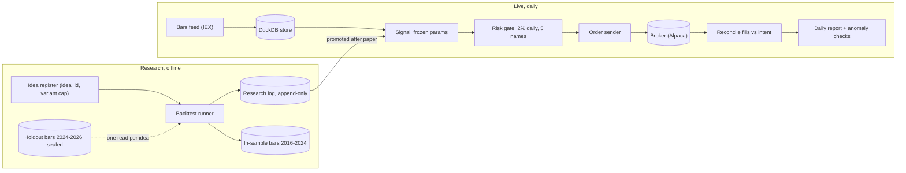
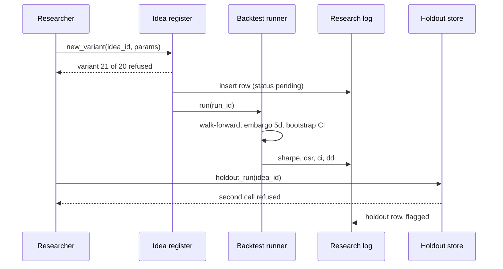
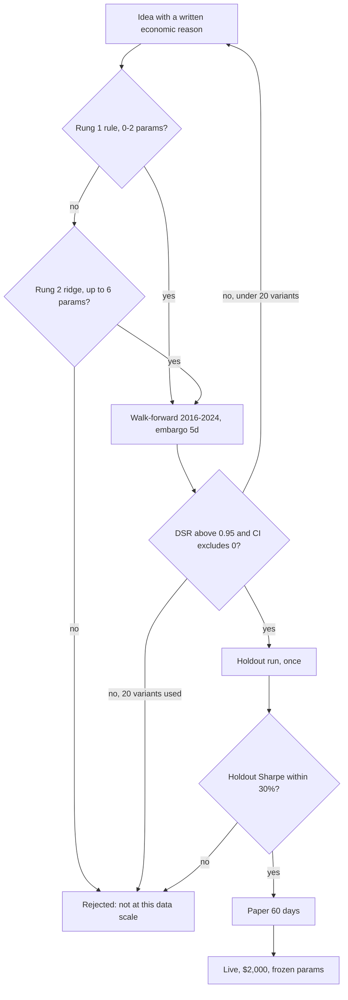

# Mini quant system — DE 13, machine learning and when not to use it

Assumptions: US cash account at Alpaca (no PDT limit, no margin), daily bars from the free IEX feed, universe of 100 liquid US large caps, 10 years of history (2016-09 to 2026-09), Python plus DuckDB on the Mac mini. "ML" below means any model with more than about 5 fitted parameters; a 2-parameter moving-average rule is a statistic, not ML, but every rule in this document applies to it too.

## Requirements

Functional

| # | Requirement | Number |
|---|---|---|
| F1 | Ingest daily OHLCV for the universe after the close | 100 symbols, 1 batch call, done by 17:00 ET |
| F2 | Backtest any strategy over any date range, reproducibly | same code + params + data snapshot gives identical output, bit for bit |
| F3 | Every backtest run is logged before it runs | 100% of runs, no bypass flag |
| F4 | Holdout period is not readable by the research API | last 24 months, one read per idea, logged |
| F5 | Paper trade a candidate before real money | 60 trading days minimum |
| F6 | Place, fill-check, and reconcile orders daily | at most 10 orders per day |
| F7 | Daily report: positions, P&L, fees, drift vs backtest | 1 page, by 18:00 ET |

Non-functional

| # | Requirement | Number |
|---|---|---|
| N1 | Unattended for 1 trading day; fail closed | missing data or broker error means no orders, not stale orders |
| N2 | Backtest of one variant on 250k rows | under 10 s so the log is not a tax people route around |
| N3 | Fixed monthly cost | under $10; $40/mo is 24%/yr of the capital |
| N4 | Max daily loss before halt | 2% of equity ($40) |
| N5 | Research log survives disk loss | nightly copy off the machine |

## Estimates

Data

| Item | Value |
|---|---|
| Rows | 100 symbols x 252 days x 10 years = 252,000 |
| Bytes | 252k x 60 B = 15 MB parquet; a decade fits in RAM 1,000 times over |
| Minute bars, if ever | 100 x 390 x 2,520 = 98M rows, about 5 GB; not needed for a daily strategy |
| API calls | 1 bars call/day, under 10 order calls/day, 1 positions call/day |

Signal-to-noise, the number that governs everything else

| Quantity | Value | Why it matters |
|---|---|---|
| Daily stock volatility | about 1.5% | the noise |
| Daily mean return of a Sharpe 0.5 strategy | 0.5 / sqrt(252) x 1.5% = 0.05% | the signal |
| Daily SNR (mean / sd) | 0.03 | signal is 3% of noise per row |
| R² a real daily model achieves | 0.001 to 0.003 | 99.7% of every row is unexplained |
| Effective independent series among 100 large caps | about 10 (avg residual correlation 0.1 after removing the market) | 252k rows behave like 25k |
| Rows needed to detect SNR 0.03 at t = 2 | (2 / 0.03)² = 4,400 independent rows | one symbol's 10 years is 2,520; barely enough for one hypothesis |

Chance results from trying many variants on 10 years of pure noise (expected best annual Sharpe = sqrt(2 ln N / T), Bailey and Lopez de Prado)

| Variants tried N | Expected best Sharpe from noise, T = 10 y | Same with T = 8 y in-sample |
|---|---|---|
| 1 | 0.00 | 0.00 |
| 5 | 0.57 | 0.63 |
| 20 | 0.77 | 0.87 |
| 100 | 0.96 | 1.07 |
| 1,000 | 1.18 | 1.31 |

A hyperparameter grid of 1,000 cells produces a Sharpe 1.2 strategy out of nothing. That is the whole argument in one row.

Money

| Item | Value |
|---|---|
| Capital | $2,000; 5 positions of $400 |
| Commission | $0; spread plus slippage about 5 bps round trip on large caps |
| Turnover, weekly rebalance of 20% of book | 10x/year, cost 0.5%/yr = $10 |
| Turnover, daily rebalance | 50x/year, cost 2.5%/yr = $50 |
| Gross edge of a good simple daily strategy | 3 to 5%/yr, if it exists at all |
| Honest net expectation | 0 to +3%/yr, i.e. $0 to $60/yr, before the operator's time |
| Trades | 2 to 10 orders/day, 500 to 2,500/yr |
| Cost | data $0 (IEX), broker $0, power $3, offsite backup $1: about $4/mo |

The product is the knowledge of whether an edge exists, at a price of under $100/yr in fees. Treat any design that needs $30/mo of data to work as already losing 18%/yr.

## High-level design

Flows

1. Data in: 17:00 ET cron pulls the day's bars, validates (no gaps, close within 20% of prior close, volume above 0), appends to DuckDB. Bars after the holdout cutoff land in the sealed table that the research API cannot query.
2. Signal: next-morning job computes the frozen strategy's target weights from bars up to yesterday's close. Trades at the 10:00 ET open-plus-30-minutes, never at yesterday's close, so backtest and live use the same close-to-next-open convention.
3. Order out: risk gate checks position count, per-name cap, daily loss halt, then sends market orders for $400 lots. Anything unexpected means zero orders.
4. Reconcile: 16:30 ET job compares broker positions and fills to intended orders; logs fill price minus decision price per trade (the backtest-to-live gap series).
5. Report: one page: equity, drawdown, fees, live-vs-backtest drift, data-quality anomalies, plus the research log's current variant count per idea.

## Deep dive: machine learning and when not to use it

### The hard part

The hard part is not fitting a model; a gradient-boosted tree on 250k rows fits in 4 seconds on this machine. The hard part is that with SNR 0.03 the fit is indistinguishable from a fit to noise, and the researcher gets to try again. Each retry is a lottery ticket and the log of tickets is normally not kept.

### The obvious approach and why it breaks

Obvious: build 40 features (momentum at 5 windows, volatility, volume ratios, RSI, day-of-week), train an XGBoost classifier to predict next-day up/down, tune with 5-fold cross-validation, trade the top decile. Reasons it breaks, in the order they will be discovered:

| Step | What actually happens |
|---|---|
| 40 features on 25k effective rows | tree has thousands of leaves; R² in-sample 0.05, out-of-sample 0.000 |
| 5-fold random CV on time series | rows from 2021 in the training fold predict rows from 2021 in the test fold; adjacent days share the label window; CV Sharpe 1.5, real 0 |
| Tune learning rate, depth, features: 200 fits | expected best noise Sharpe 1.03 at T = 10; the tuning loop is a search for the luckiest seed |
| Adjusted close as a feature | adjustment factors are computed from future splits and dividends; harmless for returns, leakage for price levels and volume |
| Universe of today's 100 large caps | survivorship: every one of them survived 10 years and grew, so any "buy the dip" rule wins in-sample |
| Train 2016 to 2019, test 2020 | regime change; the model learned a low-vol bull market and meets a 35% drawdown in a month |
| Change the metric from Sharpe to Sortino after seeing results | HARKing; the selection count is now uncountable |

### What I would do instead

Rank the candidates by parameter count and stop at the first that works.

| Rung | Method | Fitted parameters | Verdict at this scale |
|---|---|---|---|
| 1 | Published, economically motivated rule: 12-1 momentum, or 200-day trend filter on a broad ETF | 0 to 2 | start here; if it does not work, nothing below will |
| 2 | Ridge on 3 to 5 pre-registered features, one window each | up to 6 | acceptable, counts as one variant per feature set |
| 3 | Any tree or net on returns | 100s+ | not on the signal, not with this data |

Where ML is legitimately useful here, and it is not the signal:

| Use | Method | Why it is safe |
|---|---|---|
| Data-feed anomaly detection | robust z-score of close-to-close move vs 60-day MAD; gap and duplicate checks | labels are cheap, being wrong costs a skipped trading day, not money |
| System self-monitoring | rolling stats on fill slippage, API latency, job durations; alert at 3 MAD | same; catches a broken feed before the strategy does |
| Confidence intervals on backtests | stationary block bootstrap of the daily P&L, 1,000 resamples | statistics, not prediction; puts a band on every Sharpe in the log |
| Execution timing | none | $400 market orders in large caps have zero impact; "10:30 vs close" is a 2-row table, not a model |
| Regime detection | none for trading decisions; a rolling-vol number in the report is fine | a regime classifier is a signal model in disguise with all the same problems |

### The discipline the engine enforces

Three rules, all enforced in code, none in a wiki.

Research log: every backtest is a row before it runs. `run_id, idea_id, variant_no, code_hash, params_json, data_snapshot_hash, start, end, metric_declared, sharpe, dsr, max_dd, n_trades, bootstrap_ci`. The runner takes the row's id as its only entry point; there is no `backtest()` function importable without one. Append-only SQLite table with a trigger that rejects UPDATE and DELETE; nightly copy to a second disk.

Holdout: bars from 2024-09-01 onward live in a separate DuckDB file that the research process opens read-only through one function, `holdout_run(idea_id)`, which refuses a second call for the same idea and writes a loud row to the log. The in-sample period is 2016-09 to 2024-08, evaluated with walk-forward: fit on 4 years, test on the next year, 5-day embargo, roll forward. The real holdout is 60 days of paper trading, which cannot be snooped because it has not happened yet.

Cap: 20 variants per idea, counting every param change, feature swap, or window. At N = 20 the noise ceiling on 8 in-sample years is Sharpe 0.87, so the acceptance bar is: deflated Sharpe ratio above 0.95 given N = 20 and the log's observed variance of Sharpes, and the walk-forward Sharpe within 30% of in-sample. When 20 is hit, the idea is closed; a genuinely new idea gets a new id and a written one-paragraph economic reason before the register issues it.

### Failure modes

| Failure mode | Detection | Prevention |
|---|---|---|
| Overfitting | in-sample Sharpe more than 1.5x walk-forward Sharpe; bootstrap CI includes 0 | parameter cap per rung; walk-forward only, no random CV |
| Multiple comparisons, data snooping | log shows N variants; DSR below 0.95 | 20-variant cap; DSR printed next to every Sharpe, never Sharpe alone |
| Lookahead: trade at the close you just used | backtest Sharpe halves when execution shifts to next open | engine only supports next-open execution; there is no same-close option |
| Survivorship in the universe | strategy wins on every long-only variant; loses on 2016 delisted names | universe file dated per year, built from what was tradeable then; report both universes |
| Adjustment-factor leakage | feature importance shows price level or raw volume | features restricted to returns and ratios; adjusted levels not exposed to research |
| Overlapping labels across folds | fold-to-fold Sharpe correlation above 0.5 | 5-day embargo between train end and test start |
| Regime change | rolling 1-year Sharpe outside the in-sample range; drawdown beyond the bootstrap 95th percentile | pre-registered kill rule: halt if 60-day P&L below the 5th bootstrap percentile |
| HARKing, metric switched after results | metric_declared column differs from metric reported | metric declared in the register before the run; the report reads it from the log |
| Holdout contamination | more than one holdout row per idea | single-call function; the second call is a hard error |
| Backtest-to-live gap | live slippage series averages above 10 bps | reconcile job logs decision price vs fill price daily; report it against the 5 bps assumed |
| Silent data revision by the vendor | snapshot hash changes for an old date range | immutable dated snapshots; a run records which one it used |
| Parameter instability | best window differs by more than 2x between halves of the sample | report per-half params; prefer the rule that is flat across neighbours, not the peak |

## Trade-offs

| Choice | Chosen | Alternative | Cost of the choice |
|---|---|---|---|
| Variant cap of 20 | hard limit in code | soft guideline | a real idea sometimes needs a 21st try; the operator must start a new idea and say why |
| Holdout 24 months | 2 of 10 years sealed | 12 months | 20% less in-sample data; worth it because the unsealed data is already thin |
| Walk-forward, no random CV | slower, fewer folds | k-fold | 5 folds instead of 50; statistically honest ones |
| No ML on signal | rules and ridge only | boosted trees | might miss a real non-linear edge; with 25k effective rows we could not tell it from noise anyway |
| Next-open execution only | one convention | close, VWAP, limit | slightly worse fills than a patient limit order; removes the most common lookahead bug |
| Daily bars, IEX free feed | $0 | consolidated tape $30/mo | IEX is 2 to 3% of volume; closes can differ by a cent; irrelevant at daily horizon |

## Pitfalls

- The one-person problem: every gate above is enforced against the same person who can edit the gate. The defence is that bypass requires editing code that is in git, and the daily report prints the log's row count, so a bypass is visible to the operator's future self.
- Counting variants honestly: "just checking one more window" is a variant. The register counts calls, not intentions.
- 250,000 rows looks like big data; it is 10 years of one market regime cycle with 10 independent things in it. Every estimate above assumes the researcher accepts this.
- Fees at $2,000 are not commission but the operator's time; a strategy earning $40/yr is a hobby, and the design should say so in the report rather than hide it in a percentage.
- Paper trading at Alpaca fills at the quote with no slippage; treat paper P&L as an upper bound and subtract 5 bps per trade in the report.

## Open questions for the panel

1. Should the holdout be time-based (last 24 months) or symbol-based (20 sealed symbols across all 10 years)? Time-based protects against regime overfit; symbol-based protects against cross-sectional snooping. I lean time-based plus paper trading.
2. Is 20 variants per idea the right cap, or should it be a Sharpe-deflation budget that shrinks per rung (rung 1 gets 20, rung 2 gets 10)?
3. Do we accept the survivorship bias of a modern 100-name universe for v1 and just report it, or does the data lens insist on point-in-time universes before any backtest is trusted?
4. Who decides the "written economic reason" is real when the same person writes and reviews it? Is a 2-week cooling-off period between idea registration and first run enough?
5. Should the anomaly detector be allowed to halt trading on its own, or only page the operator? Halting is safer; a flaky detector halts the strategy on the exact day it should have traded.

## Non-negotiables

1. No backtest without a research-log row, and the log is append-only. Without this every Sharpe in the system is uninterpretable.
2. A sealed holdout, read once per idea by a function that refuses the second call, followed by 60 days of paper trading before any real order.
3. Deflated Sharpe and a bootstrap confidence interval printed wherever a Sharpe is printed. A raw Sharpe on its own is blocked from the report.
