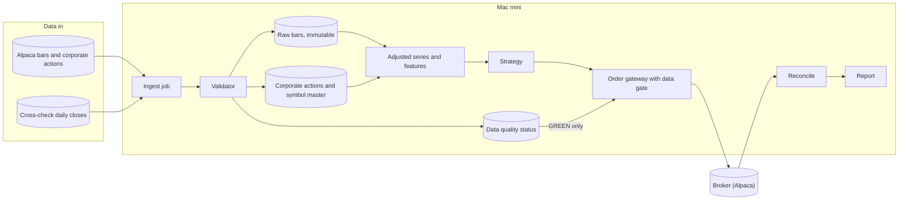
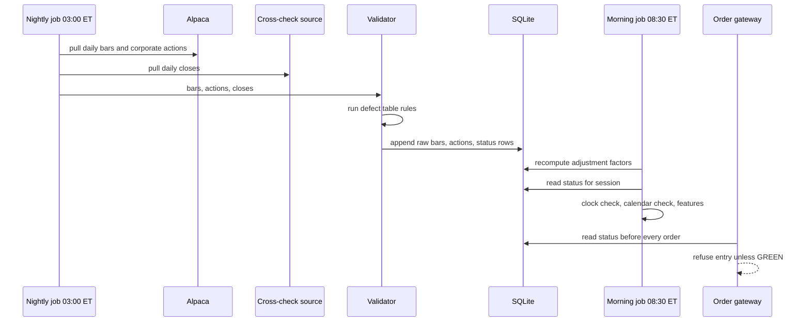
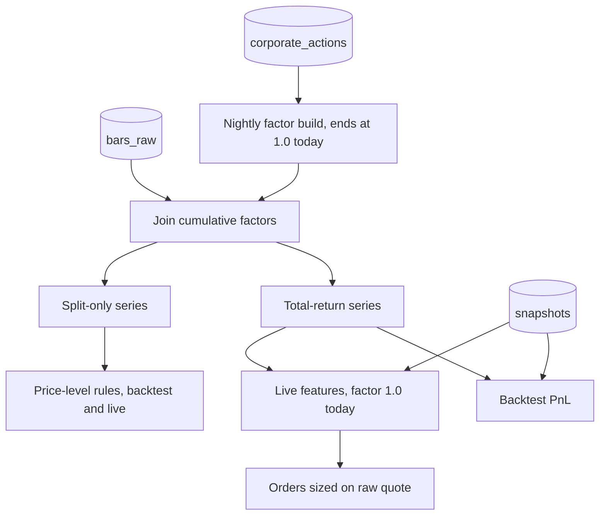

# Mini quant system — DE 14, data quality and corporate actions

Assumptions: US retail account at Alpaca (zero commission, free IEX intraday feed, free daily bars, free corporate-actions endpoint, paper account for shadow mode). Universe is 8 liquid US ETFs plus at most 4 single stocks. Strategy runs on daily bars with a 1-minute intraday feed used only for execution timing. Everything runs in one Python process family on the Mac mini with SQLite (WAL mode) as the store. Delisting risk, ticker churn and survivorship are real problems only for the single stocks; the ETF core is chosen to keep those problems small, not to pretend they are gone.

## Requirements

Functional

| # | Requirement | Number |
|---|---|---|
| F1 | Ingest daily bars for the universe after each session and 1-minute bars during the session | 12 symbols, daily by 17:30 ET, intraday lag under 60 s |
| F2 | Ingest corporate actions (splits, cash dividends, symbol changes, delistings) before the next open | Nightly job at 03:00 ET, plus a re-check at 08:30 ET |
| F3 | Keep raw unadjusted prices immutable; derive adjusted series on demand | Raw table append-only, adjusted view recomputed nightly |
| F4 | Validate every ingest and write a per-symbol, per-session status | GREEN, AMBER, RED; validation completes in under 5 s |
| F5 | Trading loop reads status and refuses to open positions on non-GREEN data | Enforced in the order gateway, not only in the strategy |
| F6 | Backtest and live loop use the same feature code on the same adjusted series | One function, two callers, snapshot hash recorded per run |
| F7 | Reconcile broker positions and quantities after every corporate action | Split day: position quantity check before 09:25 ET |

Non-functional

| # | Requirement | Number |
|---|---|---|
| N1 | Unattended for one trading day | No human input 08:00 to 17:00 ET |
| N2 | Fail closed | Any validation failure blocks new orders; risk-reducing exits stay allowed |
| N3 | Reproducibility | Any backtest can be re-run from a data snapshot id and produce identical numbers |
| N4 | Clock discipline | Host clock within 2 s of NTP; all stored timestamps UTC epoch milliseconds |
| N5 | Cost | Under $5 per month for data; Alpaca free tier plus one free cross-check source |
| N6 | Loss bound | Daily loss cap 2 percent of equity ($40), enforced downstream of my gate, listed here because bad data is the most likely way to hit it |

## Estimates

| Item | Estimate | Working |
|---|---|---|
| Daily bars | 12 symbols x 252 days = 3,024 rows/yr | About 100 bytes each, 0.3 MB/yr; 10 years of history 3 MB |
| 1-minute bars | 12 x 390 x 252 = 1.18 M rows/yr | About 100 MB/yr in SQLite, 3 MB/day; 512 GB SSD is never the constraint |
| Corporate actions | 12 symbols, roughly 4 dividends/yr each, 0 to 1 splits/yr total | Under 60 rows/yr; the table is tiny, the consequences are not |
| Ingest requests | 12 symbols x 1 daily call + 1 intraday poll every 60 s x 390 min = about 400 calls/day | Alpaca free tier allows 200 requests/min; we use under 1 percent |
| Validation runtime | 1.18 M rows/yr of intraday bars, checked per session | Per-session check on 4,680 rows takes under 1 s in pandas |
| Cross-check source | 12 daily closes/day from a second free feed | Negligible; the point is independence, not volume |
| Expected trades | Daily strategy, 2 to 4 rebalances/week | 100 to 200 fills/yr |
| Fees and friction | Commission $0; SEC and FINRA fees about $0.03 per $1,000 sold; spread plus slippage 2 to 5 bps per side on ETFs | On $2,000 turning over 150 times/yr at $300 per trade: $45,000 traded, about $15 to $25 friction |
| Honest edge | A retail daily strategy that is real might deliver 0 to 4 percent/yr excess | $0 to $80/yr on $2,000, against $15 to $25 friction and one bad print costing $40. Data quality is worth more than alpha at this size |
| Cost/month | Alpaca $0, cross-check $0, Mac mini power about $2, optional $1 backup bucket | Under $5 |

The most important estimate is the last row of the edge table: one missed split on a $300 position produces a phantom 50 percent move, and an unguarded strategy will trade it.

## High-level design

Main flows

1. Data in: the ingest job pulls bars and corporate actions, hands everything to the validator, and nothing reaches the raw table without a status row being written first.
2. Signal: features are computed from the adjusted view, which is raw bars joined to cumulative adjustment factors. The same function serves backtest and live.
3. Order out: the gateway checks the status row for the symbol and the global status for the session before it accepts any position-opening order.
4. Reconcile: after fills and after every corporate action, broker positions and cash are compared to the local ledger. A split changes share counts at the broker overnight; the ledger must agree before 09:25 ET.
5. Report: the nightly report includes the data quality table for the day so the operator sees AMBER before it becomes RED.

## Deep dive: data quality and corporate actions

The hard part: prices are not numbers, they are numbers plus a set of conventions (which exchange time, which adjustment, which symbol id), and every feed applies those conventions slightly differently and sometimes silently changes them. A system that treats a price as a float will eventually trade on a fiction.

The obvious approach: pull adjusted daily bars from the vendor, store them, run the strategy on them. It breaks because adjusted history is rewritten every time a dividend or split occurs, so yesterday's stored series no longer matches today's, backtests stop being reproducible, and the live loop sees a discontinuity between its stored history and the fresh pull. It also breaks because the vendor's adjustment is opaque: you cannot tell whether a 2 percent jump is a bad print, a missed dividend adjustment, or the market.

What I would do instead: store raw and derive, validate on every ingest, and let the gateway refuse rather than trusting the strategy to be careful.

### Storage: raw is immutable, adjusted is a view

| Table | Key | Content |
|---|---|---|
| `symbol_master` | internal id | Permanent internal id, current ticker, Alpaca asset id, list of (ticker, effective from, effective to), status active or delisted with date |
| `bars_raw` | internal id, timeframe, timestamp UTC ms | OHLCV exactly as received, plus source, ingest id, and a flag for synthetic (forward-filled) bars. Never updated, never deleted |
| `corporate_actions` | internal id, ex date, type | Split ratio, cash dividend amount, symbol change, delisting. Row includes source and the date we learned of it |
| `adjustment_factors` | internal id, date | Cumulative split factor and cumulative split-plus-dividend factor, recomputed nightly from `corporate_actions`, ends at 1.0 on the latest date |
| `data_quality` | internal id, session date, ingest id | GREEN, AMBER or RED, list of rule ids that fired, counts |
| `snapshots` | snapshot id | SHA-256 over the raw and corporate-action rows in scope; every backtest run and every live day records one |

Adjustment is backward: the factor is 1.0 today and shrinks going back in time. This is the reason the live loop and the backtest can share code: the latest adjusted price equals the raw price the broker quotes, so no translation is needed at the order boundary.

### Which prices where

| Consumer | Series | Why |
|---|---|---|
| Backtest returns and PnL | Split and dividend adjusted | A long-only daily strategy earns dividends; leaving them out understates returns by 1 to 2 percent/yr on ETFs and creates fake down-gaps on ex dates that a momentum rule will short |
| Backtest price-level rules, e.g. breakout above a 52-week high | Split adjusted only | Dividend adjustment shifts historical levels a few basis points every quarter; the level a real trader saw was the split-adjusted one |
| Live features | Same adjusted series, factor 1.0 today | Computed from raw plus factors at 08:30 ET after the corporate-action re-check |
| Live order sizing and limit prices | Raw, from the latest quote | The broker only knows raw prices |
| Reconcile | Raw plus broker share counts | After a 4-for-1 split the broker shows 4x shares at a quarter of the price; the ledger applies the same split from `corporate_actions` before comparing |

### Survivorship, delistings and ticker changes

- Universe choice is where most survivorship bias enters. The ETF core (SPY, QQQ, IWM, TLT, GLD and similar) has near-zero delisting risk. For single stocks the universe is fixed by a rule evaluated point-in-time (for example, in the S&P 100 on the backtest date, using a historical constituent list stored in `symbol_master`), not by what looks good today.
- Delisted symbols stay in `bars_raw` and `symbol_master` with a delisting date. Backtests must include them and mark the last bar as a forced exit at the last close, with a 5 percent haircut if the delisting was involuntary. Excluding them is the classic 1 to 3 percent/yr phantom edge.
- Ticker changes never touch the internal id. Ingest resolves the current ticker through `symbol_master`; if the vendor returns a ticker that maps to no internal id or to two, the ingest for that symbol is RED.
- Alpaca asset ids are the join key to the broker; if the asset id for an internal id changes, that is a RED and a human decision, because it usually means a reorganization the system does not understand.

### Time

- Every stored timestamp is UTC epoch milliseconds. The session date is a separate column, derived using the NYSE calendar from the `exchange_calendars` library, never by truncating a UTC timestamp, because 23:00 UTC is still the same trading day in New York.
- Bar convention is checked, not assumed: Alpaca minute bars are stamped at bar start. The validator asserts that the first minute bar of a regular session is stamped exactly at the calendar's open (13:30 UTC in summer, 14:30 UTC in winter) and the last at close minus one minute. A mismatch by one hour is the DST signature and is RED for the whole session.
- DST transitions in March and November are the two days a year the local scheduler is most likely to fire at the wrong wall-clock time. Jobs are scheduled in America/New_York with `zoneinfo`, never in fixed UTC offsets, and the 08:30 ET job asserts that the calendar open is in the future.
- Half days (day after Thanksgiving, Christmas Eve, sometimes July 3) close at 13:00 ET. The expected bar count is taken from the calendar, so a 210-minute session is not flagged as 180 missing bars, and the trading loop's end-of-day flatten uses the calendar close, not 16:00.
- Holidays come from the same calendar. The ingest job on a holiday expects zero bars and writes GREEN with no rows; unexpected bars on a holiday are RED, since they mean the calendar or the feed is wrong.
- Host clock: the 08:30 ET job runs `sntp -q time.apple.com` and compares. Skew over 2 s is global RED.

### Defect table

| Defect | Detection rule | Response |
|---|---|---|
| Negative, zero or NaN price or volume | `any(o,h,l,c) <= 0` or NaN | Drop bar, RED for symbol and session |
| OHLC inconsistency | `low > min(o,c)` or `high < max(o,c)` | Drop bar, AMBER; RED if more than 3 bars in a session |
| Bad print, isolated spike | Bar close deviates more than 8 sigma of 60-session daily returns from both neighbours, and neighbours agree with each other within 1 sigma | Mark bar suspect, exclude from features, AMBER; RED if it is the latest bar |
| Bad print or missed action, level shift | Close-to-close move over 15 percent with no corporate action on that ex date and volume under 3x the 20-day median | RED for symbol until a human confirms or a corporate action arrives |
| Unadjusted split leaking in | Close-to-close move within 2 percent of a ratio 1/2, 1/3, 1/4, 1/5, 1/10, 2, 3, 4, 5, 10 with no corporate action row | RED for symbol, alert, re-pull corporate actions |
| Dividend not on file | Second source reports a cash dividend on ex date that is missing locally | AMBER, insert row from second source, recompute factors, flag for review |
| Cross-source close mismatch | Daily close differs from second source by more than 0.5 percent, or by more than 0.1 percent for 3 sessions running | AMBER; RED if it repeats next session |
| Missing daily bar | Calendar says session, raw table has no bar by 17:30 ET | Retry 3 times over 30 minutes, then RED for symbol; the next morning's features are not computed |
| Missing minute bars | Missing count over 5 percent of calendar minutes, or any gap over 10 minutes in the last 30 | Forward-fill close with volume 0 and synthetic flag for features; AMBER; the execution timer will not use a synthetic bar as a reference price |
| Duplicate timestamp | Primary key conflict on insert | Keep first, log; AMBER if payloads differ |
| Out-of-order or future timestamp | Timestamp later than now plus 5 s, or earlier than last stored for that symbol | Drop bar, RED for symbol if it recurs within the session |
| DST or convention shift | First bar of session not at calendar open in UTC | Global RED for the session |
| Stale feed | During the session, newest minute bar older than 3 minutes for a symbol that traded more than 1 M shares yesterday | Global AMBER, no new entries; RED after 10 minutes |
| Ticker resolution failure | Vendor ticker maps to zero or two internal ids | RED for symbol |
| Broker position mismatch after action | Broker quantity differs from ledger quantity after applying the split | Global RED, no orders at all until reconciled by a human |
| Clock skew | Host differs from NTP by more than 2 s | Global RED |
| Corporate action learned late | Action with ex date earlier than the date we learned it | Recompute factors, mark every backtest snapshot in range as stale, AMBER |

Status semantics: GREEN means trade normally. AMBER means hold existing positions, allow exits and risk-reducing orders, no new entries for that symbol. RED for a symbol is AMBER plus an alert. Global RED means no orders of any kind except the daily-loss-cap flatten, which is allowed to bypass the gate because losing on stale data is worse than being flat.

### Ingest and gate sequence

### Adjustment paths

Validation of the validator: a fixture set of 40 hand-built sessions (one per defect row plus clean sessions) runs in CI on every change, and the live status for the last 20 sessions is replayed through the current rules on each deploy. If the replay changes any status, the deploy stops.

## Trade-offs

| Choice | Chosen | Alternative | Why |
|---|---|---|---|
| Adjustment | Store raw, derive adjusted nightly | Store vendor-adjusted | Reproducible snapshots and explainable jumps; costs one nightly job and a factor table |
| Adjustment direction | Backward, factor 1.0 today | Forward | Live and backtest share code with no translation at the order boundary; costs a recompute whenever an action lands |
| Universe | ETF core plus a few stocks from a point-in-time list | Broad stock screen | Removes most survivorship and delisting work; gives up breadth a $2,000 account cannot use anyway |
| Cross-check | One free second source for daily closes only | Paid consolidated feed | Catches feed-level errors for $0; does not catch intraday IEX gaps, which we tolerate with forward-fill and AMBER |
| Missing minutes | Forward-fill with synthetic flag | Refuse to trade | IEX is thin in quiet names and would RED every day; synthetic bars are excluded from execution reference prices |
| Failure mode | Fail closed on entries, allow exits | Fail closed on everything | Being unable to exit on a real move is a larger loss than missing an entry |
| Storage | SQLite WAL | Postgres or Parquet | One process, one file, 100 MB/yr; backups are a file copy |

## Pitfalls

- Applying dividend adjustment to a price-level rule and then wondering why the breakout signal fires a day early every quarter.
- Truncating UTC timestamps to dates. Every after-hours bar lands on the wrong session date.
- Scheduling in fixed UTC offsets. Works for eight months, then the job fires an hour late in March.
- Trusting the vendor's split field alone. Reverse splits are the most commonly missed and produce the most convincing phantom crashes.
- Reconciling positions by ticker string instead of internal id, so a ticker change reads as a full position disappearing and a new one appearing.
- Letting the strategy read `bars_raw` directly because it was convenient in a notebook. All access goes through the adjusted view.
- Silently forward-filling without a synthetic flag, so a stale symbol looks calm and the execution timer sends a market order at a price that no longer exists.
- Recomputing adjustment factors without re-stamping snapshots, so two backtests with the same code and the same date range disagree and no one can say why.

## Open questions for the panel

1. Should the daily-loss-cap flatten bypass a global RED, as I propose, or should a global RED freeze everything on the theory that the data that triggered the cap is itself suspect?
2. For single stocks, is a point-in-time constituent list worth maintaining at all, or should the system be ETF-only until the strategy has shown an edge for 6 months?
3. Which second source is acceptable for the daily cross-check, given that free sources have their own convention drift and terms of use?
4. How should a late-arriving corporate action be reported: invalidate every backtest in the affected range automatically, or only mark them stale and let the operator decide?
5. Does the execution lens want a stricter stale-feed threshold than 3 minutes for the ETF core, where a 3-minute gap on SPY is itself evidence of a feed problem?

## Non-negotiables

1. Raw bars are immutable and adjustment is derived. If the design stores adjusted prices as the source of truth, I block it; reproducibility and defect diagnosis both die.
2. A per-symbol, per-session data quality status is written on every ingest and the order gateway reads it before every position-opening order. Validation that lives only in the strategy or only in a notebook does not count.
3. All timestamps are UTC with session dates derived from an exchange calendar, and the first-bar-at-open assertion runs every session. Without it the first DST transition after launch trades on shifted data.
