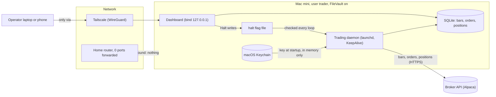
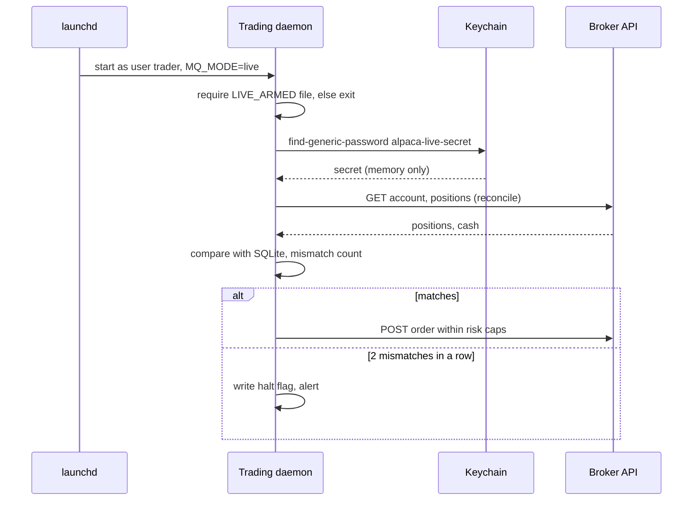
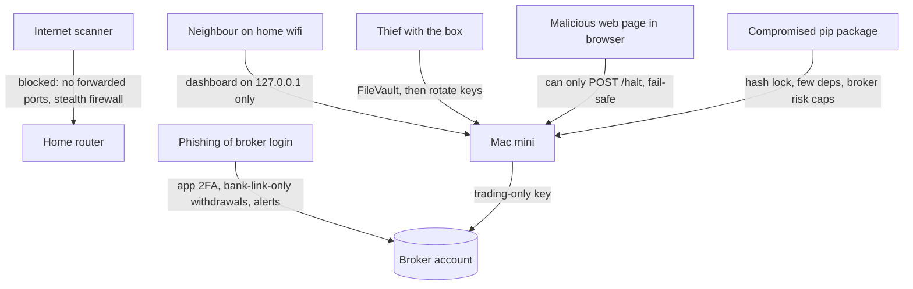

# Mini quant system — DE 15, security and secrets

Assumptions: broker is Alpaca (commission-free, REST API, separate paper and live keys); instruments are 3 to 5 liquid US ETFs; strategy runs on 1-minute bars and trades at most a few times a day; the operator's own Mac mini is the only compute; no cloud services except an optional Tailscale account (free) and broker email alerts.

## Requirements

Functional

| # | Requirement | Number |
|---|---|---|
| F1 | Pull bars for 3 to 5 symbols, compute a signal, submit and cancel orders through the broker API | 1 poll/min during market hours |
| F2 | Reconcile local position and cash against the broker before every order and every 5 min | 2 reconcile calls/min max |
| F3 | Local dashboard: positions, P&L, last 50 orders, daemon health, one Halt button | read-only except Halt |
| F4 | Paper and live modes use different keys, different Keychain items, different log dirs | live requires an explicit flag |
| F5 | Operator can rotate broker keys in under 10 minutes with no code change | quarterly and on incident |

Non-functional

| # | Requirement | Number |
|---|---|---|
| N1 | No secret ever exists in plaintext on disk: no `.env`, no shell rc, no launchd plist env, no log line | 0 occurrences, checked by grep in CI and pre-commit |
| N2 | Dashboard reachable only from 127.0.0.1 or the Tailscale interface | 0 ports forwarded on the router |
| N3 | Broker key has no withdrawal or bank-link rights; worst case from key theft is bounded by the account's own risk limits | max daily loss cap 2% = $40, hard position cap $2,000 |
| N4 | Trading venv is frozen: hash-pinned lockfile, under 30 transitive packages, updated on a market holiday only | `pip install --require-hashes` |
| N5 | Trading process runs as a non-admin macOS user with no sudo | 1 dedicated user `trader` |
| N6 | Machine: FileVault on, screen lock at 5 min, firewall on, Remote Login and Screen Sharing off | verified by a 6-line `check_machine.sh` run weekly |
| N7 | Unattended for 24 h: process restarts on crash, halts itself if reconcile fails twice in a row | launchd `KeepAlive`, halt flag file |

## Estimates

| Item | Estimate | Note |
|---|---|---|
| Bars | 5 symbols x 390 min x ~100 B = 200 KB/day, ~4 MB/month | SQLite, trivial |
| Broker API calls | 390 polls + ~200 reconciles + ~10 order calls = ~600/day | Alpaca limit is 200/min; we use 1 to 3/min |
| Trades | 1 to 3/day, 20 to 60/month | round trips |
| Fees | $0 commission; SEC/FINRA fees ~$0.01 per sell; spread on liquid ETFs ~0.01% to 0.03% per side | ~$0.30 to $0.60 per round trip on $1,000 notional |
| Monthly fee drag | 40 trades x $0.50 = $20/month = 1% of capital | this is the bar the edge must clear |
| Honest expected edge | daily-timeframe retail strategy: 0% to 0.5%/month gross before you have evidence; net of the 1% drag it is likely negative until proven otherwise | paper trade 3 months before live |
| Costs/month | electricity ~$2, Tailscale $0, Alpaca $0, data via broker $0 | under $5 |
| Secrets to manage | 2 live (key id, secret), 2 paper, 1 alert webhook | 5 Keychain items |
| Attack surface | 0 inbound ports, 2 outbound hosts (broker API, broker data), 1 non-admin user, ~25 Python packages | the whole list fits on an index card |

The security cost of this design is about 2 hours of setup and 10 minutes a quarter. It is cheaper than one stolen key.

## High-level design

Main flows

| Flow | Steps | Security-relevant point |
|---|---|---|
| Data in | daemon polls bars every minute, writes to SQLite | outbound HTTPS only, cert verification on (never `verify=False`) |
| Signal | strategy reads last N bars, emits target position | pure function, no network, no secrets |
| Order out | risk gate (daily loss, position cap, halt flag) then broker POST | the risk gate is also the blast-radius cap for a stolen key |
| Reconcile | compare broker positions and cash to local before each order and every 5 min; two mismatches in a row set the halt flag | reconcile is the detector for "someone else is trading with my key" |
| Report | dashboard reads SQLite; nightly summary posted to a private webhook | dashboard never touches the broker or the Keychain |

## Deep dive: security and secrets on a home machine

The hard part is not cryptography. It is that everything convenient (`.env`, `export ALPACA_SECRET=...`, a dashboard on port 8000, `pip install` from a tutorial) leaks a key that can trade $2,000 without anyone noticing, and the obvious fixes are the ones people skip because "it is just my Mac".

### 1. Broker keys: scope, storage, rotation

Obvious approach: `.env` file with `python-dotenv`, keys also exported in `~/.zshrc` for scripts. Why it breaks: `.env` gets committed (it is in every "leaked keys" postmortem), it is in Time Machine and iCloud backups in plaintext, `ps eww` and crash reporters dump the environment, every one of the ~25 installed packages can read `os.environ`, and shell history keeps the `export` line forever.

What to do instead:

| Decision | Choice | Why |
|---|---|---|
| Key scope | Trading-only key. Alpaca's retail Trading API has no transfer or bank-link endpoints; IBKR's TWS API likewise. Verify in the broker's docs before funding; if a broker's key can move money, pick another broker | worst case from key theft is bad trades, not an empty bank account |
| Account controls | 2FA with an authenticator app (not SMS), withdrawals only to the one linked bank, email alert on every login, key creation, and order | phishing the web login is the real path to the cash, not the API key |
| Storage | macOS Keychain, login keychain of user `trader`, one item per secret: `alpaca-live-key`, `alpaca-live-secret`, `alpaca-paper-key`, `alpaca-paper-secret`, `alert-webhook` | encrypted at rest, tied to the user's login password, not a file you can `cat` or commit |
| Write | `security add-generic-password -a trader -s alpaca-live-secret -w` with no value on the command line so it prompts; nothing lands in shell history | |
| Read | `subprocess.run(["security","find-generic-password","-a","trader","-s",name,"-w"], capture_output=True, text=True, check=True).stdout.strip()` at startup, held in one variable, never logged | stdlib only, no `keyring` dependency |
| Rotation | Quarterly, and immediately on any incident: create new key in broker UI, `security add-generic-password -U ...`, `launchctl kickstart -k` the daemon, revoke old key. Under 10 minutes, no code change | the procedure is written down so it actually happens |
| Live/paper split | Daemon reads `MQ_MODE` (not a secret) from the launchd plist; `live` requires the file `~/trader/LIVE_ARMED` to exist too | a research script run in the wrong shell cannot reach live keys by accident |

Honest limit of the Keychain: any process running as `trader` that has been granted access (or that you click "Always allow" for) can read the item. The Keychain stops leaks via files, backups, git, logs, and other users. It does not stop malware running as `trader`. That threat is handled by dependency locking and by the broker-side blast-radius caps, not by storage.

### 2. Dashboard: what it exposes and why it stays off the internet

The dashboard shows positions, P&L, orders and daemon health. That is enough for a stranger to know you have an account, your size, and when you trade; combined with a Halt button it is a denial-of-service lever; if it ever grew an order button it would be a remote trading terminal with no login.

Obvious approach: Flask on `0.0.0.0:8000` plus a router port-forward "so I can check from work". Why it breaks: internet scanners find open ports within hours, home routers are the least-patched device you own, and a dashboard with no auth is now a public page about your money.

| Rule | Implementation |
|---|---|
| Bind to loopback | `uvicorn app:app --host 127.0.0.1 --port 8000`; never `0.0.0.0` |
| Remote access | Tailscale on the Mac mini and on the phone; open `http://<tailscale-ip>:8000` or use `tailscale serve` to expose only that port on the tailnet. Zero router changes, identity-based, WireGuard-encrypted |
| Actions | Exactly one state-changing endpoint, `POST /halt`, which writes the halt flag. No resume, no order, no key rotation from the web. Resume is a shell command on the box |
| CSRF | A malicious website in the operator's browser can POST to `localhost:8000`. Since the only action is Halt (fail-safe), the worst case is a spurious halt. Still: require a `X-Halt: yes` header so a plain form post cannot do it |
| Data hygiene | No key material, no account number, no bank details in any response or template. Positions and P&L only |
| Alerts out | nightly summary and halt alerts go to a private webhook (Discord or ntfy); the webhook URL is a secret and lives in the Keychain like the others |

### 3. Dependency supply chain

A Python project that moves money imports code from ~25 strangers. One compromised maintainer or one typo (`reqeusts`) and the package runs as `trader` with Keychain access.

| Control | How |
|---|---|
| Fewest packages | Call the broker REST API with `httpx` directly instead of the broker SDK; `pandas` only if the strategy needs it. Target under 30 transitive packages, list them in the README |
| Hash pinning | `uv lock` or `pip-compile --generate-hashes`; install with `uv sync --frozen` or `pip install --require-hashes -r requirements.lock`. A changed tarball fails the install |
| Two venvs | `~/research` (Jupyter, whatever you want, never sees live keys because it runs as the admin user, not `trader`) and `~/trader/venv` (frozen) |
| Update cadence | Once a month, on a weekend, from a diff of the lockfile; `pip-audit` weekly via launchd for known CVEs, which alerts but does not auto-update |
| Never | `pip install` a package from a blog post into the trading venv; `curl | sh` anything as `trader`; enable auto-updates on the trading venv |
| Code you wrote | Pre-commit hook greps for `AKIA|PK[A-Z0-9]{16}|secret_key|password=` and for `verify=False`; repo is private but treated as if public |

### 4. Least privilege for the trading process

| Layer | Setting |
|---|---|
| macOS user | Standard (non-admin) user `trader`. The operator's daily account is admin; it cannot read `trader`'s Keychain |
| Home dir | `chmod 700 /Users/trader`; SQLite, logs and venv live there |
| Process | LaunchAgent under `trader` with `KeepAlive` and `ThrottleInterval 30`; no `sudo` entry, no Full Disk Access, no Accessibility permission |
| Network | Outbound HTTPS to the broker and data hosts only. A pf rule restricting `trader` to those hosts is optional and I would skip it at $2,000 |
| Logs | Structured, redacting `Authorization`, `APCA-API-*` headers and any value read from the Keychain (a single `redact()` around the log call) |

### 5. Protecting the machine itself

| Control | Setting | Why |
|---|---|---|
| FileVault | on | theft of the box yields an encrypted disk, keys included |
| Screen lock | 5 min idle, password immediately | a visitor at the desk gets nothing |
| Remote Login (SSH) | off; if needed, Tailscale SSH only | no password brute force from the LAN |
| Screen Sharing, Remote Management | off | |
| Firewall | on, stealth mode, block all incoming | belt and braces for a box with 0 listening ports |
| Updates | automatic security updates on; major macOS upgrades manual on a weekend after checking the Python build | |
| Gatekeeper, SIP | left on | |
| Physical | the box is at home; FileVault plus key rotation covers theft. No sticky note |
| Weekly check | `check_machine.sh`: `fdesetup status`, firewall state, `systemsetup -getremotelogin`, listening ports via `lsof -iTCP -sTCP:LISTEN`, must show only 127.0.0.1:8000 | drift is silent; the script is not |

### Threat model

| Attacker | What they get if nothing stops them | What stops them | Residual |
|---|---|---|---|
| Internet port scanner | dashboard, then whatever it can do | no forwarded ports, loopback bind, stealth firewall | none |
| Someone on the home wifi | dashboard | loopback bind; Tailscale for remote | none |
| Thief who takes the Mac mini | disk, Keychain, keys | FileVault; rotate keys the same day | small window before rotation |
| Compromised or typosquatted pip package | runs as `trader`, can read Keychain, can trade | hash-locked install, few deps, monthly reviewed updates, broker daily loss cap and position cap, reconcile halts on unknown positions | bounded to one day's loss cap, ~$40 to $100 |
| Malicious website in the operator's browser (CSRF to localhost) | halt the daemon | only fail-safe endpoint exists, custom header required | a spurious halt |
| Phishing of the broker web login | full account, including withdrawal to a new bank | app-based 2FA, withdrawals to linked bank only, alerts on login and bank change | the same as for any brokerage account |
| Accidental `git push` of a secret | key | no `.env` exists; pre-commit grep | none |
| Time Machine or iCloud backup read by someone else | plaintext secrets | none stored in files; backups of `trader` home hold no keys | none |
| The operator, tired, running a research script against live | unintended live orders | paper and live are separate users, separate Keychain items, live requires `LIVE_ARMED` file | low |
| Bug in own code sending 100 orders | account drawdown | risk gate: max orders per day, position cap, daily loss cap, reconcile halt | bounded to the day cap |
| Broker itself compromised | account | out of scope; SIPC covers securities, not losses from trading | accept |

## Trade-offs

| Choice | Gain | Cost | Verdict |
|---|---|---|---|
| Keychain via `security` CLI vs `.env` | no plaintext on disk, no backup or git leak | 5 lines of subprocess, must run as the same user, first read needs an "Always allow" click | Keychain |
| Separate `trader` user vs run as self | admin account cannot touch keys; research mess cannot reach live | two logins, `su` to debug, launchd agent per user | separate user |
| REST via `httpx` vs broker SDK | ~15 fewer packages | write ~80 lines of client code and handle pagination yourself | direct REST |
| Tailscale vs port forward with basic auth | no public exposure, no cert or password to manage | one more vendor, phone must be on the tailnet | Tailscale |
| Hash-locked, manual updates vs auto-update | no surprise code | CVE window until the monthly review; `pip-audit` alerts cover it | locked |
| Only a Halt button vs full remote control | no remote order path to abuse | to resume you SSH in over Tailscale | Halt only |
| pf outbound allowlist | blocks exfiltration from a bad package | fragile when the broker changes hosts, and macOS pf is awkward | skip at this scale |

## Pitfalls

- The daemon reads the Keychain at startup; if `trader` is not logged in (the LaunchAgent needs a login session) the Keychain is locked and the daemon fails. Enable automatic login for `trader` on a FileVault machine is contradictory, so: the operator unlocks the disk after a reboot, `trader` stays logged in with the screen locked. Document it or the first power cut takes the system down for a week.
- "Always allow" for the Keychain item is per binary path; rebuilding the venv Python changes the path and the daemon hangs on a GUI prompt nobody sees. Run it once interactively after any venv rebuild.
- Reconcile-based halting detects an attacker trading with your key only if they change positions; a key used to read your positions is invisible. Rotation and broker email alerts are the only answer.
- `verify=False` and `ssl.CERT_NONE` appear in half the broker code examples online. Grep for them.
- Log libraries print request objects with headers on exceptions. Redact at the one place logs are emitted, not at every call site.
- Alpaca paper keys look identical to live keys. Name the Keychain items by mode and make the daemon print the mode in the first log line and on the dashboard header in red for live.
- Tailscale gives every device on the tailnet access to the dashboard, including an old phone you forgot; review the device list quarterly with the key rotation.

## Open questions for the panel

1. Does the panel accept a hard dependency on the operator being logged in as `trader` for the Keychain to be unlocked, or would a file encrypted with a passphrase entered at startup be more robust for unattended restarts?
2. Where should the daily loss cap and position cap live, in the risk gate, at the broker (Alpaca has none for retail), or both? Security wants them in a place a compromised package cannot edit.
3. Is one Halt endpoint over Tailscale enough remote control, or does the operator need remote resume, and if so what authenticates it?
4. Should the research environment be a different physical machine (the laptop) rather than a second user on the same Mac mini?
5. Monthly dependency updates on a locked venv versus weekly: what CVE window is acceptable for a box with zero inbound ports?

## Non-negotiables

1. Broker key is trading-only with no transfer rights, exists only in the `trader` Keychain, and is never written to a file, environment block, plist, or log. Block the design if a `.env` appears.
2. Dashboard binds to 127.0.0.1 (or the Tailscale interface) with Halt as its only action; the router forwards nothing. Block on `0.0.0.0` or any port forward.
3. The trading venv is installed from a hash-locked lockfile and runs as a non-admin user with daily loss and position caps enforced in code before every order. Block on `pip install <package>` by hand into that venv.
