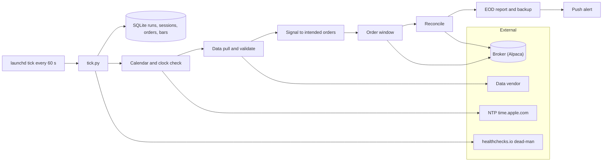
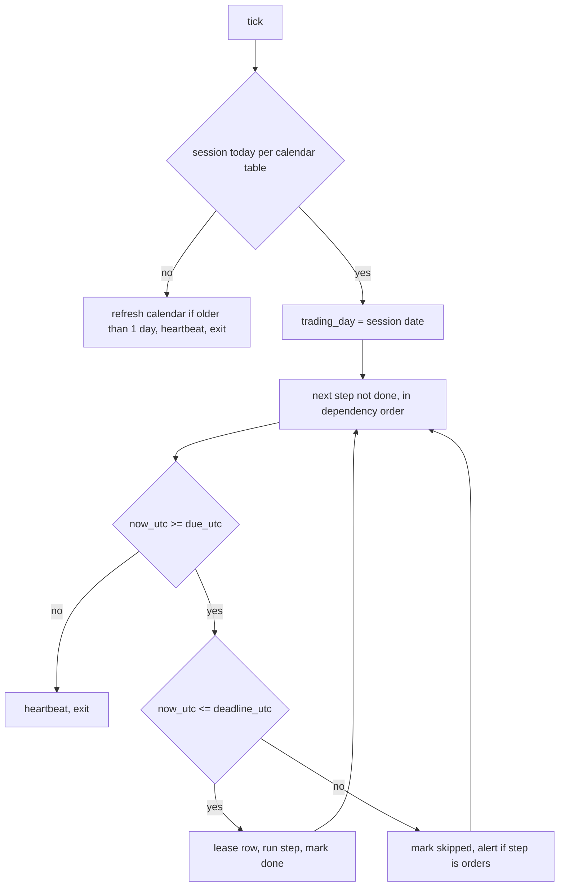

# Mini quant system — DE 16, scheduling and time

Lens: scheduling and time. Assumptions: US equities on NYSE/Nasdaq hours, one daily-rebalance strategy on 5 to 10 liquid ETFs and large caps, Alpaca as broker (free calendar and clock endpoints), Mac mini on mains power with a user logged in. Intraday variants are called out where they change the answer.

## Requirements

Functional:

| # | Requirement | Number |
|---|---|---|
| F1 | Run a fixed daily sequence: calendar check, data pull, validate, signal, order window, midday reconcile, pre-close cancel, EOD report, backup | 8 steps, 1 trading day |
| F2 | Know whether today is a session and when it closes, from a fetched calendar, not a hardcoded list | refreshed every pre-market, 60 days ahead cached |
| F3 | Every run, order, fill, bar and log line carries `trading_day` (a date) and a UTC timestamp | 100 percent, enforced by NOT NULL |
| F4 | Steps are idempotent and resumable; a crash mid-step re-runs safely | one row per (trading_day, step) |
| F5 | Missed steps follow a written catch-up rule; the order step is never run late | deadline per step |
| F6 | Report in exchange time, store in UTC | one conversion function, display layer only |

Non-functional:

| # | Requirement | Number |
|---|---|---|
| N1 | Step start latency on a normal day | within 60 s of due time |
| N2 | Wall clock drift versus broker clock | warn above 2 s, halt trading above 30 s |
| N3 | Detect a dead or asleep machine | external heartbeat, alert within 30 min |
| N4 | Unattended for one full trading day, no operator action | 0 manual steps on a normal day |
| N5 | Survive reboot, power loss, DST change, early close, unscheduled closure | all handled without code change |
| N6 | Whole daily pipeline CPU time | under 5 min, so a 60 s tick is never the bottleneck |

## Estimates

| Item | Estimate | Working |
|---|---|---|
| Instruments | 10 | daily strategy, liquid names |
| Daily bars stored | 10 x 252 x 100 B = 250 KB per year | negligible |
| 1-minute bars if intraday | 10 x 390 x 252 x 100 B = 100 MB per year | still fine on SQLite |
| API calls per day | about 60 | calendar 1, clock 3, bars 10, positions 3, orders 10, fills 10, plus retries |
| Scheduler ticks per day | 1,440 | launchd every 60 s, each tick under 50 ms when idle |
| Calendar cache | 60 sessions x 5 fields | under 10 KB |
| Trades per month | 40 to 80 | 10 names, 2 to 4 rebalances per day on average |
| Notional per month | 60 x $200 = $12,000 | average order $200 |
| Cost of spread and slippage | 5 bps per side x $12,000 = $6 per month | commission free broker |
| Cloud cost | $0 to $3 per month | healthchecks.io free tier, ntfy or Pushover for push |
| Honest gross edge | 2 to 5 percent per year on $2,000 = $40 to $100 | a good retail daily strategy |
| Net after slippage | about $0 to $30 per year | the system is for learning, not income |
| Trades needed to detect that edge | several hundred, over 12 months | which is why unattended reliability matters more than speed |

Time budget for the pipeline: data pull 30 s, validate 5 s, signal 10 s, orders 20 s, reconcile 10 s, report 10 s. Total under 2 min. Nothing here needs sub-second scheduling.

## High-level design

Main flows:

- Data in: pre-market, pull prior session bars for 10 names, validate (no gaps, no stale timestamps, splits adjusted), write with `trading_day` and `ts_utc`.
- Signal: read validated bars, write intended orders for `trading_day` with `client_order_id = trading_day + symbol`. Nothing is sent yet.
- Order out: inside the 09:45 to 10:15 window only, send intended orders as limit DAY orders. Broker expires whatever is unfilled at close.
- Reconcile: pre-open, midday and after close, compare local orders and positions with broker; differences are alerts, never silent fixes.
- Report: after close, P&L in exchange time, list of steps that ran, skipped, or ran late, and a backup of the SQLite file.

One process, one tick entry point, one database. The scheduler decides nothing about the market; the tick reads the calendar and the runs table and decides what is due.

## Deep dive: scheduling and time

### The hard part

The pipeline is easy. The hard part is that the machine's clock, the machine's timezone, the machine's sleep state and the exchange's calendar are four independent sources of truth, and the obvious design trusts all four.

### The obvious approach and why it breaks

Obvious: a cron or launchd `StartCalendarInterval` entry per step, in local time, each step calling `datetime.now()` to decide what to do.

| Failure | What happens |
|---|---|
| Mac asleep at 09:45 | launchd fires the missed job once on wake at 10:40, orders go out at stale prices |
| Reboot at 09:44 | job never fires, no orders, no alert, nobody knows |
| Early close at 13:00 | 15:45 pre-close cancel runs after close, EOD report at 16:30 has no fills from the last hour it expected |
| Unscheduled closure, for example a national day of mourning | pipeline runs against a closed market, data pull returns yesterday, signal trades on it |
| DST Sunday | local 02:30 job skipped or doubled; UTC open moves from 13:30Z to 14:30Z and any stored 09:30 without a date is now wrong |
| Operator changes machine timezone while travelling | every naive `now()` shifts by hours |
| Step crashes halfway | next cron run is tomorrow; partial orders sit at the broker |
| 23:30 ET log line | stored as next day in UTC, joined to the wrong trading day in the report |

Every one of these is a time bug, none is a trading bug, and all of them are silent.

### What I would do instead

Three rules, then the mechanism.

Rule 1, the trading day is data, not the clock. `trading_day` is the session date from the calendar table whose window `[open_utc - 4 h, open_utc + 20 h]` contains `now_utc`. If no session matches, it is a non-trading day and only calendar refresh and heartbeat run. Every step receives `trading_day` as an argument; no step calls `date.today()`.

Rule 2, store UTC, display exchange time. The process runs with `TZ=UTC`. Every column is `ts_utc` as ISO-8601 with a Z suffix, or `trading_day` as a date. One function `to_exchange(ts_utc)` using `zoneinfo` for `America/New_York` exists in the report layer only. Bars from the vendor are converted on ingest and the vendor's own timestamp is kept in a second column for audit.

Rule 3, the scheduler is dumb and the tick is smart. launchd runs `tick.py` every 60 s with `RunAtLoad`. The tick is idempotent and cheap. It never sleeps, never holds state in memory, never assumes it fired on time.

The runs table is the whole scheduler state: `runs(trading_day, step, status, lease_until_utc, started_utc, finished_utc, note)` with a unique key on `(trading_day, step)`. Status is pending, running, done, skipped, failed. A row in running with an expired lease of 30 min is treated as crashed and re-leased. Only steps marked re-runnable are re-leased automatically; the order step is not, it goes to failed and alerts, because the broker may already hold half the orders. Reconcile then finds them by `client_order_id`.

### The daily timeline

```mermaid
gantt
    title Trading day in exchange time, normal close
    dateFormat HH:mm
    axisFormat %H:%M
    section Pre-market
    Calendar and clock check   :a1, 06:30, 5m
    Data pull and validate     :a2, 06:35, 25m
    Signal compute             :a3, 07:30, 10m
    Pre-open reconcile         :a4, 09:15, 10m
    section Session
    Order window               :crit, b1, 09:45, 30m
    Midday reconcile           :b2, 12:30, 10m
    Pre-close cancel           :b3, 15:45, 15m
    section After close
    EOD reconcile and report   :c1, 16:30, 15m
    Backup                     :c2, 16:45, 10m
```

Due and deadline times are computed per session from `open_utc` and `close_utc`, never from constants, so an early close moves pre-close cancel to 12:45 and the EOD report to 13:30 without a code change.

| Step | Due | Deadline | Depends on | If missed |
|---|---|---|---|---|
| calendar and clock check | open - 3 h | open | none | run late until open, else halt the day and alert |
| data pull and validate | open - 2 h 55 m | open | calendar | run late until open, else skip trading today |
| signal | open - 2 h | open + 10 m | data | run late until open + 10 m, else skip trading |
| pre-open reconcile | open - 15 m | open + 15 m | none | run late; if it finds drift, block the order step |
| order window | open + 15 m | open + 45 m | signal, pre-open reconcile | never late; skipped and alerted |
| midday reconcile | open + 3 h | close - 15 m | none | run late until close |
| pre-close cancel | close - 15 m | close | none | run late until close; after close DAY orders are expired by broker anyway |
| EOD reconcile and report | close + 30 m | next open - 3 h | none | always run late, even next morning, before next data pull |
| backup | close + 45 m | next open - 3 h | EOD | always run late |

Catch-up principle: steps that read are always safe to run late; steps that write to the broker are only safe inside their window. A run that wakes at 10:40 does the pre-market steps, marks the order window skipped, sends one alert, and carries on to reconcile and report. The report says in plain words "no orders placed on 2026-09-04, order window missed, machine was asleep 09:12 to 10:40".

Why 15 minutes after open: the opening auction and first minutes are the most volatile of the day and a 60 s tick has no business there. Why 30 minutes wide: wide enough to absorb a reboot, narrow enough that signals computed on yesterday's close are still what the strategy meant. If the strategy is intraday, the window rule is the same but the signal step repeats on its own bar cadence and each repetition gets its own `(trading_day, step, seq)` row.

### The exchange calendar

Source: broker calendar endpoint, fetched in the calendar step every trading morning for the next 60 days, stored as `sessions(date, open_utc, close_utc, fetched_utc)`. A second source, `pandas_market_calendars` or a static list for the year, is compared against it. Disagreement is an alert and the broker wins, because the broker is who accepts the order. Fetching daily, not weekly, is what catches an unscheduled closure announced with two days notice. Early closes come with a different `close_utc`, no special code path. Juneteenth was added in 2022 and any hardcoded list from before then was wrong for a year; that is the argument against hardcoding in one sentence.

### Clock drift and NTP

macOS runs `timed` against `time.apple.com` and keeps drift under a second when the machine is online. The calendar step still checks: compare `now_utc` with the broker clock endpoint, and with one NTP query as a second opinion. Under 2 s, nothing. 2 to 30 s, warn and continue. Above 30 s, mark the day halted and alert, because a 30 s error means either NTP is blocked or the clock was set by hand. Durations inside a step use `time.monotonic()`; wall clock is only for stamps. `sysctl kern.boottime` is written to the log at every tick after a reboot so a missed window can be explained.

### What launchd should and should not be trusted to do

| Trust it to | Do not trust it to |
|---|---|
| start `tick.py` every 60 s while awake | fire while the machine is asleep, it will not |
| fire once on wake for the interval it missed | fire on time to the second, seconds to minutes late is normal |
| restart the tick if it crashes | know about DST, `StartCalendarInterval` is local time and has a skipped hour in March |
| run at login as a LaunchAgent with keychain access | run before login as a LaunchDaemon and still reach the user keychain |

So: `StartInterval` of 60 s, `RunAtLoad` true, `ProcessType` Background, one LaunchAgent, auto-login enabled, FileVault off or accept a manual unlock after power loss. Power settings are part of the design, not ops trivia: `pmset -a sleep 0 disksleep 0 autorestart 1 womp 1` and `pmset repeat wakeorpoweron MTWRF 06:00:00` as belt and braces. The external dead-man switch is what tells you the pmset line was reverted by an OS update: every tick pings healthchecks.io, and 30 min of silence during a session is a push alert.

Ponytail note: no long-running daemon, no APScheduler, no Airflow, no cron. A process that sleeps until 09:45 is the one design that is guaranteed wrong on a machine that suspends. The tick plus a table is 150 lines and every failure mode above lands on one of two branches in the diagram.

## Trade-offs

| Choice | Chosen | Alternative | Why |
|---|---|---|---|
| Scheduler | launchd 60 s tick, state in SQLite | long-running daemon with sleep | daemon drifts and dies on suspend; tick is stateless and resumable |
| Missed order window | skip and alert | run late with a fresh price check | on a daily strategy a late fill is a different trade than the one backtested; skipping keeps the record honest |
| Calendar | broker API daily, static list as check | static list only | static lists go stale, and the broker decides what it accepts |
| Timezone | process in UTC, display in exchange time | store exchange time | DST and a 23:30 ET row prove exchange time cannot be a storage format |
| Agent versus daemon | LaunchAgent, auto-login | LaunchDaemon | keychain and broker secrets are simpler under a logged-in user; cost is a reboot needs no one, but a FileVault machine needs a password |
| Order type | limit DAY inside a window | market-on-open | MOO removes the window problem entirely but gives up price control; worth revisiting if the window is missed more than twice a quarter |
| Watchdog | external free heartbeat | local only | a silent machine cannot report its own silence |

## Pitfalls

- `datetime.now()` without `tz=timezone.utc` anywhere in the codebase. Grep for it in CI.
- SQLite has no datetime type. Store text with a Z suffix; a bare `2026-09-04 09:45:00` will be read as local by someone within a month.
- A step that runs at 20:30 ET on 2026-09-04 is 00:30Z on 2026-09-05. Joining on `date(ts_utc)` instead of `trading_day` misattributes it.
- DST shifts on different Sundays in the US and Europe. If the data vendor is European and reports exchange time, there are two weeks a year where their offset is wrong. Ingest their UTC field, not their local one.
- Early close changes `close_utc` but not `open_utc`. Any step defined as a fixed clock time rather than an offset from close will be wrong four times a year.
- Waking at 09:29:50 fires every overdue pre-market step at once. Dependency order in the runs table handles it; a per-step cron does not.
- launchd coalesces a missed interval into one fire. If the tick does more than one step per invocation that is fine; if it did exactly one step per fire the day would fall behind by a step each sleep.
- A macOS update resets `pmset` and re-enables sleep. The dead-man switch catches it; a checklist does not.
- Log lines in local time next to database rows in UTC. Force the logger to UTC with the same Z format.
- Broker clock endpoint says `is_open` true on a day the calendar says closed, or the reverse. Trust neither; halt and alert, it has happened during exchange outages.

## Open questions for the panel

1. Daily versus intraday. Intraday turns the order window into a repeated step on a bar cadence and puts the 60 s tick under real pressure; is the strategy lens committed to daily?
2. Skip versus run-late for the order window. I chose skip. Would the strategy owner accept a run-late variant that re-prices against the live quote and only trades if within 25 bps of the signal price?
3. Market-on-open orders would delete the order window and its catch-up rule. Does the execution lens want them, given the auction fill quality on 10 liquid names?
4. Who is allowed to flip a halted day back on, and from where? A phone push with a one-tap resume is convenient and exactly the kind of thing that places orders at 10:40.
5. FileVault on with a manual unlock after power loss, or FileVault off on a machine holding broker keys? Security lens should rule.

## Non-negotiables

1. Every row that describes a run, order, fill, or bar carries a `trading_day` date and a UTC timestamp, both NOT NULL, and no step computes today's date itself. Without this the reports lie and cannot be audited.
2. The order step has a hard deadline and refuses to run past it. Catch-up never places orders. A design where a wake-up can send yesterday's orders is blocked.
3. An external heartbeat with a 30 min alarm during sessions. A machine that is asleep, unplugged, or stuck on a FileVault prompt has to be noticed by something that is not the machine.
