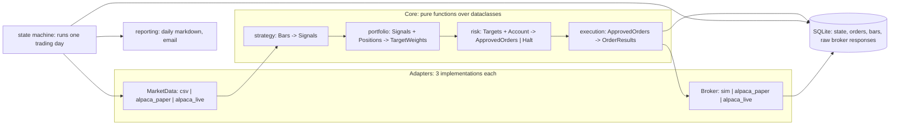
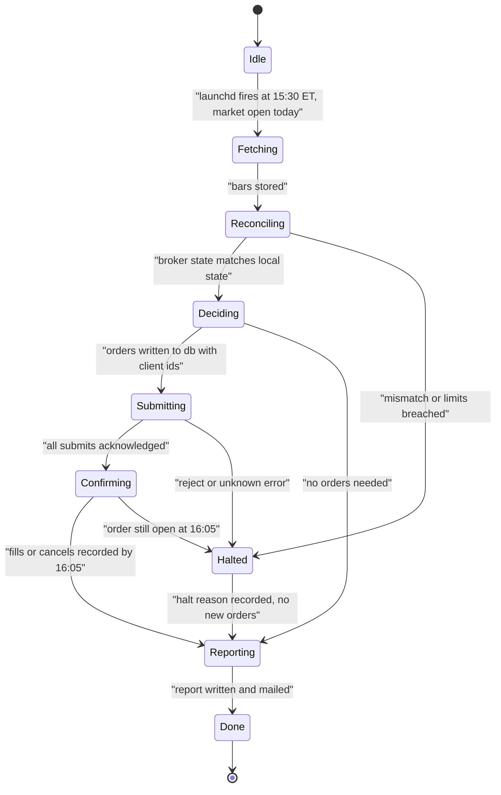
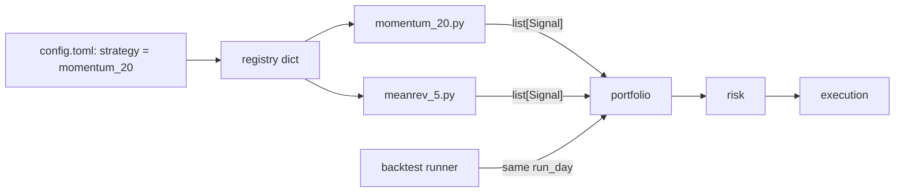

# Mini quant system — DE 17, software architecture and testability

Assumptions: Python 3.12, Alpaca paper and live accounts (commission-free US equities, fractional shares), 3 to 5 liquid ETFs, one decision per instrument per day near the close, no options, no margin. Everything below is sized for one person who has to read the whole codebase again after six months away.

## Requirements

Functional

| # | Requirement | Number |
|---|---|---|
| F1 | Pull daily bars for a watchlist, compute signals, size, submit orders | 5 instruments, 1 decision cycle per day |
| F2 | Reconcile broker state (positions, fills, cash) against local state every cycle | Drift of $0.01 or 1 share halts trading |
| F3 | Same strategy code runs in backtest, paper, live with zero edits | 3 adapters behind 2 interfaces |
| F4 | A new strategy is a new file plus one registry line | 0 edits to risk, execution, state |
| F5 | Daily report: positions, P&L, orders placed, orders rejected, halts | 1 markdown file per day, mailed |
| F6 | Any day can be replayed offline from recorded inputs | Replay of a recorded day identical to the byte |

Non-functional

| # | Requirement | Number |
|---|---|---|
| N1 | Unattended for 1 trading day; operator checks once in the evening | Max 1 human action per day |
| N2 | Crash at any point resumes without a duplicate order | Idempotent orders, resume from persisted state |
| N3 | Codebase readable end to end | Under 3,000 lines including tests |
| N4 | Test suite fast enough to run on every save | Unit and replay tests under 5 seconds; simulated day under 60 seconds |
| N5 | Max loss per day capped in code, not in the operator's head | 2% of equity ($40) daily, 25% ($500) position cap |

## Estimates

| Item | Estimate | Reasoning |
|---|---|---|
| Market data | 5 symbols x 1 daily bar x ~60 bytes = 300 B/day; 10 years history 5 x 2,520 x 60 B = 760 KB | Fits in SQLite trivially; no time series DB |
| Broker requests | ~30/day: 5 bar fetches, 1 account, 1 positions, up to 5 orders, 5 order polls, retries | Alpaca limit is 200/min; we use 0.01% of it |
| Trades | 0 to 5 orders/day, realistically 2 to 4 per week for a daily-rebalance strategy | 100 to 200 fills/year |
| Fees | $0 commission; SEC/FINRA fees on sells ~$0.01 to $0.03 each; spread on liquid ETFs ~1 to 2 bp | Round trip cost ~3 bp on $400 position = $0.12 |
| Slippage at close | MOC or limit near close, ~2 to 5 bp | ~$0.20 per round trip |
| Expected edge | A daily-momentum or mean-reversion strategy on ETFs after fees: 0 to 3% annual excess, Sharpe well under 1 out of sample | $0 to $60 per year on $2,000. Fees ~$40 per year at 150 trades |
| Honest read | Edge and fees are the same order of magnitude. The system's value is learning cheaply, not income | |
| Cost per month | $0 to $3: broker free, data free from broker, one email via SMTP, optional healthchecks.io free tier | Electricity for the Mac mini already paid |
| Storage | SQLite database under 50 MB after 5 years including every recorded broker response | 512 GB SSD, irrelevant |
| Code | ~2,000 lines app, ~1,000 lines tests | One process, six modules |

## High-level design

One Python process, launched by launchd once per trading day at 15:30 ET. It runs the trading-day state machine to completion, writes a report, and exits. No daemon, no queue, no second process. Each module exposes pure functions over plain dataclasses; only two modules touch the outside world (`data` and `execution`) and both do it through an adapter interface with three implementations: backtest, paper, live.



Main flows

| Flow | Path | Persisted |
|---|---|---|
| Data in | `MarketData.bars(symbols, lookback)` returns `list[Bar]`; stored in `bars` table | Raw JSON response in `raw_responses` |
| Signal | `strategy.signals(bars) -> list[Signal]` then `portfolio.targets(signals, positions, equity) -> list[Target]` | `signals` table with the day's inputs hash |
| Order out | `risk.approve(targets, account, limits) -> Approved | Halt`; `execution.submit(approved, broker)` with client order id `f"{date}-{symbol}-{n}"` | `orders` table, one row per intended order, written before submit |
| Reconcile | `Broker.positions()`, `Broker.orders(since)` compared to `orders` and `positions` tables; mismatch raises `Halt` | `reconciliations` table with diff |
| Report | `reporting.daily(db, date)` renders markdown, sends via SMTP | `reports/YYYY-MM-DD.md` |

## Deep dive: software architecture and testability

### The hard part

The hard part is not any single module. It is that the code which decides to move money is the code least safe to run while developing it. Every obvious shortcut welds the strategy to the broker, and then the only way to test a strategy change is to trade it. The architecture exists to make "run today's logic against yesterday's recorded reality" a one-command operation.

### The obvious approach and why it breaks

The obvious approach is a `main.py` with a `while True` loop, `if now > 15:30 and not traded_today:` branches, and `alpaca.submit_order()` called from inside the strategy function. It works for the first week. It breaks in three specific ways.

| Failure | Cause | Consequence |
|---|---|---|
| Duplicate order after crash | `traded_today` lived in memory | Two buys of $400 each, position cap silently exceeded |
| Backtest disagrees with live | Backtest path is a separate script that reimplements sizing | Edge in backtest, none live, no way to know which is wrong |
| Cannot test a fix | Strategy imports the broker client | Every test needs network or a mock of Alpaca's whole API |

### What I would do instead

**1. Module boundaries as plain data.** Six modules, each a single file. The contract between them is dataclasses, not objects with behaviour. Nothing in `core/` imports `requests`, `alpaca`, `datetime.now`, or `random`.

| Module | Input | Output | Touches outside world |
|---|---|---|---|
| `data` | symbols, lookback, `MarketData` adapter | `list[Bar]` | Yes, through adapter |
| `strategy` | `list[Bar]` | `list[Signal]` (symbol, score in [-1, 1]) | No |
| `portfolio` | `list[Signal]`, `list[Position]`, equity | `list[Target]` (symbol, target weight) | No |
| `risk` | `list[Target]`, `Account`, `Limits` | `Approved(orders)` or `Halt(reason)` | No |
| `execution` | `Approved`, `Broker` adapter, `OrderStore` | `list[OrderResult]` | Yes, through adapter |
| `state` | events | persisted `DayState` in SQLite | SQLite only |
| `reporting` | SQLite, date | markdown string | SMTP only |

Two adapter protocols, both tiny:

```python
class MarketData(Protocol):
    def bars(self, symbols: list[str], end: date, lookback: int) -> list[Bar]: ...

class Broker(Protocol):
    def account(self) -> Account: ...
    def positions(self) -> list[Position]: ...
    def submit(self, order: Order) -> OrderResult: ...      # idempotent on client_order_id
    def orders(self, since: date) -> list[OrderResult]: ...
```

`clock` is a third, one-function adapter: `now() -> datetime`. Backtest passes a fixed clock. That is the whole dependency-injection story; no framework.

**2. One process, and why.** The workload is 30 HTTP calls per day. A second process buys nothing and costs an IPC boundary, a second log, and a second failure mode. The single process is a script that runs to completion; launchd is the scheduler and the restarter. If it crashes, launchd's `KeepAlive` on non-zero exit reruns it, and the state machine resumes from the persisted state, not from the top.

**3. An explicit trading-day state machine.** The day is a sequence of states persisted in one SQLite row `day_state(date, state, updated_at)`. Each transition is a function that reads its inputs, does exactly one side effect, and writes the next state in the same SQLite transaction as the side effect's record. Resuming means reading the row and calling the handler for that state.



Why this beats if-statements: every state has exactly one handler, every handler is idempotent (re-running `Submitting` re-reads the `orders` table and only submits rows without a `broker_order_id`), and the set of legal transitions is a 12-line dict that a test can walk exhaustively. `Halted` is a state, not an exception; the process still reaches `Reporting`, so the operator gets an email saying why nothing traded.

Crash safety specifically: the `orders` row with its `client_order_id` is committed before the HTTP call. On resume, `Submitting` first calls `Broker.orders(since=today)` and matches by client id. An order that was sent but whose response was lost is found, not resent. Alpaca rejects a duplicate `client_order_id`, which is the backstop.

**4. Same code in backtest, paper, live.** Three configurations, one code path:

| Mode | MarketData | Broker | Clock | State DB |
|---|---|---|---|---|
| backtest | `CsvMarketData` reading stored bars | `SimBroker`: fills at next open with 3 bp slippage, tracks cash and positions in memory | fixed per day | in-memory SQLite |
| paper | `AlpacaMarketData` | `AlpacaBroker(paper=True)` | real | `paper.db` |
| live | `AlpacaMarketData` | `AlpacaBroker(paper=False)` | real | `live.db` |

A backtest is `for day in trading_days: run_day(day, adapters)`. It runs the identical state machine, including `Reconciling` against `SimBroker`. If sizing or risk drifts between backtest and live, it is because of the adapter, and the adapter is 150 lines with a recorded-response test.

**5. Testing pyramid for a system that moves money.**

| Layer | What | How | Count and speed |
|---|---|---|---|
| Unit | `strategy`, `portfolio`, `risk`, transition table | Pure functions, hand-written inputs, property tests on `risk` (never approve an order that breaches a cap, for any input) | ~60 tests, under 1 s |
| Replay | `AlpacaBroker`, `AlpacaMarketData` parsing and error handling | Every live HTTP response is recorded to `raw_responses` in production; tests replay them through the adapter with a fake HTTP client | ~20 tests, under 1 s, grows every time production sees a new response shape |
| Simulated day | Full `run_day` against `SimBroker` with injected faults: crash after submit, reject, partial fill, stale bars, mismatched position | Each fault must end in `Halted` or `Done` with correct db state and no duplicate order | ~10 tests, under 10 s |
| Paper soak | Real paper account, real schedule, 20 trading days minimum before live | Report emails checked daily; any `Halted` blocks promotion | Calendar time, not CPU |

The replay layer is the one most people skip and the one that pays. Recording every broker response costs nothing at 30 requests per day, and it means the test for "Alpaca returned a 422 with this exact body on 2026-08-14" is written from what actually happened rather than from documentation.

**6. Adding a strategy without touching execution or risk.** A strategy is one file exporting one function with the signature `signals(bars: list[Bar], params: dict) -> list[Signal]`, plus one line in `strategies/__init__.py`'s registry dict. The config names the strategy and its params. `portfolio` turns scores into weights, `risk` caps them, `execution` sends them; none of them know which strategy ran. The strategy cannot place an order because it has no reference to a broker, cannot see the clock, and cannot see the account. The CI check is a single import-linter rule: `core.strategy` may not import `adapters`, `execution`, or `state`.



## Trade-offs

| Decision | Chosen | Alternative | Why |
|---|---|---|---|
| Process model | One script per day via launchd | Long-running daemon with scheduler | Daemon needs its own health, reconnect, memory watch; launchd already does restart and scheduling |
| State store | SQLite, one file per mode | Postgres, JSON files | Transactions across order row and state row in one commit; JSON cannot do that atomically |
| Inter-module contract | Frozen dataclasses | Pydantic models, ORM objects | Zero dependencies in `core`, trivially constructible in tests |
| Adapters | `Protocol` with three impls | Abstract base classes, plugin system | Three implementations exist today; the protocol earns its keep. No plugin loader |
| Strategy interface | One function, params dict | Class with lifecycle hooks | Stateless strategy cannot accumulate hidden state across days; state lives in the db |
| Halt semantics | Halt is a state that still reports | Exception that kills the process | Silent death is the worst outcome for an unattended system |
| Replay tests | Record every production response | Mock from API docs | Docs lie; recorded bodies are the truth of what the broker actually sent |

## Pitfalls

- Testing the state machine only on the happy path. The simulated-day fault tests are the point; write the crash-after-submit test first.
- Letting `datetime.now()` leak into `core`. One call and backtests stop being reproducible. The clock adapter and the import-linter rule are the guard.
- Recording raw responses but never replaying them. Add a test the same day a new response shape shows up in the log.
- Backtest `SimBroker` that fills at the signal bar's close. Fill at next open with slippage or the edge is fiction.
- A `Halted` state that halts forever. Halt is per day; the next day's `Idle -> Fetching` transition re-checks limits, and the operator must clear a persistent halt flag by hand, which is the intended one human action.
- Growing the codebase past the point where one person can reread it. If it passes 3,000 lines, delete something before adding.

## Open questions for the panel

1. Should `Confirming` cancel unfilled orders at 16:05 or let them expire as day orders? Cancelling is safer; expiring is simpler.
2. Is 20 paper trading days enough soak before live, or should promotion require N paper days with zero `Halted` and a backtest-versus-paper P&L gap under some threshold?
3. Should the strategy registry allow two strategies to run the same day with capital split, or is one strategy at a time the right constraint for $2,000?
4. Do we want intraday at all? Everything above assumes one cycle per day. An intraday version is the same state machine run in a loop, but `Reconciling` cost and the clock adapter get harder.
5. Is the raw-response recording a privacy or key-leak concern if the db is ever backed up off-box? Headers are stripped; bodies contain account ids.

## Non-negotiables

1. The `orders` row with a `client_order_id` is committed before the broker call, and `Submitting` reconciles by client id on resume. Without this, a crash can double a position.
2. `core/` imports no network, no clock, no randomness. Enforced by an import-linter rule in CI, not by convention.
3. The simulated-day fault suite passes, including crash-after-submit and position mismatch, before any config is pointed at the live account.
