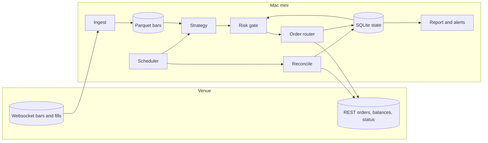
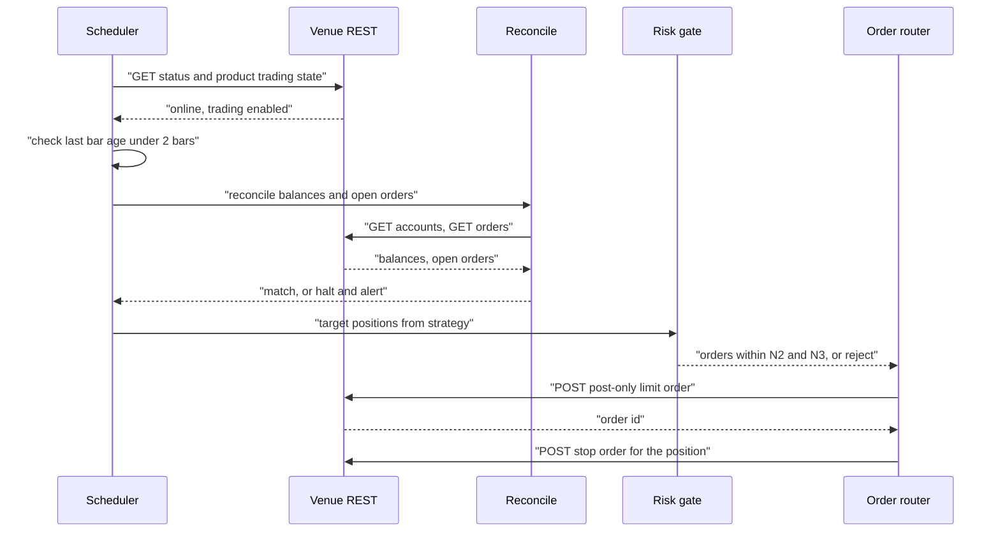
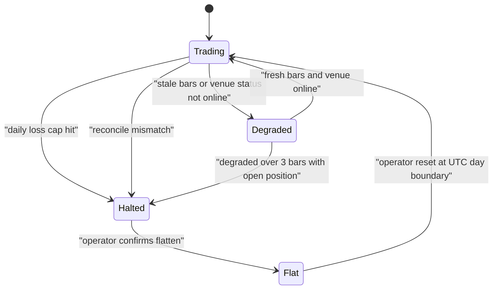

# Mini quant system — DE 18, the crypto alternative

Lens: should a $2,000, one-person, Mac-mini system trade crypto instead of, or alongside, US equities. Assessed on fees, spreads, volatility, counterparty risk, API quality, and what 24/7 does to the scheduler and the risk limits. Assumptions stated inline; numbers are approximate, fee tiers drift and must be re-read from the venue's fee page the week you go live.

## Requirements

Functional

| # | Requirement | Number |
|---|---|---|
| F1 | Ingest bars for a small basket | 3 to 5 instruments, 1h bars (equities) or 1h bars around the clock (crypto) |
| F2 | Signal on a fixed cadence, place limit orders only | 1 decision per instrument per bar, never market orders in crypto |
| F3 | Paper mode before live, same code path | 4 weeks paper minimum, 30 trades minimum |
| F4 | Reconcile positions and cash against the venue before every order | 1 reconcile per cycle, block on mismatch |
| F5 | Daily report and alert on anomalies | 1 report per day, alert within 5 minutes of a limit breach |
| F6 | Kill switch: flatten and halt | Operator-triggered and automatic, halts within 1 cycle |

Non-functional

| # | Requirement | Number |
|---|---|---|
| N1 | Unattended for 24h, including a weekend night for crypto | 0 orders placed while venue state is unknown |
| N2 | Daily loss cap | 2% of equity ($40), then halt until next UTC day |
| N3 | Max single position | Equities 25% ($500), crypto 12.5% ($250) |
| N4 | Recovery after crash or reboot | Resume in under 2 minutes with state rebuilt from venue, not local DB |
| N5 | Fee drag hurdle | Expected gross edge per trade must exceed 3x round-trip cost or the strategy does not go live |
| N6 | Cloud cost | Under $5 per month |

## Estimates

Data volume and rates

| Item | Equities (Alpaca) | Crypto (Coinbase Advanced or Kraken) |
|---|---|---|
| Bars per day, 5 instruments, 1h | 35 | 120 |
| Bars per day, 5 instruments, 1m | 1,950 | 7,200 |
| Storage per year at 1m, Parquet | ~25 MB | ~100 MB |
| REST calls per day, poll 1/min plus orders | ~450 | ~1,500 |
| Venue rate limit | 200 req/min | Coinbase ~30 req/s private, Kraken counter 15 to 20 decaying ~0.33/s |
| Headroom | 60x | 1,000x (Coinbase), ~30x (Kraken, order endpoints are the tight one) |

Costs per month

| Item | Equities | Crypto |
|---|---|---|
| Market data | $0 (IEX feed) | $0 (venue websocket) |
| Mac mini power, ~10 W | ~$1 | ~$1 |
| Off-site backup of SQLite and Parquet | ~$1 | ~$1 |
| Commission, 20 round trips on max position | $0 | $40 maker to $60 taker at Coinbase tier 1 (0.40/0.60%), $25 to $40 at Kraken Pro (0.25/0.40%), $15 to $25 at Alpaca crypto (0.15/0.25%) |
| Spread and slippage, 20 round trips | ~$2 on $500 positions (SPY-class, ~1 bp) | ~$1 on BTC, $5 to $15 on a top-20 alt |
| Total | ~$4 | ~$20 to $65 |

Trade counts and edge, honestly

| Item | Equities | Crypto |
|---|---|---|
| Position size at 1% risk ($20) with a 2-ATR stop | Stop ~2%, size $1,000, capped to $500 | Stop ~8%, size $250 |
| Trades per month, 1h momentum | 8 to 15 (PDT-safe in a cash account with T+1 settlement) | 30 to 60 |
| Round-trip cost as share of $20 risk budget | ~1% | 10% to 15% at Coinbase, 4% to 6% at Alpaca crypto |
| Plausible gross edge for simple trend, per trade | 0.1% to 0.3% of position | 0.3% to 0.8% of position |
| Net edge after cost, per trade | ~$0.50 to $1.50 | ~-$1 to +$1 at Coinbase taker, ~$0 to +$1.50 maker |
| Expected annual P&L if the edge is real | $50 to $150 | -$200 to +$300, wide because volatility is 3 to 4x |

Read that last table plainly. Crypto's headline benefit, no pattern day trader rule, buys trade frequency. Crypto's fees punish exactly that frequency. At the frequency where PDT stops mattering, a $2,000 crypto account pays 3% of equity per month in fees at a retail tier. Equities in a cash account with T+1 settlement sidestep PDT for a daily-cadence strategy with zero commission.

## High-level design

One process per concern, one machine, SQLite for state, Parquet for bars, launchd to keep it alive. The venue adapter is a single module for the chosen venue, not a plugin system; a second venue is a second module when and if it is needed.

Main flows

1. Data in: websocket bars written to Parquet per instrument per day; a REST backfill on start covers gaps. Staleness is a first-class field: last bar age is checked every cycle.
2. Signal: on each bar close the strategy reads the last N bars and emits target positions, not orders.
3. Order out: the risk gate turns targets into orders, rejects any that breach N2 or N3, and the router places post-only limit orders.
4. Reconcile: before any order, balances and open orders are pulled from the venue and compared to SQLite. A mismatch blocks trading and alerts. The venue is the source of truth, always.
5. Report: one daily summary at the day boundary (16:00 ET for equities, 00:00 UTC for crypto) with P&L, fees paid, trades, rejects, and staleness incidents.

## Deep dive: the crypto alternative, assessed honestly

### Side by side for this system

| Dimension | US equities, Alpaca cash account | Crypto, Coinbase Advanced or Kraken Pro |
|---|---|---|
| Day trading rule | PDT applies to margin accounts under $25k; a cash account has no PDT, but T+1 settlement means cash used today is back tomorrow. With $2,000 split across 2 to 3 slices this supports daily cadence, not intraday churn | No PDT, instant settlement, unlimited turnover |
| Hours | 6.5 h/day, ~252 days/yr; overnight gaps | 24/7/365; no gaps but weekend liquidity is 30% to 50% thinner |
| Commission | $0 plus regulatory fees of cents on sells | 0.15% to 0.60% per side at retail tiers; 0.8% to 1.2% round trip |
| Spread, top instrument | ~1 bp (SPY) | ~1 to 2 bp (BTC-USD on Coinbase), 5 to 30 bp on top-20 alts |
| Daily volatility | ~1% (SPY), 2% to 3% (single large caps) | ~3% to 4% (BTC), 5% to 8% (alts) |
| Position size at equal $ risk | $500 to $1,000 | $150 to $250 |
| Fractional sizing | Supported, but fractional limit-order support is venue-specific; verify | Native, minimum order ~$1 to $10 |
| Counterparty | SIPC to $500k, broker-dealer regulation | No SIPC; USD balances at Coinbase held in pass-through FDIC accounts, crypto balances uninsured; exchange failure risk is real (FTX 2022) |
| Custody | Broker holds, standard | Exchange holds; self-custody removes exchange risk but breaks the trading loop and adds key management. At $2,000 the answer is exchange custody with nothing beyond trading capital on the venue |
| Paper trading | Alpaca paper is full order simulation | Alpaca crypto paper is full simulation; Coinbase Advanced sandbox returns static responses only; Kraken spot has no sandbox |
| Rate limits | 200 req/min | Coinbase ~30 req/s private; Kraken call counter with tier-based decay, order endpoints are the bottleneck |
| Calendar | Needs holiday and half-day calendar | None, but needs venue status and maintenance-window handling |
| Tax | Property, wash-sale rule applies | Property, wash-sale rule does not currently apply; every trade is a taxable event, keep the ledger |
| Outage cost | Missed bar at most; market is closed 17.5 h/day so a reboot is usually free | A crash at 03:00 Sunday with an open position and no stop on the venue is a live exposure until you wake up |
| Data quality | Consolidated tape, one price | Fragmented; the price on your venue is the only one that matters for fills, and it diverges from index prices in stress |

### The hard part

Not the API. The hard part is that the reasons to prefer crypto (no PDT, always open) are the reasons the risk budget shrinks (fees at frequency, volatility, no closing bell as a natural circuit breaker).

### The obvious approach and why it breaks

Obvious: trade BTC and ETH on Coinbase Advanced with the same 1h momentum strategy planned for equities, since there is no PDT and the market never closes.

It breaks three ways:

1. Fees erase the edge. A 1h momentum strategy on BTC that turns over 40 times a month on a $250 position pays 40 x $250 x 1.0% = $100 per month at Coinbase tier 1 blended. That is 5% of the account per month. The strategy needs a gross edge over 1% per trade just to break even; simple trend on BTC does not deliver that at 1h.
2. Volatility shrinks size until the P&L is noise. At 8% stops the position is $250. A winning month is $20 to $40. Learning whether the edge is real needs hundreds of trades, so the learning takes a year and costs $1,200 in fees along the way.
3. 24/7 without a venue-side stop is unbounded overnight risk. Equities give you a free daily halt. Crypto does not. A 15% weekend move on an alt against a $250 position is $37, survivable, but the same design with 3 correlated positions is $110, or 5.5% of the account, from one gap while the operator sleeps.

### What I would do instead

Version one does not touch crypto. Version one is equities, Alpaca cash account, daily cadence, T+1 settlement managing PDT. Reasoning: zero commission, real paper trading, a natural daily halt, SIPC, and a consolidated tape. The learning goal in the brief is served best where costs are near zero.

If crypto is added later, in this order:

1. Alpaca crypto first, not an exchange. Same API, same paper environment, 0.15/0.25% fees, which is cheaper than Coinbase retail. The cost is wider effective spreads because Alpaca routes to liquidity providers; measure fill quality in paper before caring.
2. Only BTC and ETH. Alt spreads and volatility make every number above worse by 2 to 5x.
3. Cadence of 4h or daily, never 1h. Turnover is the fee lever; the target is under 10 round trips per month per instrument.
4. Coinbase Advanced or Kraken only if Alpaca's crypto fills are measurably bad in paper, and then with the risk limits below. Coinbase has the better API ergonomics and higher rate limits; Kraken has lower fees at the base tier. Neither has a paper environment worth the name, so the first live weeks are the paper weeks, at $200 of capital.

### What changes in the scheduler for crypto

| Concern | Equities | Crypto |
|---|---|---|
| Trigger | Market calendar plus clock endpoint; skip holidays and half days | Fixed UTC cron at every bar close; no calendar |
| Day boundary for loss cap and report | 16:00 ET | 00:00 UTC |
| Venue open check | Broker clock endpoint | Venue status endpoint plus product-level trading status; Kraken publishes maintenance windows, Coinbase has per-product halts |
| Stale data detection | Bar age > 2 bars during session | Bar age > 2 bars at any hour; a stuck websocket has no market close to hide behind |
| Overnight exposure | Flat or held, market closed | Always live; place a venue-side stop order or reduce size to what a 20% gap costs within N2 |
| Maintenance on the Mac | Any time after 16:00 ET | Only inside a declared trading-halt window you set yourself, e.g. Sunday 08:00 to 10:00 UTC, flat first |

Every cycle starts with venue status and staleness, and ends with a venue-side stop. If any step fails the cycle ends with no order, not with a retry loop.

### Risk limits that must be tighter for crypto

| Limit | Equities | Crypto | Why |
|---|---|---|---|
| Max position | 25% ($500) | 12.5% ($250) | 3 to 4x daily volatility |
| Max gross exposure | 75% | 40% | BTC and ETH correlation is ~0.8; three positions is one bet |
| Daily loss cap | 2% ($40) | 2% ($40), measured on a UTC day and on a rolling 24h | No close to anchor the day |
| Per-trade stop | 2 ATR, tracked locally | 2 ATR, placed on the venue | Local stops die with the process |
| Max orders per hour | 10 | 10 | Runaway loop guard, same either way |
| Fee budget per month | n/a | 1% of equity ($20), halt new entries when reached | Fees are the dominant cost, so they get a hard cap |
| Capital on venue | Full $2,000 | $500 initially, top up after 3 clean months | Exchange counterparty risk |
| Operator absence | Any length | Under 36h, otherwise flatten before leaving | 24/7 exposure without a person |

Degraded means no new entries, existing venue-side stops stay. Halted means flatten and stop. The operator reset is manual on purpose.

## Trade-offs

| Choice | Gain | Cost |
|---|---|---|
| Equities-only v1 | Zero commission, real paper, SIPC, daily halt | No trading outside 6.5h, PDT constrains cadence to daily-ish |
| Cash account over margin | No PDT | T+1 settlement ties up capital; at $2,000 that is 2 to 3 slices |
| Alpaca crypto over exchanges, if crypto at all | One API, paper works, lower fees than retail Coinbase | Wider effective spreads, less venue transparency |
| Post-only limit orders in crypto | Maker fees, 30% to 40% cheaper | Missed fills on fast moves; the strategy must tolerate not being filled |
| Venue-side stops | Survive process death | Visible to the venue, can be swept in a wick; a 2 ATR stop on BTC means ~8%, so wicks are the price of sleeping |
| $500 on the exchange, not $2,000 | Bounded counterparty loss | Smaller positions, slower learning |

## Pitfalls

- Treating "no PDT" as free. The fee bill at the frequency PDT would have blocked is 3% to 5% of equity per month.
- Backtesting crypto on index or aggregate prices and trading on one venue. Fills happen at the venue price; in stress the two diverge by 1% or more.
- Trusting the Coinbase Advanced sandbox as a paper environment. It returns static responses; it proves your auth and JSON, not your strategy.
- Local-only stops in a 24/7 market. The first 03:00 crash of the process with an open position is the lesson; make it not one.
- Fee tiers that quietly change. Read the fee page monthly and store the assumed fee in config with a date.
- Kraken's rate limiter counts orders differently from queries; an order-cancel-replace loop can lock you out for minutes while a position is open.
- Rolling the day boundary. A loss cap measured on a UTC day can be gamed by a 23:59 loss followed by a fresh budget one minute later; the rolling 24h check exists for this.
- Tax ledger. Hundreds of small crypto trades with no wash-sale relief is fine, but only if every fill and fee is logged from day one.

## Open questions for the panel

1. Is there any strategy on the table whose gross edge per trade exceeds 1% in crypto at a cadence under 4h? If not, the crypto discussion is closed for v1.
2. Do we accept a cash account and T+1 settlement as the PDT answer for equities, or does anyone want margin with the sub-$25k restriction managed in code?
3. If crypto comes in v2, does the panel accept Alpaca crypto as the venue despite spread opacity, or insist on an exchange and accept the missing paper environment?
4. Who owns the venue-side stop placement in the design: the order router, or the risk gate as a separate order? It changes what a reconcile mismatch looks like.
5. Is $500 of capital on an exchange the right counterparty cap, or should it be lower until a real month of live data exists?

## Non-negotiables

1. No crypto in version one. The design ships equities-only, and any crypto venue module lands behind a real paper result, not before.
2. Fee-aware go-live gate: expected gross edge per trade over 3x the measured round-trip cost, with the cost measured in paper on the target venue, not assumed.
3. For any 24/7 venue: venue-side stops on every position, venue status and staleness checks at the head of every cycle, and a rolling 24h loss cap in addition to the daily one. Missing any one of these blocks live crypto trading.
