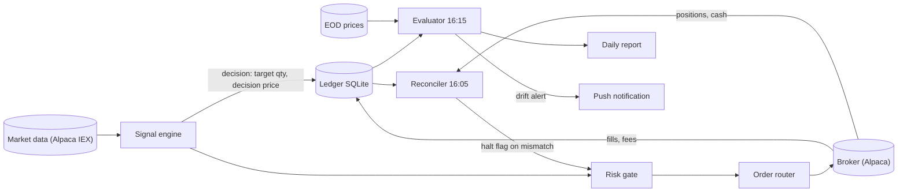
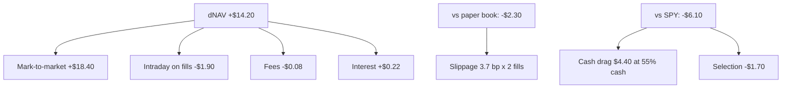
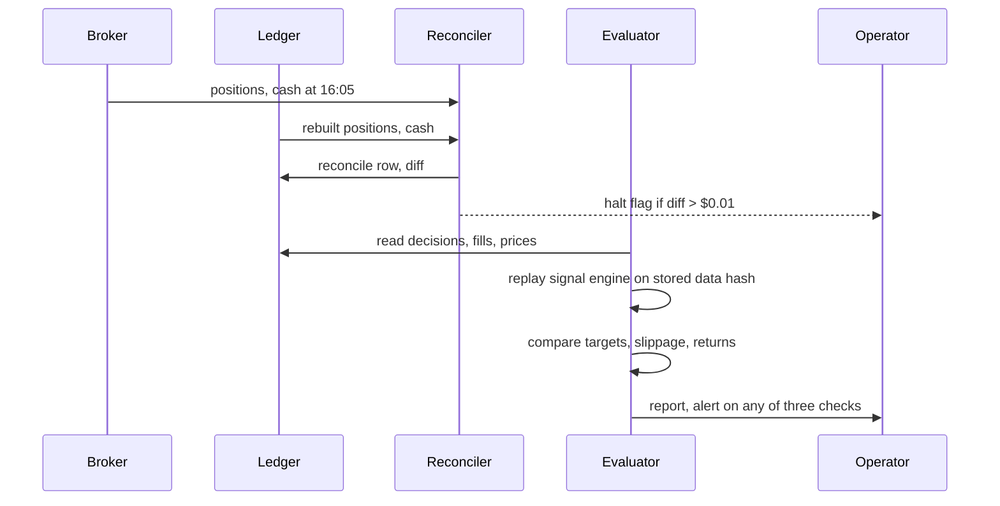

# Mini quant system — DE 19, performance evaluation and statistics

Assumptions: Alpaca paper and live accounts (commission-free, fractional shares, free IEX data), a cash account to avoid the pattern-day-trader rule (T+1 settlement means about half the cash is tradable on any given day), 3 to 5 liquid ETFs, one decision per day at 15:50 ET, orders sent 15:55, marked at the 16:00 close. Everything below holds for an intraday variant with "day" replaced by "bar".

## Requirements

Functional

| # | Requirement | Number |
|---|---|---|
| F1 | Every metric on the dashboard is recomputable from the fills ledger plus a price file, by one script, byte-identical | rebuild < 5 s for 5 years of fills |
| F2 | Daily reconciliation of positions, cash and NAV against the broker | diff must be < $0.01 or trading halts next session |
| F3 | Daily P&L attribution: mark-to-market, slippage, fees, interest, cash drag versus benchmark | posted by 16:30 ET |
| F4 | Live-versus-backtest drift checks: signal match, implementation cost, return residual | signal mismatch = same-day alert |
| F5 | Metric report shows a standard error or a minimum-sample flag next to every estimate | no bare Sharpe ever |
| F6 | Benchmarks: SPY total return buy-and-hold, cash at the account's sweep rate, beta-matched SPY | same start NAV, same dates |

Non-functional

| # | Requirement | Number |
|---|---|---|
| N1 | Ledger is append-only; corrections are reversal rows, never UPDATE or DELETE | 0 mutations |
| N2 | Ledger survives a disk loss | nightly copy off the Mac, 1 file, < 10 MB |
| N3 | Evaluation code never touches the order path; it reads the ledger and prices only | read-only DB connection |
| N4 | Operator can read the daily report in under 2 minutes on a phone | 1 screen, 12 rows |

## Estimates

| Item | Estimate | Working |
|---|---|---|
| Trades | 1 to 3 per day, 250 to 750 per year | 3 to 5 ETFs, daily rebalance, only trade when target drifts > 5% of position |
| Fills ledger size | 750 rows x 200 B = 150 KB per year | trivial; SQLite |
| Daily bars | 5 symbols x 252 x 100 B = 126 KB per year | minute bars for slippage checks: 5 x 390 x 252 x 60 B = 30 MB per year |
| Reports | 1 daily, 1 weekly, 1 monthly | HTML file written to disk, optional push notification |
| Cost | $0 to $3 per month | Alpaca free tier, B2 or iCloud for backups |
| Fees per trade | commission $0; SEC and FINRA fees ~ $0.01 per $1,000 sold; half-spread 0.5 to 2 bp on liquid ETFs | total cost per round trip ~ 3 bp, $0.18 on a $600 position |
| Honest edge | a good retail daily-timeframe strategy nets 3 to 8 bp per trade after cost | 500 trades x 5 bp x $600 = $150 per year, 7.5% on $2,000 |
| Annual vol at full exposure | 12% to 18% | $240 to $360 one-sigma swing on NAV |
| Expected max drawdown of a zero-edge strategy, one year, 15% vol | ~ 19% = $375 | E[MDD] ~ 1.25 x sigma x sqrt(T) for a driftless walk |

The last row is the whole lens in one number: a flat strategy will show a $375 drawdown in a normal year. A $375 drawdown is therefore not evidence of anything.

## High-level design

Main flows

1. Data in: EOD and minute bars land in the prices table with source and fetch time.
2. Signal: engine writes a decision row (target qty, decision price, signal version, data hash) before any order exists.
3. Order out: router sends orders tagged with the decision id; the broker returns fills that are inserted with that id.
4. Reconcile: at 16:05 the reconciler rebuilds positions and cash from the ledger and compares with the broker; any diff sets a halt flag the risk gate reads next morning.
5. Report: at 16:15 the evaluator rebuilds NAV series, attribution, drift checks and metrics from ledger plus prices, writes one HTML page, pushes if a threshold fires.

## Deep dive: performance evaluation and statistics

### The hard part

With $2,000 and a daily strategy the operator will see about 250 return observations a year. The question "does this strategy have an edge" cannot be answered from live P&L in that time. The obvious approach is to run live for a few months, look at the equity curve and the Sharpe, and decide. It breaks because the standard error of a one-year Sharpe is about 1.0, larger than any edge a retail strategy plausibly has.

### Standard error of a Sharpe estimate, the arithmetic

For iid returns (Lo 2002), with SR the per-period Sharpe and n periods:

    SE(SR) = sqrt( (1 + SR^2 / 2) / n )

Annualized Sharpe from daily returns is SR_a = SR_d x sqrt(252). For SR_a = 1, SR_d = 0.063 and SR_d^2 / 2 = 0.002, so the correction is negligible and

    SE(SR_a) ~ sqrt(252 / n)

| Live history | n days | SE(SR_a) | 95% interval around a measured SR of 1.0 |
|---|---|---|---|
| 1 quarter | 63 | 2.00 | -2.9 to 4.9 |
| 1 year | 252 | 1.00 | -1.0 to 3.0 |
| 2 years | 504 | 0.71 | -0.4 to 2.4 |
| 4 years | 1,008 | 0.50 | 0.0 to 2.0 |
| 10 years | 2,520 | 0.32 | 0.4 to 1.6 |

To reject SR = 0 at two-sided 95% when the true SR_a is 1.0 needs n ~ 252 x 1.96^2 ~ 970 days, about 4 years. For a true SR_a of 0.5 it is 4x that, 15 years. Fat tails and autocorrelation make it worse: with skew s and excess kurtosis k, SE^2 = (1 + SR^2/2 - s SR + k SR^2 / 4) / n. Overlapping or multi-day holds reduce the effective n further; use days-in-market as n, not trade count.

Consequence, and the design decision that follows from it: live trading is a validation of the pipeline, not a test of the edge. The edge is inferred from the backtest over 10+ years of data, and the live period is used to check that live behaviour matches the backtest on things that converge fast: signals, costs, exposure, vol. Only after several years does live P&L itself carry weight.

### Metrics and the minimum sample to trust each

"Trust" below means the one-sigma error is small enough that the number would change a decision. Trade-unit metrics assume roughly 1 to 3 trades a day.

| Metric | Formula | SE approximation | Min sample | Notes |
|---|---|---|---|---|
| Total return | NAV_T / NAV_0 - 1 | none, it is arithmetic | 1 day | a fact, not evidence |
| Annualized vol | std(daily r) x sqrt(252) | sigma / sqrt(2n) | 60 days (about 6% relative) | converges fastest; first thing to compare with backtest |
| Sharpe | mean / std x sqrt(252) | sqrt(252 / n) | 1,000 days for SE 0.5 | show the interval, never the point |
| Max drawdown | max peak-to-trough of NAV | no closed form | never, use bootstrap | compare with 1.25 sigma sqrt(T) of a flat strategy |
| Hit rate | wins / trades | 0.5 / sqrt(n) | 400 trades (SE 2.5%) | distinguishing 55% from 50% at 2 sigma needs 400 |
| Avg win / avg loss | mean(win) / mean(loss) | ratio of two heavy-tailed means | 300 trades | one outlier moves it 20% below 100 trades |
| Profit factor | sum wins / sum losses | same as above | 300 trades | |
| Turnover | sum abs(traded notional) / NAV, annualized | deterministic | 20 days | compare with backtest to 10% |
| Exposure | mean abs(position notional) / NAV | deterministic | 20 days | cash drag is derived from this |
| Beta to SPY | OLS slope of r on r_SPY | sigma_e / (sigma_m sqrt(n)) | 120 days for SE ~ 0.15 | needed for the beta-matched benchmark |
| Slippage per trade | (fill - decision price) x side, bp | sigma_slip / sqrt(n), sigma ~ 5 bp | 30 trades (SE ~ 1 bp) | converges fast; the main early check |
| Fees | from ledger | exact | 1 trade | |
| Signal match rate | live target == replayed target | exact | 1 day | any mismatch is a bug |

### Benchmarks that are fair

| Benchmark | Why | How |
|---|---|---|
| Zero | unfair, always looks good in a bull market | never shown |
| SPY buy-and-hold, total return | what the operator could do with no system | same start NAV, dividends reinvested |
| Cash at sweep rate (assume 4%) | what the idle cash earns anyway | daily accrual in the ledger |
| Beta-matched SPY | strategy at 40% exposure should beat 40% SPY, not 100% | beta x SPY + (1 - beta) x cash |
| Random entry, same turnover | isolates cost and timing noise | 100 shuffled-signal runs, report percentile |

### Daily attribution the operator sees

The NAV identity, all terms from the ledger and the EOD price file:

    dNAV = sum(position_open x dPrice)          overnight mark-to-market
         + sum(qty x (close - fill))             intraday P&L on today's fills
         - fees + interest                        exact from ledger

Relative to the paper book that executes the same decisions at decision price with zero cost:

    dNAV_live - dNAV_paper = -slippage - fees     implementation shortfall

Relative to the benchmark:

    excess = r_live - r_SPY
    cash drag = cash_weight x (r_SPY - r_cash)    shown separately, not inside the NAV identity

The daily report is twelve rows: the seven boxes above, NAV, exposure, today's signal match (must be 100%), rolling 30-trade slippage versus backtest assumption, and days since last reconcile mismatch.

### Live-versus-backtest drift, detected early

Three checks, ordered by how fast they converge:

| Check | What | Threshold | Detects in |
|---|---|---|---|
| Signal match | rerun the frozen signal version on the stored data snapshot; targets must equal the decision rows | any mismatch | same day; this catches data, timezone, look-ahead and versioning bugs |
| Implementation cost | rolling 30-trade mean slippage versus backtest assumption (3 bp) | > 2x assumption; with sigma 5 bp and n 30, 6 bp is ~ 3 sigma | 2 to 4 weeks |
| Return residual | CUSUM of (r_live - r_expected) / sigma_backtest, where r_expected is the paper book return | cumulative sum below -4 | 3 to 6 months at best; state this on the report |

The honest line: statistical drift in P&L cannot be seen faster than a quarter. Mechanical drift can be seen the same day, and almost all real failures are mechanical (stale data, wrong session, partial fill, a rebalance that fired twice). So halts are driven by dollar drawdown limits owned by the risk lens, not by statistics.

### The ledger

SQLite, one file, four fact tables, insert-only. Everything else is a view or a recompute.

| Table | Columns | Rule |
|---|---|---|
| decisions | decision_id, ts, symbol, target_qty, decision_price, signal_version, data_hash | written before any order; the backtest replays from data_hash |
| fills | fill_id, order_id, decision_id, ts, symbol, side, qty, price, fee, broker_ref | one row per broker fill; duplicates rejected on broker_ref |
| cash_events | ts, amount, kind "deposit, withdrawal, interest, dividend, fee, correction" | corrections are new rows referencing the original |
| prices_eod | date, symbol, close, adj_close, source, fetched_at | never overwritten; a revised close is a new row with a later fetched_at |
| reconcile | date, ledger_nav, broker_nav, diff, halted | one row per session |

Derived, recomputed on every run: positions, cash, NAV series, daily returns, paper-book NAV, every metric. A weekly job rebuilds the report from scratch on a fresh copy of the file and asserts equality with the served report. Backup is a nightly copy of the file to B2; restore test once a quarter.

## Trade-offs

| Choice | Chosen | Alternative | Why |
|---|---|---|---|
| Unit of analysis | daily returns | per-trade returns | days are equally spaced and comparable to benchmarks; trade counts overstate n for multi-day holds |
| Sharpe reporting | interval, SE beside it | point estimate | a bare one-year Sharpe is noise with two decimals |
| Drift detection | mechanical checks first | statistical tests | mechanical converges in days, statistics in quarters |
| Storage | SQLite insert-only | Postgres, event log, hash chain | one operator, one file, 150 KB a year; a hash chain adds nothing a nightly backup does not |
| Attribution | paper book at decision price | TCA against VWAP | decision price is what the backtest assumed; VWAP is a different question |
| Benchmark | beta-matched SPY | raw SPY | a 40% exposed strategy losing to 100% SPY in a bull year is not information |

## Pitfalls

- Multiple testing: if the operator tried N strategy variants in backtest, the expected best Sharpe from pure noise is about SE x sqrt(2 ln N). With 10-year backtests SE is 0.32, so 20 variants yield an expected best of 0.8 from nothing. Record N, report the deflated Sharpe, and stop iterating on the same data.
- Survivorship in the ETF list and in the operator's memory of what was tried.
- Reporting metrics on paper-trading fills: Alpaca paper fills at the quote with no impact, so slippage looks like zero. Paper trading validates plumbing, not cost.
- Marking with a different close than the signal engine used, making the backtest and live diverge by construction.
- Annualizing a two-month Sharpe.
- Max drawdown quoted without the flat-strategy expectation beside it.
- Dividends and cash interest left out of the strategy but included in SPY, or the reverse.
- Counting the halt days as zero-return days in vol, understating it.

## Open questions for the panel

1. Should the halt on reconcile mismatch be automatic or a notification with a manual resume, given no one is watching intraday?
2. Which lens owns the dollar drawdown limit that actually stops trading, and should the evaluator's CUSUM feed into it or stay advisory?
3. Do we require a paper-trading period of fixed length (60 days covers vol and slippage) before live, or a fixed number of signal-match days?
4. Is the strategy allowed to change during the live evaluation period, and if so does the clock reset?
5. Is a 4% cash sweep rate available on this broker, or should the cash benchmark be BIL held in the account?

## Non-negotiables

1. Every number on the report is rebuilt from the insert-only fills, decisions, cash and price tables by one script; if the served report and the rebuild differ, the report is wrong.
2. Every estimated metric carries a standard error or a minimum-sample flag; no bare Sharpe, hit rate or drawdown is shown.
3. Decision rows with a data hash and signal version are written before orders, so the live signal can be replayed and diffed every day; a mismatch is an alert, not a metric.
