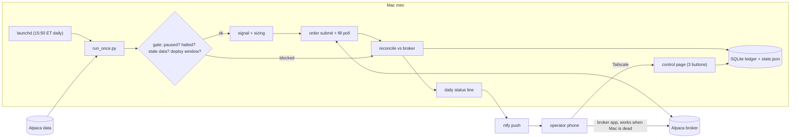
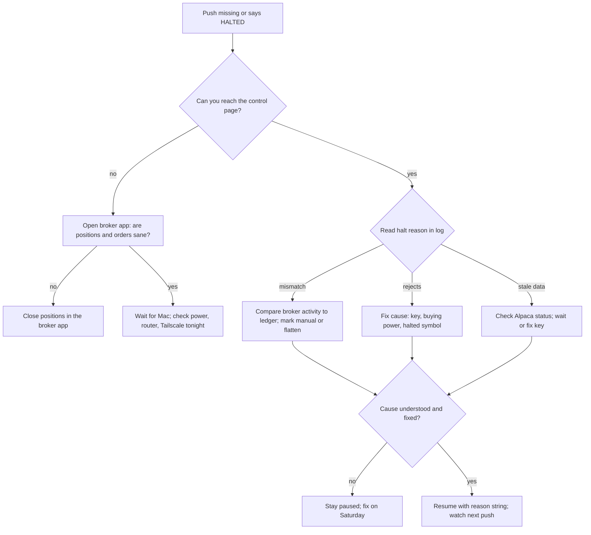

# Mini quant system — DE 20, operations and the human in the loop

Assumptions: Alpaca cash account (no margin, no PDT), US ETFs, one decision per day at 15:50 ET, long-only, Python on launchd, SQLite ledger, phone access over Tailscale, push alerts over ntfy. The operator has a day job and checks the phone at breakfast.

## Requirements

Functional

| # | Requirement | Number |
|---|---|---|
| F1 | One daily decision window; no orders outside it | 15:50 to 15:58 ET |
| F2 | Broker is source of truth for positions and cash; ledger is a cache | reconcile after every order and at 16:10 ET |
| F3 | Three phone controls: pause, flatten, resume | each works in under 30 seconds |
| F4 | Every halt is sticky; only a human resumes | 0 auto-resumes, ever |
| F5 | Daily status push with one-line verdict | 1 message per day, by 16:30 ET |
| F6 | Deploys refuse to run during market hours | window locked 09:25 to 16:05 ET |
| F7 | Strategy retirement rules pre-registered before go-live | written in the strategy file, versioned |

Non-functional

| # | Requirement | Number |
|---|---|---|
| N1 | Safe to ignore for 7 days: worst case is bounded, no action required | max loss with no human touch: 10% of account ($200) |
| N2 | Daily checklist under 5 minutes; weekly review under 30 | measured on the phone |
| N3 | Every automatic action leaves a log line the operator can read in one glance | 1 line, human words, no stack traces |
| N4 | Recovery from reboot, crash, or network loss needs no operator | launchd restarts within 60 s; missed window is skipped, not replayed |
| N5 | Manual override works even if the Mac mini is dead | via the broker's own phone app |

## Estimates

| Item | Estimate | Note |
|---|---|---|
| Instruments | 3 to 5 ETFs | SPY, QQQ, IEF, GLD class |
| Data | 5 bars per day, 400 bytes each; 2 KB/day, under 1 MB/year | free Alpaca IEX feed |
| Requests to broker | about 20 per day | quotes, submit, poll fills, positions, account |
| Trades | 1 to 3 per week, 60 to 150 per year | daily rebalance with a deadband |
| Cost per trade | $0 commission, 1 to 2 bps half-spread on $500 clip: about $0.10 | slippage at 15:50 on liquid ETFs is small |
| Fees per year | $10 to $30 | rounding error |
| Monthly running cost | under $5 | electricity about $2, ntfy and Tailscale free tiers |
| Honest edge | 0 to 5% per year on $2,000, so $0 to $100 | below noise; 1 year of live data cannot prove it |
| Operator time | 5 min/day, 30 min/week, 2 h per incident | about 60 h/year, the real cost |

The operator's hourly rate is the biggest line item. The system has to be cheap in attention, not in dollars.

## High-level design

Main flows

| Flow | Steps | Failure default |
|---|---|---|
| Data in | 15:48 fetch daily bars and last quote; reject if newest bar older than 26 h or quote older than 60 s | skip today, log "stale data", push alert |
| Signal | target weights from strategy; deadband 5% so most days produce no order | no order |
| Order out | limit orders at the touch, 5 minute time-in-force, then cancel; never market | unfilled is fine, retry tomorrow |
| Reconcile | broker positions and cash vs ledger; any mismatch beyond 1 share or $5 halts | halt, sticky, alert |
| Report | one push: "OK / HALTED / PAUSED, equity $x, day P&L, positions, next action" | if the report itself fails, the missing message is the alert |

State lives in one file, `state.json`: `{mode: run|paused|halted, reason, since, strategies: {name: active|retired}}`. Every gate reads it; every control writes it.

## Deep dive: operations and the human in the loop

The hard part: the operator is the single point of failure and is unavailable 23 hours a day. The obvious approach is a dashboard, Grafana, alerts on everything, and a runbook wiki. It breaks because the operator stops reading after week two, alerts train them to ignore alerts, and the dashboard never gets opened during the one incident that matters. What I do instead: shrink the system's asks on the operator to one message a day and three buttons, and make silence safe.

### Manual override from a phone

| Control | What it does | Implementation | Time to effect |
|---|---|---|---|
| Pause | no new orders; existing positions held; cancels open orders | writes `mode=paused` to state.json | next gate check, under 10 s |
| Flatten | cancels all open orders, sells every position at limit at bid, then market after 2 minutes if unfilled; sets `mode=halted` | `flatten.py`, same function the auto-halt uses | under 3 minutes in market hours; queued for open otherwise |
| Resume | `mode=run`, requires typing the reason string from the halt | writes state.json and a resume log line | immediate |

The control page is a single HTML page with three buttons served on the Mac, reachable only over Tailscale, no auth beyond the tailnet. Fallback when the Mac is unreachable: the Alpaca phone app. Because the broker is the source of truth and reconcile treats any position the bot did not place as a mismatch, closing positions in the broker app halts the bot safely on its next run. That is the override that always works, and the one I would test first.

### Safe to ignore for a week

Rules that make silence safe:

1. All halts are sticky. Nothing resumes itself, not after a reboot, not after a network return.
2. Hard limits live in code, not config: max 100% of equity invested, max 40% per instrument, max 3 orders per day, max 2% of equity notional per order beyond target, long only. The strategy cannot ask for more than this.
3. A missed window is skipped, never replayed. Ten missed days means ten skipped days, not ten stacked orders.
4. No human ack for 5 trading days: mode flips to `paused`. Positions are held, not sold. Selling on a timer would turn a holiday into a forced exit.
5. Worst case over 7 untouched days: fully invested in liquid ETFs with a daily drawdown halt at 10% of equity. The halt does not need the operator; it flattens on its own.

The ack is the operator opening the daily push. If ntfy delivery is on and the message is never opened, the system assumes nobody is watching.

### Daily five-minute checklist

| Min | Check | Pass looks like |
|---|---|---|
| 1 | Open the 16:30 push | starts with "OK", equity number is close to yesterday |
| 2 | Compare push positions to the broker app | same tickers, same share counts |
| 3 | Glance at the one log line for the run | "no order", or one fill line with price |
| 4 | Scan for a second push | none; a second push means something halted |
| 5 | Nothing else | close the phone |

If step 1 shows no message at all, that is the incident. Missing report is treated as broker or machine down.

### Weekly review, 30 minutes, Saturday

| Item | Question | Threshold to act |
|---|---|---|
| Equity curve | live P&L vs paper account running the same code | gap over 1% of equity per week for 2 weeks: investigate slippage or bug |
| Fill quality | average fill vs quote at decision time | worse than 5 bps: change limit logic |
| Halts and skips | how many, why | any halt without a known cause: block resume until understood |
| Mismatches | reconcile diffs, even the ones under threshold | any recurring diff: fix before Monday |
| Machine | disk, macOS update pending, launchd job loaded, Tailscale online | fix on Saturday, never on a weekday |
| Retirement rules | evaluate every strategy against its pre-registered stop rules | rule hit: retire, no debate |

### Incident runbook

Detection is the same path for all five: the daily push is missing, or it starts with HALTED.

| # | Failure | Auto action | Operator action | Done when |
|---|---|---|---|---|
| 1 | Broker rejects orders | 2 rejects in a window: halt, sticky | read reject reason in log; typical causes are buying power, symbol halted, API key expired; fix cause; resume | one dry-run order at 1 share fills |
| 2 | Data feed stale | skip window, push "stale data"; 3 consecutive skips: pause | check Alpaca status page; if outage, wait; if key or code, fix and deploy Saturday | fresh bar timestamp in log |
| 3 | Machine rebooted | launchd reloads job; if reboot falls inside the window the run is skipped; reconcile at 16:10 still runs | confirm Tailscale is up and control page loads; check disk and FileVault login | next day's push arrives |
| 4 | Position mismatch | halt, sticky, push both sides of the diff | decide which side is right using the broker's activity list; if human trade, mark it manual; if bot bug, flatten and fix | reconcile clean for 2 days before resume |
| 5 | Internet down | run fails at fetch; skip window; open orders expire by time-in-force | nothing during the outage; on return, one reconcile runs and pushes | push arrives; no orders were placed blind |

### Upgrade procedure without trading through a deploy

| Step | Rule |
|---|---|
| When | Saturday only; `deploy.sh` exits non-zero between 09:25 and 16:05 ET on weekdays and whenever mode is `run` with open orders |
| Dependencies | pinned lockfile; upgrade one package at a time; pip audit and pytest must pass |
| Replay test | `run_once.py --replay 2026-09-03` on last week's data; output must match the recorded decisions exactly |
| Paper first | any strategy or sizing change runs in the paper account 10 trading days before live; same code, same schedule |
| Cutover | `git tag`, `launchctl unload`, install, `launchctl load`, run reconcile, read the log line |
| Rollback | previous tag checked out; state.json untouched; under 5 minutes |
| macOS | auto-update off; apply on Saturday; reboot; confirm launchd job and Tailscale before Monday |

### When to stop a strategy for good

Retirement rules are written into the strategy file before the first live order, so the decision is made by the calm version of the operator.

| Rule | Threshold | Why this number |
|---|---|---|
| Drawdown | 15% from peak on the strategy's allocation | on $2,000 that is $300, the cost of finding out |
| Time without edge | 120 trading days with cumulative P&L below fees | six months is the shortest window that says anything at 2 trades a week |
| Backtest divergence | live 60-day return below the 5th percentile of bootstrapped backtest paths | the backtest is the hypothesis; this is the rejection |
| Slippage | realised fill cost over 3x the modeled cost for 20 trades | the edge was in the model, not the market |
| Understanding | operator cannot explain a losing week in one paragraph | a strategy you cannot explain you cannot fix |

A retired strategy stays in the repo with a `retired.md` next to it stating the rule that fired and the equity curve. It never comes back without a new paper run.

## Trade-offs

| Choice | Chose | Over | Cost |
|---|---|---|---|
| Control plane | state.json plus 3-button page | REST API with auth | no remote scripting; acceptable for one operator |
| Silence policy | pause after 5 unacked days, hold positions | flatten on timer | held positions can drop; flattening on a holiday is worse |
| Deploy | Saturday only, hard-blocked | rolling deploy any time | slower iteration; one window a day makes speed pointless |
| Alerts | one push a day, second push means trouble | alert per event | slower detection of non-halting oddities; caught weekly |
| Override fallback | broker app closes positions | second machine | bot halts on mismatch instead of continuing; fine |
| Retirement | fixed rules, pre-registered | judgment calls | may retire a good strategy on bad luck; cheaper than the reverse |

## Pitfalls

- Alert fatigue: more than one push a day and the operator stops reading within a month. Keep it to one.
- Auto-resume creeping in: someone adds "resume after network returns" and one day it resumes into a broken ledger. F4 is a code review rule.
- The control page as the only override: test the broker-app fallback on day one, with the Mac unplugged.
- Replaying missed windows: seems helpful, stacks orders after an outage.
- macOS auto-updates rebooting at 15:52 ET. Turn them off; the Saturday step covers them.
- Reconcile that compares only totals: a wrong ticker with the right dollar value slips through. Compare per instrument.
- Halting on every mismatch including dividends and fractional-share rounding: define the mismatch threshold ($5, 1 share) and log the small ones for the weekly review instead.

## Open questions for the panel

1. Should the unattended default after 5 unacked days be pause-and-hold, or flatten? I chose hold; the risk lens may disagree.
2. Is the 15:50 ET single window enough for the strategy lens, or do they need intraday, which would break the "one push a day" model?
3. Who owns the mismatch threshold: operations ($5, 1 share) or the reconciliation lens?
4. Is a paper account running the same code worth its maintenance cost, or should divergence tracking use a replay of live data instead?
5. Does the broker lens accept limit-then-market for flatten, or do they want limit-only with a human decision?

## Non-negotiables

1. Every halt is sticky and only a typed human resume clears it. No auto-resume path exists in the code.
2. Manual override works with the Mac mini switched off: the broker app closes positions, and the bot treats the result as a halt, not a mismatch to correct.
3. Retirement rules for each strategy are written and committed before its first live order.
