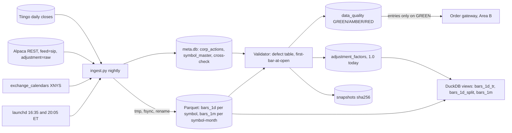
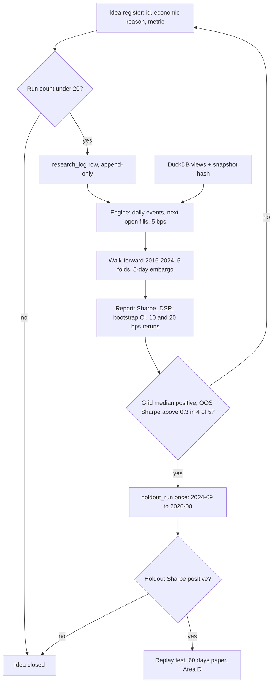

# Area A: data and research — lead review

Scope: market data ingestion (01), backtesting engine (03), strategy families (12), research discipline (13), data quality and corporate actions (14). Everything below is reconciled against the brief: one operator, one Mac mini, $2,000, daily timeframe, honest edge $0 to $160 per year. Area letters used below: B is Execution and risk, C is Platform, D is Operations and evaluation.

## Engineers

- **01, market data ingestion.** Lens: the store must be correct under reruns, crashes and vendor corrections. Contribution: whole-partition atomic writes (tmp, fsync, rename) instead of cursors and upserts, plus the fact that Alpaca's free REST tier returns consolidated SIP bars once 15 minutes old.
- **03, backtesting.** Lens: a backtest is a machine for producing convincing lies. Contribution: one engine loop shared by backtest, paper and live, with a 20-day replay test that must produce zero order diffs, and a run record that makes every result reproducible bit for bit.
- **12, strategy families.** Lens: at $2,000 the strategy is killed by PDT, granularity and statistical power, not fees. Contribution: a fully specified reference strategy, `mom_top3`, with 2 conventional parameters, 11 symbols and 12 decisions a year, so every other lens has something concrete to size against.
- **13, ML skeptic.** Lens: daily SNR is 0.03, so 1,000 variants on noise yield a Sharpe 1.2. Contribution: the research log row that must exist before a backtest runs, the sealed holdout read once per idea, and the deflated Sharpe printed beside every Sharpe.
- **14, data quality and corporate actions.** Lens: a price is a number plus conventions, and feeds change conventions silently. Contribution: the per-symbol, per-session GREEN/AMBER/RED status that the order gateway reads before every entry, and the defect table with numeric thresholds.

## Consensus

- Prices are stored raw and unadjusted; adjustment is derived at read time from a separate corporate-actions table (01, 03, 13, 14; 12 consumes adjusted bars but does not care where they come from).
- Data costs $0 per month; any paid feed at $29 to $99 per month exceeds the plausible annual edge by 2 to 6 times and is rejected (all five).
- Daily bars are the primary and only trading timeframe in v1; intraday data is for execution analysis, never for signals (all five).
- The strategy is a pure function shared byte-for-byte by backtest, paper and live, returning target weights, not orders (03, 12, 13, 14).
- Fills happen at the next session's open, never at the signal bar's close, and a non-zero cost model is on by default (03, 12, 13).
- Every backtest run records a data snapshot hash, code version and full parameters, and an identical rerun reproduces it exactly (03, 13, 14).
- All timestamps are UTC; the session date is a separate column derived from the NYSE calendar via `exchange_calendars`, never by truncating a timestamp (01, 03, 14).
- Bad data fails closed: a symbol that fails validation cannot be the subject of a new entry order (01, 13, 14).
- Free parameters are capped at 3 and the number of variants tried is recorded so multiplicity can be deflated (03, 12, 13).
- The strategy sees only completed sessions, never today's partial bar; the signal is computed after 18:00 ET from the final close (03, 12, 13).
- Scheduling is launchd in America/New_York, not cron or a long-lived process, and the job rechecks the calendar so a holiday fire is a no-op (01, 12, 14).
- The product is knowledge of whether an edge exists, not the $20 to $120 per year it might earn; one year of live trading confirms the plumbing, not the edge (03, 12, 13, 14).

## Disagreements and resolutions

### Storage format and layout

- 01 and 03: Parquet files as the system of record, DuckDB as the reader. Whole-file replace is the idempotency mechanism, a 30M-row scan is under 1 s versus tens of seconds in SQLite, and Parquet's format has never broken across releases while DuckDB's file format has.
- 01: 1-minute bars partitioned by symbol-month (about 8k rows, one vendor page), daily bars one file per symbol. 03: one file per symbol per year.
- 14: SQLite in WAL mode for everything. One file, backups are a file copy, 100 MB per year, and append-only tables with triggers give an immutability guarantee that files do not.
- 13: an append-only SQLite research log with a trigger rejecting UPDATE and DELETE, and the holdout in a separate DuckDB file the research process opens read-only.

**Resolution:** Bars go in Parquet, everything row-shaped and small goes in one SQLite file. Parquet for `bars_1d` (one file per symbol, 8 MB total) and `bars_1m` (one file per symbol-month, about 8k rows each), written atomically per 01. SQLite `meta.db` in WAL mode holds `corp_actions`, `symbol_master`, `adjustment_factors`, `data_quality`, `snapshots`, `research_log` and `idea_register`, with 13's append-only triggers on the log tables. DuckDB reads both through its built-in sqlite scanner and exposes the adjusted views. This keeps 01's idempotency for the only large dataset and 13's and 14's append-only guarantees for the tables where a silent UPDATE is the failure mode. 03's symbol-year partition is rejected: a vendor correction would rewrite 100k rows, and month is one vendor page.

### Adjustment mechanics

- 01: cumulative factor computed inside a DuckDB view at query time from `corp_actions` ordered by ex-date descending; nothing materialised, so a new split changes one table and every adjusted number follows.
- 14: `adjustment_factors` materialised nightly, backward, ending at 1.0 today so the latest adjusted price equals the raw quote at the order boundary; two series, total-return for P&L and split-only for price-level rules, because dividend adjustment shifts levels a few basis points every quarter.
- 12: needs total-return closes; TLT and IEF pay monthly, and unadjusted momentum scores drift 1 to 4 percent a year and flip rankings.
- 13: adjusted levels should not be exposed to research at all because factors are computed from future splits and dividends; restrict features to returns and ratios.

**Resolution:** 14's design, with one addition from 03. Factors are materialised nightly and snapshot-hashed. Two views exist: `bars_1d_tr` (total return) and `bars_1d_split`. Strategies receive `bars_1d_tr`; ratios of two total-return prices are leakage-free because factors from actions after time t cancel, so `mom_top3`'s score is safe. Price levels are not leakage-free, so any strategy that uses a level (52-week high, dollar thresholds) must declare `series=split` in its register row and use `bars_1d_split`. 03's indicator truncation test is extended: for 50 random dates t it recomputes factors as of t and compares the strategy's output to the full-history run; any difference fails the build. That test, not a policy, is what enforces 13's concern.

### Universe and reference strategy

- 01: store 10 to 30 liquid ETFs and large caps; whole-market daily bars optional at 1.6 GB.
- 03: trade 20 names, store 100 for research; delisted names kept with a minus 100 percent delisting return, or the run is labelled survivor-only.
- 12: trade exactly 10 risk ETFs plus BIL, chosen for over $100M daily volume and under 3 bps spread, fixed before looking at returns; reference strategy `mom_top3`, second candidate RSI(2) on SPY.
- 13: 100 large caps, with the admission that today's 100 all survived and grew, so any buy-the-dip rule wins in-sample.
- 14: 8 ETFs plus at most 4 single stocks; single stocks require a point-in-time constituent list in `symbol_master`, which nobody budgeted.

**Resolution:** Traded universe is 12's 11 symbols, fixed before any return is looked at. Stored universe is 30 symbols (the 11 plus IEF, VNQ, sector ETFs and 8 large caps) so the second candidate and future ideas have data on day one without a backfill. Single stocks are not tradeable in v1; the research API labels any single-stock run `survivor_only=true`, which blocks graduation. Reference strategy is `mom_top3` as 12 specified: 126-bar total-return score, top 3 above BIL, 1/3 each, monthly. Second candidate is 12's RSI(2) mean reversion on SPY, valued because 30 to 50 trades a year tests the slippage assumption in one quarter. 03's 100-symbol and 13's 100-large-cap universes are rejected: they cannot be traded at $400 per slot and they import a survivorship problem the budget cannot fix.

### Parameter caps and multiplicity accounting

- 12: at most 3 free parameters, each a literature convention, not a search result; a neighbourhood grid (4 lookbacks x 3 N = 12 cells for `mom_top3`) recorded before paper, median neighbour positive or the strategy is rejected.
- 03: at most 3 parameters; 500-config vectorised sweeps allowed; `sweep_size` in the run record feeds a deflated Sharpe; a Sharpe of 1.5 from the best of 500 is not a Sharpe of 1.5.
- 13: 20 variants per idea, hard limit in code, every window change counts; deflated Sharpe above 0.95 and bootstrap CI excluding 0 to pass; at N equals 20 and T equals 8 the noise ceiling is Sharpe 0.87.
- The conflict: a 500-config sweep is 25 times 13's cap, and 12's grid alone is 12 of 13's 20.

**Resolution:** Three numbers, each with a job. Free parameters: at most 3 per strategy. Logged runs: at most 20 per idea, enforced by the register; a run may contain a sweep, and the register refuses a 21st run. Deflated Sharpe: computed from the total configurations across all runs of the idea, so a 500-config sweep counts 500 and at T equals 8 years the noise ceiling is Sharpe 1.25, which is the self-correcting reason nobody will run one. 12's neighbourhood grid is one run of 12 configs, declared before the chosen cell is fixed, and is the only sweep `mom_top3` will ever have. Acceptance is a robustness bar, not a significance bar: 12's own estimate is 16 years to a t-statistic of 2, so 13's "bootstrap CI excludes 0" would reject every honest strategy on this data. The CI is printed on every report; it is not a gate.

### Backtest engine style

- 03: own engine, about 600 lines, two modes. Vectorised (50 ms) for sweeps, event-driven (0.8 s after optimisation) for validation and as the live loop, with an agreement test that fails if returns differ by 1 percent or trade counts by 5 percent. Strategy is `on_bar(ctx)` and cannot import polars, datetime, requests or alpaca.
- 12: strategy is `target_weights(bars, held)` on a pandas DataFrame, pure, about 20 lines for the reference; `held` passed in so hysteresis needs no hidden state.
- 13: the runner's only entry point takes a research-log row id; there is no importable `backtest()` function to route around the log.
- All three reject Backtrader, vectorbt and Zipline because the backtest loop must be the live loop.

**Resolution:** One engine, event-driven at daily granularity, one event per session carrying all symbols. 03's own table shows this runs 252k bars in 0.8 s; a 500-config sweep on 8 cores is 50 s, inside 03's 60 s target, so the vectorised engine and its agreement test are dropped from v1 and every result comes from the one code path that trades live. Interface is 12's: `target_weights(bars, held) -> dict[str, float]`, bars a pandas DataFrame of the last `lookback_bars` completed sessions from `bars_1d_tr`, weights in [0, 1] summing to 1.0. The strategy may import pandas and numpy only; 03's lint blocks everything else. The runner's only entry point takes a `run_id` from 13's register. Own engine over Backtrader, vectorbt or Zipline because the same loop must be the paper and live loop.

### Data source and cross-check

- 01: Alpaca REST with `feed=sip`, consolidated once 15 minutes old, is the primary; Tiingo free cross-checks daily closes at 0.1 percent; Databento is a possible one-off audit; yfinance is notebook-only.
- 12, 13 and 14: all assumed Alpaca daily bars are IEX-only (2 to 3 percent of volume) and can differ from consolidated closes by a few cents. 12 asked whether that breaks RSI(2); 13 called it irrelevant at a daily horizon.
- 14: cross-source mismatch is AMBER above 0.5 percent, or above 0.1 percent for 3 sessions running; RED if it repeats.
- 01's own open question: should the cross-check be Tiingo (free, rate-limited) or a one-off Databento pull (paid, complete)?

**Resolution:** Alpaca REST with `feed=sip` and `adjustment=raw` for daily and 1-minute bars, so the IEX-close concern is moot for both `mom_top3` and RSI(2). Tiingo free is the cross-check, daily closes only, 11 symbols, well inside 50 requests per hour. Thresholds: AMBER above 0.1 percent (01's number, appropriate because both sides are consolidated), RED above 0.5 percent or three consecutive AMBERs (14's escalation). Databento is deferred: a daily strategy does not need 1-minute history before 2016, and the $125 credit is kept for an audit if the cross-check ever disagrees persistently. yfinance is notebook-only, never in the pipeline.

### Minute bars, intraday polling and failure severity

- 01: 8 or more years of 1-minute bars for 30 symbols, about 600 MB, regular hours only, pulled nightly; never forward-fill in storage.
- 03: 2 years of 1-minute bars for 20 symbols, used to measure the 09:30 to 09:35 spread for per-symbol slippage overrides.
- 14: poll intraday every 60 seconds, forward-fill missing minutes with a synthetic flag, stale-feed AMBER at 3 minutes.
- 13: minute bars are not needed for a daily strategy at all.
- Failure severity: 01 writes a flag file and the signal skips the symbol; 13 sends zero orders on anything unexpected; 14 distinguishes GREEN, AMBER (exits only) and RED (exits plus alert), with global RED stopping everything except the loss-cap flatten.

**Resolution:** 1-minute bars: 2 years, 11 traded symbols, regular hours, pulled nightly with `feed=sip`, about 2.2M rows and 45 MB. Their only jobs are measuring realised slippage against the 09:30 to 09:35 spread and feeding 03's per-symbol slippage override. No intraday polling in v1; the free IEX websocket heartbeat belongs to Execution's kill switch and never reaches the store. Severity: 14's three states. AMBER and RED allow exits because `mom_top3` exits are weight-0 targets and blocking them is a larger loss than missing an entry. Forward-fill is rejected in storage (01) and unnecessary without intraday execution; if a minute is missing the slippage report says so.

## Open questions, answered

**01.1 Regular hours only or extended?** Regular hours only. Orders go out at 09:31 ET as market orders and fractional orders at Alpaca are regular-hours-only anyway, so pre-market prices change nothing. Extended hours would double storage and change every gap rule for no consumer. Execution and risk may reopen this if it wants a pre-market reference price.

**01.2 Is 15-minute-delayed consolidated data enough for intraday work?** Yes, because there is no intraday strategy in v1 and the 09:31 order uses the broker's live quote, not our store. The strategy lens's second candidate, RSI(2), still signals at the close and fills at the next open.

**01.3 Fixed 30 symbols or whole-market daily bars?** Fixed 30 stored, 11 traded. Whole-market bars make survivorship a real task and no strategy in the plausible table can use 8,000 names at $400 per slot.

**01.4 Who owns corporate-actions correctness?** Data owns the `corp_actions` table, the cross-source dividend check and the nightly factor build (14's design). Backtest owns as-of application of those factors and the truncation test that proves it.

**01.5 Tiingo or Databento for the cross-check?** Tiingo, daily closes, free. Databento deferred to an audit role if the cross-check ever disagrees for more than 3 sessions on more than 1 symbol.

**03.1 T+1 cash account or margin with a PDT counter?** Owned by Execution and risk. The engine models whichever is chosen; the ledger tracks unsettled cash by default until the chair decides.

**03.2 Delisted-symbol source for single stocks?** No subscription. ETFs only in year one; single-stock runs are labelled `survivor_only` and cannot graduate.

**03.3 Risk gate inside the engine loop or a separate process?** Owned by Execution and risk. Data's requirement is only that the gateway reads `data_quality` before every entry, wherever it lives.

**03.4 Is 1 percent per month tracking error the right graduation bar?** Owned by Operations and evaluation. Data's stronger check is 03's 20-day replay with zero order diffs; for a monthly strategy that replay covers at most one signal day, so the paper period must span at least 3 signal days.

**03.5 Who reviews a graduation decision with one operator?** Owned by Operations and evaluation. The research side supplies the checklist artefacts: neighbourhood grid, DSR, holdout row, replay diff count, all committed.

**12.1 Refuse day trades outright or count to 2?** Owned by Execution and risk. Data's note: `mom_top3` never sells what it bought the same session, so refusing outright costs nothing.

**12.2 One live and one paper, or two paper?** Owned by Operations and evaluation. Research view: one strategy in paper at a time, because two paper strategies invite comparing backtests instead of learning the plumbing.

**12.3 Who owns the neighbourhood-grid check?** The backtester. The register's `promote_to_paper` call refuses unless a grid run with `median_sharpe > 0` exists for the idea. Manual steps done alone get skipped, so there is no manual step.

**12.4 Are IEX closes acceptable for a 126-bar score and for RSI(2)?** Moot: daily bars are pulled with `feed=sip` and are consolidated. Both strategies see the same close a Bloomberg terminal would.

**12.5 Drop DBC for its 5 bps spread?** Keep it. At a $667 slot 5 bps is $0.33 per trade, and the universe was fixed before returns were seen; changing it now is a parameter search. Execution may veto on fill quality after 60 days of paper.

**13.1 Time-based or symbol-based holdout?** Time-based, last 24 months (2024-09 to 2026-08), sealed in a separate file. Symbol-based is meaningless with an 11-symbol traded universe, and the real holdout is the 60 paper days that have not happened yet.

**13.2 Flat 20-variant cap or a per-rung budget?** Flat cap of 20 logged runs per idea, with the deflated Sharpe computed from total configurations tried. A rung-2 ridge model burns the same 20; the DSR does the shrinking.

**13.3 Accept survivorship in a 100-name universe for v1?** Neither: the universe is ETFs, where the effect is stated as an assumption and is small. Point-in-time lists are not built until a single-stock idea is registered and the operator has 6 months of live plumbing.

**13.4 Who validates the written economic reason?** Owned by Operations and evaluation. Data's mechanism: the reason is a required field in the register row, is in git, and is printed at the top of the daily report while the idea is in paper. A cooling-off period for one operator is theatre; the printed reason is not.

**13.5 Can the anomaly detector halt trading on its own?** For data: yes, at the entry gate only. A RED symbol cannot be entered; exits stay open. Whether a P&L anomaly halts the whole book is Execution and risk.

**14.1 Should the loss-cap flatten bypass a global RED?** Owned by Execution and risk. Data's input: the flatten prices off the broker's live quote, not our store, so suspect stored data does not make the flatten suspect.

**14.2 Is a point-in-time constituent list worth maintaining?** No, not in v1. ETF-only until an edge has survived 6 months of live trading; see 13.3.

**14.3 Which second source for the daily cross-check?** Tiingo free tier, daily closes only. Its adjusted close divided by its cumulative factor gives a raw close to compare against Alpaca SIP.

**14.4 Late-arriving corporate action: invalidate or mark stale?** Mark stale automatically, never delete. Every run whose snapshot range covers the ex-date gets `stale=true` in the log; graduation is blocked while any run in the idea's chain is stale, and the operator reruns from the same register row so the count does not increase.

**14.5 Stricter stale-feed threshold for the ETF core?** Owned by Execution and risk; there is no intraday polling in the data design, so the only stale-feed detector is the IEX heartbeat in the kill switch.

## Non-negotiables for this area

1. Raw unadjusted bars are the only prices on disk; adjustment factors live in a separate table and are applied only in read-time views (01, 14).
2. Every partition write is whole-file and atomic via temp file, fsync and rename; there are no cursors and no upserts, and any job can be rerun any number of times (01).
3. A validation pass runs after every ingest, writes a per-symbol, per-session GREEN/AMBER/RED row, and the order gateway refuses position-opening orders on anything but GREEN (01, 14).
4. All timestamps are stored UTC, session dates come from the exchange calendar, and the first-bar-at-open assertion runs every session to catch DST shifts (01, 14).
5. One engine loop serves backtest, paper and live, the strategy is a pure `target_weights(bars, held)` function shared byte-for-byte, and the 20-day replay test produces zero order diffs (03, 12).
6. Fills are at the next session's open with a non-zero cost model of 5 bps per side on by default, and every result is rerun at 10 and 20 bps (03).
7. Every run has a record with data snapshot hash, git commit, full parameters, seed and sweep size, and an identical rerun reproduces it bit for bit (03, 13, 14).
8. No backtest runs without a research-log row created first, and the log is append-only with triggers rejecting UPDATE and DELETE (13).
9. The 24-month holdout is sealed in a separate file, read once per idea by a function that refuses the second call, and is followed by at least 60 trading days of paper (13).
10. A deflated Sharpe and a bootstrap confidence interval are printed wherever a Sharpe is printed; a raw Sharpe alone is blocked from any report (13).
11. At most 3 free parameters per strategy, each a published convention, and the neighbourhood grid is recorded before the strategy enters paper (12).
12. Long only, no leverage, at most 5 positions, no day trades, enforced by the engine's risk layer and not by the strategy (12; enforcement is Execution and risk's).

## Recommended design for this area

The pipeline is one Python file with three subcommands, no orchestrator, no queue. launchd fires `ingest.py nightly` at 16:35 and 20:05 ET on a Mac set to America/New_York with sleep disabled. It asks `exchange_calendars` whether today was a session, pulls the last 5 sessions of daily bars and the current month of 1-minute bars for the 30-symbol stored universe from Alpaca REST with `feed=sip` and `adjustment=raw`, pulls corporate actions, and pulls 11 daily closes from Tiingo. Each Parquet partition is written to a temp file, fsynced and renamed; the nightly job rewrites the current month so vendor corrections arrive for free. Corporate actions, the symbol master and the cross-check closes go into `meta.db`.

The validator then runs 14's defect table: bar count against the calendar's 390 or 210 minutes, OHLC consistency, 8-sigma isolated spikes, 15 percent level shifts with no action on file, split-ratio signatures, cross-source mismatch, first-bar-at-open, duplicates. It writes one `data_quality` row per symbol per session and rebuilds `adjustment_factors` backward from `corp_actions` so the factor is 1.0 today. It ends by writing a `snapshots` row with the SHA-256 over the raw rows and actions in scope, and one summary line to the log. DuckDB exposes `bars_1d_tr`, `bars_1d_split` and `bars_1m` as views over Parquet joined to `meta.db`; strategies, the engine and the report read only those views.

Research starts at the register, not at a notebook. An idea gets an id, a one-paragraph economic reason and a declared metric. Each run is a row before it executes, carrying idea id, variant number, code hash, params, snapshot hash and sweep size; the register refuses run 21. The runner loads bars once into dense arrays, walks 2016-09 to 2024-08 one session at a time, calls `target_weights` with bars up to and including that session's close, converts weights to orders with the cash, lot and settlement rules, fills at the next open minus 5 bps and fees, and reruns at 10 and 20 bps. Walk-forward is train 3 years, test 1, roll 1, 5-day embargo, 5 folds. The report prints Sharpe, deflated Sharpe for the idea's cumulative configuration count, a 1,000-resample block-bootstrap interval, drawdown, turnover, cost paid and per-fold results. The neighbourhood grid is one declared run. `holdout_run(idea_id)` opens 2024-09 to 2026-08 once and writes a loud row. Promotion to paper requires: pooled out-of-sample Sharpe above 0.3 and positive in 4 of 5 folds, out-of-sample to in-sample ratio above 0.5, survives 10 bps, max drawdown under 20 percent, at least 50 out-of-sample fills, grid median positive, holdout Sharpe positive, clean git tree, no stale runs in the chain. The 20-day replay test with zero order diffs and the 60-day paper period follow, both owned with Operations.

Nightly and research schedule, all times America/New_York:

1. 16:35, `ingest.py nightly`: 5 sessions of daily bars, current month of 1-minute bars, corporate actions, Tiingo closes; atomic partition writes; under 10 seconds of API time.
2. 16:36, `ingest.py verify`: defect table, `data_quality` rows, factor rebuild, snapshot hash, one summary line.
3. 18:00, engine signal step: reads `bars_1d_tr` through the view, calls `target_weights`, logs the weight hash; skips any symbol not GREEN.
4. 20:05, second `ingest.py nightly` and `verify` pass to pick up late vendor corrections; a status change between the two passes is itself reported.
5. 09:31 next session, orders go out (Area B); the 1-minute bars from that morning are pulled the following night and used for the slippage report.
6. Research runs any time from the register; the sealed holdout file is never opened by the nightly jobs.

Code footprint: `ingest.py` (backfill, nightly, verify) under 300 lines; `engine.py` about 600 lines; `register.py` under 150 lines; `strategies/mom_top3.py` about 20 lines. Dependencies: `alpaca-py`, `pyarrow`, `duckdb`, `exchange_calendars`, `pandas`, `numpy`. No Docker, no orchestrator, no queue.

| Choice | Decision | Number |
|---|---|---|
| Source | Alpaca REST `feed=sip` `adjustment=raw`; Tiingo free for daily cross-check; Databento deferred; yfinance notebook-only | $0 per month; 200 req/min; cross-check AMBER 0.1%, RED 0.5% or 3 sessions |
| Storage | Parquet bars via atomic partition replace; SQLite WAL `meta.db` for row tables with append-only triggers; DuckDB reader | bars_1d 1 file per symbol, bars_1m 1 file per symbol-month; 30 stored symbols; under 100 MB total |
| Schema | bars: symbol, ts UTC, o, h, l, c, volume, vwap, trade_count, session_date ET, source; corp_actions: symbol, ex_date, kind, ratio, amount, source, fetched_at; symbol_master with internal id | daily 25 years, 1m 2 years for 11 traded symbols, regular hours only |
| Adjustment policy | Raw on disk; factors rebuilt nightly, backward, 1.0 today; two views, total-return for strategies, split-only for level rules; truncation test with as-of factors | 50 random dates per test run; any diff fails |
| Backtest engine | Own, event-driven, one event per session, all symbols per event; no vectorised mode in v1; strategy may import pandas and numpy only | about 600 lines; 252k bars in under 1 s; 500 configs in under 60 s on 8 cores |
| Cost model | Next-open fill, half-spread slippage, SEC and FINRA fees, settlement tracked | 5 bps per side default; reruns at 10 and 20 |
| Reference strategy | `mom_top3`: 10 risk ETFs plus BIL, 126-bar total-return score, top 3 above BIL, 1/3 each, monthly; second candidate RSI(2) on SPY | 2 free parameters; 15 to 25 orders per year; grid 4 lookbacks x 3 N |
| Research discipline | Register before run; append-only log; 20 runs per idea; DSR from cumulative configs; sealed 24-month holdout read once; 3 params max; grid recorded | walk-forward 3 train 1 test 5 folds, 5-day embargo; OOS Sharpe above 0.3 in 4 of 5; OOS/IS above 0.5; MDD under 20%; 50 OOS fills |
| Validation | 14's defect table after every ingest; GREEN/AMBER/RED per symbol per session; exits allowed on AMBER and RED | validator under 5 s; 40-session fixture set in CI; 20-session replay on deploy |

### Conflicting numbers, reconciled

| Quantity | Proposals | Chosen | Why |
|---|---|---|---|
| Stored universe | 11 (12), 12 (14), 30 (01), 100 (03, 13) | 30 | Covers both candidates and 8 large caps for future ideas; 100 imports survivorship the budget cannot fix |
| Traded universe | 11 (12), 12 (14), 20 (03), 5 positions (13) | 11, max 5 positions | 12's list is fixed before returns; $400 per slot rules out 20 |
| 1-minute history | 8 years x 30 symbols (01), 2 years x 20 (03), none (13) | 2 years x 11 | Only consumer is slippage measurement |
| Cross-check threshold | 0.1% (01), 0.5% or 0.1% x 3 (14) | AMBER 0.1%, RED 0.5% or 3 AMBERs | Both sides consolidated, so 0.1% is real disagreement |
| Walk-forward | train 3 test 1, 5 folds (03); train 4 test 1, 5-day embargo (13) | train 3 test 1, 5 folds, 5-day embargo | 4-year training on 8 in-sample years leaves 4 folds |
| Holdout | last 2 of 10 years (03), 24 months sealed file (13) | 2024-09 to 2026-08, sealed, one read | Same number, 13's mechanism |
| Variant cap | unlimited with DSR (03), 20 per idea (13), grid of 12 (12) | 20 runs per idea; DSR over cumulative configs | Cap stops retries, DSR punishes width |
| OOS trade minimum | 100 (03) | 50 | A monthly strategy cannot reach 100 in 5 OOS years |
| Cost sensitivity | 5, 10, 20 bps (03); 3 bps (12); 5 bps round trip (13) | 5 per side default, reruns at 10 and 20 | 03's is the conservative one and it is a rerun, not a guess |
| Paper minimum | 60 days (03, 13); 3 months or 30 orders (12) | 60 days and 3 signal days; final bar owned by Area D | 30 orders is 18 months for `mom_top3` |

## What the chair needs to decide

Each of these changes a number in Area A's design but is owned elsewhere.

1. **Account type: cash with T+1 or margin at 0 percent usage.** 03 and 13 modelled a cash account; 12 wants margin so a sell does not block a buy for a day. The engine's settlement ledger and the PDT counter depend on the answer. Areas B (Execution and risk) and A.
2. **Where the data gate lives.** Data writes `data_quality`; someone must read it before every entry order. 03 puts the risk gate inside the engine loop so backtests see the same rejections; 14 puts it in the order gateway. Both can hold, but one must be authoritative. Areas B and A.
3. **Whether the loss-cap flatten bypasses a global data RED.** 14 says yes because the flatten prices off broker quotes; 13 says anything unexpected means zero orders. Area B decides; Area A only supplies the status.
4. **Paper-to-live graduation numbers.** 03 wants 60 days and 1 percent monthly tracking error; 12 wants 3 months or 30 orders, whichever is later, which for a monthly strategy is 18 months; 13 wants 60 days. Research supplies the artefacts; Area D (Operations and evaluation) owns the bar and the checklist.
5. **Offsite copy of `meta.db` and the run store.** 13 requires the research log to survive disk loss (N5); the nightly copy target and its cost, under $1 per month, belong to Area C (Platform).
