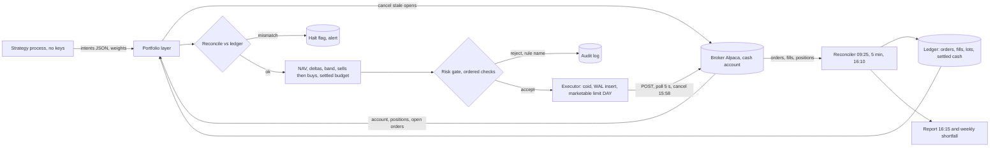
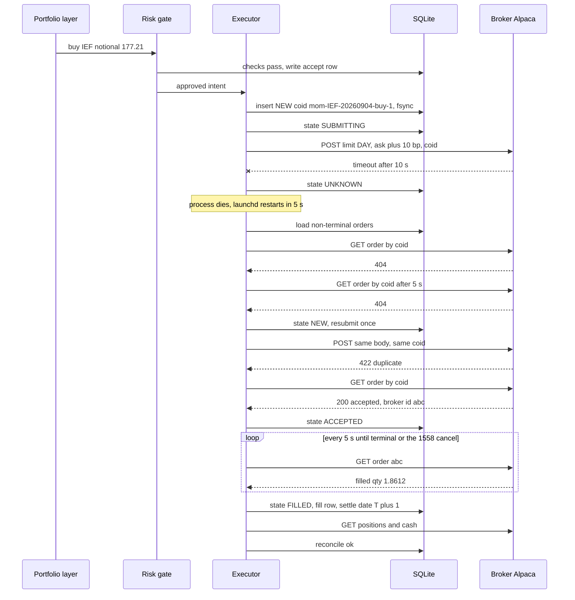

# Area B: execution and risk — lead review

Scope: broker, order handling, risk gate, portfolio construction, account rules, cost realism. Inputs: engineers 02, 04, 05, 06, 07. Numbers are for $2,000 starting equity and scale with current equity unless stated.

## Engineers

- **02 Broker and execution.** Lens: what happens when the network or the process dies mid-order. Contribution: the order state machine with a deterministic client order id persisted before the HTTP call, UNKNOWN resolved only by lookup, and a reconcile disposition table instead of ad hoc recovery code.
- **04 Risk.** Lens: the strategy is the least trusted code in the system. Contribution: the gate as a separate process and OS user holding the only broker keys, limits as logged data in SQLite, halt state that survives restart.
- **05 Portfolio.** Lens: what $2,000 can physically hold. Contribution: fractional orders make the book constructible at all, cash-account semantics in software regardless of account type, sells-then-buys against settled cash with a 20% band, and the worked example proving it.
- **06 Regulatory.** Lens: rules are stateful, time-windowed and punished after the fact with 90-day freezes. Contribution: in a cash account every legal entry implies a legal exit, so exits are never gated; the settled-cash ledger; FIFO lots keyed on broker fill id that reconcile to the 1099-B.
- **07 Costs.** Lens: commission-free is not free, and turnover is a design variable. Contribution: the break-even table (daily rebalance needs 10 to 22% gross, monthly 3.6 to 4.2%), one cost function shared by backtest and live, and implementation shortfall as the only feedback loop a $2,000 account can close.

## Consensus

- Alpaca is the broker: key-based REST with no session or 2FA in the loop, paper and live on the same API, fractional orders, $0 commission.
- The strategy emits intents (weights), never orders, and never touches the broker.
- Every order carries a deterministic `client_order_id` written to SQLite before the network call; a retry can never create a second order.
- The broker is the source of truth for positions, cash and fills; the local ledger is the source of truth for intent, and reconciliation runs before any signal and after the close.
- An unexplained mismatch halts new orders and alerts; nobody auto-flattens on a bookkeeping discrepancy.
- Only DAY time in force; nothing outlives the session the process is watching.
- Intraday trading is out at this size: PDT in margin, good-faith violations in cash, and 5 to 12% annual cost drag before either rule is counted.
- Fixed infrastructure cost is $3 to $7 per month; the paid SIP feed at $99 is 59% of the account per year and rejected.
- Honest expected edge is $0 to $100 per year; the downside of one bug is $2,000; every limit below follows from that asymmetry.
- A single daily run with one order pass per symbol; a missed run costs a missed signal, nothing else.
- Halt state and limits live in SQLite, survive restart, and cannot be raised silently.

## Disagreements and resolutions

### Margin account with a PDT counter versus a cash account

02 proposes the Alpaca default margin account with a local day-trade counter (3 per 5 days) and Alpaca's own PDT protection as a second guard; margin avoids settlement bookkeeping. 04, 06 and 07 propose a cash account: PDT does not apply, no leverage or shorts by construction. 05 says the account type barely matters because $2,000 sits exactly on the FINRA 4210(b) margin floor, so run cash semantics in software either way. 06 adds the decisive point: in margin the exit can be the illegal leg (the 4th day trade), and Alpaca's `pdt_check` will reject the exit that protects capital.

**Resolution:** cash account at the broker, and cash semantics in the portfolio layer regardless (settled-cash ledger, no same-day round trip per symbol, one run per day). A $60 drawdown would flip margin off anyway, so margin buys nothing. The day-trade counter 02 wanted is kept as 10 lines for the report and a halt if `daytrade_count` is ever above 0, so a future margin mode needs no new code.

### Order window: at the open versus 15:45 ET

02 and 05 run at 15:45 ET on a nearly complete daily bar with orders out by 15:50. 06's cash-cycle example buys at 09:35 with a fully settled balance and a complete prior-day bar. 04 locks out 09:30 to 09:35 and 15:50 to 16:00 to avoid auction noise, which is compatible with either. 07 notes a 15:55 market order fills at the ask, not the close print.

**Resolution:** one run at 15:45 ET, submissions by 15:50, unfilled orders cancelled at 15:58. The overnight gap between a close signal and a 09:35 fill is about 0.7% on SPY, ten times the entire round-trip cost, and 15:45 to 16:00 differs from the close by far less. Proceeds from 15:45 sells are spendable tomorrow, which is exactly what the settled-cash rule requires. Half days: read the broker calendar and shift the run to 15 minutes before the close.

### Rebalance cadence given the cost arithmetic

05 wants daily evaluation with a 20% relative band (about 25 orders per month, turnover about 40% of NAV per month, T about 5 per year). 07's table shows unbanded daily rebalancing at T = 75 needs 10.5 to 18% gross to break even, and proposes trade-on-flip with a minimum hold and a 30x annual turnover cap (would accept 15x). 04 expects 2 to 6 trades per week. 02 expects a mean of 1 order per day.

**Resolution:** daily evaluation at 15:45, trade a symbol only if |delta| ≥ max($10, 20% of target dollars), always open if target ≥ $25, always close fully if target is 0. That is 05's rule, and it lands at T ≈ 5, which is the cost profile 07 calls the best on the list. Add 07's cap as a gate rule: rolling 20-session one-way turnover above 1.25x NAV (15x per year) soft-halts entries. No minimum holding period: exits are never gated, and the band already prevents churn.

### Position count and sizing numbers

02: 3 to 5 names, $700 max per order. 04: max 3 positions, 40% notional cap, 1% risk per trade sized off a 2 x ATR stop in whole shares. 05: up to 8 positions, weight ≤ 0.40, gross ≤ 0.95, min position $100, 5% cash reserve. 06: 1 position at 100% of settled cash. 07: $200 max per position across 5 to 10 names.

**Resolution:** 3 to 5 positions, per-symbol weight ≤ 0.40 ($800), gross ≤ 0.95, 5% cash reserve, minimum position $100, minimum trade $10. The strategy publishes target weights; the portfolio layer converts to dollars; the gate clamps. 04's risk-per-trade sizing assumes per-trade stops, which the stop resolution below removes, so its 40% cap survives as the fat-finger bound and its sizing formula does not. 07's $200 is a cost-table assumption, not a sizing rule; at $200 x 5 half the book sits in cash earning nothing. 06's single position is the regulatory minimum case, not a portfolio. `max_positions = min(5, floor(NAV x 0.95 / $200))`, so it falls to 4 at $1,000.

### Bracket stops on every entry versus not

04 makes broker-side bracket stops (2 x ATR) a non-negotiable: the Mac dying must not be a risk event. 05 makes fractional orders a non-negotiable, and Alpaca brackets need whole shares. 02 bans GTC: an instruction nobody is watching is the outage failure mode. 07 notes whole shares turn a $400 slot into a 25 to 100% sizing error.

**Resolution:** no bracket stops. Three reasons. A DAY bracket's stop leg expires at 16:00 the same day, so protecting an overnight position needs GTC, which 02 rightly bans. Whole-share brackets make SPY at $560 unholdable at a $400 slot, which defeats the portfolio. And the book is long-only liquid ETFs at ≤ 40% weight with no leverage: a 5% overnight gap on the largest position is 2% of NAV, inside the daily loss limit, and 04's own pitfall notes a gap fills through the stop anyway. What replaces the stop: the strategy's exit at the next 15:45 run, the 5-minute equity check against the daily limit during market hours, a deadman ping to the phone within 10 minutes of the Mac going silent, and the operator's cancel-all plus close-all from the phone. This is the one engineer non-negotiable I overrule; the chair should confirm it.

### Where the risk gate lives

04 wants two processes under two macOS users, broker keys in the executor's Keychain only, the strategy writing intents to a directory the executor polls. 02 has one process. 05, 06 and 07 describe the gate as a pipeline stage without saying where.

**Resolution:** two processes, two users, as 04 describes. The cost is an hour of launchd setup once. The benefit is that "the strategy cannot reach the broker" becomes a permission, not a convention, on a system where the one operator edits the strategy weekly with no reviewer. The strategy process writes `intents/<date>.json`; the executor process owns SQLite, the gate, the order state machine, the reconciler and the report. Platform implements the users and launchd; this area owns what crosses the boundary.

### Daily loss limits

04: daily 2% ($40) hard halt with flatten, weekly 4% soft halt, drawdown budget 15% with tiers from 5%. 05: 3% halt. 07: 3% kill switch. 06: $200 per day (10%) and $500 cumulative (25%).

**Resolution:** daily 3% ($60) of start-of-day equity halts entries for the rest of the session and the next session, re-arms automatically, no flatten. Weekly 5% ($100) rolling 5 sessions halts entries, manual re-arm. Drawdown budget 10% ($200) from the high-water mark: at 5% gross cap drops to 0.60, at 10% the book is flattened at the next 15:45 run and live trading stops for 20 paper sessions. 04's 2% is inside the ordinary daily range of a 95% long ETF book and would fire on noise; 06's 10% day is a headline, not a limit; 04's own question 3 argues for 10% tuition rather than 15%. All three limits use broker `equity`, which marks at NBBO, not the IEX last trade.

### What a halt does

02: halt new orders, alert, let DAY orders expire, never auto-flatten. 04: soft halt (no entries, exits allowed) and hard halt (cancel opens, flatten). 05: halt flag, no trading until a human clears it. 06: kill switch is cancel-all then close-all in one command; exits never blocked.

**Resolution:** two states. `HALT_ENTRIES`: no buys; sells that reduce or close still pass; open orders expire on their own; alert; re-arm rule depends on the trigger (automatic for daily loss and stale data, manual for everything else). `FLATTEN`: cancel-all then close-all, triggered only by the operator (Telegram, curl, dashboard) or by the 10% drawdown budget through the normal 15:45 run. One exception to "exits pass": a reconciliation mismatch sends nothing, because computed quantities are untrusted; the operator resolves it or flattens by hand. No automatic flatten on divergence, ever.

## Open questions, answered

**02.1 Is intraday viable with PDT, or fix daily now?** Fix daily now. Cash account plus T+1 gives one round trip per dollar per day, and 07's arithmetic makes intraday negative expectation before any rule is counted. The design has no intraday order path.

**02.2 Auto-flatten above a threshold on unexplained divergence?** No. A false mismatch flattened is a realized cost with no offsetting information; a real unknown position is long-only ETFs and sits for the minutes until the operator answers the alert. The operator's one-command flatten is the escalation.

**02.3 IEX feed for marketable limit pricing, or SIP at $9?** IEX. A limit 10 bp through the IEX touch on a 1 to 3 bp spread ETF is through the NBBO; if IEX is stale the result is a non-fill, which the band absorbs tomorrow. Data and research owns the signal-side answer.

**02.4 Second broker as fallback?** No. Daily signals mean an outage costs one missed run; a second reconciliation target doubles the surface of the hardest part of the system.

**02.5 Paper and live on the same machine?** Live keys live only in the executor user's Keychain; paper keys in a separate config. Same code, one config value. Platform owns the user and Keychain mechanics.

**04.1 Flatten a reconciliation mismatch after N minutes?** Stay halted indefinitely; nothing is sent. Without stops the only thing at risk is a long ETF position the operator is being paged about, and a 30-minute auto-flatten adds a second uncontrolled action to an already confused state.

**04.2 Fractional market entry plus a separate stop?** No. Fractional orders must be DAY at Alpaca, so the separate stop dies at the close too. Fractional entries without stops, as resolved above.

**04.3 Is 15% too generous?** Yes. 10% ($200) adopted, with the gross cap tiered at 5%.

**04.4 Keep the weekly limit?** Yes, at 5%. Three days at 1.9% never trip the daily limit and reach the weekly one; it is the only guard against a slow bleed before the drawdown tier.

**04.5 Whose vol estimate?** The strategy's, published in the intent alongside the weight. The gate does not recompute volatility because it no longer sizes off a stop; it clamps weights. One estimate, no unexplained rejects.

**05.1 Explicit cash account or software only?** Both. Belt and braces costs nothing; the restriction on a later move to intraday is a feature.

**05.2 Who owns the 20% band?** The portfolio layer, as a constant in the limits table. A strategy that needs a different band is a different strategy and gets its own review.

**05.3 Who drops a position when `max_positions` shrinks?** The strategy, by re-ranking against the published `max_positions`; the portfolio layer rejects a weight vector with more nonzero entries than allowed. The layer never chooses what to sell.

**05.4 ETFs only?** ETFs only for the first strategy. Admission rule from 07: measured spread ≤ 20 bp, average volume above 5M. Single mega-caps are allowed by the rule but the first universe is 5 ETFs.

**05.5 Gate scales gross before or after banding?** Before. The band must see final targets or a gate cut trades every day.

**06.1 Settled-cash reserve?** Yes, the 5% reserve (05's N5) doubles as it. Fees on a $2,000 book are under $2 per month, so $100 covers rounding and fees with room.

**06.2 December re-entry cooldown flag?** No. The rule only defers the loss, and a config flag that changes behaviour for one month a year is a bug generator. The report prints estimated disallowed loss; the operator decides by hand.

**06.3 Margin mode if the PDT rule changes?** No. The $2,000 floor still applies and cash semantics stay. Revisit only above $25,000 or if shorting becomes part of a strategy.

**06.4 Crypto sleeve at 0.4% round trip?** Out of scope for year one. Weekly crypto at T ≈ 26 is 10% drag. Data and research can re-raise it with a monthly strategy.

**06.5 Who owns the 1099-B reconciliation?** The system produces the Form 8949 CSV and a diff by lot; the operator reads it once a year. Operations and evaluation owns the annual checklist.

**07.1 Turnover cap 30x too generous?** Yes. 15x per year adopted, enforced as a rolling 20-session cap of 1.25x NAV.

**07.2 Idle cash in SGOV or BIL?** Chair decision, see below. It is $80 per year, roughly the expected edge, but it touches the settled-cash gate and the strategy universe.

**07.3 Operator time in the report?** Yes, one line at the top of the weekly report at an assumed rate. Operations and evaluation owns the report format.

**07.4 Paper venue that models spread?** None known; subtract modeled cost from paper fills in the ledger and show both columns. Same cost function as live, as 07 requires.

**07.5 Worth building if the survivor is monthly dual momentum?** Points to Operations and evaluation. This area's view: the executor, reconciler and ledger are the part that is worth building whatever the cadence.

## Non-negotiables for this area

1. `client_order_id` is deterministic, persisted with fsync before the HTTP call, and no submit is retried without a lookup by that id first.
2. Reconciliation against broker orders, positions and fills at 09:25, every 5 minutes while orders are open, and 16:10, with a disposition for every mismatch and a halt for anything unclassified.
3. DAY time in force on every order, no GTC, no market orders; a dead process or an outage leaves nothing the system is not watching past 16:00.
4. The strategy process has no broker credentials and emits weights, not quantities; the executor process holds the keys and the gate.
5. Halt state and every limit live in SQLite, survive restart, and every change carries a reason row.
6. Fractional and notional orders at the broker with a minimum notional ≤ $5.
7. Settled cash only, no same-day round trip per symbol, one run per day, with a test that fails if any of the three is removed.
8. Cash account, long only; entries gated on the local settled-cash ledger with the broker's `cash` as the lower-wins cross-check.
9. Exits are never gated except when a reconciliation mismatch has made quantities untrusted, in which case nothing is sent.
10. Append-only fill ledger keyed on broker fill id, FIFO lots, reconciled nightly, exportable to Form 8949.
11. One cost function shared by backtest and live with per-symbol measured spreads; the gate enforces the spread cap and turnover cap and logs rejections.
12. The weekly report leads with realised versus modeled cost and halts entries when realised exceeds 1.5x modeled over 20 trades.
13. The pre-deploy test: a strategy that emits 50 intents at weight 1.0 for a symbol off the allow-list produces zero broker calls and 50 reject rows.

Dropped from engineer lists: broker-side bracket stops on every entry (04), for the reasons in the stop resolution.

## Recommended design for this area

Two processes on the Mac mini under two macOS users. The strategy process reads bars from SQLite and writes one file, `intents/<date>.json`, containing target weights (≤ 5 nonzero, each ≤ 0.40, sum ≤ 0.95) and the vol estimate it used. It has no broker keys. The executor process wakes at 15:45 ET, and everything below happens inside it.

The portfolio layer snapshots the broker (account, positions, open orders), cancels any open orders left from a crashed run, and reconciles positions and cash against the ledger; a mismatch beyond $1 per position or $5 cash halts and nothing is sent. It computes NAV, target dollars, and deltas, applies the band (trade only if |delta| ≥ max($10, 20% of target); open if target ≥ $25; close fully at 0), sequences sells by quantity rounded down then buys by notional, and budgets buys against settled cash minus the 5% reserve, scaling pro rata on overflow. Settled cash is the ledger's number: cash minus proceeds whose settlement date is after today, cross-checked against the broker's `cash` with the lower value winning.

The risk gate takes each intent in a fixed order and short-circuits with a named reject written to SQLite: halt flag, allow-list and event lockout, bar age, weight and gross caps, position count, settled cash, orders today under 10, rolling turnover, measured spread ≤ 20 bp, day-trade count 0. Sells that reduce a position skip the entry checks. Limits are rows in a `limits` table changed only through `riskctl set --reason`.

The executor assigns `coid = "{strategy}-{symbol}-{yyyymmdd}-{side}-{seq}"`, inserts the order row as NEW with SQLite WAL and synchronous FULL, then submits a marketable limit DAY order: ask plus 10 bp for buys, bid minus 10 bp for sells, priced from the broker's latest quote. Submissions finish by 15:50. It polls every 5 seconds; a timeout or 5xx moves the row to UNKNOWN and the only allowed next action is `GET order by client_order_id`. Two 404s five seconds apart return the row to NEW for one resubmit with the same id; a 422 duplicate is treated as found. At 15:58 every non-terminal order is cancelled; a fill that beats the cancel wins and is booked. Every state change is one UPDATE with a `WHERE state = expected` clause.

The reconciler runs at 09:25, every 5 minutes while any order is open, and at 16:10. Its disposition table is 02's; the two rules are that broker quantities and cash always overwrite local, and no reconcile action ever creates an order. During market hours the same 5-minute loop compares broker equity to start-of-day equity for the daily loss check. Reconcile disposition, adopted from 02 with 05's tolerances:

| Local | Broker | Action |
|---|---|---|
| ACCEPTED or PARTIAL | filled, canceled or expired | Apply broker status, book fills at broker price and quantity |
| UNKNOWN | found by coid | Adopt broker id and status |
| UNKNOWN | 404 twice | Back to NEW, resubmit once with the same coid, then REJECTED with alert |
| FILLED | order missing at broker | Alert, halt entries; treat as a bug |
| Position differs by more than $1 or 0.001 sh | any | Overwrite local from broker, log delta, alert above $50 |
| Broker position with no local order in 5 days | any | Alert; operator decides, no auto-flatten |
| Broker open order with no local row | any | Cancel it, alert; the bot did not place it |
| Cash differs by more than $5 | any | Overwrite local, alert, recompute settled cash |
| `daytrade_count` above 0 | any | Halt entries, alert; the same-day exclusion failed |

Gate order, each check a named reject row:

1. Halt flag in SQLite.
2. Symbol on allow-list, no event lockout (FOMC, CPI, NFP dates from a YAML calendar under 35 days old), clock inside 15:45 to 15:50 ET.
3. Bar age: daily bar for today received by 15:40 ET.
4. Weight ≤ 0.40, gross after this order ≤ 0.95, positions after this order ≤ `max_positions`.
5. Buys only: cost ≤ settled cash minus reserve, symbol not sold today.
6. Orders today under 10, one open order per symbol, rolling 20-session turnover under 1.25x NAV.
7. Measured spread ≤ 20 bp from the broker's latest quote, limit price within 2% of the last bar close.

The 16:15 report carries fills versus arrival midpoint, positions, settled and unsettled cash, rejects by rule, halt state, drawdown from HWM and the day-trade count. The weekly report leads with implementation shortfall against the model.

| Choice | Value |
|---|---|
| Broker | Alpaca, REST, paper and live by one config value |
| Account type | Cash, long only; cash semantics also enforced in software |
| Order type | Marketable limit DAY: ask + 10 bp buys, bid − 10 bp sells; buys by notional, sells by quantity; no market, no GTC |
| Order window | One run at 15:45 ET, submissions by 15:50, cancel non-terminal at 15:58; no orders outside 09:30 to 16:00 |
| Cadence | Evaluate daily; trade if abs delta ≥ max($10, 20% of target); open at ≥ $25; close fully at 0 |
| Position count | 3 to 5; `max_positions = min(5, floor(NAV x 0.95 / 200))`; minimum position $100 |
| Sizing rule | Strategy weights; per-symbol ≤ 0.40, gross ≤ 0.95, 5% cash reserve, buys scaled pro rata to settled cash |
| Daily loss limit | 3% of start-of-day equity ($60): halt entries this session and next, auto re-arm, no flatten |
| Weekly loss limit | 5% rolling 5 sessions ($100): halt entries, manual re-arm |
| Drawdown budget | 10% from HWM ($200); at 5% gross cap 0.60; at 10% flatten at next run, 20 paper sessions before live |
| Stop policy | No broker-side stops; exits via daily run, 5-minute equity check, deadman ping, phone flatten |
| Halt semantics | HALT_ENTRIES blocks buys, sells pass, opens expire; FLATTEN is cancel-all then close-all, operator or drawdown budget only; reconcile mismatch sends nothing |
| Cost model | 10 bp round trip base, 20 bp stress; half spread from a 20-session live table + 2 bp + fees; spread cap 20 bp; turnover cap 1.25x NAV per 20 sessions; halt entries if realised > 1.5x modeled over 20 trades |
| Order caps | 10 orders per day, 1 open order per symbol, no resting buy and sell on the same symbol |

## What the chair needs to decide

1. **Timeframe fixed to daily, no intraday path.** This area has designed it out; Data and research must agree the strategy universe is daily-or-slower ETFs so nobody builds a minute-bar signal that cannot be executed.
2. **Two processes and two macOS users.** Platform pays the launchd and Keychain cost and owns the intents handoff; confirm they accept it rather than a single-process layer.
3. **No broker-side stops.** This overrules 04's non-negotiable in favour of 05's fractional orders and 02's no-GTC rule. The chair should record the decision and the arithmetic so it is not reopened after the first bad overnight gap.
4. **Idle cash in SGOV or BIL.** Worth about $80 per year, the same size as the expected edge, but it changes the strategy universe and the settled-cash budget. Data and research and this area need the same answer.
5. **Paper exit criteria to live.** 02 wants 20 sessions with zero UNKNOWN residues and zero reconcile deltas; 07 wants 60 days of fills compared to the model; 04 wants the overspend test. Operations and evaluation should merge these into one checklist that gates the live keys.
