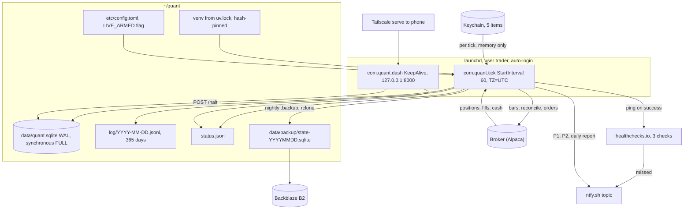

# Area C: platform — lead review

Scope: the Mac mini, supervision, state, secrets, remote access, alerting, clock, backup, and what "halt" means to the machine. Inputs: DE 08 (Mac mini infra), DE 09 (reliability), DE 10 (observability), DE 15 (security), DE 16 (scheduling and time).

## Engineers

- **DE 08, Mac mini infra.** Lens: the box as a server. Contribution: `pmset sleep 0 autorestart 1` plus a UPS with the router on it, and launchd as the only supervisor; without these nothing else in the design holds.
- **DE 09, reliability.** Lens: safe to `kill -9` at any instruction. Contribution: intent row with a deterministic `client_order_id` fsynced before every broker call, and reconcile-then-halt as the only startup path.
- **DE 10, observability.** Lens: the silent failure. Contribution: three absence checks on healthchecks.io (open, heartbeat, report) and the rule that an alert is a sentence with a verb.
- **DE 15, security.** Lens: the convenient thing leaks the key. Contribution: trading-only key in the macOS Keychain read via the `security` CLI, dashboard on loopback with Halt as its only action, hash-locked venv under a non-admin user.
- **DE 16, scheduling and time.** Lens: clock, timezone, sleep state and exchange calendar are four sources of truth. Contribution: a dumb 60 s launchd tick plus a `runs(trading_day, step)` table, with `trading_day` as data and a hard deadline on the order step.

## Consensus

- launchd is the supervisor; nothing runs on top of it (no Docker, supervisord, pm2, APScheduler, Airflow).
- One LaunchAgent under a logged-in user with auto-login, not a LaunchDaemon, so the Keychain and user files are available at boot.
- SQLite in WAL mode is the only source of truth for orders, fills, intents, halts and run state; nothing that must survive a crash lives in memory or a log line.
- An external dead-man's switch (healthchecks.io free tier, pinged from the end of a completed loop iteration, never from a side thread) is the only thing that can report the machine being dark.
- Startup and periodic reconciliation against broker positions, open orders and cash; an unexplained diff stops new orders and pages, it never guesses.
- Positions are protected by broker-side stops; the Mac, the network and the process are all allowed to die.
- Native Python via `uv` with a frozen lockfile, absolute paths in every plist, everything under one home directory that TCC does not gate.
- `pmset` sleep off and autorestart on, a macOS update that reverts it is caught by the dead-man's switch, not a checklist.
- Alerts go to a phone within a minute, key on freshness and invariants rather than P&L, and are deleted when they fire twice with no action.
- Monthly recurring cost under $5; one-time under $200.

## Disagreements and resolutions

### FileVault on versus off with auto-login

DE 08 and DE 16: off, auto-login on; with FileVault on nothing runs after a power cut until a human types a password, and Tailscale is not up at the pre-boot prompt, so "remote" means "walk to the box". DE 15: on, because theft of the box yields the Keychain; concedes in its own pitfalls that FileVault plus auto-login is contradictory and proposes the operator unlocks after each reboot. DE 09: either, as long as the box boots unattended.

**Resolution:** FileVault off, auto-login on for the `trader` user. The N2 requirement (trading within 3 min of power return) is unmeetable with FileVault on, and a week-long outage while the operator travels is the more likely loss than a burglary. Apple silicon SSDs are hardware-encrypted regardless; FileVault only binds the key to a password. The theft mitigation is the one DE 15 already specified: a trading-only key with no transfer rights, rotated the same day the box goes missing, bounded by the risk caps in the meantime.

### Keychain versus a 0600 secrets file

DE 08: `etc/secrets.env` mode 0600, excluded from rclone, Keychain "when a second person exists". DE 15: Keychain only, five items, read with `security find-generic-password` from stdlib `subprocess`; a file ends up in Time Machine, `ps eww`, crash reports and git.

**Resolution:** Keychain, DE 15's design as written. Cost is five lines of subprocess. With auto-login the login keychain is unlocked at boot, so DE 08's unattended-restart objection does not apply. Two operational rules go into the runbook: run the tick once interactively after any venv rebuild so the per-binary "Always allow" is granted, and never store the value on the command line (`security add-generic-password ... -w` with no argument prompts). No `.env` file exists anywhere; the pre-commit grep enforces it.

### One long-running process versus a launchd tick

DE 08, 09, 10, 15: one daemon with `KeepAlive`, a websocket for bars (08), a separate heartbeat process (08), a heartbeat from the end of the main loop (10). DE 16: `StartInterval 60` tick, stateless, every step a row in `runs`; a process that sleeps until 09:45 is guaranteed wrong on a machine that suspends, and a daemon needs its own stuck-loop detection.

**Resolution:** the tick. Every failure mode (sleep, reboot, crash, hung loop, coalesced missed interval) reduces to "the next tick runs and reads the table". DE 09's state machine survives intact: `Reconciling` is the first thing every tick does, `Halted` is a row, and the intent-before-submit sequence is one step. DE 08's separate heartbeat job disappears; its checks (disk free, clock offset, `pmset -g`, `launchctl list`) become steps in the tick, and launchd plus healthchecks.io are the watchers. DE 10's rule holds: the healthchecks ping is the last line of a successful tick. Bars come over REST (last N bars per symbol, upsert on `(symbol, ts_utc)`); the websocket is dropped. This caps the platform at 1-minute bars, which the brief allows and the Data and research area should confirm.

### Dead-man's switch timings

DE 08: ping every 60 s, grace 10 min. DE 09: 20 min of silence. DE 10: open check by 09:35, heartbeat period 60 s grace 120 s, report by 16:45. DE 16: 30 min.

**Resolution:** three healthchecks.io checks. `quant-open`: cron `15 9 * * 1-5` America/New_York, grace 15 min, pinged by the pre-open reconcile step, so a page arrives by 09:30, before the 09:45 order window. `quant-tick`: period 60 s, grace 5 min, pinged 24/7; 120 s is too tight because launchd fires seconds to minutes late after coalescing and DE 10's own budget is under one page a week, while 20 to 30 min buys nothing when positions already sit under broker stops. `quant-report`: cron `30 16 * * 1-5`, grace 15 min. On exchange holidays the tick sends `/pause` to `quant-open` and `quant-report` at 09:00.

### What a halt does to open positions

DE 08: any heartbeat failure, including low disk or clock drift, cancels all orders and flattens. DE 09: cancel unknown open orders, place no new intents, leave positions under their bracket stops, never flatten automatically; asks whether to flatten at 15:45 after 2 h halted. DE 10: stop new orders and page; auto-flatten can sell into a display glitch. DE 15 and 16: halt flag stops orders, nothing else.

**Resolution:** halt = cancel every open order, write a `halts` row with reason and snapshot id, page P1, place no new intents. Positions stay, protected by the broker stop. Flattening on an infrastructure fault pays 2 to 4 bps of spread for no information and turns an ISP flap into a realised trade. The single exception is the daily loss cap, where the risk gate flattens by design; that cap and any time-based flatten rule belong to Execution and risk and are flagged for the chair. Exit from halt is `quant ack <snapshot_id>` by the operator over Tailscale SSH, never a button.

### SQLite settings and the history store

DE 08: `synchronous=NORMAL`, several writer processes, monthly Parquet for history, DuckDB over Parquet for analytics. DE 09: `synchronous=FULL`, one writer, positions derived from fills. DE 16: SQLite for everything including 1-minute bars.

**Resolution:** `synchronous=FULL`, `busy_timeout=5000`; DE 08's own N3 (zero committed orders lost on power cut) is not met by NORMAL, and the cost is one fsync per intent. Two writers exist, the tick and the dashboard's `/halt`, and WAL handles that. History stays in the same SQLite file: 1-minute bars for 5 symbols are 500 k rows and about 100 MB per year, well inside SQLite, and DuckDB can read it directly for backtests. Parquet is added only when the operator stores sub-minute quotes, which nobody proposed.

### Clock tolerance

DE 08: alert above 500 ms versus NTP. DE 10: P2 above 30 s. DE 16: warn above 2 s, halt above 30 s, versus the broker clock endpoint.

**Resolution:** DE 16's numbers. 500 ms would page on ordinary post-reboot NTP settling and protects nothing on a 60 s cadence; bars are stamped by the broker. The check runs in the pre-market calendar step and hourly, compares against the broker clock with `sntp` as a second opinion, and the process runs with `TZ=UTC`.

### Reconcile interval

DE 08: every 60 s from the heartbeat process. DE 09: on start and every 5 min, then asks whether 1 min is better. DE 15: before every order and every 5 min. DE 16: three times a day, pre-open, midday, after close.

**Resolution:** every tick, 60 s, positions plus open orders plus cash, 3 calls per minute against a 200 per minute limit. DE 09's own example settles it: a stop that fires at 10:01 must be in the ledger before the 10:15 bar can try to re-enter. DE 16's three named reconciles remain as `runs` rows because they gate other steps (pre-open blocks the order window, EOD gates the report); the per-tick one is what keeps the ledger honest between them.

### Timezone of the process and the plists

DE 08: `TZ=America/New_York` in every plist so `StartCalendarInterval` and the code agree. DE 16: `TZ=UTC`, store `ts_utc` with a Z suffix, convert to exchange time in the report layer only, because `StartCalendarInterval` has a skipped hour in March and a 23:30 ET row lands on the wrong UTC date.

**Resolution:** `TZ=UTC`. There is no `StartCalendarInterval` left in the design; the tick is `StartInterval`, and due times are computed from `open_utc` and `close_utc` in the `sessions` table, so early closes and DST need no code. `trading_day` is a column, never `date(ts_utc)`. Logs use the same Z format. CI greps for `datetime.now()` without `tz=`.

### Backup layers

DE 08: three layers, hourly Time Machine to a $70 external SSD, nightly `.backup` plus rclone to B2, quarterly drill. DE 09: nightly `.backup` to B2 only, the broker's records rebuild the rest. DE 15: backups must carry no keys.

**Resolution:** two layers, not three. Nightly `.backup` plus `rclone sync` to B2, and a quarterly restore drill from git plus the lockfile plus B2. Time Machine is dropped: its value is restoring the OS and `~/quant` together, but the drill already rebuilds the box in under an hour, and DE 08's own pitfall notes that Time Machine copies the WAL mid-write and the `.backup` snapshots are the ones to trust. Nothing in `~/quant` or the backup holds a key, so the Keychain never leaves the machine and the operator re-enters five items on a rebuild.

### Alert channel and dashboard runtime

DE 08: Pushover. DE 09: email or Telegram. DE 10: ntfy.sh plus email. DE 15: ntfy or Discord webhook; dashboard via uvicorn on loopback. DE 16: ntfy or Pushover.

**Resolution:** ntfy.sh, one random 24-character topic stored in the Keychain, `urgent` for P1; Pushover is the fallback if ntfy proves flaky, email only for the weekly report. Dashboard is a stdlib `http.server` subclass serving `index.html`, `status.json` and `POST /halt` (requires `X-Halt: yes`), bound to 127.0.0.1:8000 and published on the tailnet with `tailscale serve`. No uvicorn, no framework.

### Numbers, reconciled

| Quantity | Proposed | Chosen |
|---|---|---|
| Tick interval | 60 s (08, 16), continuous loop (09, 10, 15) | 60 s |
| Heartbeat grace during session | 120 s (10), 10 min (08), 20 min (09), 30 min (16) | 5 min |
| Pre-open page deadline | 09:35 (10) | 09:30, from a 09:15 check with 15 min grace |
| Reconcile interval | 60 s (08), 5 min (09, 15), 3 per day (16) | every tick, 60 s |
| Clock warn / halt | 500 ms (08), 30 s (10), 2 s / 30 s (16) | 2 s / 30 s versus broker clock |
| Restart throttle | 10 s (08), 30 s (15) | n/a for the tick; 10 s for the dashboard |
| SQLite synchronous | NORMAL (08), FULL (09) | FULL |
| Log retention | 30 days gzip (08), 365 days plain (10) | 365 days plain JSON lines, about 550 MB |
| Data staleness before no-trade | 2 min (10), 3 min (08), 2 bar intervals (09) | 2 bar intervals, minimum 3 min |
| Alert budget | under 1 P1 per month, under 1 P2 per week (10) | adopted as written |

## Open questions, answered

### DE 08

1. **Flatten or cancel on an infrastructure fault?** Cancel open orders and stop new intents; positions stay under broker stops. Flattening is reserved for the daily loss cap, which Execution and risk owns.
2. **Cash account, T+1, half size on consecutive days.** Execution and risk, with Data and research for the strategy side.
3. **Is 500 ms the right clock tolerance?** No. Warn above 2 s, halt the day above 30 s, measured against the broker clock endpoint. Nothing in a 60 s tick needs sub-second time.
4. **$5 VPS as an external watchdog that can cancel-all?** No. healthchecks.io plus a phone plus broker-side stops cover the dark-machine case; a VPS holding a broker key doubles the secret surface for a $2,000 account.
5. **Who runs the restore drill on vacation?** Nobody. The drill is a calendar item (quarterly, 30 min); if the operator is away the answer is "the system is halted and flat", which is the designed safe state.

### DE 09

1. **Bracket stop sizing after a partial fill.** Execution and risk, verified against the live API in paper.
2. **Auto-adopt a manual position?** No. The rule is that the operator does not trade this account by hand; an allowlist is more code than the problem. Execution and risk may overrule.
3. **Halted over 2 h with positions: flatten at 15:45?** Platform does no time-based flatten. This is a risk policy; flagged for the chair.
4. **Is 5 min reconcile too slow?** Yes. With the tick, positions, open orders and cash are reconciled every 60 s: 3 calls per minute against a 200/min limit.
5. **A second watchdog process?** No. launchd restarts the tick, the tick reconciles, healthchecks.io watches the tick. A second process that can flatten is a second thing that can be wrong.

### DE 10

1. **Failed reconcile: flatten or stop and page?** Stop, cancel open orders, page. Same answer as above.
2. **09:35 deadline or 09:00 start?** The tick runs 24/7, so pre-market steps begin at 06:30. The `quant-open` check is moved to the 09:15 pre-open reconcile with a 15 min grace, so the page lands by 09:30, before any order can go out.
3. **Daily loss alert P1 with kill switch, or P2 confirmation?** The kill switch is the control; the alert is P1 because the action ("confirm flat") is real. Ownership of the cap: Execution and risk.
4. **Paper and live in parallel?** Operations and evaluation decides. Platform cost if yes: a second SQLite file and ntfy topic, paper alerts at P3 only, same user.
5. **Tailscale for phone access?** Yes. Loopback bind, `tailscale serve`, Halt as the only action, device list reviewed at each quarterly key rotation.

### DE 15

1. **Accept the logged-in dependency for the Keychain?** Yes, with auto-login as `trader`. A passphrase typed at startup is the same outage as FileVault under another name.
2. **Where do the loss and position caps live?** In code before every order, in the hash-locked venv, plus the broker bracket stop as the layer a bad package cannot edit. Alpaca has no retail server-side cap. Execution and risk owns the numbers.
3. **Halt-only remote control?** Yes. Resume is `quant ack` over Tailscale SSH, authenticated by the tailnet and the SSH key.
4. **Research on the laptop or a second user?** The laptop. If it must be the Mac mini, the admin account, never `trader`. Data and research owns the research environment.
5. **Monthly or weekly dependency updates?** Monthly, on a weekend, from a lockfile diff, with `pip-audit` weekly as an alert. Zero inbound ports and hash pinning close the paths a CVE window would open.

### DE 16

1. **Daily versus intraday?** Chair, with Data and research. The tick supports both up to 1-minute bars over REST.
2. **Skip or run-late the order window?** Execution and risk. Platform default is skip and alert.
3. **Market-on-open instead of an order window?** Execution and risk.
4. **Who flips a halted day back on?** The operator only, from a shell over Tailscale SSH. No push-button resume anywhere.
5. **FileVault?** Off. See the resolution above.

## Non-negotiables for this area

1. `pmset -a sleep 0 disksleep 0 autorestart 1 womp 1`, and a UPS with the modem and router on it; without these the machine is a laptop.
2. An external dead-man's switch that pages by 09:30 ET on a missed pre-open check, within 6 min of a missed tick, and by 16:45 ET on a missing report.
3. Every tick reconciles positions, open orders and cash against the broker before any intent; an unexplained diff cancels open orders, halts, and pages; the system never guesses its way out.
4. An intent row with a deterministic `client_order_id` is fsynced (`synchronous=FULL`) before every broker submit; no fast path.
5. SQLite WAL is the only truth; a nightly `.backup` goes off-site and a restore drill is on the calendar quarterly.
6. Every run, order, fill and bar row carries `trading_day` and `ts_utc`, both NOT NULL; no step calls `date.today()`.
7. The order step has a hard deadline; catch-up after sleep or reboot never places orders.
8. Broker keys are trading-only with no transfer rights and exist only in the `trader` Keychain; never in a file, environment block, plist or log line.
9. The dashboard binds to 127.0.0.1, is reachable only over Tailscale, and Halt is its only action; the router forwards nothing.
10. The trading venv is installed with `uv sync --frozen` from a hash-pinned lockfile and runs as a non-admin user; no manual `pip install` into it.
11. Every log line carries `run_id` and `mode`, and lineage ids once they exist.
12. Alerts key on freshness and invariants, name the action, and are deleted when they fire twice with no action.

## Recommended design for this area

Two LaunchAgents under a standard user `trader` with auto-login and FileVault off. `com.quant.tick` runs `~/quant/.venv/bin/python -m quant.tick` every 60 s (`StartInterval 60`, `RunAtLoad`, `ProcessType Background`, `TZ=UTC`, absolute paths). `com.quant.dash` keeps a stdlib `http.server` alive on 127.0.0.1:8000, published to the phone with `tailscale serve`. There is no third process.

Each tick is stateless. It opens `data/quant.sqlite` (WAL, `synchronous=FULL`, `busy_timeout=5000`), checks the `halts` table, loads the exchange calendar from the `sessions` table (refreshed daily from the broker, 60 days ahead), derives `trading_day`, reconciles positions, open orders and cash against the broker, then runs whatever `runs(trading_day, step)` row is due and inside its deadline. Steps are DE 16's nine, with DE 09's intent-before-submit sequence inside the order step and DE 08's machine checks (disk over 10 GB free, clock within 2 s of the broker, `pmset` still sleep 0, `launchctl list` still shows both agents) inside the pre-market calendar step. The last line of a successful tick pings healthchecks.io and rewrites `status.json`; a tick that fails does neither, which is how the outside learns.

State is one SQLite file: `intents`, `orders`, `fills` (unique on broker fill id), `bars` (unique on symbol and `ts_utc`), `runs`, `halts`, `reconcile_snapshots`, `sessions`. Positions and daily P&L are derived from fills on every tick and never stored. History is the same file; DuckDB reads it for backtests. Logs are JSON lines, one file per day under `log/`, opened and closed by each tick, deleted after 365 days by the backup step; no newsyslog, no rotating handler.

Secrets are five Keychain items read by `security find-generic-password` at the start of each tick and held in one variable. `MQ_MODE` in the plist selects paper or live; live also requires `~/quant/LIVE_ARMED` to exist. Alerts go to one random ntfy topic, deduplicated per condition per day.

Halt is a row, written by the tick on a reconcile diff or a broken invariant, by `quant halt` at the shell, or by the dashboard's `POST /halt`. It cancels open orders, leaves positions under broker stops, and pages. Only `quant ack <snapshot_id>` clears it.

Backup is the last step of the day: `sqlite3 .backup` to `data/backup/`, `rclone sync` to Backblaze B2 (about a cent a month), 90-day prune. Restore is `git clone`, `uv sync --frozen`, `rclone copy`, `quant selftest` against paper; the drill is quarterly. Time Machine is not required; a UPS is.

```mermaid
gantt
    title Trading day, exchange time, normal close
    dateFormat HH:mm
    axisFormat %H:%M
    section Dead-man checks
    quant-tick, 60 s period, 5 min grace, all day :active, h1, 00:00, 1439m
    quant-open cron 9h15, grace 15 min, page by 9h30 :crit, h2, 09:15, 15m
    quant-report cron 16h30, grace 15 min, page by 16h45 :crit, h3, 16:30, 15m
    section Tick steps
    Calendar, clock, machine checks :s1, 06:30, 5m
    Data pull and validate :s2, 06:35, 25m
    Signal to intents :s3, 07:30, 10m
    Pre-open reconcile, pings quant-open :s4, 09:15, 10m
    Order window, hard deadline :crit, s5, 09:45, 30m
    Reconcile every tick :s6, 09:30, 390m
    Pre-close cancel :s7, 15:45, 15m
    EOD reconcile and report, pings quant-report :s8, 16:30, 15m
    Backup to B2, prune logs :s9, 16:45, 10m
```

| Concern | Choice |
|---|---|
| Supervision | launchd LaunchAgent, `StartInterval 60` tick plus one `KeepAlive` dashboard; no daemon, no Docker |
| Runtime | Python 3.12 from `uv python install`, `uv sync --frozen`, hash-pinned, under 30 packages, `httpx` direct to the broker REST API |
| State store | SQLite, WAL, `synchronous=FULL`, `busy_timeout=5000`, one file |
| History store | Same SQLite file; DuckDB reads it for backtests; Parquet only if sub-minute quotes are ever stored |
| Secrets | macOS Keychain, 5 items, `security` CLI via stdlib subprocess, `LIVE_ARMED` file gates live |
| Remote access | Tailscale; dashboard on 127.0.0.1:8000 via `tailscale serve`; SSH over Tailscale only; 0 forwarded ports |
| Alerting | ntfy.sh random topic (P1 urgent, P2 high), healthchecks.io 3 checks, weekly report by email |
| Clock | `TZ=UTC` process, `timed` against time.apple.com, warn above 2 s and halt above 30 s versus broker clock |
| Backup | Nightly `sqlite3 .backup` then `rclone sync` to B2, 90-day prune, quarterly restore drill; UPS $80 |
| Halt semantics | Row in `halts`; cancel all open orders, no new intents, positions stay under broker stops, P1 page, cleared only by `quant ack` |
| Power | `pmset -a sleep 0 disksleep 0 autorestart 1 womp 1`, checked every pre-market step |
| User and disk | Standard user `trader`, auto-login, FileVault off, firewall on, Remote Login off except Tailscale SSH |

## What the chair needs to decide

1. **Daily or intraday, and at what bar size.** The tick with REST polling holds to 1-minute bars; anything finer needs a websocket daemon and reopens the process-shape decision. Data and research and Execution and risk have to agree with platform.
2. **Whether any halt ever auto-flattens.** Platform says only the daily loss cap flattens and nothing time-based does. Execution and risk may want a 15:45 flatten when halted with positions; that changes the halt step and the alert text.
3. **Where the loss and position caps are enforced and who owns their numbers.** Platform puts them in the hash-locked code before every order plus the broker bracket; the values ($30 per position, $40 to $60 per day proposed by three engineers) are not ours to set.
4. **Paper and live in parallel.** Doubles SQLite files, ntfy topics and healthchecks checks. Operations and evaluation should say whether the 3-month paper phase is sequential or concurrent with live.
5. **Where research runs.** Platform wants the laptop so the Mac mini has one user and one venv; Data and research may need the Mac mini's always-on data. If it stays on the box, it is the admin account, and the 16 GB RAM budget for backtests is after close only.
