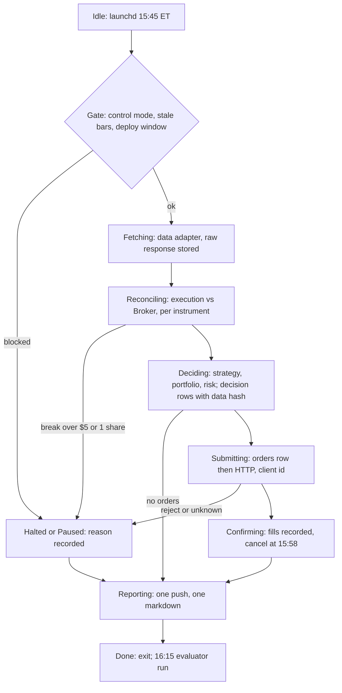
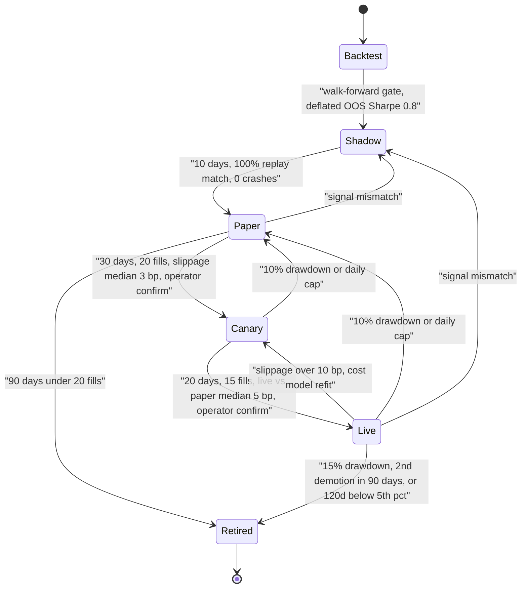

# Area D: operations and evaluation — lead review

Scope: promotion from backtest to live (DE 11), software architecture (DE 17), the crypto question (DE 18), performance statistics (DE 19), the human runbook (DE 20). Shared assumptions across all five, which I adopt: Alpaca cash account, 3 to 5 liquid ETFs, one decision per day near the close, Python plus SQLite plus launchd, one operator with a day job, $2,000.

## Engineers

- DE 11, promotion: stage is a column on the strategy row, not a deployment; contributed the five-stage ladder with pre-registered numeric gates and automatic demotion, plus the shadow-replay check that catches most month-one bugs for free.
- DE 17, architecture: one script per trading day running an explicit persisted state machine; contributed the crash-safe order path (orders row with client_order_id committed before the HTTP call, resume reconciles by client id) and the "core imports no network, no clock, no randomness" rule.
- DE 18, crypto: fees at the frequency PDT would have blocked are 3% to 5% of equity per month; contributed the clear "no crypto in v1" verdict with the numbers that make it unarguable, and the 24/7 checklist if it is ever revisited.
- DE 19, evaluation: SE(annualized Sharpe) is about sqrt(252/n), so one live year has SE 1.0; contributed the minimum-sample table per metric and the insert-only ledger from which every report number is rebuilt by one script.
- DE 20, operations: the operator is unavailable 23 hours a day, so silence must be safe; contributed sticky halts with typed human resume, one push a day, three phone buttons, the broker-app override that works with the Mac unplugged, and pre-registered retirement rules.

## Consensus

- Same code path for backtest, paper and live; the only thing that changes is an adapter or a router mode.
- Live P&L cannot prove an edge on a $2,000 account inside several years; the live stages test the pipeline, costs and signal match, and the backtest carries the edge hypothesis.
- Signal replay against a stored data snapshot is the fastest and most valuable drift check; any mismatch is a bug, never a metric.
- Every intent is written to SQLite before the broker call, and the broker is reconciled against the ledger every cycle.
- Daily loss cap of 2% of equity ($40) halts new orders; halts and demotions are automatic, resumes are human.
- One daily decision window near the close; a missed window is skipped, never replayed.
- Alpaca paper fills are optimistic, so paper proves plumbing and canary or early live proves cost.
- Reports carry a standard error or a minimum-sample flag; no bare Sharpe.
- Under $5 per month of running cost; the operator's attention is the expensive resource.
- Rules that stop a strategy are written down before the first live order and are not edited mid-stage.
- Every broker response is recorded and replayable, so adapter tests are written from what the broker actually sent.
- A strategy is one pure function over bars; it cannot see the clock, the account or the broker.
- Deploys never happen during market hours, and a retired strategy never returns without a fresh paper run.

## Disagreements and resolutions

### Promotion gate numbers

| Proposal | Shadow | Paper | Canary | Basis |
|---|---|---|---|---|
| DE 11 | 10 days, 100% replay match | 30 days and 20 fills, cap 90 | 20 days and 15 fills at 10% | 20 fills pins median slippage to about 2 bp; 30 days spans an expiry and a month-end |
| DE 17 | none | 20 days, zero Halted | none | soak for plumbing only |
| DE 18 | none | 4 weeks and 30 trades | none | fee-aware gate needs measured cost |
| DE 19 | replay is the check | 60 days, or N signal-match days | none | vol converges at 60 days, slippage at 30 fills |
| DE 20 | none | 10 days after any change | none | change control, not evidence |

**Resolution:** DE 11's ladder and numbers, with DE 19's sample arithmetic as the justification: 20 fills gives slippage SE of about 1.1 bp (sigma 5 bp), enough to see a 3 bp assumption fail; 30 days spans one expiry and one month-end. Vol and turnover comparison against backtest is checked at 20 days (deterministic metrics) and revisited at 60 days in live, not gated at paper because paper vol is real but paper cost is not. The 90-day cap retires strategies too slow to evaluate at this account size. Gates are pre-registered on the row and immutable in stage.

### One process per day versus a tick loop

DE 11: ingest every minute, reconcile every 5 minutes, decide at 15:45. DE 17: one script at 15:30, runs a state machine to completion, exits. DE 18: hourly bars. DE 19 and DE 20: single window at 15:50, reconcile once after close.

**Resolution:** One script, two launchd fires: the trading run at 15:45 ET (fetch, reconcile, decide, submit, confirm by 15:58, report) and a post-close reconcile-and-evaluate run at 16:15 that runs the same binary in evaluate mode. No minute ingest and no intraday reconcile: with day orders cancelled at 15:58 there is nothing to reconcile intraday, and DE 11's 5-minute loop exists only to serve an intraday variant nobody in this area needs. 15:45 rather than 15:30 so the decision price is within 15 minutes of the close it is marked against; rather than 15:50 so a retry still fits before the 15:58 cancel.

### Is crypto in scope

DE 18: not in v1; fees at retail tiers are 0.8% to 1.2% per round trip, position size falls to $250 at equal risk, and 24/7 removes the free daily halt. The other four assume equities without arguing it.

**Resolution:** Crypto is out of scope for v1 and out of the architecture: no venue adapter, no UTC day boundary, no venue-side stops. It re-enters only if all of: a backtested strategy shows gross edge per trade over 3x the round-trip cost measured on the target venue, cadence 4h or daily, BTC and ETH only, Alpaca crypto first, and the account is above $10,000 so the fee budget of 1% per month is not most of the expected return. It would then pass the same five stages as any equity strategy.

### What "edge confirmed" can mean statistically

DE 11: t-stat = Sharpe x sqrt(years), so Sharpe 1 needs 4 years. DE 19: same conclusion via SE(SR) = sqrt(252/n), plus the deflated Sharpe for N trials. DE 20's retirement rule "120 days with cumulative P&L below fees" implicitly treats six months as informative. DE 17: OOS walk-forward is the evidence.

| What live can confirm | Converges in | Threshold |
|---|---|---|
| Signal match against replay | 1 day | any mismatch |
| Slippage versus assumed price | 30 fills | over 2x assumption (6 bp at 3 bp assumed, about 3 sigma) |
| Turnover and exposure versus backtest | 20 days | over 10% off |
| Realized vol versus backtest | 60 days | over 25% off |
| Beta to SPY | 120 days | SE about 0.15 |
| Sharpe interval excluding zero at true SR 1 | about 4 years | SE sqrt(252/n) |

**Resolution:** "Edge confirmed" is not a stage and never appears on a report. The edge hypothesis is carried by the backtest gate: walk-forward, 40% OOS, OOS Sharpe at least 0.8, deflated for the recorded number of variants tried (expected best-of-N from noise is about SE x sqrt(2 ln N), so 20 variants on 10 years produce 0.8 from nothing; the gate applies to the deflated value). Live stages confirm mechanics only: signal match (1 day), slippage (30 fills), vol and turnover within 10% of backtest (20 to 60 days), beta (120 days). After 4 live years the Sharpe interval starts to carry weight and the report says so in a fixed footnote. DE 20's 120-day P&L rule is dropped as evidence; see retirement below.

### Automatic demotion versus human decision

DE 11: evaluator alone promotes and demotes; the operator can retire but never promote, because the operator is the person most motivated to call a loss variance. DE 20: every halt is sticky and only a typed human resume clears it; retirement rules fire and are applied at the Saturday review. DE 19: CUSUM stays advisory; dollar limits owned by risk do the stopping.

| Action | Who acts | When | Human step |
|---|---|---|---|
| Halt on daily cap or break | reconciler | in the trading run | typed resume |
| Demote | evaluator | 16:15 | none; flatten at next open |
| Retire | evaluator | 16:15 | none |
| Promote | evaluator marks gate passed | 16:15 | one confirm button |
| Retire on judgment | operator | Saturday | retired.md with the reason |

**Resolution:** Downward is automatic, upward needs both. Halts, demotions and retirements are applied by the evaluator or the reconciler with no human in the path. Resume from a halt requires the typed reason string. Promotion: the evaluator is the only thing that can mark a gate passed, and the operator presses one confirm button to move the row; the human can delay a promotion but never accelerate one or edit the gate. This keeps DE 11's anti-goalpost rule and DE 20's "capital deployment is a conscious act" rule. CUSUM is reported, never acted on.

### Deploy cadence and what a code change resets

DE 20: Saturday only, deploy.sh exits non-zero on weekdays 09:25 to 16:05 and whenever there are open orders; 10 paper days for any strategy or sizing change. DE 11: any code change resets the strategy to shadow, a parameter-only change to paper. DE 17: replay of a recorded day must be byte-identical before any deploy.

**Resolution:** Saturday-only deploys, hard-blocked in the script, macOS auto-update off. What resets depends on where the diff lands. A change inside core/ (strategy, portfolio, risk) creates a new strategy row at shadow with a new version hash; the incumbent row keeps trading unless the change is a fix for a live-affecting bug, in which case the incumbent is demoted to paper by the operator as a retirement-class decision. A change outside core/ (adapters, state, reporting, control) needs the replay test byte-identical and the simulated-day fault suite green, and resets nothing. Parameter-only change: new row at paper. This answers DE 11's "too strict for a bug fix" question without weakening the rule.

### Retirement rules

| Rule | DE 11 | DE 20 | DE 19's objection |
|---|---|---|---|
| Drawdown | 10% or backtest MDD demotes to paper | 15% retires | a flat strategy at 15% vol shows about 19% ($375) in a normal year; not evidence |
| Time without edge | 90 paper days under 20 fills retires | 120 days with P&L below fees retires | 120 days has Sharpe SE about 1.45; cannot separate edge from noise |
| Backtest divergence | slippage refit, re-run gate | 60-day return below 5th percentile of bootstrapped backtest paths | a 5% test on 60 days fires on bad luck 1 time in 20 |
| Slippage | over 10 bp demotes live to canary | over 3x modeled for 20 trades retires | slippage converges in 30 fills, so both are sound |
| Repeat failure | second demotion in 90 days retires | none | none |
| Judgment | operator may retire any time | cannot explain a losing week | none |

**Resolution:** Split into safety rules and evidence rules, and say which is which on the row. Safety (capital protection, not inference): 10% drawdown from peak on the strategy's allocation demotes to paper; 15% retires; second demotion within 90 days retires. Evaluability: 90 days at paper without 20 fills retires. Evidence, one rule only: 120 trading days of live return below the 5th percentile of 1,000 bootstrapped backtest paths retires; it is a pre-registered 5% test against the strategy's own hypothesis, and 120 days rather than DE 20's 60 halves the false-retirement rate. Slippage: DE 11's 10 bp breach demotes live to canary and refits the cost model at p75 of observed fills; if the backtest no longer passes at observed cost, retire. "120 days below fees" is dropped. "Cannot explain a losing week" stays as a human retirement right, not a rule the evaluator runs.

### Reconcile halt threshold

| Proposal | Threshold | Compared | Sub-threshold diffs |
|---|---|---|---|
| DE 17 | $0.01 or 1 share | totals | halt |
| DE 19 | $0.01 on NAV | totals | halt next session |
| DE 20 | $5 or 1 share | per instrument | logged, reviewed Saturday |

**Resolution:** $5 or 1 share, compared per instrument, not on totals. Dividend accrual, cash interest and fractional-share rounding will produce sub-dollar diffs weekly; halting on them trains the operator to resume without reading. Every nonzero diff is logged and listed on Saturday. The value is provisional; ownership sits with Execution and risk (see chair decisions).

## Open questions, answered

DE 11

1. Worsen paper fills by 3 bp? No. Paper stays a pure plumbing test with fill_px recorded as-is; assumed_px is what the backtest used and the canary stage measures the real gap. Adding a fudge to paper hides the size of the gap you are trying to learn.
2. 10% canary at $40 per position, or 1 share per symbol? 10% notional, floored at $5 per order so Alpaca's $1 fractional minimum is never approached. At this account size both are noise against ETF volume; what canary tests is the live endpoint, settled-cash rejects and the operator's nerve, and 10% keeps the size function to one multiplier.
3. Does any code change reset to shadow? Only a change inside core/ (strategy, portfolio, risk), and it creates a new row rather than demoting the incumbent. Changes elsewhere need replay-identical output and the fault suite. See the deploy resolution.
4. Should the daily loss stop demote the causing strategy? Halt the account intraday, leave the stage decision to the 16:15 evaluator with full data. A demotion is a flatten at next open, and that should be decided with the day's fills in hand, not mid-reconcile.
5. One live strategy per symbol blocks a good SPY replacement? Acceptable for v1: the replacement runs in paper on the same symbols and the Saturday report shows both curves side by side, which is how the incumbent gets retired. Netted books would double reconciliation complexity for a diversification gain that $2,000 cannot use.

DE 17

1. Cancel at 16:05 or let day orders expire? Cancel explicitly at 15:58 inside Confirming, with day-order expiry as the backstop. Cancelling means the post-close reconcile sees a closed order book, and the extra call is one request.
2. Is 20 paper days enough? No; 30 days and 20 fills at paper, then 20 days and 15 fills at canary, per the gate resolution. A P&L gap threshold is deliberately absent; the gap is measured as slippage per fill, which converges.
3. Two strategies with capital split? Yes, up to 2 at live or canary, each owning its symbols exclusively, weights summing to at most 80% of equity; up to 4 rows total including paper and shadow. One process, stage as a column.
4. Do we want intraday? Not in this area's design; everything is one cycle per day. If Data and research needs intraday, that changes the process model and the one-push-a-day rule (see chair decisions).
5. Raw-response recording as a key-leak concern? Strip headers, redact account ids to a stable hash before insert, encrypt the backup. Ownership: Platform.

DE 18

1. Any strategy with gross edge over 1% per trade at under 4h in crypto? None proposed by any of the twenty; the crypto discussion is closed for v1.
2. Cash account and T+1 as the PDT answer? Yes for this area: it fits a daily cadence with 2 to 3 slices. The settled-cash check in the router is owned by Execution and risk.
3. Alpaca crypto versus an exchange if v2? Alpaca crypto: same API, real paper, and the stage ladder applies unchanged. An exchange with no paper environment would mean the first live weeks are the paper weeks, which the ladder forbids.
4. Who places venue-side stops? Moot for v1. If v2, the order router places the stop in the same transaction as the entry so a reconcile sees one position with one stop. Execution and risk.
5. $500 exchange counterparty cap? Moot for v1; keep the number as the default when the question returns.

DE 19

1. Reconcile halt automatic or notify-and-manual-resume? Automatic halt, sticky, human resume with typed reason; this is DE 20's F4 and nobody in the area disagrees. Nobody is watching intraday, so a notification alone leaves the next run to trade on a wrong ledger.
2. Who owns the dollar drawdown limit, and does CUSUM feed it? Execution and risk owns the 2% daily cap and the per-strategy drawdown demotion; CUSUM is advisory and appears on the report with its expected detection lag stated.
3. Fixed paper length or fixed signal-match days? Both: 30 trading days and 20 fills and 100% signal match. Signal match is exact from day one, so it is a precondition rather than a duration.
4. Can the strategy change during live evaluation? A core/ change is a new row at shadow with its own clock; the incumbent row's clock is untouched. A parameter change is a new row at paper.
5. 4% sweep or BIL? Use the account's actual sweep rate from the broker's cash-interest events in the ledger; if it is zero, use BIL's daily return as the cash benchmark. Which one applies is a Data and research fact to confirm.

DE 20

1. Pause-and-hold or flatten after 5 unacked days? Hold, with the 2% daily cap and the 10% strategy drawdown demotion still armed; those flatten on their own if needed. Flattening on a timer turns a holiday into a forced exit. Risk may override (chair decision).
2. Is one 15:50 window enough? This area says one window at 15:45 with cancel at 15:58; intraday breaks the process model and the alert model. Data and research decides whether any strategy needs more.
3. Who owns the mismatch threshold? Execution and risk; this area proposes $5 or 1 share per instrument as the default.
4. Paper account worth its maintenance, or replay of live data? Both, for different things: shadow is the replay and catches signal bugs; the Alpaca paper account exercises the order lifecycle. Once a strategy is live there is no paper twin; the paper book is recomputed from the ledger at decision price with zero cost, which is DE 19's implementation-shortfall baseline and costs nothing to maintain.
5. Limit-then-market for flatten? Yes from this area: a flatten is a safety action and an unfilled limit at 15:59 is worse than 2 bp of slippage. Execution and risk confirms.

## Non-negotiables for this area

1. One code path for backtest, shadow, paper, canary and live, with stage as a column and the size multiplier in exactly one function.
2. The orders row with its client_order_id is committed before the broker call, and Submitting reconciles by client id on resume.
3. core/ imports no network, no clock, no randomness; enforced by an import-linter rule in CI.
4. Every strategy passes through shadow with nightly replay against the stored data snapshot; any mismatch demotes to shadow.
5. Gate, demotion and retirement criteria are written to the strategy row before the stage starts, immutable while in stage, and applied by the evaluator, not the operator.
6. Every halt is sticky; the only resume is a typed human reason; no auto-resume path exists in the code.
7. The simulated-day fault suite, including crash-after-submit and position mismatch, passes before any config points at the live account.
8. Every report number is rebuilt from insert-only decisions, fills, cash and price tables by one script; every estimate carries a standard error or a minimum-sample flag.
9. Manual override works with the Mac switched off: closing positions in the broker app produces a halt on the next reconcile, not a correction.
10. No crypto in version one; any future venue lands behind a real paper result and a fee-aware gate of gross edge over 3x measured round-trip cost.
11. Decision rows carry a data hash and signal version so the live signal can be replayed and diffed every day.

## Recommended design for this area

One Python process, under 4,000 lines including tests, launched twice a day by launchd: 15:45 ET for the trading run, 16:15 ET for reconcile, evaluation and the report. The trading run is DE 17's persisted state machine; each transition does one side effect and writes the next state in the same SQLite transaction. Halted is a state that still reports. Missed windows are skipped.

Modules, one file each: data, strategy, portfolio, risk, execution, state, reporting, evaluator, control. The first seven are DE 17's. evaluator is DE 11's nightly gate run plus DE 19's metrics, on a read-only connection; it never touches the order path. control is DE 20's three-button page over Tailscale writing a control row (mode, reason, since) in SQLite, replacing state.json so mode and orders share one transactional store. Two adapter protocols, MarketData and Broker, each with backtest, paper and live implementations, plus a one-function clock.

Stage is a column on the strategies table. The router applies the multiplier (0 shadow, 1.0 paper, 0.1 canary, 1.0 live) in one function and routes to the log, the paper endpoint or the live endpoint. Each strategy has a virtual book; reconcile compares the sum of books to the broker per instrument. At most 2 rows at canary or live, each owning its symbols; at most 4 rows total.

Downward moves are automatic: the reconciler halts on the 2% daily cap or a break; the evaluator demotes on signal mismatch, slippage breach or 10% drawdown, and retires on the rules in the table. Upward moves need the evaluator to mark the gate passed and the operator to confirm. The operator's whole job is one push a day, a five-minute checklist, a Saturday half hour, and typed resumes.

The ledger is DE 19's: decisions, fills, cash_events, prices_eod and reconcile, insert-only, corrections as new rows. Decision rows carry the data hash and signal version, and every fill stores assumed_px and fill_px so implementation shortfall is a subtraction, not a model. Positions, NAV, the zero-cost paper book and every metric are recomputed on each evaluator run, and a weekly rebuild on a fresh copy of the file must equal the served report. The nightly backup is that one file, redacted per Platform's rule, under 10 MB for years.

| Run | Fires | Does | Writes | Ends with |
|---|---|---|---|---|
| Trade | 15:45 ET, market days | gate, fetch, reconcile, decide, submit, confirm, cancel at 15:58 | bars, raw responses, decisions, orders, fills, day_state | one push by 16:30 |
| Evaluate | 16:15 ET, every day | reconcile per instrument, replay signals on the stored hash, metrics, gate and demotion rules, retirement rules | reconcile row, metrics, stage updates, report markdown | report file; second push only on halt or stage change |
| Backtest | on demand | same run_day over CSV bars against SimBroker filling at next open with 3 bp slippage | in-memory SQLite | gate result on the strategy row |
| Deploy | Saturday, manual | replay last week byte-identical, fault suite, tag, unload, install, load, reconcile | git tag, log line | one read of the log line |

| Choice | Value |
|---|---|
| Backtest gate | 2 years data, 100 closed trades, 40% OOS, deflated OOS Sharpe at least 0.8, MDD at most 15%, at most 5 parameters, byte-identical rerun |
| Shadow gate | 10 trading days, 100% replay match, runner done by 15:55 on 95% of days, 0 crashes |
| Paper gate | 30 trading days and 20 fills (cap 90), 100% signal match, slippage median at most 3 bp and p95 at most 15 bp, 0 unexplained breaks, no P&L gate |
| Canary gate | 20 trading days and 15 live fills at 10% size, live vs paper median at most 5 bp and p95 at most 20 bp, reject rate at most 2%, daily cap never hit |
| Promotion | Evaluator marks gate passed; operator confirms; operator can never edit a gate or skip a stage |
| Demotion | Automatic: signal mismatch to shadow; slippage over 10 bp live to canary; 10% strategy drawdown or daily cap to paper |
| Retirement | 15% drawdown; second demotion in 90 days; 90 paper days under 20 fills; 120 live days below 5th percentile of 1,000 bootstrapped backtest paths; backtest fails at refit cost; operator cannot explain a losing week |
| Modules | data, strategy, portfolio, risk, execution, state, reporting, evaluator, control; two adapter protocols, three implementations each |
| Process model | One script, two launchd fires (15:45 trade, 16:15 evaluate); state machine persisted per day; under 4,000 lines including tests |
| Decision window | 15:45 fetch and decide, orders by 15:50, cancel unfilled at 15:58, mark at 16:00 close |
| Reconcile | In-run before Deciding and at 16:15; per instrument; halt at $5 or 1 share; smaller diffs logged for Saturday |
| Daily loss cap | 2% of equity ($40); sticky halt; typed human resume |
| Deploy cadence | Saturday only; script refuses weekdays 09:25 to 16:05 and with open orders; replay byte-identical and fault suite green; core/ change is a new shadow row |
| Silence policy | 5 unacked daily pushes: pause and hold; 2% and 10% rules stay armed |
| Concurrency | At most 2 rows at canary or live, one owner per symbol, weights at most 80% of equity; at most 4 rows total |
| Crypto | Out of v1; re-entry needs gross edge over 3x measured round-trip cost, 4h or daily cadence, BTC and ETH on Alpaca crypto, account over $10,000 |
| Metrics, minimum sample | Signal match 1 day; slippage 30 fills (SE 1 bp); turnover and exposure 20 days; vol 60 days; beta 120 days; hit rate 400 trades; profit factor 300 trades; Sharpe shown with SE sqrt(252/n), 1,000 days for SE 0.5; MDD beside 1.25 sigma sqrt(T) |
| Benchmarks | SPY total return, cash at sweep rate or BIL, beta-matched SPY, random-entry same turnover (100 runs) |
| Report | One push by 16:30 with one-line verdict; 12-row markdown; weekly rebuild from scratch must equal the served report |

## What the chair needs to decide

1. Reconcile halt threshold and its owner: this area proposes $5 or 1 share per instrument (DE 20) over $0.01 (DE 17, DE 19). Execution and risk must own the number because it interacts with their settled-cash and fractional-share handling.
2. Unattended default after 5 unacked days: hold positions (this area) versus flatten. Risk may prefer flatten; the cost of hold is bounded by the 10% strategy drawdown demotion, the cost of flatten is a forced exit on every holiday week.
3. Daily single window versus intraday: every design here assumes one cycle at 15:45. If Data and research wants an intraday strategy, the process model becomes a loop, reconcile goes intraday, and the one-push-a-day rule breaks; that is a different system and should be a v2 decision, not a v1 option.
4. Cash account with T+1 as the PDT answer: this area's ladder assumes it, and the canary stage tests settled-cash rejects. Execution and risk should confirm the router checks settled cash and that two live strategies can trade the same day within 2 to 3 cash slices.
5. Backup contents: raw broker responses are recorded for replay tests and contain account ids. Platform decides on redaction and encryption for the nightly off-box copy; this area needs the recording to stay, since it is what makes the adapter tests true.
