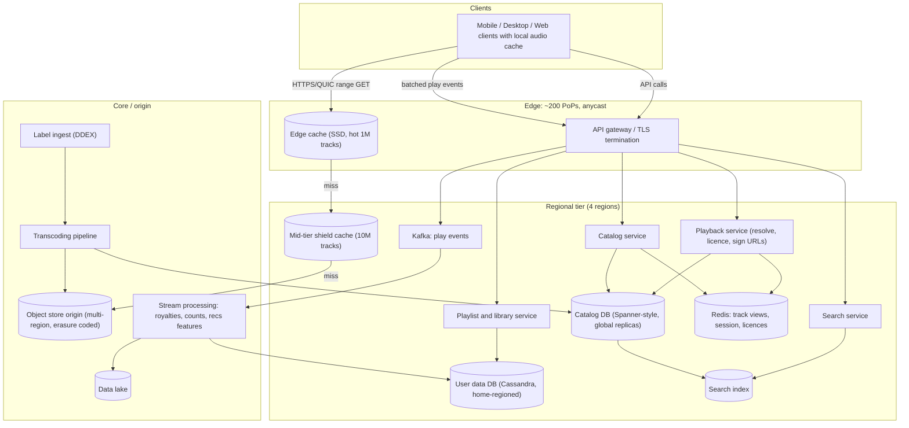
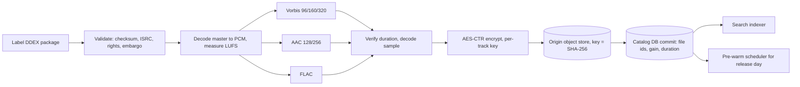
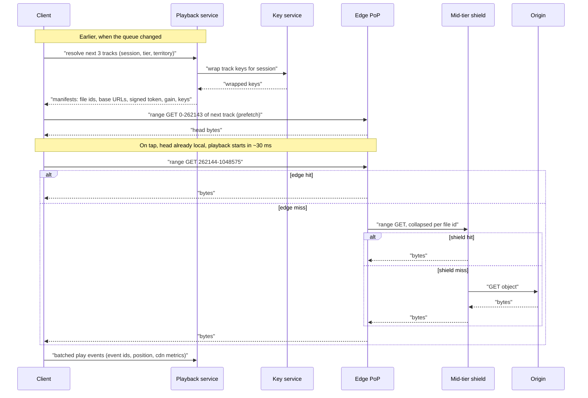
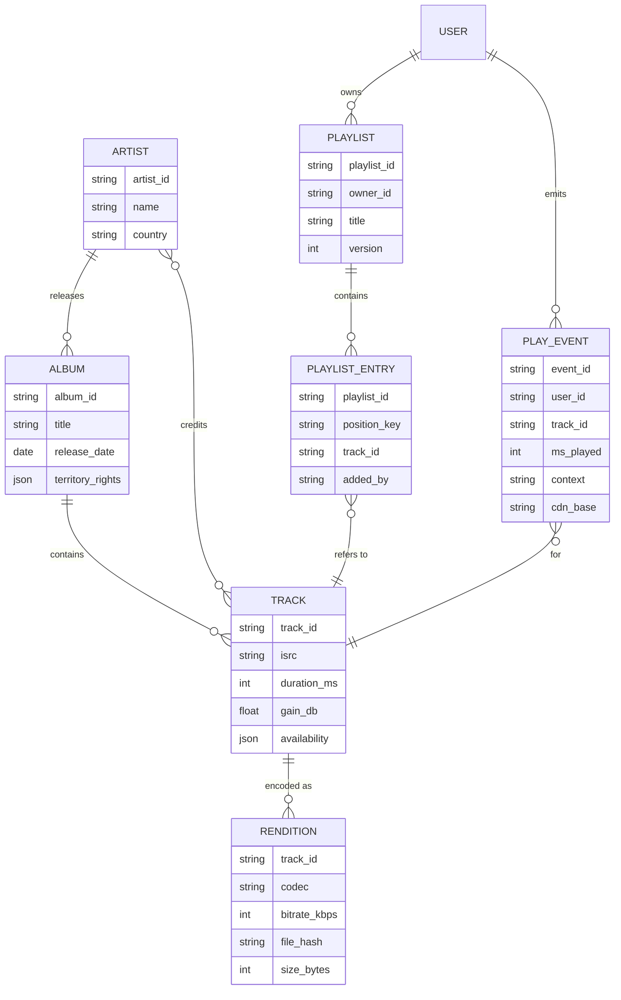

# Spotify — Distinguished Engineer, 45-minute design

Lens: storage and delivery at planet scale. I will cover the whole system but spend the deep dives on the audio pipeline, the CDN/edge tier, and how the catalog and play-event data are partitioned.

## Requirements

I am stating assumptions rather than asking. If the panel disagrees with a number, the design bends, it does not break.

**Functional**

- Stream any track in the catalog on demand: play, pause, seek, skip, queue, with a choice of quality tier.
- Browse and search the catalog (tracks, albums, artists, playlists).
- User library and playlists: create, edit, follow, collaborate.
- Offline downloads for subscribers (encrypted on device, licence expires).
- Record every play accurately enough to pay royalties (the 30-second rule).
- Out of scope today: podcasts, recommendations model internals, ads serving, social features, lyrics. I will show where they plug in and stop there.

**Non-functional**

- Startup latency: tap-to-first-audio p50 under 200 ms, p99 under 1 s, on a warm client on a mobile network.
- Rebuffer ratio under 0.5% of playback seconds; adaptive quality rather than stalls.
- Availability: playback path 99.99% (52 min/year); metadata writes can be 99.9%.
- Scale: 600M MAU, 250M DAU, 100M tracks, 180+ countries.
- Cost: infrastructure per stream must stay well under royalty per stream (~$0.004), so a delivery budget on the order of $0.0001 per stream.
- Content protection good enough for label contracts: encrypted at rest and in transit, licence-bound playback, no plain URLs to raw audio.
- Catalog consistency: a release must appear globally within minutes; playlist edits read-your-writes for the author, eventual for followers within seconds.

## Estimates

Rounded to the nearest power of ten where it does not change a decision.

| Quantity | Value | How |
|---|---|---|
| Tracks in catalog | 100M | Assumed; grows ~100k/day from label ingest |
| Avg track length | 210 s | Industry average ~3.5 min |
| Renditions per track | 6 | Ogg Vorbis 96/160/320 kbps, AAC 128/256 kbps, FLAC ~850 kbps |
| Encoded bytes per track | ~50 MB | (96+160+320+128+256+850) kbps × 210 s / 8 ≈ 47 MB |
| Catalog audio, single copy | 5 PB | 100M × 50 MB |
| Catalog audio with masters and durability | ~12 PB | + 3 PB WAV/FLAC masters, ×1.5 erasure coding on origin |
| Hot set, top 1M tracks, streaming renditions only | ~20 TB | 1M × (96+160+320+128+256) kbps × 210 s / 8 ≈ 25 MB each |
| Warm set, top 10M tracks | ~250 TB | Same maths ×10; this is what a regional tier holds |
| Streams per day | 8B | 250M DAU × 120 min listening / 3.5 min per track ≈ 8.6B |
| Stream starts per second | 100k avg, 250k peak | 8B / 86,400; peak 2.5× at evening in each region |
| Concurrent listeners at peak | ~50M | 250M DAU × (2 h / 24 h) ≈ 21M avg, ×2.4 for regional evening peaks |
| Peak streaming bandwidth | ~8 Tbps | 50M × 160 kbps average delivered bitrate |
| Audio egress per day | ~34 PB | 8B × 210 s × 160 kbps / 8 = 8B × 4.2 MB |
| Audio egress after device cache and offline | ~24 PB/day, ~0.7 EB/month | Assume 30% of plays served from device cache or downloads |
| CDN egress cost | ~$3.5M/month | 0.7 EB × ~$0.005/GB blended at committed volume |
| Delivery cost per stream | ~$0.000015 | $3.5M / 240B streams per month |
| Royalty per stream | ~$0.004 | Public reporting; 250× the delivery cost |
| Play events per day | 8B, ~1.6 TB/day raw | 200 B per event; 0.6 PB/year before compaction |
| Catalog metadata | ~300 GB | 100M tracks × 2 KB + albums, artists, credits |
| Playlist data | ~4 TB | 4B playlists × 50 entries × 16 B + headers |
| Transcode compute | ~60 cores continuous | 100k tracks/day × 6 renditions × 10 CPU-s ÷ 86,400 |

Two conclusions drive the rest of the design. First, delivery cost is a rounding error next to royalties, so I optimise the CDN for latency and hit ratio, not for squeezing cents. Second, the hot set is tiny: 20 TB fits on the SSDs of a single edge PoP, so every PoP can hold the whole hot catalog and the long tail is the only thing that goes upstream.

## High-level design

**Play path.** The client already holds the playlist's track ids and, for the next 2 or 3 tracks, prefetched manifests and the first 15 seconds of audio. On tap, if the head chunk is in the device cache, audio starts immediately and the network work is only for the remainder. If not, the client calls the Playback service once: it checks the licence (subscription tier, territory, offline count), picks renditions, returns a manifest with the content-hash file ids, several CDN base URLs, and a short-lived signed token. The client fetches the first 256 KB by HTTP range from the nearest edge PoP over an already-warm QUIC connection, decrypts it with the track key it obtained alongside the manifest, and begins decoding. Deep dive 2 walks the latency budget.

**Metadata path.** Home, album, artist pages go gateway → Catalog service → Redis (denormalised "track view" documents) → Catalog DB on miss. Reads are served from the replica in the user's region; there is one writer region because catalog writes come from the ingest pipeline, not users. Playlist and library go to the User data DB which is partitioned by user or playlist id and homed in the user's region.

**Ingest path.** Labels deliver DDEX packages with WAV or FLAC masters. The pipeline validates, normalises loudness, transcodes to every rendition, encrypts, writes to the origin object store under a content hash, then commits the catalog row and search index update. Releases are embargoed until their release time and pre-warmed to the edge before then.

**Play-event path.** The client batches play, seek, pause and end events, writes them at-least-once with a client-generated event id to the gateway, which appends to Kafka partitioned by user id. Stream processors dedupe, compute qualified plays (30 s or more), update counters, and feed royalty ledgers and recommendation features. This is the money path; it is designed for correctness and not for latency.

## Deep dive: audio storage and encoding pipeline

Everything in delivery gets easier if the storage layer is immutable, content-addressed, and range-friendly. Those three properties are the design.

**Formats and bitrates.** The table shows what I encode and why. Vorbis and AAC are the two decoders I can rely on across every client platform; FLAC is the lossless tier. Opus would beat Vorbis at 96 kbps but would not play in every embedded partner device, so it is an open question, not a default.

| Rendition | Codec | Bitrate | Size for 210 s | Used for |
|---|---|---|---|---|
| Low | Ogg Vorbis | 96 kbps | 2.5 MB | Free tier, cellular data saver |
| Normal | Ogg Vorbis | 160 kbps | 4.2 MB | Default for mobile and desktop |
| High | Ogg Vorbis | 320 kbps | 8.4 MB | Premium "very high" |
| Web low | AAC-LC | 128 kbps | 3.4 MB | Browsers and iOS web where Vorbis is unavailable |
| Web high | AAC-LC | 256 kbps | 6.7 MB | Same, premium |
| Lossless | FLAC | ~850 kbps | 22 MB | Lossless tier; 3× to 5× the egress of Normal |

**Pipeline.** Ingest is a job DAG on a queue, one job per delivered track, idempotent on (release id, ISRC, master checksum) so a label re-delivery reprocesses cleanly.

1. Validate the package: checksum, ISRC, territory rights, release date, artwork.
2. Decode the master to PCM once; compute loudness (integrated LUFS, true peak) and store a per-track gain so the client normalises to -14 LUFS without re-encoding.
3. Fan out six encodes in parallel. Each encoder job writes to a temp key, then the pipeline verifies duration and decodes a sample window to catch corrupt output.
4. Encrypt each rendition with AES-128-CTR under a per-track key. CTR matters: any byte range decrypts independently, so I do not need segmented containers to support seek. Keys live in a key service, wrapped by a KMS master key; the client gets a per-session-wrapped key with its manifest.
5. Write each rendition to the origin object store keyed by the SHA-256 of the ciphertext. The content hash is the file id in the manifest and the cache key everywhere. Immutable forever; a replacement master gets a new hash and a catalog pointer flip.
6. Commit the catalog row with all file ids, then publish to the search indexer and the pre-warm scheduler.

**Why whole files plus byte ranges, not HLS segments.** Music is short, fixed-length and seeked rarely. One file per rendition means one object per rendition (600M objects, not 60B), one cache entry, and a seek is a single range request. Ogg pages and AAC ADTS frames are self-synchronising, so the client can start decoding from any page boundary after a range fetch. The trade-off is that quality switching mid-track means opening a second file at the aligned time offset; I accept a small overlap fetch there because switches are rare for music, unlike video.

**Origin layout.** The origin is an object store in 3 regions (US, EU, APAC) with erasure coding at roughly 1.5× storage overhead inside a region and full copies across regions. New writes land in the ingest region and replicate asynchronously; the manifest is not published until the object is present in all 3, which takes seconds and is invisible next to the release embargo. Masters go to cold storage in 2 regions and are read only when re-encoding for a new rendition. Storage bill: 12 PB at ~$0.02/GB/month ≈ $240k/month, again small next to egress.

**Re-encoding the catalog.** Adding a rendition (say Opus 128) is 100M jobs. At 10 CPU-s each that is 1B CPU-s, about 12,000 core-days: a few weeks on a modest preemptible pool, throttled so it never competes with same-day ingest. Because file ids are hashes, the new rendition is additive and no existing cache entry changes.

## Deep dive: CDN and edge strategy for sub-200 ms startup

**The latency budget.** 200 ms on a mobile network is one to two round trips. Everything the design does is to make the tap-to-audio path exactly one round trip, or zero.

| Step | Cold | Designed | How |
|---|---|---|---|
| DNS + TCP + TLS | 150 to 300 ms | 0 ms | Persistent QUIC connection to the edge PoP kept warm while the app is foregrounded; TLS 1.3 0-RTT resumption on wake |
| Playback resolve API | 60 to 120 ms | 0 ms on the critical path | Manifests and keys for the next 3 queue items are prefetched when the queue changes |
| First 256 KB from edge | 40 to 80 ms | 30 to 60 ms | Edge hit ratio above 95% for head bytes; range aligned to 256 KB so the PoP serves from SSD in one read |
| Decoder warm-up and buffer | 30 to 50 ms | 30 to 50 ms | Start decoding at the first Ogg page; play when 500 ms of PCM is buffered |
| Total | 300 to 500 ms | 60 to 110 ms p50 | Leaves headroom for cellular jitter to land under 200 ms |

If the head of the track is already on the device (prefetched, recently played, or downloaded), all of that collapses to decoder warm-up and playback starts in about 30 ms.

**Cache hierarchy.** Four tiers, each with a clear job.

| Tier | Where | Capacity | Holds | Expected share of bytes |
|---|---|---|---|---|
| Device | App storage | 1 to 10 GB, LRU plus pinned downloads | Recent plays, prefetched heads, offline library | ~30% of plays never touch the network |
| Edge PoP | ~200 PoPs, ISP and IX colocation | 50 to 200 TB SSD per PoP | Entire top 1M hot set in all streaming renditions, plus LRU tail | ~92% of network requests |
| Mid-tier shield | 1 per region, 4 regions | 300 to 500 TB | Top 10M tracks, and everything requested in the last 30 days | ~7% |
| Origin | Object store, 3 regions | Full catalog | Everything | under 1%, mostly first plays of tail tracks and new PoP fills |

The hot set is small enough that the edge does not need to be clever about admission for popular content: pre-warm the top 1M into every PoP and keep a 30-day LRU for the tail. Inside a PoP, files are placed by consistent hashing of the content hash across the PoP's nodes with a replication factor of 2, so a 100 TB PoP stores 100 TB of distinct content rather than every node caching the same top 10k tracks. Nodes proxy to their peer on a local miss before going upstream. Requests from the PoP to the shield are collapsed: one in-flight upstream fetch per (file id, range) no matter how many clients wait, which is the stampede guard for a surprise viral track.

**Release day.** Friday midnight is the one predictable thundering herd: an album by a top artist can hit 5M plays in the first hour, almost all in the first minutes in each time zone. The pre-warm scheduler pushes every rendition of embargoed releases to every PoP up to 24 hours ahead, encrypted so the bytes are useless without the key, and the key service refuses to issue keys before the release timestamp. Nothing goes to origin at midnight; the only thing that scales is key issuance, which is a Redis read.

**Prefetching policy.** The client prefetches the manifest and first 15 s of the next 3 tracks in the queue, and for radio or autoplay contexts where the server knows the next track, the server includes its manifest in the current response. Prefetch fills at most 5% of the user's daily bytes; on metered connections it drops to the next track only. 15 s of Normal is 300 KB, so a session of 30 tracks costs about 9 MB of speculative fetch, of which most is consumed anyway.

**Multi-CDN and steering.** I run my own PoPs where I have the traffic density to justify a rack (roughly 40 metros) and use two commercial CDNs elsewhere and as overflow. The manifest lists 3 base URLs in preference order. The client measures time-to-first-byte and throughput per base URL and reports it in play events; a steering service updates the per-ASN preference order every few minutes. Failover is client-side: a request that fails or exceeds 400 ms to first byte is retried on the next base URL, so a dead PoP costs users one slow start, not silence.

**Adaptive quality without rebuffering.** The client starts at the tier the user chose but will drop one rendition for the rest of the track if the buffer falls under 5 s and measured throughput is under 1.5× the current bitrate. Because renditions are separate files, the switch is a range request at the aligned time offset in the lower file; the decoder is reset at an Ogg page boundary. Upward switches only happen at track boundaries, because nobody notices a quality upgrade mid-song but everyone notices a stall.

**Failure modes and degradation.**

| Failure | Blast radius | Behaviour |
|---|---|---|
| Edge PoP down | One metro | Anycast withdraws the prefix; clients already connected fail over to the second base URL after one timeout |
| Region outage, playback service | A quarter of users | Gateway routes to the next region; playback service is stateless and reads catalog replicas that exist everywhere; licence checks fall back to cached session state on the client for up to 24 h |
| Origin region unavailable | Tail misses in that region | Shield fails over to another origin region; hot content is unaffected because it never reaches origin |
| Key service down | New plays of new tracks | Clients hold session-wrapped keys for prefetched and recently played tracks; downloads keep working; new tracks fail with a retry, and this is the one hard dependency I want alerted at 1 minute |
| Kafka backlog | Royalty and counters lag | Gateway spools events to local disk; clients retain unacked batches; nothing user-facing degrades |
| Viral track not pre-warmed | One file id | Request collapsing at PoP and shield means at most one origin fetch per region per file |

## Deep dive: catalog, user data, and the play ledger

The three data sets have different shapes and get different stores.

**Catalog: one writer, replicas everywhere.** Catalog rows are written by the ingest pipeline at maybe 10 writes/s and read at hundreds of thousands per second. A globally replicated relational store with a single write region (Spanner-style, or Postgres with logical replicas per region) is the right fit: strong consistency for the writer, a few seconds of replication lag that the release embargo hides. Partition by hashed track id. Every region gets a full read replica; 300 GB replicates cheaply. In front of it, a Redis cluster per region holds a denormalised "track view" document (track, album, artist names, artwork ids, rendition file ids, availability by territory) keyed by track id, populated on read with a 24 h TTL and invalidated by a change stream from the catalog writer. Hit ratio here is above 99% because catalog reads follow the same popularity curve as plays.

Territory availability is the subtle bit. Rights change constantly and a track can be available in 150 countries but not 30. I store availability as a bitmap over ~250 territories on the track view, and the Playback service checks the user's territory bit at resolve time. That keeps the check local and constant time, and it means rights changes are catalog writes that propagate through the same change stream.

**User data: partition by owner, home by region.** Playlists, library, follows and settings are written by users at maybe 50k writes/s globally and read at 10× that. A wide-column store (Cassandra-style) partitioned by playlist id for entries and by user id for library and settings handles this with linear scaling. Each user has a home region (chosen at signup by location, movable), and their partitions are replicated with a local quorum in the home region and asynchronously to one other region for disaster recovery. Reads and writes go to the home region, which gives read-your-writes for the author; followers in other regions see edits within seconds through the async replica or by reading cross-region on a cache miss. Playlist entries use a fractional position key (a lexicographically sortable string), so inserting between two entries is one write and collaborative edits do not require renumbering. Each playlist carries a version counter so the client can sync deltas.

**Play ledger: at-least-once in, exactly-once out.** The client assigns a UUID to each event and retries until acknowledged. The gateway appends to Kafka partitioned by user id, so one user's events are ordered on one partition. A stream processor keeps a per-user dedupe window (event ids seen in the last 48 h, in RocksDB state) and emits qualified plays. Those go to three sinks: a counters table (track and artist play counts, eventually consistent, refreshed every minute), the recommendation feature store, and the royalty ledger. The ledger is append-only in the data lake, and a nightly batch recomputes from raw events with full dedupe to reconcile against the streaming numbers. If the two disagree by more than 0.01% for a label, it pages. Money is where I trade latency for a second, independent computation.

**What the client is trusted with.** Play events are self-reported, so the ledger applies plausibility rules server-side: total ms played per user per day cannot exceed wall-clock time, a track cannot qualify twice within its own duration, and the signed token in the manifest ties the event to a real resolve. Fraud detection beyond that is a downstream batch job, not on this path.

## Trade-offs

| Decision | Chosen | Alternative | Why, and what it costs |
|---|---|---|---|
| Delivery container | Whole file per rendition, HTTP byte ranges | HLS/DASH segments | 100× fewer objects, one cache entry per track, simpler seek; mid-track quality switches need an aligned second fetch |
| Encryption | AES-CTR whole file, per-track key, keys via session | DRM segment-level (Widevine, FairPlay) | Range-friendly and simple; weaker against a compromised client, which labels have accepted for audio at these tiers. Lossless tier may force real DRM |
| Codec set | Vorbis + AAC + FLAC | Opus everywhere | Universal decoder coverage on partner hardware; Opus would save ~20% egress at low tiers, that is about $700k/month, worth a migration project |
| Edge ownership | Own PoPs in 40 metros plus two commercial CDNs | Commercial only | Own PoPs give consistent-hash placement and pre-warm control that commercial CDNs do not expose; costs an operations team |
| Catalog store | Single-writer globally replicated relational | Multi-master wide-column | Catalog writes are tiny and come from one pipeline; strong consistency for rights changes matters more than write availability |
| User data store | Cassandra, home region per user | Global Spanner | 50k writes/s of playlist edits do not need global transactions; async DR replica means a region loss can lose seconds of playlist edits, which I accept |
| Play accounting | Streaming with nightly batch reconciliation | Streaming only | Two independent computations for the money path; costs a daily batch over 1.6 TB, which is cheap |
| Prefetch depth | Next 3 tracks, 15 s each | Whole next track | Bounded data cost for users on metered plans; a skip past 3 tracks pays the full one-RTT path |

## Pitfalls

Things that have bitten systems like this, and where this design guards against them.

- Every PoP node caching the same top 10k tracks, so a 100 TB PoP behaves like a 2 TB one. Consistent hashing across nodes with replication factor 2 is the fix, and it needs to be measured: track distinct bytes per PoP, not just hit ratio.
- Origin stampede on a surprise hit. Request collapsing at both the PoP and the shield keeps it at one fetch per region per file; without the shield tier the origin sees 200 PoPs at once.
- Key issuance on the critical path. If the client has to call the key service on tap, that is a second round trip and a hard dependency at 250k requests/s. Keys travel with the prefetched manifest, wrapped to the session.
- TCP slow start on a cold connection makes the first 256 KB take 3 to 4 round trips. The warm QUIC connection is not an optimisation, it is what makes 200 ms achievable on cellular.
- Mutable file ids. If a label re-delivers a master and the bytes change under the same id, every cache tier serves a mix of old and new. Content-hash ids and a catalog pointer flip make this impossible by construction.
- Double-counted plays after a client crash and retry, paying royalties twice. Client-generated event ids plus a 48 h dedupe window, and the nightly reconciliation catches what the window misses.
- Rights changes lagging in one region. Availability lives on the track view with a change-stream invalidation, not on a client-cached manifest with a long TTL; manifests expire in 1 h.
- Release-day pre-warm leaking audio early. Bytes are encrypted at rest on the PoP and the key service is time-locked to the release timestamp, so early bytes are noise.
- Lossless tier tripling egress for a subset of users without a pricing signal. Meter it separately from day one; 5% of users on FLAC would add roughly 20% to total egress.
- Data residency. User data homed per region makes it possible to keep EU users' data in the EU; catalog is not personal data and can replicate freely.

## Open questions for the panel

1. Opus migration: it saves roughly 20% of egress at the 96 and 160 kbps tiers, about $700k/month, but breaks playback on a long tail of partner devices with fixed decoder sets. Is there a client-population threshold at which we drop Vorbis, or do we carry both indefinitely and eat the storage?
2. Encryption model for the lossless tier: labels may demand hardware-backed DRM for FLAC. That pushes lossless onto a segmented, DRM-friendly container and a second delivery path. Do we build it now for all tiers to keep one path, or keep the range-based path for lossy and accept two?
3. Own PoP footprint: I put the own-versus-commercial break-even at about 40 metros. Does anyone have current egress pricing that moves that number, and how much steering control do the commercial CDNs now expose?
4. Playlist store consistency: I chose home-region Cassandra with async DR, which can lose seconds of edits in a region failover. Is a global transactional store worth its latency for collaborative playlists, or is client-side version reconciliation enough?
5. Prefetch aggressiveness: 15 s of the next 3 tracks is a guess. The right number depends on skip rates by context, which the data team has and I do not; what is the skip-rate distribution for autoplay versus user playlists?
