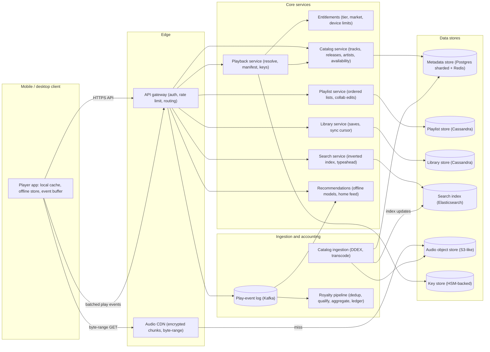
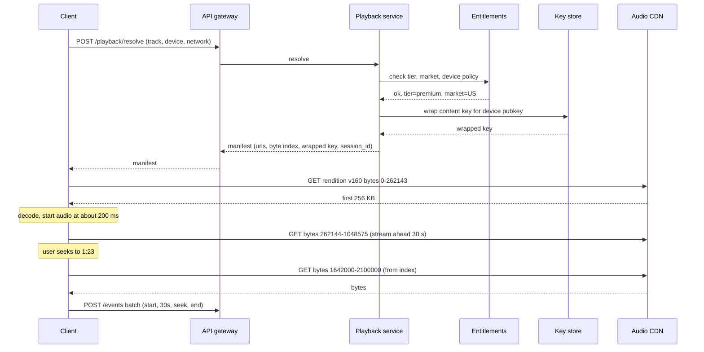
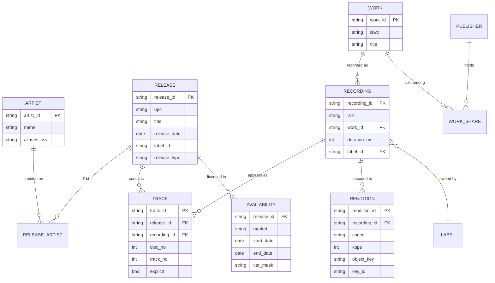

# Spotify — Principal Engineer, 45-minute design

## Requirements

I am going to state assumptions rather than ask. The product surface I am designing is the music-streaming core: a listener opens the app, finds a track, and it plays within a few hundred milliseconds, with seek, next/previous, playlists, a personal library, and offline downloads for paying users. Behind that, the business needs every qualifying stream counted correctly because royalties are paid on those counts. Podcasts, social features, ads serving, lyrics, and the recommendation models themselves are out of scope; I will show where they plug in but not design them.

**Functional**
- Search and browse: text search over tracks, albums, artists, playlists; typeahead; market-aware results (a track not licensed in Brazil should not appear for a Brazilian user).
- Play: resolve a track id to audio at the right bitrate, start fast, seek anywhere, crossfade/gapless into the next track, resume across devices.
- Playlists: create, reorder, add/remove, follow other users' playlists, collaborative editing by multiple users on the same playlist.
- Library: save tracks, albums, artists; sync across a user's devices; works when the client is offline and reconciles later.
- Offline: Premium users download tracks and playlists to a device; playback works with no network; downloads expire if the subscription lapses.
- Catalog ingestion: labels and distributors deliver releases, audio masters, and rights metadata; availability varies by territory and date.
- Royalty accounting: count streams of 30+ seconds per track, per market, per subscription tier, and produce monthly statements to rights holders that are auditable.

**Non-functional**
- Startup latency: time from tap to first audio, p50 under 200 ms and p99 under 600 ms on a warm client with a decent connection. This is the number the product lives or dies on.
- Availability: playback path 99.99% (an outage of search is annoying; an outage of playback is a headline). Playlist/library writes 99.9%.
- Consistency: catalog and search are eventually consistent (minutes is fine for a new release). A user's own playlist edits must read-your-writes on the device that made them. Royalty counts must be exactly-once at monthly close, not merely at-most-once or at-least-once.
- Scale: hundreds of millions of monthly users, tens of millions concurrent at peak, a catalog of about 100 M tracks.
- Client constraints: mobile first. Battery, cellular data caps, flaky networks, and app kills mid-playback are normal, not edge cases.
- Content protection: audio is encrypted at rest on device and on the CDN; keys are tied to an entitled user and device. Not a full DRM design, but no plaintext audio anywhere a user can copy it.

## Estimates

I round aggressively; the point is to know which parts are big.

| Quantity | Value | How |
|---|---|---|
| MAU / DAU | 600 M / 250 M | Stated assumption, roughly public numbers |
| Peak concurrent streams | 30 M | About 12% of DAU listening at the same moment in the evening peak across time zones |
| Track starts per day | 4 B | 250 M DAU x 16 tracks/day (about 1 hour of listening) |
| Track starts per second, avg / peak | 46 k/s / 120 k/s | 4 B / 86,400; peak about 2.5x |
| Egress bandwidth at peak | 4.8 Tbps | 30 M streams x 160 kbps average delivered bitrate |
| Egress volume per day | 17 PB | 4 B starts x 4.2 MB (3.5 min at 160 kbps) |
| Catalog size (tracks) | 100 M | Stated assumption |
| Encoded audio per track | 22 MB | Ogg Vorbis 96/160/320 kbps (2.5 + 4.2 + 8.4 MB) plus AAC 256 kbps (6.7 MB) at 3.5 min |
| Encoded audio, total | 2.2 PB | 100 M x 22 MB; masters (FLAC) add about 3.5 PB but sit in cold storage |
| Hot audio set | 25 TB | Top 1 M tracks are about 80% of plays; 1 M x 22 MB plus headroom; fits in one CDN POP's SSD tier |
| Track metadata | 200 GB | 100 M x 2 KB; fits in memory across a small cluster, so metadata reads never hit disk |
| Playlists / playlist rows | 4 B / 200 B | 4 B playlists x 50 tracks avg; 200 B rows x 40 B = 8 TB |
| Library rows | 180 B | 600 M users x 300 saved items; about 9 TB |
| Play events per day | 4 B starts, about 6 B events | Start, 30-second mark, end/skip; 200 B each = 1.2 TB/day raw, 440 TB/year retained for audit |
| Search QPS, peak | 25 k/s | Roughly one search per five track starts |

Takeaways: audio delivery is a CDN problem with a tiny hot set, metadata is small enough to live in RAM, and the event pipeline is a modest 70 k events/s average that must be correct rather than fast.

## High-level design



The client is a first-class component, not a thin UI. It owns a local audio cache, an encrypted offline store, a durable event buffer, and a copy of the user's library and playlists. Most of the latency and correctness story lives in the client-server contract rather than in any single backend service.

**Main request paths**

Play a track. The client already has the track id from search, a playlist, or a recommendation. It calls `POST /v1/playback/resolve` with the track id, device capabilities, and network class. The playback service checks entitlements (tier, market, concurrent-device policy), picks the audio rendition, and returns a manifest: CDN URLs for each bitrate, a byte-offset index so the client can seek by time, the content key wrapped for this device, and a playback session id. The client starts fetching the first 256 KB from the CDN in parallel with the resolve call if it has a cached manifest, otherwise immediately after. Audio begins as soon as the first Ogg pages are decoded. The manifest is cacheable for 24 hours, which is what makes repeated plays and predicted next-track prefetch cheap.

Search. `GET /v1/search?q=&market=&types=` hits the search service, which queries Elasticsearch with the user's market as a filter so unlicensed content never appears. Typeahead uses a separate prefix index kept in memory. Results carry track ids and enough denormalized metadata (title, artist, artwork URL, duration) to render without a second call.

Playlist edit. `POST /v1/playlists/{id}/ops` with a base revision and a list of operations (insert at position, remove uid, move). The playlist service applies them in order, bumps the revision, and returns the new revision plus any operations the client missed. Collaborative edits from other users are delivered through the same mechanism on the next sync or via a push notification that tells the client to sync.

Library sync. `GET /v1/library/changes?since=cursor` returns a change feed; the client applies it to its local copy. Writes are `PUT /v1/library/items` with an idempotency key so a retried request after a dropped connection does not double-save.

Play events. The client appends events to a local durable buffer and uploads them in batches of up to 100 every 30 seconds while online, or on next launch if it was offline. The gateway validates the batch, stamps server receipt time, and writes to Kafka partitioned by user id. Nothing downstream is user-facing, so this path is designed for durability, not latency.

## Deep dive: Playback, low startup latency, seek, and offline

This is the flow I would spend the most time on because the product is the player.

**Audio format and layout.** Each track is transcoded at ingestion into Ogg Vorbis at 96, 160, and 320 kbps plus AAC 256 kbps for platforms that lack a Vorbis decoder. Each rendition is one object in the object store, encrypted with AES-128-CTR using a per-track content key. I deliberately do not segment into HLS/DASH chunks. Music tracks are short, bitrate is constant, and a single file plus a byte-range index gives the client everything segmentation would (seek, partial fetch, prefetch) with fewer objects, fewer CDN misses, and no manifest-per-segment overhead. The trade-off is that adaptive bitrate switching mid-track means switching files rather than segments; the client handles this at a page boundary and it is rare for music because the client picks a bitrate once at start based on network class and user setting.

**Manifest.** The resolve response is small (about 2 KB):

```
{
  "session_id": "ps_9f2...",
  "track_id": "t_4uLU6hMCjMI75M1A2tKUQC",
  "duration_ms": 213000,
  "renditions": [
    {"codec":"vorbis","kbps":160,"bytes":4260000,
     "url":"https://audio-cdn/ak/8f/t_4uLU...v160.enc",
     "index":[0,19800,39700,...]},      // byte offset every 1 s
    ...
  ],
  "key": {"kid":"k_77a","wrapped":"base64...","expires_at":"..."},
  "ttl_s": 86400
}
```

The byte index is what makes seek cheap: to seek to 1:23 the client computes the byte offset from the index and issues one range request; no server round trip. The index for a 3.5-minute track is about 210 integers, well under 1 KB compressed.

**Startup latency budget (target p50 200 ms).** Where the time goes and what I do about each piece:

| Step | Cold | Warm | How the warm number is achieved |
|---|---|---|---|
| Resolve call | 80 ms | 0 ms | Manifest cached on device for 24 h; for tracks in the current queue the client pre-resolves the next 3 tracks |
| TLS + connection to CDN | 60 ms | 0 ms | Persistent HTTP/2 connection to the CDN kept warm while the app is foregrounded |
| First 256 KB from CDN | 90 ms | 30 ms | Hot set is in POP SSD; for the next track in the queue the client prefetches the first 15 s (about 300 KB at 160 kbps) while the current track is playing |
| Key unwrap + decoder init | 15 ms | 15 ms | Device-bound key unwrapped in the secure enclave; Vorbis decoder is cheap |
| Total | 245 ms | 45 ms | Most plays are next-track-in-queue, so most plays are warm |

The prefetch rule is the biggest lever. For any queue (album, playlist, radio) the client prefetches the head of the next track. For the home screen, the client prefetches the head of the top 3 recommended tracks in the background on Wi-Fi only. That is about 1 MB of speculative download per session, which is acceptable.



**Concurrency and device policy.** Premium allows one active stream per account. The entitlement check on resolve is not enough because resolve is cached; the client sends a heartbeat every 30 seconds with the session id, and the playback service keeps the active session per account in Redis with a 90-second TTL. A second device starting playback wins and the first device receives a push telling it to pause. This is deliberately last-writer-wins because the user is holding the newer device.

**Offline.** A download is the same encrypted rendition file written to the app's private storage, plus the manifest and a wrapped key with a 30-day expiry. Every time the app is online it renews keys for all downloaded content in one batch call; if the subscription has lapsed the renewal fails and the client refuses to play after expiry. Keys are wrapped to a device public key generated in the secure enclave, so copying files to another device yields nothing. Downloads are bounded per device (10,000 tracks) and per account (5 devices), enforced server-side because the client cannot be trusted with the count.

**Why encrypt on the CDN at all.** The CDN URLs are signed and short-lived, but signed URLs stop hotlinking, not copying. A user with a signed URL can save the file. With encryption, the file is useless without a key that only ships to an entitled device. This is the cheapest thing that satisfies labels without full hardware DRM.

## Deep dive: Catalog model, playlists, and library

**Catalog entities.** The mistakes I have seen in this domain come from collapsing distinct legal objects into one "song" row. The model keeps them apart because royalties depend on it.



A `RECORDING` is the master (identified by ISRC, owned by a label); a `WORK` is the composition (ISWC, owned by publishers and songwriters with percentage splits); a `TRACK` is a recording's placement on a `RELEASE` (the same recording appears on the album, the deluxe edition, and a compilation, each a different track id but one recording). Streams are counted per recording for the label side and per work for the publishing side. If the model only had "track," a compilation appearance would either be double-counted or attributed to the wrong owner.

Availability lives at the release level with market, date window, and a tier mask (some content is Premium-only at launch). The playback service and search both filter on it. It is denormalized into the search index as a `markets` field and into the metadata cache so no request joins across it at runtime.

**Storage.** Metadata is 200 GB, so the whole thing sits in Redis in front of sharded Postgres (shard by release id; tracks and availability co-locate with their release). Writes come only from ingestion at a few hundred per second, so Postgres is not a bottleneck and gives me foreign keys and transactions across release, tracks, and availability, which matters when a label pulls a release. Ingestion is idempotent on the label's delivery id (DDEX message id), because labels re-deliver constantly.

**Playlists.** A playlist is an ordered list where the ordering is the product; "move track from position 40 to position 3" must not rewrite 50 rows, and two collaborators must not clobber each other.

Each playlist row is `(playlist_id, revision, op_seq, op)` in Cassandra, partitioned by playlist id, plus a materialized snapshot `(playlist_id) -> [item uid, track_id, added_by, added_at]` refreshed every 50 ops or on read if stale. Each item gets a unique uid at insertion so operations refer to items, not positions, which is what makes concurrent edits mergeable: "remove uid X" and "move uid Y after uid Z" commute in all the cases that matter. Position-based ops from a stale client are rebased server-side against the ops it missed. The client sends `base_revision`; if it is more than 200 revisions behind, the server rejects and the client resyncs the snapshot. This is a small operational-transform system, deliberately limited to three op types.

Followed playlists are a pointer, not a copy. Reads of a popular editorial playlist (tens of millions of followers) go through the Redis cache of the snapshot; writes to those playlists are rare and made by internal tools.

**Library.** Saves are a pure user-partitioned key-value problem: `(user_id, item_type, item_id) -> saved_at`, in Cassandra, with a per-user change log `(user_id, cursor, op)` for sync. The client holds a full local copy (300 items average, a few thousand at the high end) and pulls the change log since its last cursor on foreground. Writes carry an idempotency key `(device_id, local_seq)` so the mobile retry storm after a subway tunnel does not double-save. Conflicts are trivial: last save or unsave wins by server timestamp.

## Deep dive: Royalty accounting correctness

Royalty payouts are the largest cost line in the business and the thing that gets audited by labels. The pipeline has to produce numbers that are exactly-once, explainable, and reproducible months later.

**What counts.** A stream qualifies when the same user plays the same recording for at least 30 seconds of audio (not wall time; pausing does not count) in one playback session. Replays count again. Streams are attributed to the market of the account, not the IP, and to the subscription tier at the time of the stream (Premium streams pay from the Premium revenue pool; free streams from the ad pool).

**Event contract.** The client is the only witness of how long audio played, so the event has to be trustworthy enough and the server has to be skeptical enough. Each event carries:

- `event_id` = hash(device_id, session_id, seq): unique across retries.
- `session_id`: the playback session from the resolve call; ties the event to an entitlement check the server did.
- `type`: start, progress (every 30 s of audio), seek, pause, resume, end (with reason: complete, skip, next, error).
- `audio_ms_played`: cumulative for the session.
- `client_ts` and, on the server, `received_ts`.

The client stores events in a SQLite table, marks them sent only on a 200, and uploads at most 100 per request. This gives at-least-once delivery from the device; dedup happens server-side on `event_id`.

```mermaid
flowchart LR
  APP["Client event buffer (SQLite)"] -->|"batch upload"| GW["Gateway: schema check, stamp received_ts"]
  GW --> K[("Kafka: play-events, keyed by user_id")]
  K --> DEDUP["Stream job: dedup on event_id (7-day RocksDB state)"]
  DEDUP --> SESS["Sessionizer: fold events into playback sessions"]
  SESS --> QUAL["Qualifier: 30 s rule, entitlement replay, fraud score"]
  QUAL --> QS[("Qualified streams (Iceberg, partitioned by day and market)")]
  QS --> AGG["Monthly aggregation per recording, work, market, tier"]
  AGG --> LEDGER[("Royalty ledger (append-only, Postgres)")]
  LEDGER --> STMT["Statements to labels and publishers"]
  QS --> RECON["Daily batch recount from raw events; diff against stream job"]
  RECON -->|"diff"| ALERT["Page if diff exceeds 0.01%"]
  FRAUD["Fraud models (bot farms, stream manipulation)"] --> QUAL
```



**Exactly-once, in practice.** No single component is exactly-once; the combination is:

1. Kafka retains raw events for 90 days. The stream job deduplicates on `event_id` with a 7-day state window, which covers the offline-upload case (a device that was offline for a week uploads a week of events with their original ids). Events older than 30 days at receipt are quarantined rather than counted: they may be legitimate, but they are reviewed, because "my phone was in a drawer for 60 days" is also what a replay attack looks like.
2. The sessionizer folds events into one row per `session_id` with total audio ms. A session with 30,000+ ms of audio is a qualified stream. One session yields at most one stream, so duplicate `progress` events cannot inflate the count even if dedup misses.
3. The qualifier re-checks the entitlement snapshot for `(user, timestamp)` from a slowly-changing table of subscription states, rather than trusting the tier in the event. Tier at stream time decides which revenue pool pays.
4. A daily batch job recomputes qualified streams from raw Kafka events with a completely separate code path (Spark, not the streaming job) and diffs against the streaming output. A diff above 0.01% pages someone. The batch output is what goes into the ledger; the streaming output feeds dashboards and artist analytics where a few hours of drift is fine.
5. The ledger is append-only. Monthly close writes a snapshot row per `(recording, work, market, tier, month)` with the stream count and the pool share. Corrections after close (a label proves a delivery error, a fraud ring is discovered) are written as adjustment rows in a later month, never as updates. This is what makes an audit reproducible: every statement can be regenerated from the ledger and the raw events.

**Pro-rata calculation.** Per market per month per tier: `payout(recording) = pool_revenue x streams(recording) / total_streams`. Pool revenue comes from finance, not from this system. The split between label (recording) and publisher (work shares) is applied from the catalog model, using the work shares as of the close date. I keep the shares versioned in the catalog because splits change when publishing deals are renegotiated, and last month's statement must not change when they do.

**Fraud.** Stream manipulation (bot farms streaming a track on loop to collect payout) is a real cost. The qualifier attaches a fraud score from an offline model; streams above a threshold are excluded from the pool and the account is flagged. The important design choice is that exclusion is recorded as a reason code on the qualified-stream row, so the count is explainable when a label asks why its track dropped.

## Trade-offs

| Decision | Chosen | Alternative | Why |
|---|---|---|---|
| Audio delivery | Single encrypted file per rendition, byte-range with a time index | HLS/DASH segments | Tracks are short and constant bitrate; one object per rendition means fewer CDN misses and simpler seek; lose easy mid-track ABR, which music rarely needs |
| Startup latency | Client prefetch of next-track head plus cached manifests | Faster backend resolve path | The backend can shave 30 ms; prefetch removes 200 ms. The client is the lever |
| Content protection | AES-CTR with device-wrapped keys, signed CDN URLs | Full hardware DRM (Widevine/FairPlay) | Labels accept this for audio; hardware DRM adds device compatibility pain and licensing cost for little marginal protection on music |
| Playlist edits | Item uids plus small op log with server rebase | Last-writer-wins full list replacement | Collaborative playlists and two devices editing the same list would lose edits with LWW; a 3-op OT is small enough to get right |
| Metadata store | Sharded Postgres with Redis in front | Cassandra or a document store | Writes are ingestion-only and low volume; catalog needs transactions across release, tracks, and availability when a release is pulled; the read path never touches Postgres anyway |
| Royalty counting | Streaming for dashboards, batch recount for the ledger, diffed daily | Trust the streaming job | Money needs a second independent path; the cost of a daily Spark job over 1.2 TB is trivial compared to one mis-statement |
| Late events | Accept up to 30 days, quarantine older | Accept anything or reject after 24 h | Offline users are real (weeks on a plane or with no data plan); 60-day-old events are indistinguishable from replay |
| Device concurrency | Heartbeat with 90 s TTL, newer device wins | Strict server-side lock per resolve | Resolve is cached so it cannot enforce; heartbeat is cheap and the UX of "newest device wins" matches what users expect |

## Pitfalls

Counting per track instead of per recording. The same master appears on several releases. If the ledger is keyed by track id, a compilation appearance is paid to the wrong party or twice. Key everything money-related by ISRC and ISWC.

Trusting the client's tier or market. The event should carry nothing that affects money; the server looks up entitlement at stream time from its own snapshot. A modified client that reports "premium" must not move a stream into the Premium pool.

Letting resolve be the concurrency enforcer. Since manifests are cached for 24 hours, a user can play from a cached manifest without calling resolve. Any policy that must hold during playback (device limits, subscription cancellation) needs the heartbeat, not resolve.

Prefetch on cellular without limits. The next-track prefetch is 300 KB; the home-screen prefetch is 1 MB. Left unbounded on cellular this shows up as user complaints about data usage and as CDN cost for audio nobody heard. Cap it and make it a setting.

Playlist positions instead of item uids. Position-based ops cannot be merged from two clients. It is tempting because the UI thinks in positions; translate at the edge.

Mutable ledger rows. The first time someone "fixes" last month's count in place, statements stop being reproducible. Adjustments only.

Search index lagging availability. A release becomes unavailable in a market (license expired) and search still shows it for an hour; users tap it and get an error. Push availability changes to the search index with priority ahead of the normal reindex queue, and have the playback service enforce availability so the failure is a clean message rather than a broken stream.

Event buffer lost on app uninstall. Events on a device that is wiped before upload are lost; those streams are never paid. Accept this (it is a small fraction) but measure it via the gap between resolve calls and received start events, so it stays small.

## Open questions for the panel

1. Byte-range single file versus HLS/DASH segments. I chose single file for simplicity and CDN efficiency. If the team already runs an HLS pipeline for podcasts and video, is the operational uniformity worth the extra objects and the manifest chatter for music?
2. Hardware DRM. Labels have historically accepted software encryption for audio. Is there a licensing deal on the table (lossless tier, early releases) that would require Widevine/FairPlay, and does that change the offline design?
3. Batch as the source of truth for the ledger. I am putting monthly close on the batch recount, with streaming for dashboards. Is a 24-hour lag on artist-facing stream counts acceptable, or does the product need near-real-time counts that are also the paid counts, which would push me toward a much more careful streaming-only design?
4. Postgres for catalog metadata. Sharded Postgres is comfortable at 100 M tracks and low write rates, but if ingestion grows to include user-generated audio at 100x the volume, the sharding and transaction story gets harder. Should we start on a wide-column store and give up the cross-table transactions?
5. Playlist OT scope. Three operation types with server rebase is the minimum. Do we anticipate richer collaboration (comments, per-item reactions, live co-listening) soon enough that a CRDT-based list would be the better foundation now?
