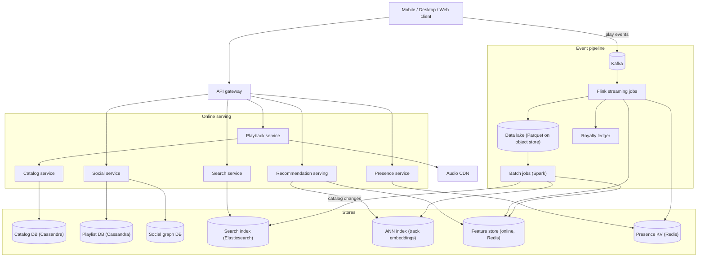
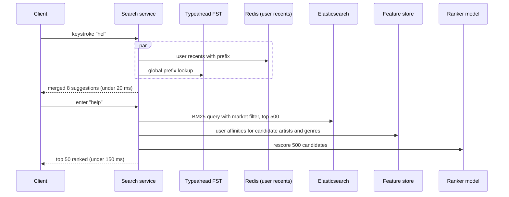
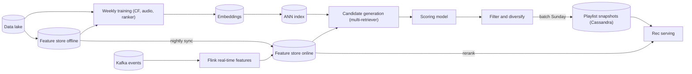
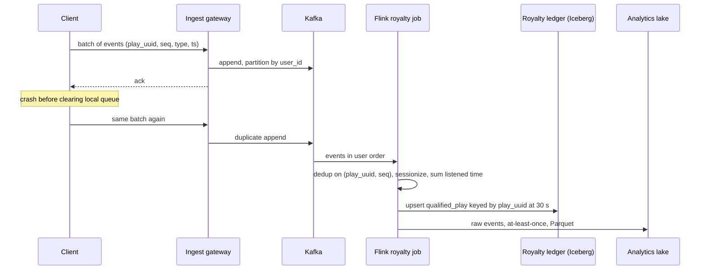
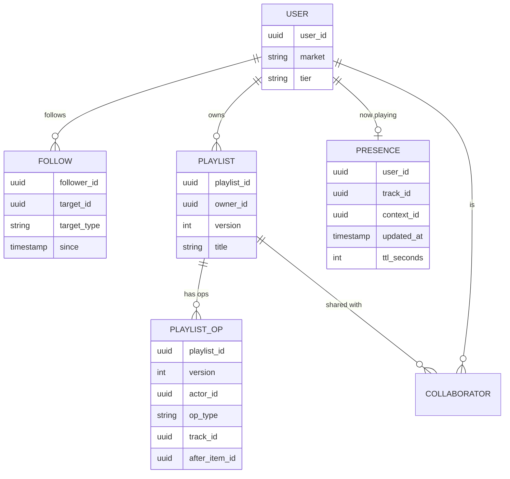

# Spotify — Senior Staff Engineer, 45-minute design

## Requirements

I am going to assume the interviewer wants the consumer streaming product, not the artist tooling or ads business. My lens is the data side: search, recommendations, the play-event pipeline, and social. I will cover playback and catalog enough that the rest hangs together, but I will not deep-dive audio delivery; that is a CDN problem a different engineer on this panel owns better than I do.

**Functional**

- Catalog: 100M tracks, 10M artists, 20M albums, 5B user playlists. Metadata is written by label ingestion, read by everyone.
- Playback: a client requests a track and streams it, with resume, offline download for premium, and per-region licensing rules.
- Search: typeahead over tracks, artists, albums, playlists, podcasts, and users. P95 under 100 ms for typeahead, under 300 ms for full search. Results are personalized (a Beatles fan typing "help" gets the song, not the podcast).
- Recommendations: Home page shelves, radio and autoplay, and batch personalized playlists (Discover Weekly, Release Radar, Daily Mix). Discover Weekly is 30 tracks per user, refreshed every Monday.
- Play events: every play, skip, seek, like, and add-to-playlist is recorded. Plays over 30 seconds are royalty-bearing and must be counted exactly once.
- Social: follow users and artists, collaborative playlists with concurrent edits, Friend Activity ("what are my friends listening to right now"), and Jam / group sessions.

**Non-functional**

- 600M monthly users, 250M premium, 100M daily actives, 15M concurrent streams at peak.
- Playback availability 99.99%: a play must start even if search, recs, and social are all down. Catalog reads are the only hard dependency of playback.
- Royalty counts are the one place where correctness beats latency. A week of delay is acceptable; a 0.1% overcount is not, because it is real money paid to the wrong rights holder.
- Recommendations are eventually consistent. A like should influence radio within seconds, but Discover Weekly being a day stale is fine.
- Search index freshness: new releases at Friday midnight must be searchable within 5 minutes worldwide.
- Global: users in 180 markets, licensing varies per market, so every catalog read is (track, market)-scoped.

## Estimates

I will round aggressively; the point is to know which numbers are big.

| Quantity | Value | How |
|---|---|---|
| Daily active users | 100M | Given |
| Peak concurrent streams | 15M | 15% of DAU listening at the same time in the evening peak |
| Plays per day | 3B | 100M DAU x 30 tracks/day |
| Play-related events per day | 30B | Each play emits ~10 events: start, heartbeat every 30 s on a 3.5 min track, seek, skip, end |
| Event ingest rate | 350K/s average, 1M/s peak | 30B / 86,400 s; peak is ~3x average |
| Event payload | ~500 B, so 15 TB/day raw | 30B x 500 B; compresses ~5x in columnar storage to 3 TB/day |
| Event retention | 1 year hot, 3 years cold | 1 PB hot columnar, 3 PB in object storage |
| Catalog metadata | 100M tracks x ~2 KB = 200 GB | Fits in memory on a handful of nodes; this is small |
| Audio storage | 100M tracks x 4 min x 3 bitrates x ~1 MB/min = 1.2 PB | Object storage plus CDN; not my deep dive |
| Search index (catalog) | ~50 GB inverted index, ~150 GB with n-gram typeahead | 130M catalog entities x ~400 B posting data; n-grams triple it |
| Search index (user playlists) | 5B playlists x ~100 B = 500 GB | Only title and owner indexed; heavily sharded by owner |
| Search QPS | 50K/s typeahead, 10K/s full | 100M DAU x 5 searches/day x 10 keystrokes; peak 3x |
| Track embeddings | 100M x 128 dims x 4 B = 51 GB | fp32; fits in a few ANN index shards |
| User embeddings | 600M x 128 dims x 4 B = 300 GB | Stored in the feature store, hot subset in Redis |
| Discover Weekly batch | 250M users x 30 tracks | 7.5B candidate scorings per week, done Sunday; ~2K cores for 6 hours |
| Friend Activity fan-out | 100M DAU x 20 followed friends | 2B "now playing" updates per day, but only ~5M users have the sidebar open at once |

The two numbers that shape the design: 1M events/s at peak, and 7.5B weekly recommendation scorings. Everything else is comfortable.

## High-level design

The main request paths:

**Play a track.** Client asks Playback for `(track_id, market)`. Playback checks the catalog for licensing in that market and picks the bitrate, then returns a signed CDN URL for the audio segments. The client streams from the CDN and buffers ahead. Playback has exactly one hard dependency, the catalog, which is a replicated Cassandra cluster with the 200 GB metadata cached in memory in each region. Everything else on the page degrades: if recs are down the client shows the last cached Home; if search is down, the Play button still works.

**Search.** Keystrokes hit Search, which fans out to a typeahead index for prefix matches and returns within 100 ms. On enter, a full query hits the main index, gets a few hundred candidates, and a lightweight ranker rescores them using the user's affinity features from the feature store. Deep dive below.

**Home page.** Rec serving reads precomputed shelves for the user (written by batch overnight), adds a few real-time shelves (Recently Played, Continue Listening) from Redis, and returns. It never computes recommendations on the request path; the request path only assembles and reranks.

**Play events.** The client batches events locally and posts them every 30 seconds or on app background. They land in Kafka partitioned by user. Flink jobs fan them into four consumers: the lake for analytics, the online feature store for real-time recs, the presence store for Friend Activity, and the royalty counting job. Deep dive below.

**Social.** Follows are a write to the social graph plus an update to the follower's feed. Collaborative playlists are the interesting one: concurrent edits from multiple clients on the same list. Deep dive below.

## Deep dive: search over a 100M-track catalog

Search is really two different systems that share a query box: typeahead, which is a prefix lookup that has to be fast, and full search, which is a ranking problem that has to be good.

**Indexing.** The catalog is small enough (130M entities, 50 GB inverted) that a single Elasticsearch cluster of 20 to 30 data nodes with 3 replicas holds it entirely in page cache. I shard by entity type and then hash: tracks, artists, albums, podcasts each get their own index so the ranker can weight types independently and so a podcast reindex does not touch tracks. User playlists (5B) are the exception: they are sharded by owner and only the title is indexed, because a global playlist index would be 10x the catalog and nobody searches other people's playlists by content.

Freshness comes from a change-data-capture stream off the catalog DB. Label ingestion writes to Cassandra, Debezium-style CDC puts the change on Kafka, and an indexer applies it to Elasticsearch within seconds. Friday midnight release drops are the stress case: 50K tracks land in a 10-minute window, which is 100 writes/s, trivial. The harder problem is that a release goes live at midnight in each market, so the index carries a `available_markets` field and every query filters by the requesting user's market at query time. I do not build per-market indices; that would be 180 copies.

**Typeahead.** Prefix search on the main index is too slow at 50K QPS because Elasticsearch prefix queries walk term dictionaries. Instead I build a separate completion structure: a finite-state transducer (Lucene's `completion` suggester or a hand-built FST) over the top 20M entity names weighted by 30-day play count. It is a few GB, memory-resident, and answers in single-digit milliseconds. It is rebuilt nightly from the lake with popularity weights, plus a small per-user layer: the user's own recent searches and library, kept in Redis, checked first so "hel" returns their most-played track by that prefix before the global answer. The nightly rebuild means a brand new release is not in typeahead until the next morning; full search catches it within seconds via CDC, and I accept that gap rather than making the FST mutable.

**Ranking.** Full search is two stages. Stage one is BM25 over name, artist name, and album name, with a popularity boost and a market filter, returning 500 candidates in about 30 ms. Stage two is a gradient-boosted tree model (cheap, a few hundred features, runs in 10 ms on 500 rows) using text features, entity popularity, and personalization features from the feature store: the user's affinity to each candidate's artist and genre, and whether the candidate is in their library. This is where "help" resolves to the Beatles for one user and a Papa Roach track for another. I keep the model small because it runs on 10K QPS; a neural reranker would cost 10x the hardware for a few percent of NDCG, and search quality on Spotify is mostly about the first result being right for navigational queries, which BM25 plus popularity already nails.

**Failure modes.** If the feature store is down, the ranker runs with personalization features zeroed and search gets slightly worse; nobody notices. If Elasticsearch loses a shard, replicas cover it. The one thing that takes search fully down is the FST build failing, so the build writes to a new path and the service only swaps pointers after a smoke test.

## Deep dive: recommendations and Discover Weekly

The core design decision is batch versus real-time, and the answer is both, with a clear line between them. Batch produces candidates and long-lived user representations. Real-time only reranks and filters. Nothing on the request path computes a recommendation from scratch.

**Models and representations.** Three signals feed everything:

1. Collaborative filtering. Implicit-feedback matrix factorization (or a two-tower model, same idea at scale) over the user-track play matrix, trained weekly on the lake, producing 128-dim user and track embeddings. This captures "people who play X also play Y" and is the workhorse.
2. Content. Audio embeddings from a CNN over spectrograms plus text embeddings from track and artist metadata. These matter for cold-start tracks with no plays; a new release gets a content embedding at ingestion so it can be recommended on day one.
3. Real-time context. The last 50 tracks the user played, skipped, or liked, kept in the online feature store as a rolling list with timestamps, updated by Flink within seconds.

**Candidate generation.** For each user, candidates come from multiple retrievers, each producing a few hundred tracks: nearest neighbours to the user embedding in the track ANN index (HNSW, sharded, 51 GB), nearest neighbours to each of the user's recent tracks, tracks from followed and similar artists, and editorial pools. I retrieve from several sources rather than one because a single ANN retriever collapses into the user's existing taste; the whole point of Discover Weekly is a small amount of controlled novelty.

**Scoring and filtering.** Candidates are scored by a model that predicts probability of a completed play (over 30 s, not skipped), using user, track, and context features. Then a filter stage removes tracks the user has already heard, tracks not licensed in their market, and explicit content if the user has opted out. Then a diversity pass caps tracks per artist and spreads genres. The final list is 30 tracks.

**Batch (Discover Weekly, Release Radar).** Sunday, Spark runs the full pipeline above for 250M users. That is 7.5B scorings; at ~1M scorings per core-second it is 2K cores for about an hour, with a comfortable margin. Output is written to Cassandra keyed by user, as a playlist snapshot with the generating model version. Monday morning the client fetches it like any other playlist. I do not generate on demand at first open because the compute is the same and precomputing gives a full day to detect a bad model before anyone sees it: if the Sunday run's offline metrics regress, we skip publishing and users keep last week's list.

**Real-time (radio, autoplay, Home reranking).** Radio is candidate generation from the seed track's ANN neighbours plus the user's embedding, scored online, with the recent-context features applied. This is under 50 ms because retrieval is one HNSW query and scoring is a few hundred rows. Home shelves are precomputed nightly but reranked at request time with the last-hour context, so if you spent the morning on jazz, the jazz shelf moves up.

**Feature store.** Two tiers, one definition. Features are defined once (say, `user_artist_affinity_30d`) and materialized to both an offline table in the lake, for training, and an online Redis cluster, for serving. Batch features are written by nightly Spark; streaming features by Flink. The reason for the single definition is training-serving skew: if the model trains on a feature computed one way and serves on a feature computed another, quality degrades silently. Point-in-time correct joins for training are the hard part; the offline store keeps feature values with timestamps so a training example from Tuesday only sees Tuesday's features.

**Evaluation.** Offline metrics gate publishing; online A/B tests decide model launches. The metric I trust most for Discover Weekly is saves per user per week, not completed plays, because a played-but-not-saved track means the user tolerated it, and the product promise is discovery.

## Deep dive: the play-event pipeline and exactly-once royalty counting

Thirty billion events a day, and one specific subset, the royalty-bearing plays, must be counted exactly once. I split the pipeline into an at-least-once firehose for everything, and a deduplicated, auditable path for royalties.

**Client emission.** The client assigns each play a UUID at play start and each event a monotonic sequence number within that play. Events are written to a local queue on disk and flushed in batches every 30 seconds, with retries. This means the server sees duplicates (a batch acked but the client crashed before clearing the queue) and gaps (a device that was offline for a week uploads late). Both are normal and the pipeline must handle them, not the client.

**Ingestion.** The gateway validates the batch, stamps server receive time, and writes to Kafka partitioned by `user_id`. Partitioning by user means one user's events are ordered on one partition, which is what the sessionization and dedup jobs need. 1M events/s at 500 B is 500 MB/s, which is 100 to 200 Kafka partitions across a modest cluster. Retention is 7 days so any downstream job can replay a week.

**Royalty counting.** A royalty-bearing play is a stream of one track lasting at least 30 seconds, by a licensed user in a licensed market. A Flink job keyed by `(user_id, play_uuid)` consumes the events, sessionizes them (start, heartbeats, end or timeout), and emits one `qualified_play` record when accumulated listened time crosses 30 seconds. Dedup works at two levels:

1. Within Flink, keyed state holds the set of seen `(play_uuid, seq)` for the last 7 days, so a re-uploaded batch produces no second qualified play. Flink checkpoints to object storage and its Kafka source offsets are part of the checkpoint, so a job restart replays from the checkpoint without double-emitting.
2. The `qualified_play` sink is an idempotent upsert into the royalty ledger keyed by `play_uuid`. Even if Flink emits twice across a failover, the ledger stores it once.

This is exactly-once at the ledger level without needing Kafka transactions end-to-end: at-least-once delivery plus idempotent writes keyed by a client-generated ID. The ledger is a partitioned columnar table (Iceberg) in the lake, plus a monthly rollup per `(track_id, market, subscription_tier)` that feeds the actual payout.

**Late data.** A device offline for a week uploads a week of plays. The Flink job uses event time with a 7-day allowed lateness, and the ledger's monthly rollup is recomputed for any month that received late arrivals, up to a hard cutoff of 30 days after month close, after which late plays are counted in the current month. Rights holders are told this; it is the industry norm.

**Fraud.** Bot plays are the main royalty risk. A separate Flink job scores plays for fraud signals (many accounts on one device, plays with no client interaction, uniform 31-second plays) and marks plays as suspect in the ledger. Suspect plays are excluded from payouts pending review, not deleted, so a false positive is reversible.

**Analytics.** Everything else, artist dashboards, Wrapped, A/B test metrics, product analytics, reads from the raw event table in the lake, which is at-least-once with duplicates deduplicated at query time by `(play_uuid, seq)`. Wrapped is a once-a-year Spark job over a year of the lake, precomputed in November and stored per user; it is not a query at open time.

## Deep dive: the social layer

Three problems here with different consistency needs: the follow graph (durable, simple), collaborative playlists (concurrent edits, must not lose anyone's change), and Friend Activity (ephemeral, high fan-out, wrong-is-fine).

**Follow graph.** A users-follow-users and users-follow-artists table in Cassandra, indexed both directions (`follows(user, target)` and `followers(target, user)`). The graph is small in the shape that matters: median user follows 20, artists have up to 100M followers. Artist follower counts are approximate counters updated by Flink, not read from the table. Feed for "new releases from artists you follow" is a batch job on Friday, not a fan-out at release time.

**Collaborative playlists.** A playlist is an ordered list of tracks, up to 10K items, and up to a few hundred collaborators can edit at once. Naive last-writer-wins on the whole list loses edits. I model each playlist as an append-only log of operations (`add track T after item I`, `remove item I`, `move item I after J`) with a server-assigned version number, and the current list is a materialized view. The client sends an operation with the version it last saw; the server applies it against the current state. Adds and removes commute, so concurrent ones both apply. Moves can conflict; if two clients move the same item concurrently, the later one wins, and the client that lost sees the list refresh. I chose an operation log over a CRDT because the server is always available to sequence operations, so I do not need offline peer-to-peer merge, and an op log is much simpler to reason about and to audit ("who removed my track"). Clients subscribe to the playlist's op stream over WebSocket for live updates.

**Friend Activity.** Every play-start event updates a presence entry `user_id -> (track, context, timestamp)` in Redis with a 10-minute TTL. That is a write per play, 3B a day, 35K/s average, easy. The read side is a pull, not a push: the desktop client with the sidebar open polls every 30 seconds for its followed friends, which is a Redis `MGET` of 20 keys. About 5M users have the sidebar open at once, so 170K reads/s of 20 keys each. I chose pull over WebSocket push because it is stateless and the staleness bound (30 s) is invisible to the user; push would only matter if the product moved to "listen along" which is where Jam comes in.

**Jam.** A group session is a small state machine (host, members, queue, current position) held in a single Redis hash with the host's region as home, with members subscribed over WebSocket. Membership tops out at 32, so there is no scaling problem, just latency for the "everyone hears the same thing" illusion; playback itself is still per-client from the CDN, with the host broadcasting seek positions.

## Trade-offs

| Decision | Chose | Alternative | Why |
|---|---|---|---|
| Discover Weekly generation | Batch Sunday, precomputed | On-demand at first open | Same compute either way; batch gives a day to catch a bad model before anyone sees it |
| Royalty exactly-once | At-least-once plus idempotent ledger upsert keyed by client UUID | Kafka transactions end to end | Transactions are fragile across job restarts and multi-cluster; idempotent sinks are simpler and auditable |
| Typeahead | Separate nightly FST with per-user Redis layer | Prefix queries on the main index | 50K QPS of prefix queries would need a much bigger ES cluster; FST is a few GB and single-digit ms |
| Search reranker | GBDT, a few hundred features | Neural reranker | 10x cheaper at 10K QPS for a few percent NDCG; navigational queries dominate and BM25 plus popularity already solves them |
| Collaborative playlists | Server-sequenced op log | CRDT | Server always available, so no need for peer merge; op log is simpler and auditable |
| Friend Activity | Pull every 30 s | WebSocket push | Stateless, 30 s staleness is invisible, push adds connection state for 5M users |
| Feature store | Single definition, dual materialization | Separate online and offline pipelines | Training-serving skew is the number one silent quality bug in recs |
| Playlist search | Owner-sharded, title only | Global content index | 10x the catalog index size, and nobody searches strangers' playlists by track |
| Catalog store | Cassandra with in-memory cache per region | Relational | 200 GB fits in memory; multi-region replication and availability matter more than joins |

The recurring theme is that I spend correctness budget on the one place that costs money (royalties) and accept staleness everywhere else (recs, typeahead, presence) because the user cannot tell.

## Pitfalls

**Training-serving skew.** The model sees `user_artist_affinity` computed by Spark at training and by Flink at serving. If those two implementations diverge by even a normalization constant, the model quietly gets worse and nobody sees an error. The fix is one feature definition compiled to both runtimes and a daily job that samples online feature values and compares them to the offline table.

**Popularity feedback loops.** Recommending popular tracks makes them more popular, which makes them more recommended. Discover Weekly's diversity pass and the explicit novelty retriever exist to fight this, and the metric to watch is catalog coverage: what fraction of tracks got at least one recommendation this week.

**Hot partitions in Kafka.** Partitioning by user is right for ordering but a single bot account or a shared institutional account can dominate a partition. The gateway rate-limits per user before Kafka, and the fraud job flags the account.

**Double counting on Flink restart without idempotent sinks.** If someone "simplifies" the ledger to an append instead of an upsert, a Flink failover double-pays. The ledger's primary key on `play_uuid` is a constraint, not a convention, and a monthly reconciliation compares ledger counts to a dedup query over the raw lake.

**Friday release thundering herd.** New albums at midnight cause a spike in search, plays, and playlist adds for the same few track IDs. Catalog cache is warmed from the release schedule an hour before; the CDN pre-positions the audio; the recs system gets content embeddings at ingestion so the track can appear in Release Radar the same day.

**Market licensing drift.** A track's licensed markets change when a deal lapses. Every read path filters by market at query time from the catalog, not from a cached copy in the search index or the rec snapshot, because a snapshot generated Sunday may include a track delisted Tuesday.

**Presence privacy.** Friend Activity leaks what you are listening to. Private session mode must be enforced at the presence write, not the read, so a bug in the reader cannot expose it.

## Open questions for the panel

1. **Neural reranking for search.** I chose GBDT at 10K QPS for cost. If the product wants semantic search ("sad songs for a rainy day") that changes to a dense retrieval plus neural rerank, which is a different cluster and 10x the cost. Is that on the roadmap, and does it justify building it into the initial architecture?
2. **On-device recommendations.** The last-50-tracks context and a small reranker could run on the phone, cutting the online feature store load and improving privacy. I have not designed for it. Does the mobile team have appetite for shipping models in the client?
3. **Kafka transactions versus idempotent sinks.** I went with idempotent upserts for royalties. Someone who has run Flink with exactly-once Kafka sinks at this scale for a few years might tell me the transactional path is now boring enough to prefer, and it would let me drop the 7-day dedup state.
4. **CRDT for collaborative playlists.** I chose a server op log because I assumed online-only editing. If offline editing of shared playlists is a real requirement, the CRDT route becomes necessary and I would want to know now, before the op log is entrenched.
5. **Regional data residency for play events.** The pipeline as drawn is one global Kafka and lake. If EU play events must stay in the EU, royalty counting and training become per-region with a federated rollup, which is a meaningful redesign of the batch layer. Is that a constraint today?
